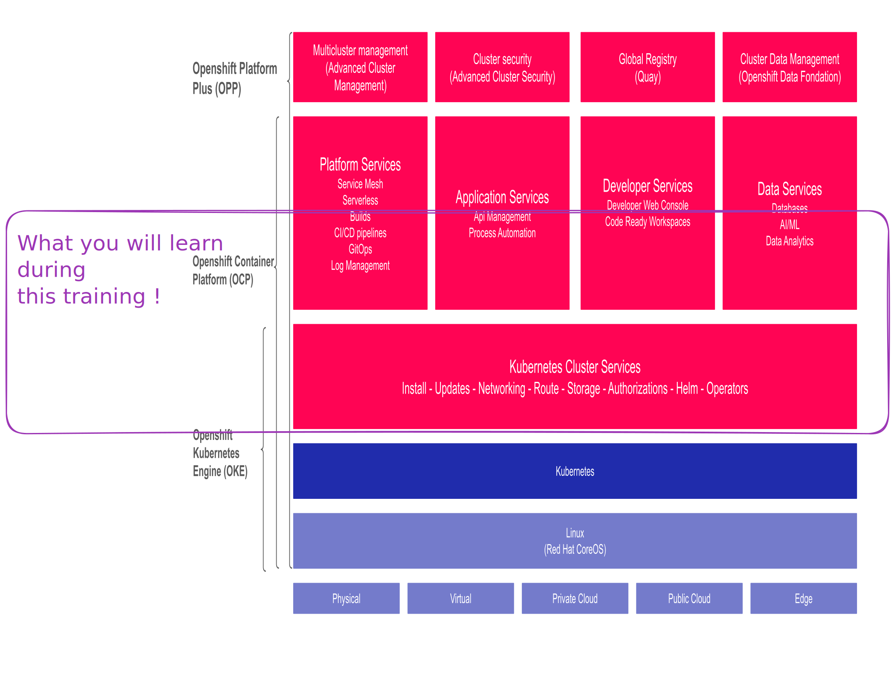

Bienvenue dans cette formation OpenShift. Ce cours vous accompagne pas à pas dans la découverte et la maîtrise d'OpenShift, la plateforme de conteneurs d'entreprise de Red Hat. Que vous soyez administrateur système, développeur ou ingénieur DevOps, ce programme est conçu pour vous donner des compétences concrètes et immédiatement applicables.

:::info A propos de cette formation
Cette formation alterne théorie et pratique sur un cluster OpenShift réel, déjà provisionné pour vous. Aucune installation préalable n'est nécessaire de votre côté.
:::

## A qui s'adresse ce cours ?

Ce cours s'adresse à trois profils principaux :

| Profil | Objectif principal | Bénéfice attendu |
|--------|-------------------|-----------------|
| **Administrateur système** | Automatiser la gestion des déploiements et de l'infrastructure | Maîtriser la gestion du cycle de vie des clusters et des ressources |
| **Développeur** | Comprendre comment les applications s'exécutent dans un environnement conteneurisé | Améliorer son workflow de développement avec OpenShift et Kubernetes |
| **Ingénieur DevOps** | Intégrer Kubernetes et OpenShift dans une chaîne CI/CD | Mettre en place des pipelines de déploiement continu robustes |

:::tip Pas d'expérience OpenShift requise
Ce cours part de zéro sur OpenShift. Une familiarité avec Linux et les concepts de base des conteneurs est suffisante pour démarrer.
:::

## Objectifs d'apprentissage

A l'issue de cette formation, vous serez capable de :

| Objectif | Description |
|---------|-------------|
| 1. Comprendre les fondamentaux | Expliquer les concepts de base de Kubernetes et d'OpenShift : pods, services, déploiements, namespaces |
| 2. Naviguer dans la console | Utiliser l'interface web d'OpenShift pour visualiser et gérer les ressources d'un cluster |
| 3. Utiliser la ligne de commande | Interagir avec le cluster via `oc`, le client OpenShift, pour toutes les opérations courantes |
| 4. Déployer des applications | Déployer, mettre à jour et supprimer des applications conteneurisées sur le cluster |
| 5. Gérer le stockage | Configurer des volumes persistants et des claims pour les applications stateful |
| 6. Assurer la disponibilité | Mettre en place des mécanismes de résilience : liveness probes, readiness probes, HPA |
| 7. Maintenir les applications | Effectuer des mises à jour applicatives en production avec un impact minimal |



## Structure du cours

Le cours est organisé en modules progressifs. Chaque module suit le même schéma pédagogique :

```
Module N
├ Théorie       - Concepts expliqués avec des schémas et des exemples
├ Démonstration - Le formateur montre les manipulations en direct
├ Pratique      - Exercices guidés dans votre namespace
└ Quiz          - Évaluation rapide des connaissances acquises
```

### Liste des modules

| Module | Titre | Contenu clé |
|--------|-------|-------------|
| 00 | Introduction | Objectifs, organisation, environnement de travail |
| 01 | Présentation de Kubernetes et OpenShift | Conteneurs, orchestration, architecture, console |
| 02 | Déploiement d'applications | Pods, Deployments, Services, Routes |
| 03 | Gestion de la configuration | ConfigMaps, Secrets, variables d'environnement |
| 04 | Stockage | PersistentVolumes, PersistentVolumeClaims, StorageClasses |
| 05 | Fiabilité et disponibilité | Health checks, autoscaling, stratégies de déploiement |
| 06 | Mise à jour et maintenance | Rolling updates, rollbacks, gestion des images |

:::note Rythme de la formation
La formation dure deux jours. Les modules théoriques sont présentés par le formateur, suivis immédiatement d'exercices pratiques sur le cluster.
:::

## Pré-requis

Avant de commencer ce cours, il est recommandé d'avoir les bases suivantes :

### Connaissances techniques

- **Linux / Unix** : navigation dans le système de fichiers, édition de fichiers, gestion des processus
- **Ligne de commande** : maîtrise des commandes de base (`ls`, `cat`, `grep`, `curl`, redirection, pipes)
- **Réseau** : notions de base sur TCP/IP, DNS, HTTP/HTTPS, ports
- **Conteneurs** : avoir déjà utilisé Docker ou Podman est un plus, mais pas obligatoire

:::warning Niveau requis
Ce cours n'est pas une introduction à Linux. Si vous n'êtes pas à l'aise avec la ligne de commande, il est fortement recommandé de suivre une formation Linux préalable.
:::

### Connaissances conceptuelles

- Comprendre la différence entre une application et son infrastructure d'exécution
- Avoir des notions sur la virtualisation (VMs, hyperviseurs)
- Comprendre le cycle de vie d'un déploiement logiciel (dev, test, prod)

## Environnement de travail

Tout l'environnement nécessaire est fourni. Voici ce dont vous disposerez :

| Ressource | Description |
|-----------|-------------|
| **Cluster OpenShift** | Un cluster partagé, déjà provisionné et opérationnel |
| **Namespace dédié** | Un espace de travail isolé, réservé à votre usage |
| **Client `oc`** | Le client OpenShift en ligne de commande, disponible sur le terminal |
| **Console web** | Accessible via navigateur, sans installation |
| **Formateur** | Disponible pour répondre à vos questions tout au long de la journée |

:::tip Utilisation du terminal intégré
OpenShift propose un terminal directement dans la console web. Si vous ne souhaitez pas installer `oc` sur votre machine, vous pouvez utiliser ce terminal pour toutes les manipulations.
:::

Nous vous souhaitons une excellente formation. N'hésitez pas à poser des questions : il n'y a pas de question inutile dans cet environnement d'apprentissage.
