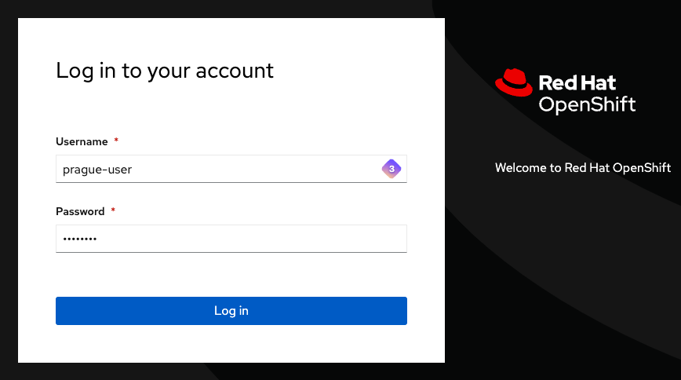

# Organisation de la formation

## Environnement technique

Pour maximiser le temps consacré à l'apprentissage, un cluster OpenShift a été provisionné et configuré en amont. Vous n'avez aucune installation à réaliser : dès le début de la formation, l'environnement est opérationnel et accessible.

:::info Infrastructure partagée
Le cluster est un environnement partagé entre tous les participants. Chaque participant dispose d'un namespace isolé pour ses exercices. Les actions réalisées dans votre namespace n'affectent pas les autres participants.
:::

### Attribution des namespaces

Chaque participant se voit attribuer un namespace identifié par un nom de ville. Ce nom est indiqué sur votre poste de travail.

La liste complète des villes disponibles est la suivante :

```
Tokyo, Paris, Londres, Rome, Sydney, Rio, Istanbul, Berlin, Nairobi, Madrid,
Toronto, Singapour, Stockholm, Athènes, Varsovie, Oslo, Helsinki, Lisbonne,
Vienne, Brasilia, Canberra, Ottawa, Séoul, Le Cap, Budapest, Dublin, Zurich,
Cardiff, Nicosie, Sofia, Suva, Riga, Vilnius, Alger, Abou Dabi, Bagdad,
Bangkok, Le Caire, Freetown, Kaboul, Kinshasa, Libreville, Mexico, Reykjavik, Prague
```

### Droits et permissions

| Périmètre | Droits accordés |
|-----------|----------------|
| Votre namespace (ex: `paris`) | Droits d'administrateur complets |
| Nouveaux namespaces | Création autorisée selon les besoins |
| Ressources cluster (nœuds, opérateurs globaux) | Accès en lecture seule |
| Actions nécessitant des droits cluster-admin | Réalisées par le formateur |

:::warning Limites de ressources
Des quotas de ressources ont été appliqués sur l'ensemble des namespaces afin de préserver la stabilité du cluster partagé. Si vous atteignez une limite, le formateur peut ajuster les quotas à la demande.
:::

## Accès au cluster

### Console web

La console web OpenShift est accessible à l'adresse suivante :

**[https://console-openshift-console.apps.neutron-sno-office.intraneutron.fr/dashboards](https://console-openshift-console.apps.neutron-sno-office.intraneutron.fr/dashboards)**

### Identifiants de connexion

Votre nom d'utilisateur est dérivé du nom de votre ville. Par exemple :

| Ville attribuée | Nom d'utilisateur |
|-----------------|------------------|
| Paris | `paris-user` |
| Tokyo | `tokyo-user` |
| Berlin | `berlin-user` |

Le mot de passe vous sera communiqué par le formateur au début de la session.



:::tip Fournisseur d'identité
Sur la page de connexion, sélectionnez le fournisseur **"Neutron Guest Identity Management"** pour vous authentifier avec les identifiants fournis.
:::

### API du cluster

Pour les interactions via la ligne de commande avec `oc`, l'API du cluster est disponible à l'adresse suivante :

**[https://api.neutron-sno-office.intraneutron.fr:6443](https://api.neutron-sno-office.intraneutron.fr:6443)**

Pour vous connecter depuis un terminal :

```shell
oc login https://api.neutron-sno-office.intraneutron.fr:6443 \
  --username paris-user \
  --password <votre-mot-de-passe>
```

Une fois connecté, vérifiez que vous êtes positionné sur le bon projet :

```shell
oc project paris
```

## Déroulement de la formation

### Programme des deux jours

| Période | Contenu |
|---------|---------|
| **Jour 1 — Matin** | Introduction, présentation d'OpenShift, architecture, exploration de la console |
| **Jour 1 — Après-midi** | Déploiement d'applications, gestion des pods, services et routes |
| **Jour 2 — Matin** | Configuration, secrets, stockage persistant |
| **Jour 2 — Après-midi** | Disponibilité, autoscaling, mises à jour, bilan et Q&A |

### Schéma pédagogique

Chaque module de la formation suit le même enchaînement :

```
1. Théorie       — Présentation par le formateur (slides + explications)
2. Démonstration — Le formateur réalise la manipulation en direct
3. Exercice      — Vous reproduisez la manipulation dans votre namespace
4. Quiz          — Questions rapides pour consolider les acquis
```

:::note Quiz interactifs
Les quiz sont réalisés avec Quizizz. Ils sont accessibles depuis votre navigateur et permettent de vérifier votre compréhension de manière ludique et collaborative.
:::

### Outils disponibles pour les exercices

Deux options s'offrent à vous pour réaliser les manipulations pratiques :

| Option | Description | Recommandé si |
|--------|-------------|---------------|
| **Terminal local** | Votre propre terminal avec `oc` installé | Vous êtes à l'aise avec les outils locaux |
| **Terminal web OpenShift** | Terminal intégré directement dans la console OpenShift | Vous souhaitez tout faire depuis le navigateur |

:::tip Terminal web
Le terminal intégré à OpenShift (accessible via l'icône en haut à droite de la console) est préconfiguré avec `oc` et les droits de votre utilisateur. C'est l'option la plus simple si vous ne souhaitez pas configurer votre environnement local.
:::

## Règles de bonne conduite

Pour garantir une expérience d'apprentissage optimale pour tous :

- Travaillez exclusivement dans votre namespace attribué
- Ne supprimez pas les ressources des autres participants
- Signalez immédiatement tout problème technique au formateur
- Posez vos questions : les questions profitent à l'ensemble du groupe

:::info Besoin d'aide ?
Le formateur est disponible tout au long de la formation pour répondre à vos questions, débloquer des situations et apporter des précisions. N'hésitez pas à demander.
:::


