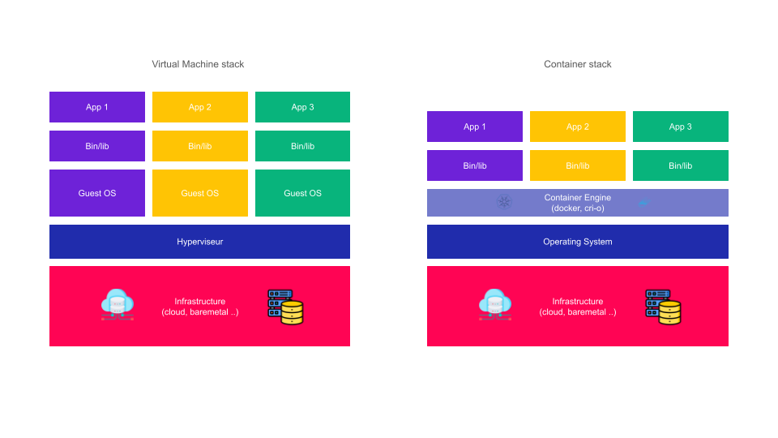
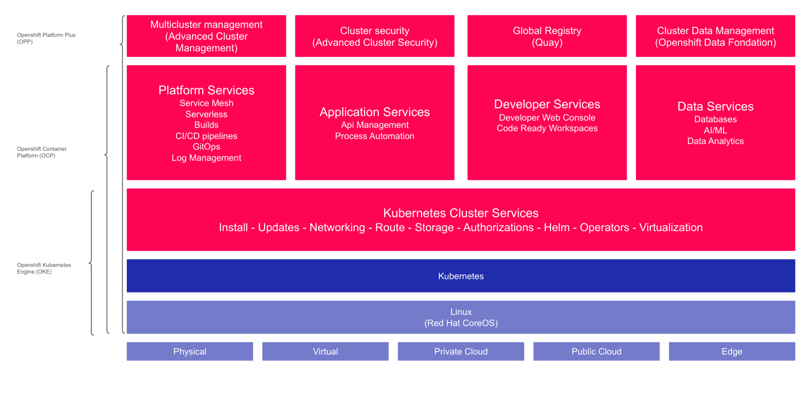

# Présentation d'OpenShift

## Objectif

Cette section pose les fondations conceptuelles de la formation. Avant de manipuler OpenShift, il est essentiel de comprendre pourquoi les conteneurs ont émergé, comment Kubernetes les orchestre, et ce qu'OpenShift apporte par rapport à Kubernetes nu. Ces trois niveaux - conteneur, orchestrateur, plateforme - forment une pile cohérente que vous allez maîtriser tout au long de la formation.

:::info Structure de cette section
Cette section est divisée en trois parties progressives :
1. Les conteneurs : qu'est-ce que c'est et pourquoi les utiliser
2. Kubernetes : l'orchestrateur open source
3. OpenShift : la plateforme d'entreprise bâtie sur Kubernetes
:::

---

## Partie 1 - Comprendre les conteneurs

### Qu'est-ce qu'un conteneur ?

Un conteneur est une unité d'exécution légère qui encapsule une application avec l'ensemble de ses dépendances : bibliothèques, configuration, variables d'environnement et code applicatif. Contrairement à une machine virtuelle, un conteneur ne virtualise pas le matériel : il s'appuie sur le noyau du système d'exploitation hôte et utilise des mécanismes d'isolation fournis par Linux (namespaces, cgroups).

Le résultat est une unité portable, reproductible et rapide à démarrer, qui fonctionne de manière identique quel que soit l'environnement d'exécution.

### Comparaison : VM, Conteneur, Machine physique

| Critère | Machine physique | Machine virtuelle (VM) | Conteneur |
|---------|-----------------|----------------------|-----------|
| Isolation | Aucune | Système d'exploitation complet | Processus isolés (namespaces Linux) |
| Démarrage | Minutes | 30 secondes à 2 minutes | Secondes |
| Taille | - | Plusieurs Go (OS inclus) | Quelques Mo à centaines de Mo |
| Partage du noyau OS | Oui | Non (chaque VM a son propre noyau) | Oui |
| Portabilité | Faible | Moyenne (dépend de l'hyperviseur) | Haute (image standardisée OCI) |
| Densité sur un hôte | 1 | Dizaines | Centaines |
| Overhead ressources | Minimal | Significatif (hyperviseur + OS invité) | Minimal |
| Cas d'usage typique | Applications legacy | Isolation forte, OS différents | Microservices, CI/CD |



*Représentation des couches pour une machine physique, une VM et un conteneur.*

:::tip L'image comme unité de distribution
L'image de conteneur est le format de distribution standard. Elle est construite une fois et peut être exécutée sur n'importe quel environnement compatible OCI (Open Container Initiative) : votre laptop, un serveur de production, ou un cluster Kubernetes.
:::

### Avantages des conteneurs

**1. Portabilité**

L'image de conteneur embarque tout ce dont l'application a besoin. Le fameux problème "ça marche sur mon poste" disparaît : si ça tourne en développement, ça tourne en production.

**2. Isolation**

Chaque conteneur s'exécute dans son propre espace de processus, réseau et système de fichiers. Une défaillance dans un conteneur n'affecte pas les autres.

**3. Efficacité des ressources**

Les conteneurs partagent le noyau de l'hôte. Il est possible de faire tourner des centaines de conteneurs sur un seul serveur, là où vous ne pourriez faire tourner que quelques dizaines de VMs.

**4. Démarrage rapide**

Un conteneur démarre en quelques secondes. Cette rapidité est critique pour les mécanismes d'autoscaling et de rétablissement automatique après une panne.

**5. Gestion simplifiée des dépendances**

```dockerfile
# Exemple de Dockerfile : toutes les dépendances sont déclarées
FROM python:3.11-slim
WORKDIR /app
COPY requirements.txt .
RUN pip install -r requirements.txt
COPY . .
CMD ["python", "app.py"]
```

Toutes les dépendances sont déclarées dans l'image. Plus de conflits de versions entre les applications déployées sur le même hôte.

:::note Limites des conteneurs seuls
Les conteneurs sont excellents pour packager et isoler des applications. En revanche, gérer des dizaines ou des centaines de conteneurs manuellement devient rapidement ingérable. C'est précisément là qu'intervient Kubernetes.
:::

---

## Partie 2 - Introduction à Kubernetes

### Qu'est-ce que Kubernetes ?

Kubernetes (abrégé **k8s**) est une plateforme open source d'orchestration de conteneurs. Développé à l'origine par Google sur la base de son système interne Borg, il est aujourd'hui maintenu par la **Cloud Native Computing Foundation (CNCF)** et constitue le standard de fait pour l'orchestration de conteneurs en production.

Kubernetes résout un problème fondamental : comment gérer de manière fiable et automatisée des applications composées de nombreux conteneurs, répartis sur plusieurs machines ?

### Pourquoi un orchestrateur est-il nécessaire ?

Imaginez une application composée de 10 microservices, chacun instancié en 3 copies pour la haute disponibilité, déployée sur 5 serveurs. Sans orchestrateur, cela représente 30 conteneurs à surveiller, redémarrer en cas de panne, mettre à jour sans interruption de service, et équilibrer en charge. C'est impossible à gérer manuellement à l'échelle.

Kubernetes automatise l'ensemble de ce travail :

**Déploiement déclaratif**

```yaml
# Vous décrivez l'état désiré, Kubernetes s'occupe d'y arriver
apiVersion: apps/v1
kind: Deployment
metadata:
  name: mon-application
spec:
  replicas: 3          # Je veux 3 instances
  selector:
    matchLabels:
      app: mon-application
  template:
    spec:
      containers:
      - name: app
        image: mon-image:v1.2
        resources:
          requests:
            memory: "128Mi"
            cpu: "250m"
```

**Réconciliation continue**

Kubernetes surveille en permanence l'état réel du cluster et le compare à l'état déclaré. Si un pod tombe, il est automatiquement recréé. Si un nœud est perdu, les pods sont reprogrammés sur un autre nœud.

**Gestion des fonctionnalités clés**

| Fonctionnalité | Description |
|---------------|-------------|
| Scheduling | Placement automatique des pods sur les nœuds disponibles selon les ressources |
| Self-healing | Redémarrage automatique des pods en échec, remplacement des nœuds défaillants |
| Horizontal scaling | Augmentation ou réduction du nombre de pods selon la charge |
| Rolling updates | Mise à jour progressive sans interruption de service |
| Service discovery | Résolution DNS automatique entre les services |
| Load balancing | Distribution du trafic entre les instances d'un service |
| Configuration management | Gestion des ConfigMaps et Secrets pour la configuration applicative |
| Storage orchestration | Montage automatique de volumes persistants |

---

## Partie 3 - OpenShift

### Qu'est-ce qu'OpenShift ?

OpenShift est la plateforme de conteneurs d'entreprise de **Red Hat**. Elle repose sur Kubernetes et y ajoute une couche de fonctionnalités pensées pour les environnements de production d'entreprise : sécurité renforcée, outils pour les développeurs, console web avancée, opérateurs, et support commercial.

OpenShift n'est pas un fork de Kubernetes : il *embarque* Kubernetes (upstream) et l'étend. Toutes les ressources Kubernetes standard (`Deployment`, `Service`, `Pod`…) fonctionnent de manière identique sur OpenShift.

### Kubernetes vs OpenShift : comparaison des fonctionnalités

| Fonctionnalité | Kubernetes (vanilla) | OpenShift |
|---------------|---------------------|-----------|
| Orchestration de conteneurs | Oui | Oui (base Kubernetes) |
| Console web | Optionnelle (dashboard basique) | Intégrée, complète, extensible |
| Authentification | Basique (certificats, tokens) | OAuth2, LDAP, OIDC intégrés |
| Gestion des builds | Non | Oui (BuildConfig, S2I) |
| Registre d'images intégré | Non | Oui (OpenShift Image Registry) |
| Pipelines CI/CD | Non | Oui (OpenShift Pipelines, Tekton) |
| Politique de sécurité des pods | Basique (PSA) | SecurityContextConstraints (SCC) avancées |
| SELinux intégré | Non | Oui (RHCOS) |
| Mises à jour du cluster | Manuel | Automatisées via le Cluster Version Operator |
| Support commercial | Non (communauté) | Oui (Red Hat) |
| Service Mesh | Non | Oui (OpenShift Service Mesh, Istio) |
| Serverless | Non | Oui (OpenShift Serverless, Knative) |



*La famille OpenShift : de l'infrastructure jusqu'aux offres managées, en passant par RHCOS, Kubernetes et OCP*

### Les spécificités majeures d'OpenShift

**1. Source-to-Image (S2I)**

OpenShift inclut un mécanisme de build appelé S2I qui permet de transformer directement un dépôt Git en image de conteneur, sans écrire de Dockerfile :

```shell
# Déployer une application Node.js directement depuis un dépôt Git
oc new-app nodejs~https://github.com/mon-org/mon-app.git
```

OpenShift détecte le langage, choisit le bon builder, compile l'application et génère l'image automatiquement.

**2. Projets et namespaces**

OpenShift utilise la notion de **Project** (projet), qui est un namespace Kubernetes enrichi avec des métadonnées supplémentaires et des politiques de sécurité par défaut. Chaque projet est isolé des autres par défaut.

```shell
# Créer un nouveau projet
oc new-project mon-projet --description="Mon application de test"

# Lister les projets accessibles
oc get projects
```

**3. Routes**

En plus des Ingress Kubernetes standard, OpenShift propose les **Routes**, qui exposent les services vers l'extérieur du cluster avec des fonctionnalités avancées (TLS edge, reencrypt, passthrough) :

```yaml
apiVersion: route.openshift.io/v1
kind: Route
metadata:
  name: mon-application
spec:
  host: mon-application.apps.cluster.example.com
  to:
    kind: Service
    name: mon-service
  tls:
    termination: edge
```

**4. SecurityContextConstraints (SCC)**

OpenShift impose par défaut que les conteneurs ne s'exécutent pas en tant que `root`. Les SCC définissent ce qu'un pod est autorisé à faire sur un nœud : utiliser le réseau hôte, monter certains volumes, élever ses privilèges. C'est un mécanisme de sécurité beaucoup plus granulaire que les Pod Security Standards de Kubernetes vanilla.

:::warning Sécurité par défaut
Sur OpenShift, un conteneur qui nécessite de s'exécuter en tant que `root` sera rejeté par défaut. Si vous migrez une image Docker existante qui ne respecte pas ce principe, vous devrez l'adapter ou configurer une SCC spécifique.
:::

**5. Opérateurs**

Les opérateurs Kubernetes sont des contrôleurs personnalisés qui automatisent la gestion d'applications complexes (bases de données, middleware, etc.). OpenShift intègre un catalogue d'opérateurs (OperatorHub) avec des centaines d'opérateurs certifiés, permettant d'installer et de gérer des applications complexes en quelques clics.

:::tip OpenShift en résumé
OpenShift = Kubernetes + sécurité renforcée + outils développeur + console web complète + support Red Hat. Si vous savez utiliser Kubernetes, vous savez déjà utiliser OpenShift. OpenShift ajoute de la valeur sans retirer de flexibilité.
:::

---

## Conclusion

Les conteneurs permettent de packager et d'isoler les applications. Kubernetes orchestre ces conteneurs à grande échelle. OpenShift va plus loin en ajoutant les outils, la sécurité et le support nécessaires aux environnements de production d'entreprise.

Cette progression - conteneur → Kubernetes → OpenShift - constitue le fil directeur de l'ensemble de cette formation. Dans la section suivante, nous allons explorer l'architecture interne d'un cluster OpenShift pour comprendre comment ces composants s'articulent.
