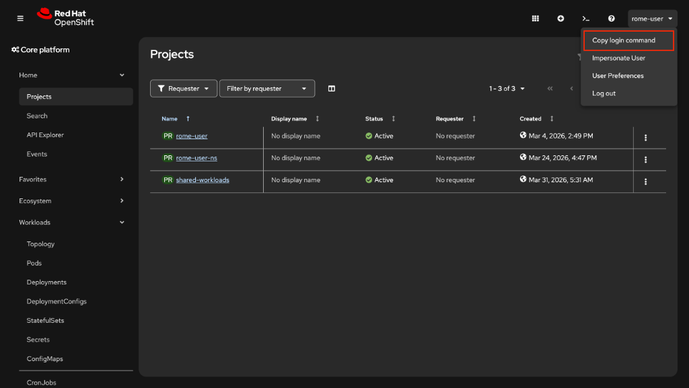
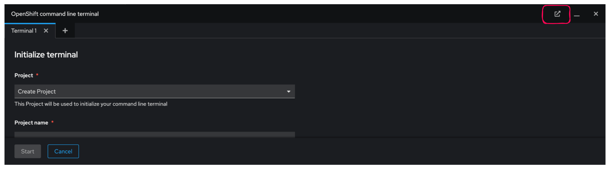

# Interagir avec la Ligne de Commande sur OpenShift

## Objectifs de la section

A l'issue de cette section, vous serez capable de :

- Distinguer les outils `kubectl` et `oc` et comprendre leurs complémentarités
- Installer le client `oc` sur votre poste de travail
- Vous authentifier sur un cluster OpenShift depuis un terminal
- Utiliser le terminal web intégré à la console OpenShift
- Créer et gérer des projets, déployer des applications et surveiller leur état
- Consulter un récapitulatif des commandes `oc` les plus utiles

---

## Introduction aux interfaces de ligne de commande

OpenShift propose deux outils principaux pour interagir avec un cluster depuis un terminal : `kubectl` et `oc`. Ces outils sont indispensables dès lors que vous souhaitez automatiser des opérations, travailler dans un pipeline CI/CD, ou simplement avoir un contrôle précis sur les ressources de votre cluster.

### kubectl et oc : différences et complémentarités


`kubectl` est l'outil de ligne de commande officiel de Kubernetes. Il communique directement avec l'API Kubernetes et permet de gérer n'importe quel cluster compatible (GKE, AKS, EKS, OpenShift, etc.).

`oc` est une extension de `kubectl` développée par Red Hat pour OpenShift. Il embarque toutes les commandes de `kubectl` et y ajoute des fonctionnalités propres à OpenShift :

| Fonctionnalité | `kubectl` | `oc` |
|---|---|---|
| Gestion des pods, services, déploiements | Oui | Oui |
| Gestion des ConfigMaps et Secrets | Oui | Oui |
| Accès aux ressources Kubernetes standard | Oui | Oui |
| Gestion des **projets** OpenShift | Non | Oui |
| Gestion des **routes** OpenShift | Non | Oui |
| Gestion des **DeploymentConfig** | Non | Oui |
| Gestion des **ImageStream** | Non | Oui |
| Connexion via token (`oc login`) | Non | Oui |
| Accès aux **BuildConfig** et **Build** | Non | Oui |
| Commande `oc new-app` | Non | Oui |
| Commande `oc rollout` étendu | Partiel | Oui |

:::info
Si vous connaissez déjà `kubectl`, vous pouvez utiliser exactement les mêmes commandes avec `oc`. Les deux outils sont interchangeables pour les opérations Kubernetes standard. Installer `oc` suffit donc pour les deux usages.
:::

:::tip
Dans un cluster OpenShift, préférez toujours `oc` à `kubectl`. Cela vous donne accès à l'ensemble des ressources OpenShift et à des raccourcis pratiques comme `oc login` pour la gestion des tokens d'authentification.
:::

---

## Installation des outils de ligne de commande

### Installation de oc

Le binaire `oc` est disponible directement depuis la console Web OpenShift, ce qui garantit que vous installez la version correspondant exactement à votre cluster.

**Etape 1 - Accéder à la page de téléchargement**

Connectez-vous à la console Web OpenShift, puis cliquez sur l'icône point d'interrogation en haut à droite et sélectionnez **"Command Line Tools"**.

La page affiche les binaires disponibles pour Linux, macOS et Windows.

**Etape 2 - Télécharger l'archive**

Téléchargez l'archive correspondant à votre système d'exploitation.

**Etape 3 - Décompresser l'archive**

Sous Linux ou macOS :

```bash
tar xvzf openshift-client-linux.tar.gz
```

Sous Windows, utilisez un outil comme 7-Zip pour extraire le contenu de l'archive `.zip`.

**Etape 4 - Ajouter `oc` au PATH**

Sous Linux ou macOS :

```bash
sudo mv oc /usr/local/bin/
```

Vérifiez ensuite l'installation :

```bash
oc version
```

```
Client Version: 4.14.0
Kustomize Version: v5.0.1
Server Version: 4.14.12
Kubernetes Version: v1.27.8+4fab27b
```

:::tip
La commande `oc version` affiche à la fois la version du client local et la version du serveur auquel vous êtes connecté. Si la version client est très différente de la version serveur, certaines fonctionnalités peuvent ne pas être disponibles.
:::

:::warning
Sous macOS, le binaire téléchargé peut être bloqué par Gatekeeper car il n'est pas signé par Apple. Si c'est le cas, exécutez la commande suivante pour autoriser son exécution :

```bash
xattr -d com.apple.quarantine /usr/local/bin/oc
```
:::

---

## Authentification et connexion

Pour interagir avec un cluster OpenShift, vous devez d'abord vous authentifier. OpenShift propose deux méthodes principales.

### Méthode 1 : connexion avec identifiants

La méthode la plus directe est d'utiliser `oc login` avec l'URL du serveur API, votre nom d'utilisateur et votre mot de passe :

```bash
oc login https://api.ocp4.example.com:6443
```

```
Authentication required for https://api.ocp4.example.com:6443 (openshift)
Username: developer
Password:
Login successful.

You have access to 58 projects, the list has been suppressed.
You can list all projects with 'oc projects'

Using project "default".
```

:::info
Le port `6443` est le port standard de l'API Kubernetes/OpenShift. Il correspond au serveur `kube-apiserver`. Ne confondez pas avec le port `443` utilisé par la console Web.
:::

### Méthode 2 : connexion via token depuis la console Web

Cette méthode est utile lorsque l'authentification par mot de passe est désactivée (SSO, LDAP, etc.) ou que vous souhaitez automatiser la connexion dans un script.

**Etape 1 - Ouvrir le menu utilisateur**

Dans la console Web OpenShift, cliquez sur votre nom d'utilisateur en haut à droite, puis sélectionnez **"Copy login command"**.



*La console OpenShift propose une option "Copy login command" dans le menu utilisateur pour récupérer un token d'authentification.*

**Etape 2 - Afficher le token**

Une nouvelle page s'ouvre. Cliquez sur **"Display Token"** pour révéler votre token d'authentification ainsi que la commande complète à copier.

**Etape 3 - Exécuter la commande dans le terminal**

Collez la commande copiée dans votre terminal :

```bash
oc login --token=sha256~AbCdEf1234567890abcdef1234567890abcdef12 \
         --server=https://api.ocp4.example.com:6443
```

```
Logged into "https://api.ocp4.example.com:6443" as "developer" using the token provided.

You have access to the following projects and can switch between them with 'oc project <projectname>':

  * default
    myapp
    staging

Using project "default".
```

:::warning
Les tokens d'authentification OpenShift ont une durée de vie limitée (par défaut 24 heures). Si vous obtenez une erreur `Unauthorized`, votre token a expiré. Répétez la procédure de copie depuis la console pour obtenir un nouveau token.
:::

:::tip
Pour vérifier avec quel utilisateur vous êtes actuellement connecté, utilisez :

```bash
oc whoami
```

```
developer
```

Et pour afficher le token actif :

```bash
oc whoami --show-token
```
:::

---

## Terminal Web intégré à la console OpenShift

OpenShift propose un terminal directement accessible depuis la console Web, sans installation locale d'aucun outil. Ce terminal web exécute `oc` dans un conteneur hébergé dans votre cluster.

### Ouvrir le terminal web

Dans la console OpenShift, cliquez sur l'icône de terminal en haut à droite de la barre de navigation.


*Le bouton d'accès au terminal web est situé dans la barre de navigation supérieure de la console OpenShift.*

Le terminal s'ouvre dans un panneau en bas de la console. Vous êtes automatiquement authentifié avec votre session en cours - aucune commande `oc login` n'est nécessaire.

### Ouvrir le terminal dans un nouvel onglet

Pour travailler plus confortablement, vous pouvez ouvrir le terminal web dans un onglet dédié :



*Le terminal web peut être détaché et ouvert dans un onglet indépendant pour un espace de travail plus grand.*

:::info
Le terminal web est particulièrement utile dans des environnements où l'installation d'outils locaux est restreinte, ou pour des démonstrations et des formations. Il dispose de `oc`, `kubectl`, `helm` et d'autres outils préinstallés.
:::

:::tip
Le terminal web conserve votre contexte de projet. Si vous avez sélectionné un projet dans la console, le terminal sera automatiquement positionné dans ce projet.
:::

---

## Gestion des projets

Les projets OpenShift sont des espaces de noms Kubernetes enrichis d'annotations supplémentaires. Ils permettent d'isoler les ressources par équipe, application ou environnement (développement, staging, production).

### Lister les projets disponibles

```bash
oc projects
```

```
You have access to the following projects and can switch between them with 'oc project <projectname>':

  * default
    kube-system
    myapp
    staging

Using project "default" on server "https://api.ocp4.example.com:6443".
```

### Créer un projet

```bash
oc new-project myapp
```

```
Now using project "myapp" on server "https://api.ocp4.example.com:6443".

You can add applications to this project with the 'new-app' command. For example, try:

    oc new-app django-psql-example

to build a new example application in Python. Or use kubectl to deploy a simple Kubernetes app:

    kubectl create deployment hello-node --image=k8s.gcr.io/serve_hostname
```

### Changer de projet actif

```bash
oc project staging
```

```
Now using project "staging" on server "https://api.ocp4.example.com:6443".
```

:::info
Le projet actif est celui dans lequel toutes vos commandes `oc` s'exécutent par défaut. Vous pouvez toujours cibler un autre projet avec le flag `-n <nom_du_projet>` sans changer de projet actif.

```bash
oc get pods -n autre-projet
```
:::

---

## Commandes pour la gestion des ressources

### Afficher les ressources

**Lister tous les pods du projet actuel :**

```bash
oc get pods
```

```
NAME                       READY   STATUS    RESTARTS   AGE
myapp-7d4b9c8f6-xk2wq      1/1     Running   0          5m
myapp-7d4b9c8f6-zp9rs      1/1     Running   0          5m
redis-6b9d7b8c4-mn4lp      1/1     Running   0          12m
```

**Afficher toutes les ressources du projet :**

```bash
oc get all
```

```
NAME                           READY   STATUS    RESTARTS   AGE
pod/myapp-7d4b9c8f6-xk2wq      1/1     Running   0          5m
pod/redis-6b9d7b8c4-mn4lp      1/1     Running   0          12m

NAME                TYPE        CLUSTER-IP      EXTERNAL-IP   PORT(S)    AGE
service/myapp       ClusterIP   172.30.45.67    <none>        8080/TCP   10m
service/redis       ClusterIP   172.30.12.34    <none>        6379/TCP   12m

NAME                      READY   UP-TO-DATE   AVAILABLE   AGE
deployment.apps/myapp     2/2     2            2           10m
deployment.apps/redis     1/1     1            1           12m

NAME                                 HOST/PORT                          PATH   SERVICES   PORT   TERMINATION
route.route.openshift.io/myapp-web   myapp-web-myapp.apps.example.com          myapp      8080
```

**Afficher les détails complets d'un pod :**

```bash
oc describe pod myapp-7d4b9c8f6-xk2wq
```

```
Name:           myapp-7d4b9c8f6-xk2wq
Namespace:      myapp
Priority:       0
Node:           worker-1/192.168.1.101
Start Time:     Wed, 15 Jan 2025 10:15:00 +0000
Labels:         app=myapp
                pod-template-hash=7d4b9c8f6
Status:         Running
IP:             10.129.2.45
Containers:
  myapp:
    Container ID:   cri-o://abcdef1234567890
    Image:          myapp:v1.2.0
    Port:           8080/TCP
    State:          Running
      Started:      Wed, 15 Jan 2025 10:15:05 +0000
    Ready:          True
    Restart Count:  0
Events:
  Type    Reason     Age   From               Message
  ----    ------     ----  ----               -------
  Normal  Scheduled  5m    default-scheduler  Successfully assigned myapp/myapp-7d4b9c8f6-xk2wq to worker-1
  Normal  Pulled     5m    kubelet            Container image "myapp:v1.2.0" already present on machine
  Normal  Created    5m    kubelet            Created container myapp
  Normal  Started    5m    kubelet            Started container myapp
```

:::tip
La section **Events** en bas de `oc describe` est extrêmement utile pour diagnostiquer des problèmes. Si un pod ne démarre pas, les événements indiquent généralement la cause (image introuvable, ressources insuffisantes, problème de configuration, etc.).
:::

### Créer et supprimer des ressources

**Créer une ressource à partir d'un fichier YAML :**

```bash
oc create -f deployment.yaml
```

```
deployment.apps/myapp created
```

**Appliquer une configuration (créer ou mettre à jour) :**

```bash
oc apply -f deployment.yaml
```

```
deployment.apps/myapp configured
```

:::info
La différence entre `oc create` et `oc apply` est importante :

- `oc create` : crée une nouvelle ressource. Echoue si la ressource existe déjà.
- `oc apply` : crée la ressource si elle n'existe pas, ou la met à jour si elle existe déjà. C'est la commande recommandée pour les pipelines CI/CD et la gestion déclarative.
:::

**Supprimer une ressource :**

```bash
oc delete pod myapp-7d4b9c8f6-xk2wq
```

```
pod "myapp-7d4b9c8f6-xk2wq" deleted
```

**Supprimer toutes les ressources d'un type :**

```bash
oc delete pods --all
```

:::warning
La suppression d'un pod géré par un Deployment ou un ReplicaSet est temporaire : Kubernetes en recrée immédiatement un nouveau pour maintenir le nombre de réplicas souhaité. Pour supprimer définitivement les pods, supprimez le Deployment lui-même.
:::

### Vérifier l'état du cluster

```bash
oc cluster-info
```

```
Kubernetes control plane is running at https://api.ocp4.example.com:6443

To further debug and diagnose cluster problems, use 'kubectl cluster-info dump'.
```

---

## Déploiement d'applications

### Créer une nouvelle application

La commande `oc new-app` est un raccourci puissant pour déployer rapidement une application depuis une image de conteneur, un dépôt Git, ou un template :

```bash
oc new-app nginx
```

```
--> Found image 64b0af3 (9 days old) in image stream "openshift/nginx" under tag "latest" for "nginx"

    * An image stream tag will be created as "nginx:latest" that will track this image
    * This image will be deployed in deployment config "nginx"
    * Port 8080/tcp will be load balanced by service "nginx"
      * Other containers can access this service through the hostname "nginx"

--> Creating resources ...
    imagestream.image.openshift.io "nginx" created
    deploymentconfig.apps.openshift.io "nginx" created
    service "nginx" created
--> Success
    Application is not exposed. You can expose services to the outside world by executing one or more of the commands below:
     'oc expose service/nginx'
    Run 'oc status' to view your app.
```

### Exposer un service

Pour rendre une application accessible depuis l'extérieur du cluster, créez une **Route** OpenShift à partir d'un Service :

```bash
oc expose svc/nginx
```

```
route.route.openshift.io/nginx exposed
```

Vérifiez l'URL générée :

```bash
oc get route nginx
```

```
NAME    HOST/PORT                              PATH   SERVICES   PORT       TERMINATION   WILDCARD
nginx   nginx-myapp.apps.ocp4.example.com             nginx      8080-tcp                 None
```

Votre application est maintenant accessible à l'adresse `http://nginx-myapp.apps.ocp4.example.com`.

:::info
Une Route OpenShift est l'équivalent d'un Ingress Kubernetes, mais avec des fonctionnalités supplémentaires comme la terminaison TLS, l'affinité de session, et les en-têtes personnalisés. Elle est gérée par le routeur OpenShift (HAProxy).
:::

---

## Surveillance des applications

### Afficher les logs d'un pod

```bash
oc logs myapp-7d4b9c8f6-xk2wq
```

```
[INFO]  2025-01-15T10:15:06Z Starting application server...
[INFO]  2025-01-15T10:15:07Z Connecting to database at redis:6379
[INFO]  2025-01-15T10:15:07Z Connection established
[INFO]  2025-01-15T10:15:08Z Listening on port 8080
```

**Suivre les logs en temps réel :**

```bash
oc logs -f myapp-7d4b9c8f6-xk2wq
```

**Afficher les logs d'un conteneur spécifique dans un pod multi-conteneurs :**

```bash
oc logs myapp-7d4b9c8f6-xk2wq -c sidecar-container
```

:::tip
Si un pod a crashé et redémarré, les logs du conteneur précédent sont disponibles avec le flag `--previous` :

```bash
oc logs myapp-7d4b9c8f6-xk2wq --previous
```

C'est souvent la première étape pour diagnostiquer un crash en boucle (CrashLoopBackOff).
:::

### Exécuter des commandes dans un pod

Pour diagnostiquer des problèmes ou inspecter l'environnement d'un conteneur :

```bash
oc exec myapp-7d4b9c8f6-xk2wq -- ls /app
```

```
config.json
index.html
main.js
static/
style.css
```

**Ouvrir un shell interactif dans un pod :**

```bash
oc exec -it myapp-7d4b9c8f6-xk2wq -- /bin/bash
```

```
[developer@myapp-7d4b9c8f6-xk2wq app]$
```

:::warning
Les modifications effectuées directement dans un conteneur via `oc exec` sont temporaires et perdues dès que le pod est redémarré. N'utilisez cette méthode que pour le diagnostic, jamais pour modifier une configuration en production.
:::

### Surveiller le statut d'un déploiement

```bash
oc rollout status deployment/myapp
```

```
Waiting for deployment "myapp" rollout to finish: 1 out of 2 new replicas have been updated...
Waiting for deployment "myapp" rollout to finish: 1 old replicas are pending termination...
deployment "myapp" successfully rolled out
```

### Mettre à l'échelle un déploiement

```bash
oc scale deployment/myapp --replicas=4
```

```
deployment.apps/myapp scaled
```

---

## Mise à jour et rollback

### Mettre à jour l'image d'un déploiement

```bash
oc set image deployment/myapp myapp=myapp:v2.0.0
```

```
deployment.apps/myapp image updated
```

### Annuler le dernier déploiement

```bash
oc rollout undo deployment/myapp
```

```
deployment.apps/myapp rolled back
```

:::tip
Avant d'annuler un déploiement, consultez l'historique pour comprendre ce qui s'est passé :

```bash
oc rollout history deployment/myapp
```

```
deployment.apps/myapp
REVISION  CHANGE-CAUSE
1         <none>
2         <none>
3         <none>
```
:::

---

## Récapitulatif - Aide-mémoire des commandes oc

### Authentification et contexte

| Commande | Description |
|---|---|
| `oc login <server>` | Se connecter à un cluster avec identifiants |
| `oc login --token=<token> --server=<url>` | Se connecter avec un token |
| `oc logout` | Se déconnecter du cluster |
| `oc whoami` | Afficher l'utilisateur connecté |
| `oc whoami --show-token` | Afficher le token actif |
| `oc config get-contexts` | Lister les contextes disponibles |
| `oc config use-context <nom>` | Changer de contexte actif |

### Gestion des projets

| Commande | Description |
|---|---|
| `oc projects` | Lister tous les projets accessibles |
| `oc project <nom>` | Changer de projet actif |
| `oc new-project <nom>` | Créer un nouveau projet |
| `oc delete project <nom>` | Supprimer un projet et toutes ses ressources |

### Inspection des ressources

| Commande | Description |
|---|---|
| `oc get <type>` | Lister les ressources d'un type |
| `oc get all` | Lister toutes les ressources du projet |
| `oc get <type> -n <namespace>` | Lister dans un namespace spécifique |
| `oc get <type> -o yaml` | Afficher au format YAML complet |
| `oc get <type> -o wide` | Afficher des colonnes supplémentaires |
| `oc describe <type> <nom>` | Afficher les détails complets d'une ressource |
| `oc explain <type>` | Afficher la documentation d'un type de ressource |
| `oc explain <type>.spec` | Afficher la documentation d'un champ spécifique |

### Création et modification des ressources

| Commande | Description |
|---|---|
| `oc create -f <fichier.yaml>` | Créer une ressource depuis un fichier |
| `oc apply -f <fichier.yaml>` | Créer ou mettre à jour une ressource |
| `oc delete <type> <nom>` | Supprimer une ressource |
| `oc delete -f <fichier.yaml>` | Supprimer les ressources définies dans un fichier |
| `oc edit <type> <nom>` | Modifier une ressource dans l'éditeur par défaut |
| `oc patch <type> <nom> --patch <json>` | Modifier une ressource avec un patch JSON |

### Déploiement d'applications

| Commande | Description |
|---|---|
| `oc new-app <image>` | Créer une application depuis une image |
| `oc new-app <git-url>` | Créer une application depuis un dépôt Git |
| `oc expose svc/<nom>` | Exposer un service via une Route |
| `oc scale deployment/<nom> --replicas=<n>` | Mettre à l'échelle un déploiement |
| `oc set image deployment/<nom> <container>=<image>` | Mettre à jour l'image d'un conteneur |
| `oc rollout status deployment/<nom>` | Suivre l'avancement d'un déploiement |
| `oc rollout undo deployment/<nom>` | Annuler le dernier déploiement |
| `oc rollout history deployment/<nom>` | Afficher l'historique des déploiements |

### Diagnostic et surveillance

| Commande | Description |
|---|---|
| `oc logs <pod>` | Afficher les logs d'un pod |
| `oc logs -f <pod>` | Suivre les logs en temps réel |
| `oc logs <pod> --previous` | Logs du conteneur précédent (après crash) |
| `oc exec <pod> -- <commande>` | Exécuter une commande dans un pod |
| `oc exec -it <pod> -- /bin/bash` | Ouvrir un shell interactif |
| `oc get events` | Lister les événements du projet |
| `oc get events --sort-by='.lastTimestamp'` | Trier les événements par date |
| `oc top pods` | Afficher la consommation CPU/mémoire des pods |
| `oc cluster-info` | Informations sur le cluster |

### Routes et services

| Commande | Description |
|---|---|
| `oc get routes` | Lister toutes les routes |
| `oc get svc` | Lister tous les services |
| `oc delete route <nom>` | Supprimer une route |
| `oc delete svc <nom>` | Supprimer un service |

---

## Conclusion

La maîtrise de `oc` est un prérequis fondamental pour travailler efficacement avec OpenShift. Que vous préfériez utiliser un terminal local ou le terminal web intégré à la console, les commandes restent identiques. La compréhension des sorties de ces commandes - en particulier `oc describe` et `oc get -o yaml` - vous permettra de diagnostiquer des problèmes et de comprendre l'état de votre cluster avec précision. La section suivante approfondira l'examen des ressources Kubernetes et leur structure interne.
