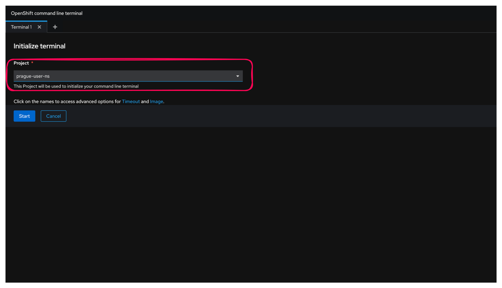

# Exercice Guidé : Interaction avec OpenShift via la Ligne de Commande

## Ce que vous allez apprendre

Dans cet exercice, vous allez découvrir comment **piloter un cluster OpenShift depuis la ligne de commande**. Vous partirez de zéro : connexion au cluster, exploration des commandes, déploiement d'une application, consultation des logs, et nettoyage. Chaque étape est détaillée pas à pas pour que vous puissiez suivre même si c'est votre première fois sur OpenShift.


---

## Objectifs

A la fin de cet exercice, vous serez capable de :

- [ ] Vous connecter à un cluster OpenShift avec la commande `oc login`
- [ ] Comprendre la différence entre `oc` et `kubectl`
- [ ] Vérifier votre projet (namespace) actif
- [ ] Déployer une application conteneurisée avec `oc new-app`
- [ ] Vérifier l'état d'un pod et consulter ses logs
- [ ] Ouvrir un shell interactif dans un pod
- [ ] Supprimer proprement les ressources créées

---

:::info Informations de connexion
- **URL de l'API OpenShift** : `https://api.neutron-sno-office.neutron-it.fr:6443`
- **Utilisateur** : `<CITY>-user` (remplacez `<CITY>` par le nom de votre ville, par exemple `paris-user`)
- **Mot de passe** : `OpenShift4formation!`
- **Projet** : `<CITY>-user-ns` (par exemple `paris-user-ns`)
:::

---

## Étape 1 : Connexion au Cluster OpenShift

### Pourquoi ?

Avant de pouvoir faire quoi que ce soit sur le cluster, vous devez **vous authentifier**. OpenShift utilise un **token temporaire** pour sécuriser votre session. Ce token est généré depuis la console web et sera utilisé dans la commande `oc login`.

### Instructions

1. Accédez à la **console Web OpenShift** dans votre navigateur.

2. Cliquez sur votre **nom d'utilisateur** en haut à droite de la console.

3. Sélectionnez **"Copy login command"**.

    

:::tip Astuce
Le menu se trouve tout en haut à droite de l'interface. Si vous ne voyez pas votre nom d'utilisateur, vérifiez que vous êtes bien connecté à la console web.
:::

4. Une nouvelle page s'ouvre. Cliquez sur **"Display Token"** pour révéler votre token de connexion.

5. **Copiez la commande `oc login`** affichée sur la page (elle contient votre token unique).

6. Ouvrez le **terminal web OpenShift** en cliquant sur l'icône de terminal en haut à droite de la console.

    

7. Dans la fenêtre qui s'ouvre, cliquez sur **"Open terminal in a new tab"**, puis sélectionnez votre projet `<CITY>-user-ns` et cliquez sur **"Start"**.

    

    

:::note
Le premier démarrage du terminal web peut prendre **10 à 30 secondes**. C'est normal : OpenShift crée un pod dédié pour votre terminal.
:::

8. **Collez et exécutez la commande de connexion** dans votre terminal web :

```bash
oc login --token=<votre_token> --server=https://api.neutron-sno-office.neutron-it.fr:6443
```

:::warning Attention
Le token est **personnel et temporaire**. Ne le partagez pas avec d'autres participants. Si votre session expire, vous devrez régénérer un nouveau token en répétant les étapes 2 à 5.
:::

**Sortie attendue :**
```
Login successful.

You have access to the following projects and can switch between them with 'oc project <projectname>':

  * paris-user-ns

Using project "paris-user-ns".
```

### Vérification

Confirmez que vous êtes bien connecté en exécutant :

```bash
oc whoami
```

**Sortie attendue :**
```
paris-user
```

Si vous voyez votre nom d'utilisateur, vous êtes prêt pour la suite.

---

## Étape 2 : Exploration des Commandes Disponibles

### Pourquoi ?

OpenShift propose **deux outils en ligne de commande** : `kubectl` (l'outil standard de Kubernetes) et `oc` (l'outil étendu d'OpenShift). Il est important de comprendre la différence pour savoir lequel utiliser.

### Instructions

1. **Affichez l'aide de `kubectl`** (l'outil Kubernetes standard) :

```bash
kubectl help
```

**Sortie attendue :**
```
kubectl controls the Kubernetes cluster manager.

 Find more information at: https://kubernetes.io/docs/reference/kubectl/

Basic Commands (Beginner):
  create        Create a resource from a file or from stdin
  expose        Take a replication controller, service, deployment or pod and expose it as a new Kubernetes service
  run           Run a particular image on the cluster
  set           Set specific features on objects
...
```

2. **Affichez l'aide de `oc`** (l'outil OpenShift) :

```bash
oc help
```

**Sortie attendue :**
```
OpenShift Client

This client helps you develop, build, deploy, and run your applications on any
OpenShift or Kubernetes cluster...

Basic Commands:
  login           Log in to a server
  new-project     Request a new project
  new-app         Create a new application
  status          Show an overview of the current project
...
```

:::info Quelle est la différence entre `oc` et `kubectl` ?
- **`kubectl`** est l'outil standard pour tout cluster Kubernetes. Il fonctionne sur OpenShift, mais aussi sur n'importe quel autre cluster Kubernetes (GKE, EKS, AKS, etc.).
- **`oc`** inclut **toutes les commandes de `kubectl`** ET ajoute des fonctionnalités propres à OpenShift : `oc new-app`, `oc new-project`, `oc start-build`, `oc login`, etc.

**En résumé** : sur OpenShift, préférez `oc` car il offre plus de possibilités. Mais sachez que `kubectl get pods` et `oc get pods` donnent exactement le même résultat.
:::

### Vérification

Comparez les deux commandes suivantes et vérifiez qu'elles retournent le même résultat :

```bash
oc version
```

**Sortie attendue :**
```
Client Version: 4.x.x
Kustomize Version: v5.x.x
Server Version: 4.x.x
Kubernetes Version: v1.x.x
```

```bash
kubectl version
```

**Sortie attendue :**
```
Client Version: v1.x.x
Kustomize Version: v5.x.x
Server Version: v1.x.x
```

Les deux outils communiquent avec le **même cluster** et le **même serveur API**.

---

## Étape 3 : Gestion du Namespace (Projet)

### Pourquoi ?

Sur OpenShift, chaque utilisateur travaille dans un **projet** (aussi appelé *namespace*). C'est un espace isolé qui contient vos ressources (pods, services, déploiements...). Avant de déployer quoi que ce soit, vous devez vérifier que vous êtes dans le **bon projet**.

### Instructions

Affichez le projet actuellement actif :

```bash
oc project
```

**Sortie attendue :**
```
Using project "paris-user-ns" from context named "paris-user-ns/api-neutron-sno-office-neutron-it-fr:6443/paris-user" on server "https://api.neutron-sno-office.neutron-it.fr:6443".
```

:::tip Astuce
Si vous n'êtes pas dans le bon projet, vous pouvez changer avec :
```bash
oc project <CITY>-user-ns
```
Remplacez `<CITY>` par le nom de votre ville.
:::

:::warning Attention
Toutes les ressources que vous créerez seront dans ce projet. Si vous êtes dans le mauvais projet, vous risquez de ne pas voir vos pods ou de déployer au mauvais endroit.
:::

### Vérification

Listez tous les projets auxquels vous avez accès :

```bash
oc projects
```

**Sortie attendue :**
```
You have access to the following projects and can switch between them with 'oc project <projectname>':

  * paris-user-ns

Using project "paris-user-ns" on server "https://api.neutron-sno-office.neutron-it.fr:6443".
```

Vous devriez voir votre projet `<CITY>-user-ns` dans la liste.

---

## Étape 4 : Création d'une Nouvelle Application

### Pourquoi ?

La commande `oc new-app` est l'une des grandes forces d'OpenShift. Elle permet de **déployer une application en une seule commande** à partir d'une image de conteneur, d'un dépôt Git ou d'un template. Ici, nous allons déployer une application Go pré-construite stockée sur le registre d'images **Quay.io**.

### Instructions

1. Basculez d'abord vers votre namespace de travail `<CITY>-user` :

```bash
oc project <CITY>-user
```

**Sortie attendue :**
```
Now using project "paris-user" on server "https://api.neutron-sno-office.neutron-it.fr:6443".
```

2. Déployez l'application avec la commande suivante :

```bash
oc new-app --image=quay.io/neutron-it/p02l01-go-app
```

**Sortie attendue :**
```
--> Found container image ec997ee from quay.io for "quay.io/neutron-it/p02l01-go-app"

    Go 1.21.11
    ----------
    ...

--> Creating resources ...
    deployment.apps "p02l01-go-app" created
    service "p02l01-go-app" created
--> Success
    Application is not exposed. You can expose services to the outside world by executing:
     'oc expose service/p02l01-go-app'
    Run 'oc status' to view your app.
```

:::info Que s'est-il passé ?
`oc new-app` a automatiquement créé **deux ressources** pour vous :
1. **Un Deployment** (`deployment.apps/p02l01-go-app`) : il définit comment lancer votre application (quelle image, combien de réplicas, etc.)
2. **Un Service** (`service/p02l01-go-app`) : il fournit une adresse réseau interne pour accéder à votre application depuis le cluster

Tout cela en une seule commande !
:::

### Vérification

Vérifiez que les ressources ont bien été créées :

```bash
oc status
```

**Sortie attendue :**
```
In project paris-user on server https://api.neutron-sno-office.neutron-it.fr:6443

svc/p02l01-go-app - 172.30.x.x ports 8080
  deployment/p02l01-go-app deploys istag/p02l01-go-app:latest
    deployment #1 running for about a minute - 1 pod
...
```

---

## Étape 5 : Vérification de l'État de l'Application

### Pourquoi ?

Après avoir lancé un déploiement, il est essentiel de **vérifier que le pod est bien démarré** et que l'application fonctionne. Un pod en état `Running` signifie que le conteneur est actif et prêt.

### Instructions

1. **Listez les pods de votre projet** :

```bash
oc get pods
```

**Sortie attendue :**
```
NAME                             READY   STATUS    RESTARTS   AGE
p02l01-go-app-6c457d7469-vhl2q   1/1     Running   0          2m33s
```

:::tip Comprendre la sortie
| Colonne    | Signification |
|------------|---------------|
| `NAME`     | Nom unique du pod (généré automatiquement) |
| `READY`    | `1/1` = 1 conteneur sur 1 est prêt |
| `STATUS`   | `Running` = le conteneur est en cours d'exécution |
| `RESTARTS` | Nombre de redémarrages (0 = tout va bien) |
| `AGE`      | Depuis combien de temps le pod existe |
:::

:::warning
Si le statut est `ContainerCreating`, **patientez quelques secondes** puis relancez `oc get pods`. Le téléchargement de l'image peut prendre un moment. Si le statut est `Error` ou `CrashLoopBackOff`, appelez le formateur.
:::

2. **Obtenez plus de détails sur le déploiement** :

```bash
oc describe deployment/p02l01-go-app
```

**Sortie attendue (extrait) :**
```
Name:                   p02l01-go-app
Namespace:              paris-user-ns
Selector:               deployment=p02l01-go-app
Replicas:               1 desired | 1 updated | 1 total | 1 available | 0 unavailable
...
  Containers:
   p02l01-go-app:
    Image:        quay.io/neutron-it/p02l01-go-app@sha256:...
    Port:         8080/TCP
...
```

:::info
La commande `oc describe` fournit une vue détaillée d'une ressource. Elle est très utile pour le **diagnostic** : vous y trouverez les événements, les erreurs de démarrage, la configuration des conteneurs, etc.
:::

### Vérification

Confirmez que le pod est bien en état `Running` avec 1/1 conteneur prêt :

```bash
oc get pods -o wide
```

**Sortie attendue :**
```
NAME                             READY   STATUS    RESTARTS   AGE   IP            NODE          ...
p02l01-go-app-6c457d7469-vhl2q   1/1     Running   0          3m    10.128.x.x    worker-0      ...
```

L'option `-o wide` affiche des informations supplémentaires comme l'**adresse IP du pod** et le **noeud** sur lequel il tourne.

---

## Étape 6 : Affichage des Logs de l'Application

### Pourquoi ?

Les **logs** sont la première chose à consulter quand on veut comprendre ce que fait une application ou diagnostiquer un problème. Ils affichent tout ce que l'application écrit sur sa sortie standard (*stdout*).

### Instructions

Affichez les logs de l'application :

```bash
oc logs deployment/p02l01-go-app
```

**Sortie attendue :**
```
Bravo, vous êtes dans Exercice Guidé : Interaction avec OpenShift via la Ligne de Commande
```

:::tip Astuce
Pour suivre les logs en temps réel (comme un `tail -f`), ajoutez l'option `-f` :
```bash
oc logs -f deployment/p02l01-go-app
```
Appuyez sur `Ctrl+C` pour arrêter le suivi.
:::

:::note Bon à savoir
Vous pouvez aussi consulter les logs d'un pod spécifique en remplaçant `deployment/p02l01-go-app` par le nom exact du pod (obtenu avec `oc get pods`). C'est utile quand un déploiement a plusieurs réplicas.
:::

### Vérification

Si vous voyez le message "Bravo, vous êtes dans Exercice Guidé...", cela confirme que votre application s'est lancée correctement et a produit sa sortie.

---

## Étape 7 : Exécution de Commandes dans un Pod

### Pourquoi ?

Parfois, vous avez besoin de **vous connecter directement à l'intérieur d'un conteneur** pour inspecter des fichiers, vérifier des variables d'environnement, ou diagnostiquer un problème. La commande `oc exec` vous ouvre un **shell interactif** dans le pod, comme si vous faisiez un SSH vers le conteneur.

### Instructions

1. **Ouvrez un shell interactif** dans le pod de l'application :

```bash
oc exec -it deployment/p02l01-go-app -- /bin/sh
```

**Sortie attendue :**
```
sh-5.1$
```

:::info Explication de la commande
| Élément | Signification |
|---------|---------------|
| `oc exec` | Exécuter une commande dans un conteneur |
| `-i` | Mode interactif (garder l'entrée standard ouverte) |
| `-t` | Allouer un terminal (pour avoir un prompt) |
| `deployment/p02l01-go-app` | La ressource ciblée |
| `--` | Sépare les options de `oc` de la commande à exécuter |
| `/bin/sh` | Le shell à lancer dans le conteneur |
:::

2. **Listez les processus** en cours dans le conteneur :

```bash
ps aux
```

**Sortie attendue :**
```
USER         PID %CPU %MEM    VSZ   RSS TTY      STAT START   TIME COMMAND
1001540+       1  0.0  0.0  12004  2496 ?        Ss   10:09   0:00 sh -c ./main && while true; do sleep 86400; done
1001540+      12  0.0  0.0  23148  1528 ?        S    10:09   0:00 /usr/bin/sleep 86400
1001540+      20  1.5  0.0  12136  3232 pts/0    Ss   10:20   0:00 /bin/sh
1001540+      26  0.0  0.0  44784  3436 pts/0    R+   10:20   0:00 ps aux
```

:::note
Remarquez que le processus principal (PID 1) est le programme `./main` de notre application Go. C'est le processus que le conteneur exécute au démarrage.
:::

3. **Sortez du shell** du conteneur :

```bash
exit
```

**Sortie attendue :**
```
$
```

Vous êtes de retour dans votre terminal web OpenShift.

:::warning Attention
Toute modification faite à l'intérieur d'un conteneur est **temporaire**. Si le pod redémarre, toutes vos modifications seront perdues. Pour des changements permanents, il faut modifier l'image du conteneur ou utiliser des volumes persistants.
:::

### Vérification

Après avoir quitté le shell, vérifiez que le pod est toujours en état `Running` :

```bash
oc get pods
```

**Sortie attendue :**
```
NAME                             READY   STATUS    RESTARTS   AGE
p02l01-go-app-6c457d7469-vhl2q   1/1     Running   0          10m
```

Le pod doit toujours être actif et en bon état.

---

## Étape 8 : Suppression de l'Application

### Pourquoi ?

Il est important de **nettoyer les ressources** après un exercice pour ne pas encombrer le cluster. La commande `oc delete all` avec un sélecteur de label (`-l`) permet de supprimer d'un coup toutes les ressources associées à une application.

### Instructions

Supprimez toutes les ressources liées à l'application :

```bash
oc delete all -l app=p02l01-go-app
```

**Sortie attendue :**
```
service "p02l01-go-app" deleted
deployment.apps "p02l01-go-app" deleted
imagestream.image.openshift.io "p02l01-go-app" deleted
```

:::info Comment fonctionne le sélecteur `-l` ?
Quand `oc new-app` crée des ressources, il leur attache automatiquement un **label** `app=p02l01-go-app`. Le sélecteur `-l app=p02l01-go-app` filtre toutes les ressources portant ce label, ce qui permet de tout supprimer en une seule commande.
:::

:::warning Attention
La commande `oc delete all` supprime les ressources **de manière irréversible**. Vérifiez toujours le sélecteur (`-l`) avant d'exécuter cette commande en production !
:::

### Vérification

Confirmez que toutes les ressources ont été supprimées :

```bash
oc get all
```

**Sortie attendue :**
```
No resources found in paris-user-ns namespace.
```

:::tip
Si vous voyez encore des pods en état `Terminating`, attendez quelques secondes et relancez la commande. OpenShift effectue un arrêt **gracieux** des pods, ce qui peut prendre un court instant.
:::

---

## Récapitulatif

Voici un résumé de toutes les commandes utilisées dans cet exercice :

| Étape | Commande | Description |
|-------|----------|-------------|
| 1 | `oc login --token=... --server=...` | Se connecter au cluster OpenShift |
| 1 | `oc whoami` | Vérifier l'utilisateur connecté |
| 2 | `kubectl help` / `oc help` | Afficher l'aide des commandes |
| 2 | `oc version` | Afficher la version du client et du serveur |
| 3 | `oc project` | Afficher le projet actif |
| 3 | `oc projects` | Lister tous les projets accessibles |
| 4 | `oc new-app --image=...` | Déployer une application depuis une image |
| 4 | `oc status` | Vue d'ensemble du projet |
| 5 | `oc get pods` | Lister les pods |
| 5 | `oc describe deployment/...` | Détails d'un déploiement |
| 6 | `oc logs deployment/...` | Afficher les logs |
| 7 | `oc exec -it deployment/... -- /bin/sh` | Ouvrir un shell dans un pod |
| 8 | `oc delete all -l app=...` | Supprimer les ressources par label |
| 8 | `oc get all` | Vérifier qu'il ne reste rien |

---

## Conclusion

Vous avez accompli avec succes les operations fondamentales pour interagir avec OpenShift en ligne de commande :

- **Connexion** au cluster via un token
- **Exploration** des commandes `oc` et `kubectl`
- **Déploiement** d'une application conteneurisée en une seule commande
- **Observation** des pods, de leurs logs et de leur contenu
- **Nettoyage** propre des ressources

:::tip Pour aller plus loin
Essayez de relancer l'exercice **sans regarder les instructions**. Si vous y arrivez, vous avez acquis les bases de l'administration OpenShift en ligne de commande !
:::
