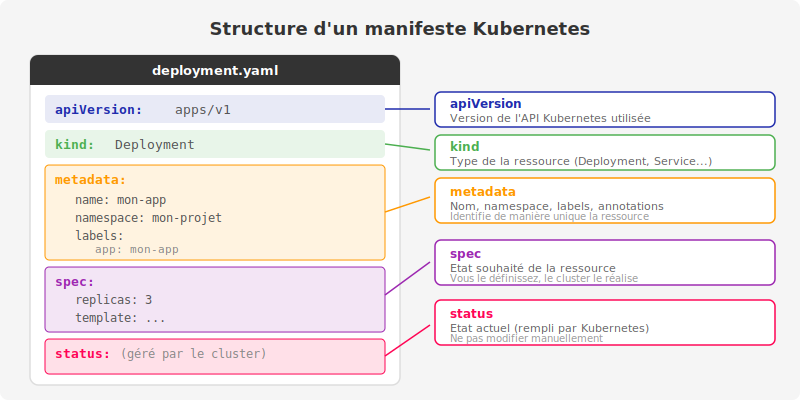

# Examen des ressources Kubernetes

## Objectifs de la section

A l'issue de cette section, vous serez capable de :

- Comprendre la structure commune de tous les objets Kubernetes (métadonnées, spec, status)
- Lire et interpréter un manifest YAML Kubernetes
- Utiliser `oc get -o yaml` pour inspecter l'état réel d'une ressource
- Utiliser `oc explain` pour consulter la documentation des champs d'une ressource
- Identifier et utiliser les principaux types de ressources Kubernetes et OpenShift
- Filtrer des ressources à l'aide de sélecteurs de labels
- Extraire des données ciblées avec les formats de sortie personnalisés

---

## Structure d'un objet Kubernetes

Chaque ressource dans Kubernetes - qu'il s'agisse d'un Pod, d'un Service, d'un Deployment ou d'une Route OpenShift - partage une structure YAML commune. Comprendre cette structure est indispensable pour lire, écrire et déboguer des manifests.



*Représentation de la structure hiérarchique d'un manifest Kubernetes : les quatre sections principales (apiVersion, kind, metadata, spec) et la section status gérée par le cluster.*

### Les quatre champs racine obligatoires

Tout manifest Kubernetes valide contient ces quatre champs au niveau racine :

```yaml
apiVersion: apps/v1      # (1) Version de l'API
kind: Deployment         # (2) Type de ressource
metadata:                # (3) Informations d'identification
  name: mon-application
  namespace: production
spec:                    # (4) Etat souhaité (déclaratif)
  replicas: 3
```

| Champ | Role | Exemple |
|---|---|---|
| `apiVersion` | Version du groupe d'API qui gère cette ressource | `v1`, `apps/v1`, `route.openshift.io/v1` |
| `kind` | Type de ressource à créer | `Pod`, `Deployment`, `Service`, `Route` |
| `metadata` | Identification de la ressource (nom, namespace, labels, annotations) | `name: myapp` |
| `spec` | Description de l'état **souhaité** de la ressource | Nombre de réplicas, image, ports... |

:::info
Le champ `status` n'est **jamais** écrit dans vos manifests. Il est géré exclusivement par Kubernetes pour refléter l'état **observé** de la ressource. Lorsque vous appliquez un manifest, vous définissez le `spec` (ce que vous voulez) et Kubernetes met à jour le `status` (ce qui existe réellement).

C'est le principe fondamental de Kubernetes : la **réconciliation continue** entre l'état souhaité (`spec`) et l'état observé (`status`).
:::

### La section metadata

La section `metadata` contient les informations permettant d'identifier et d'organiser la ressource :

```yaml
metadata:
  name: myapp-deployment          # Nom unique dans le namespace
  namespace: production           # Namespace (projet OpenShift)
  labels:                         # Labels : clés/valeurs pour l'organisation et la sélection
    app: myapp
    version: v2.1.0
    environment: production
  annotations:                    # Annotations : métadonnées non sélectionnables
    deployment.kubernetes.io/revision: "3"
    description: "Application principale de traitement des commandes"
```

**Différence entre labels et annotations :**

| | Labels | Annotations |
|---|---|---|
| Usage principal | Sélection et regroupement de ressources | Stockage de métadonnées arbitraires |
| Utilisés par les sélecteurs | Oui | Non |
| Longueur des valeurs | Limitée (63 caractères) | Illimitée |
| Exemples | `app: myapp`, `env: prod` | URL de documentation, versions d'outils CI/CD |

### La section spec et la section status

Ces deux sections forment le coeur de chaque objet Kubernetes :

- **`spec`** : vous la définissez. Elle décrit ce que vous voulez que Kubernetes crée ou maintienne.
- **`status`** : Kubernetes la gère. Elle décrit ce qui existe réellement dans le cluster.

```yaml
spec:
  replicas: 3           # Je veux 3 réplicas
  # ...

status:
  replicas: 3           # Il y a effectivement 3 réplicas
  readyReplicas: 3      # 3 sont prêts à recevoir du trafic
  availableReplicas: 3  # 3 sont disponibles
```

Le **plan de contrôle** Kubernetes surveille en permanence cet écart entre `spec` et `status`. Si un pod tombe en panne et que `readyReplicas` passe à 2 alors que `spec.replicas` est 3, Kubernetes crée immédiatement un nouveau pod pour revenir à l'état souhaité.

---

## Exemple complet : manifest d'un Deployment

Voici un manifest complet annoté, tel qu'il serait retourné par `oc get deployment -o yaml` :

```yaml
# --- En-tête obligatoire ---
apiVersion: apps/v1
kind: Deployment

# --- Identification de la ressource ---
metadata:
  name: example-deployment
  namespace: default
  labels:
    app: example
    tier: frontend
  # Annotations gérées automatiquement par Kubernetes
  annotations:
    deployment.kubernetes.io/revision: "1"

# --- Etat souhaité ---
spec:
  replicas: 3                         # Nombre de pods à maintenir

  # Le sélecteur identifie les pods gérés par ce Deployment
  selector:
    matchLabels:
      app: example                    # Doit correspondre aux labels du template

  # Template : définition des pods à créer
  template:
    metadata:
      labels:
        app: example                  # Labels appliqués à chaque pod créé
        tier: frontend
    spec:
      containers:
      - name: example-container
        image: nginx:1.14.2
        ports:
        - containerPort: 80
        resources:
          requests:
            memory: "64Mi"
            cpu: "250m"
          limits:
            memory: "128Mi"
            cpu: "500m"

# --- Etat observé (géré par Kubernetes, jamais à modifier) ---
status:
  replicas: 3
  updatedReplicas: 3
  readyReplicas: 3
  availableReplicas: 3
  conditions:
  - type: Available
    status: "True"
    lastUpdateTime: "2025-01-15T12:34:56Z"
    lastTransitionTime: "2025-01-15T12:34:56Z"
    reason: MinimumReplicasAvailable
    message: Deployment has minimum availability.
  - type: Progressing
    status: "True"
    reason: NewReplicaSetAvailable
    message: ReplicaSet "example-deployment-5d88d74c74" has successfully progressed.
```

:::tip
Pour obtenir ce YAML complet pour n'importe quelle ressource de votre cluster, utilisez :

```bash
oc get deployment example-deployment -o yaml
```

C'est la commande de référence pour comprendre exactement ce qu'il se passe dans votre cluster, y compris les champs qui ont été définis automatiquement par Kubernetes (comme `resourceVersion`, `uid`, `creationTimestamp`).
:::

---

## Introspection avec oc get -o yaml

### Inspecter une ressource existante

La commande `oc get -o yaml` est l'outil principal pour inspecter l'état réel d'une ressource. Elle affiche le manifest complet tel que stocké dans etcd, incluant tous les champs gérés par Kubernetes :

```bash
oc get pod myapp-7d4b9c8f6-xk2wq -o yaml
```

```yaml
apiVersion: v1
kind: Pod
metadata:
  creationTimestamp: "2025-01-15T10:15:00Z"
  generateName: myapp-7d4b9c8f6-
  labels:
    app: myapp
    pod-template-hash: 7d4b9c8f6
  name: myapp-7d4b9c8f6-xk2wq
  namespace: myapp
  ownerReferences:                        # Ce pod appartient à un ReplicaSet
  - apiVersion: apps/v1
    kind: ReplicaSet
    name: myapp-7d4b9c8f6
    uid: abc123
  resourceVersion: "458721"
  uid: def456-7890-abcd
spec:
  containers:
  - image: myapp:v1.2.0
    name: myapp
    ports:
    - containerPort: 8080
      protocol: TCP
  nodeName: worker-1                      # Noeud sur lequel le pod s'exécute
status:
  conditions:
  - status: "True"
    type: Ready
  hostIP: 192.168.1.101
  phase: Running
  podIP: 10.129.2.45
  startTime: "2025-01-15T10:15:00Z"
```

### Inspecter au format JSON

Le format JSON est particulièrement utile pour les scripts et les pipelines :

```bash
oc get deployment myapp -o json
```

Vous pouvez combiner avec `jq` pour extraire des champs spécifiques :

```bash
oc get deployment myapp -o json | jq '.status.readyReplicas'
```

```
3
```

:::info
Le format JSON et le format YAML contiennent exactement la même information. Le choix dépend de votre usage : YAML est plus lisible pour les humains, JSON est plus pratique pour le traitement automatisé.
:::

---

## Documentation des ressources avec oc explain

La commande `oc explain` est un dictionnaire intégré qui vous permet de consulter la documentation de n'importe quel champ d'une ressource Kubernetes, directement depuis le terminal, sans avoir besoin d'accéder à internet.

### Afficher la documentation d'un type de ressource

```bash
oc explain deployment
```

```
KIND:     Deployment
VERSION:  apps/v1

DESCRIPTION:
     Deployment enables declarative updates for Pods and ReplicaSets.

FIELDS:
   apiVersion   <string>
     APIVersion defines the versioned schema of this representation of an
     object. Servers should convert recognized schemas to the latest internal
     value, and may reject unrecognized values.

   kind <string>
     Kind is a string value representing the REST resource this object
     represents.

   metadata     <Object>
     Standard object's metadata.

   spec <Object>
     Specification of the desired behavior of the Deployment.

   status       <Object>
     Most recently observed status of the Deployment.
```

### Explorer un champ spécifique

```bash
oc explain deployment.spec.template.spec.containers
```

```
KIND:     Deployment
VERSION:  apps/v1

RESOURCE: containers <[]Object>

DESCRIPTION:
     List of containers belonging to the pod. Containers cannot currently be
     added or removed. There must be at least one container in a Pod.
     Container to run.

FIELDS:
   image        <string>
     Docker image name.

   name <string> -required-
     Name of the container specified as a DNS_LABEL.

   ports        <[]Object>
     List of ports to expose from the container.

   resources    <Object>
     Compute Resources required by this container.
   ...
```

:::tip
La commande `oc explain` est particulièrement utile lorsque vous ne vous souvenez plus du nom exact d'un champ ou de sa structure. Elle indique aussi quels champs sont obligatoires (`-required-`) et lesquels sont optionnels.

Pour obtenir la documentation récursive complète d'une ressource :

```bash
oc explain deployment --recursive
```

Cela affiche l'arborescence complète de tous les champs disponibles.
:::

---

## Principaux types de ressources Kubernetes et OpenShift

### Ressources de charge de travail (Workload)

| Type | Abréviation | Description |
|---|---|---|
| `Pod` | `po` | Unité d'exécution de base, contient un ou plusieurs conteneurs |
| `Deployment` | `deploy` | Gère le cycle de vie d'une application sans état (stateless) |
| `StatefulSet` | `sts` | Gère les applications avec état (bases de données, etc.) |
| `DaemonSet` | `ds` | Déploie un pod sur chaque noeud du cluster |
| `Job` | - | Exécute une tâche jusqu'à completion |
| `CronJob` | `cj` | Exécute une tâche selon un calendrier cron |
| `DeploymentConfig` | `dc` | Equivalent OpenShift du Deployment (héritage) |

### Ressources réseau

| Type | Abréviation | Description |
|---|---|---|
| `Service` | `svc` | Expose un groupe de pods via une adresse IP stable |
| `Route` | - | Expose un service via une URL HTTP/HTTPS (OpenShift) |
| `Ingress` | `ing` | Expose des services HTTP/HTTPS (Kubernetes standard) |
| `NetworkPolicy` | `netpol` | Règles de filtrage réseau entre pods |

### Ressources de configuration

| Type | Abréviation | Description |
|---|---|---|
| `ConfigMap` | `cm` | Stocke des données de configuration non sensibles |
| `Secret` | - | Stocke des données sensibles (mots de passe, tokens, certificats) |
| `ServiceAccount` | `sa` | Identité pour les processus s'exécutant dans un pod |

### Ressources de stockage

| Type | Abréviation | Description |
|---|---|---|
| `PersistentVolume` | `pv` | Volume de stockage provisionné dans le cluster |
| `PersistentVolumeClaim` | `pvc` | Demande de stockage par une application |
| `StorageClass` | `sc` | Définit les types de stockage disponibles |

### Ressources OpenShift spécifiques

| Type | Abréviation | Description |
|---|---|---|
| `Route` | - | Accès HTTP/HTTPS externe avec terminaison TLS intégrée |
| `ImageStream` | `is` | Suivi des versions d'images de conteneurs |
| `BuildConfig` | `bc` | Configuration de build Source-to-Image (S2I) |
| `Build` | - | Exécution d'un build |
| `Project` | - | Namespace enrichi avec contrôle d'accès |
| `DeploymentConfig` | `dc` | Déploiement avec triggers et stratégies avancées |

:::info
Pour lister tous les types de ressources disponibles dans votre cluster (y compris les ressources personnalisées installées par des opérateurs), utilisez :

```bash
oc api-resources
```

```
NAME                              SHORTNAMES   APIVERSION                             NAMESPACED   KIND
bindings                                       v1                                     true         Binding
configmaps                        cm           v1                                     true         ConfigMap
endpoints                         ep           v1                                     true         Endpoints
events                            ev           v1                                     true         Event
namespaces                        ns           v1                                     false        Namespace
nodes                             no           v1                                     false        Node
pods                              po           v1                                     true         Pod
services                          svc          v1                                     true         Service
deployments                       deploy       apps/v1                                true         Deployment
routes                                         route.openshift.io/v1                  true         Route
...
```
:::

---

## Labels et sélecteurs

Les labels sont des paires clé/valeur attachées aux ressources Kubernetes. Ils constituent le mécanisme principal de sélection et d'organisation des ressources.

### Structure d'un label

```yaml
metadata:
  labels:
    app: myapp              # Nom de l'application
    version: v2.1.0         # Version déployée
    environment: production # Environnement
    tier: frontend          # Couche applicative
    managed-by: helm        # Outil de gestion
```

:::info
Les conventions de nommage des labels recommandées par Kubernetes utilisent le préfixe `app.kubernetes.io/` pour les labels standardisés :

```yaml
labels:
  app.kubernetes.io/name: myapp
  app.kubernetes.io/version: "2.1.0"
  app.kubernetes.io/component: frontend
  app.kubernetes.io/part-of: my-platform
  app.kubernetes.io/managed-by: helm
```

Ces labels sont reconnus par les outils comme Helm, la console OpenShift et les tableaux de bord de monitoring.
:::

### Filtrer des ressources par label

**Sélectionner par label exact :**

```bash
oc get pods -l app=myapp
```

```
NAME                       READY   STATUS    RESTARTS   AGE
myapp-7d4b9c8f6-xk2wq      1/1     Running   0          10m
myapp-7d4b9c8f6-zp9rs      1/1     Running   0          10m
```

**Sélectionner par plusieurs labels (AND logique) :**

```bash
oc get pods -l app=myapp,environment=production
```

**Sélectionner par présence d'un label :**

```bash
oc get pods -l 'app'
```

**Sélectionner avec un opérateur de comparaison :**

```bash
oc get pods -l 'environment in (production, staging)'
```

**Exclure par label :**

```bash
oc get pods -l 'environment notin (development)'
```

### Comment les sélecteurs fonctionnent

Les sélecteurs sont utilisés par plusieurs ressources Kubernetes pour établir des relations dynamiques :

```yaml
# Un Service sélectionne les pods à inclure dans son groupe
apiVersion: v1
kind: Service
metadata:
  name: myapp-service
spec:
  selector:
    app: myapp          # Ce service route le trafic vers tous les pods avec ce label
  ports:
  - port: 80
    targetPort: 8080
```

```yaml
# Un Deployment sélectionne les pods qu'il gère
spec:
  selector:
    matchLabels:
      app: myapp        # Ce deployment gère les pods avec ce label
  template:
    metadata:
      labels:
        app: myapp      # Les pods créés auront ce label
```

:::warning
Le sélecteur d'un Deployment (`spec.selector`) est **immuable** après création. Si vous devez changer les labels de sélection, vous devez recréer le Deployment. Modifier les labels des pods sans mettre à jour le sélecteur du Deployment entraîne une perte de contrôle sur ces pods.
:::

---

## Formats de sortie avancés

### Format tableau élargi (-o wide)

```bash
oc get pods -o wide
```

```
NAME                      READY   STATUS    RESTARTS   AGE   IP             NODE       NOMINATED NODE   READINESS GATES
myapp-7d4b9c8f6-xk2wq     1/1     Running   0          10m   10.129.2.45    worker-1   <none>           <none>
myapp-7d4b9c8f6-zp9rs     1/1     Running   0          10m   10.129.2.46    worker-2   <none>           <none>
```

Le format `-o wide` ajoute les colonnes `IP` et `NODE`, très utiles pour le diagnostic réseau.

### Format YAML et JSON

```bash
oc get deployment myapp -o yaml    # Format YAML complet
oc get deployment myapp -o json    # Format JSON complet
```

### Colonnes personnalisées

Pour extraire exactement les champs dont vous avez besoin :

```bash
oc get pods -o custom-columns=NOM:.metadata.name,STATUT:.status.phase,IP:.status.podIP,NOEUD:.spec.nodeName
```

```
NOM                      STATUT    IP             NOEUD
myapp-7d4b9c8f6-xk2wq    Running   10.129.2.45    worker-1
myapp-7d4b9c8f6-zp9rs    Running   10.129.2.46    worker-2
redis-6b9d7b8c4-mn4lp    Running   10.129.3.12    worker-1
```

La syntaxe de la valeur de chaque colonne est un chemin JSONPath (`.metadata.name`, `.status.phase`, etc.) qui correspond exactement aux champs visibles dans la sortie `-o yaml`.

### Extraction avec JSONPath

Pour extraire un seul champ de manière scriptable :

```bash
oc get deployment myapp -o jsonpath='{.status.readyReplicas}'
```

```
3
```

**Extraire un champ sur plusieurs ressources :**

```bash
oc get pods -o jsonpath='{range .items[*]}{.metadata.name}{"\t"}{.status.phase}{"\n"}{end}'
```

```
myapp-7d4b9c8f6-xk2wq	Running
myapp-7d4b9c8f6-zp9rs	Running
redis-6b9d7b8c4-mn4lp	Running
```

:::tip
La syntaxe JSONPath peut sembler complexe au départ. Une bonne approche est de commencer par afficher la ressource complète en YAML pour identifier le chemin vers le champ souhaité, puis de le convertir en JSONPath en remplaçant les niveaux hiérarchiques par des points.

Par exemple, pour atteindre `status.containerStatuses[0].ready` dans le YAML :

```bash
oc get pod myapp-7d4b9c8f6-xk2wq -o jsonpath='{.status.containerStatuses[0].ready}'
```
:::

---

## Création et mise à jour des ressources

### oc create vs oc apply

Ces deux commandes permettent de créer des ressources depuis un fichier YAML, mais leur comportement diffère :

```bash
# Crée la ressource - echoue si elle existe déjà
oc create -f deployment.yaml
```

```
deployment.apps/myapp created
```

```bash
# Crée ou met à jour la ressource - idempotent
oc apply -f deployment.yaml
```

```
deployment.apps/myapp configured   # Si la ressource existait et a été modifiée
# ou
deployment.apps/myapp unchanged    # Si aucun changement détecté
# ou
deployment.apps/myapp created      # Si la ressource n'existait pas
```

:::info
**Quelle commande utiliser ?**

- Utilisez `oc apply` pour la gestion déclarative (GitOps, pipelines CI/CD). C'est la méthode recommandée car elle est idempotente : vous pouvez l'exécuter plusieurs fois sans effet secondaire.
- Utilisez `oc create` pour la création ponctuelle ou dans les scripts où vous souhaitez qu'une erreur soit levée si la ressource existe déjà.
:::

### Valider un manifest avant de l'appliquer

Pour vérifier la syntaxe d'un manifest sans l'appliquer réellement :

```bash
oc apply -f deployment.yaml --dry-run=client
```

```
deployment.apps/myapp configured (dry run)
```

Pour une validation côté serveur (plus complète) :

```bash
oc apply -f deployment.yaml --dry-run=server
```

:::tip
L'option `--dry-run=server` envoie le manifest au serveur API pour validation complète (notamment la validation des webhooks d'admission) sans persister la ressource. C'est la méthode la plus fiable pour détecter des erreurs avant un déploiement en production.
:::

---

## Récapitulatif - Aide-mémoire examen des ressources

| Commande | Description |
|---|---|
| `oc get <type>` | Lister les ressources |
| `oc get <type> -o yaml` | Afficher le manifest YAML complet |
| `oc get <type> -o json` | Afficher au format JSON |
| `oc get <type> -o wide` | Afficher avec colonnes supplémentaires |
| `oc get <type> -l <label>=<valeur>` | Filtrer par label |
| `oc get <type> -o custom-columns=...` | Afficher des colonnes personnalisées |
| `oc get <type> -o jsonpath='{...}'` | Extraire un champ avec JSONPath |
| `oc describe <type> <nom>` | Afficher les détails et événements |
| `oc explain <type>` | Documenter un type de ressource |
| `oc explain <type>.<champ>` | Documenter un champ spécifique |
| `oc explain <type> --recursive` | Arborescence complète des champs |
| `oc api-resources` | Lister tous les types de ressources disponibles |
| `oc create -f <fichier>` | Créer une ressource (echoue si existante) |
| `oc apply -f <fichier>` | Créer ou mettre à jour une ressource |
| `oc apply -f <fichier> --dry-run=client` | Valider sans appliquer (local) |
| `oc apply -f <fichier> --dry-run=server` | Valider sans appliquer (serveur) |

---

## Conclusion

La compréhension de la structure des objets Kubernetes - et en particulier la distinction entre `spec` (état souhaité) et `status` (état observé) - est le fondement de toute interaction efficace avec OpenShift. Les commandes `oc get -o yaml`, `oc describe` et `oc explain` forment une triade indispensable pour inspecter, comprendre et déboguer les ressources de votre cluster. La maîtrise des labels et des sélecteurs vous permettra d'organiser vos ressources et de comprendre comment les composants Kubernetes (Services, Deployments, etc.) se découvrent et se connectent dynamiquement.
