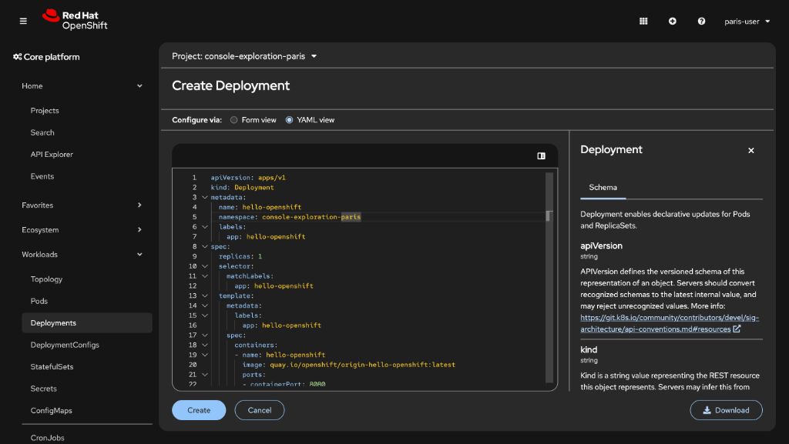
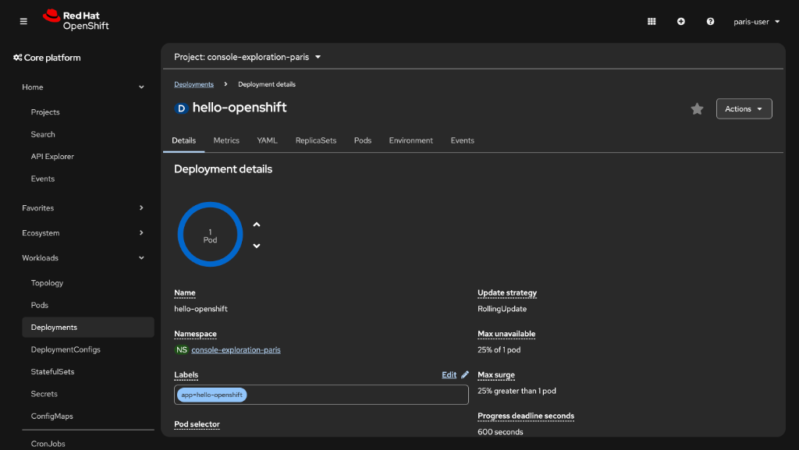
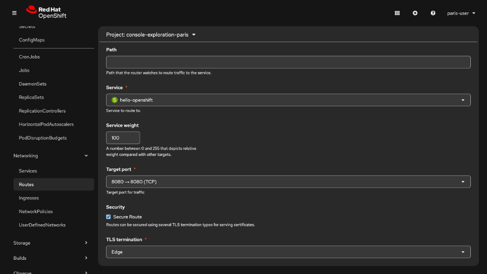

# Exercice Guidé : Exploration de la console OpenShift

## Ce que vous allez apprendre

Cet exercice vous guide pas à pas dans votre **première interaction** avec la console web d'OpenShift. Vous allez découvrir comment créer un espace de travail (un *projet*), naviguer dans la perspective Administrator, y déployer une application, puis observer et gérer les ressources que Kubernetes a créées pour vous. 

Ne vous inquiétez pas si certains termes sont nouveaux : ils seront tous expliqués au fil de l'exercice.


---

## Objectifs

A la fin de cet exercice, vous serez capable de :

- [ ] Vous connecter à la console web d'OpenShift
- [ ] Naviguer dans la perspective **Administrator**
- [ ] Créer un **projet** (espace de travail isolé)
- [ ] Déployer une application à partir d'un manifeste YAML via l'éditeur de la console
- [ ] Exposer l'application via un **Service** et une **Route**
- [ ] Identifier les ressources Kubernetes créées (Pod, Deployment, Service, Route)
- [ ] Supprimer proprement les ressources depuis la console

---

## Étape 1 : Accéder à la console web

**Pourquoi ?** La console web est l'interface graphique d'OpenShift. Elle permet de gérer vos applications et vos ressources Kubernetes sans avoir besoin d'utiliser la ligne de commande. C'est le point d'entrée principal pour les développeurs et les administrateurs.

### 1.1 - Ouvrir la console

1. Ouvrez votre navigateur web (Chrome ou Firefox recommandé).
2. Rendez-vous à l'adresse suivante :

```
https://console-openshift-console.apps.neutron-sno-office.neutron-it.fr/
```

:::tip Conseil
Ajoutez cette URL à vos favoris, vous en aurez besoin tout au long de la formation.
:::

3. Sur la page de connexion, sélectionnez **"Neutron Guest Identity Management"**.


4. Saisissez vos identifiants :
   - **Utilisateur** : `<CITY>-user` (par exemple : `paris-user`)


   - **Mot de passe** : `OpenShift4formation!`
5. Cliquez sur **"Log in"**.

:::warning Attention
Le nom d'utilisateur est composé du **nom de votre ville en minuscules**, suivi de `-user`. Vérifiez bien l'orthographe. Si la connexion échoue, vérifiez que vous avez bien sélectionné "Neutron Guest Identity Management" et non un autre fournisseur d'identité.
:::

### 1.2 - Découvrir l'interface

Une fois connecté, vous arrivez sur la page d'accueil de la console. Prenez quelques secondes pour repérer les éléments suivants :

- **Le menu de gauche** : il permet d'accéder aux différentes sections (Workloads, Networking, Storage, Observe, Administration…).
- **Le sélecteur de projet** (en haut à gauche) : il permet de choisir dans quel projet vous travaillez.

:::info Console unifiée - perspective Administrator
Depuis OpenShift 4.17, la console ne dispose plus que d'une seule perspective : **Administrator**. Cette perspective unifiée couvre aussi bien les besoins des administrateurs cluster que ceux des développeurs qui déploient et gèrent des applications.
:::

### Vérification

Vous avez réussi cette étape si :
- Vous voyez la console OpenShift dans votre navigateur
- Votre nom d'utilisateur apparaît en haut à droite de l'écran

---

## Étape 2 : Navigation dans la console Administrator

**Pourquoi ?** Avant de déployer une application, il est important de comprendre comment la console est organisée. Chaque section du menu correspond à un domaine de gestion du cluster.

### 2.1 - Explorer les sections du menu

Parcourez les sections suivantes dans le menu latéral gauche et observez leur contenu :

| Section | Contenu principal |
|---------|------------------|
| **Home** | Tableau de bord du cluster, projets, événements |
| **Workloads** | Pods, Deployments, ReplicaSets, StatefulSets, Jobs |
| **Networking** | Services, Routes, Ingress, NetworkPolicies |
| **Storage** | PersistentVolumes, PersistentVolumeClaims, StorageClasses |
| **Observe** | Métriques, alertes, logs |
| **Administration** | Namespaces, quotas, paramètres du cluster |

### 2.2 - Créer un projet

Dans OpenShift, un **projet** est un espace de travail isolé. Il regroupe toutes les ressources liées à une application ou un environnement. C'est l'équivalent d'un *namespace* Kubernetes avec des fonctionnalités supplémentaires.

:::note Analogie
Pensez au projet comme à un **dossier** sur votre ordinateur : il vous permet d'organiser et d'isoler vos fichiers (ici, vos ressources Kubernetes) des autres utilisateurs.
:::

1. Dans le menu de gauche, allez dans **"Home" > "Projects"**.
2. Cliquez sur **"Create Project"** en haut à droite.


3. Remplissez le formulaire :
   - **Name** : `console-exploration-<CITY>` (par exemple : `console-exploration-paris`)
   - **Display Name** : `Exploration Console` (optionnel)
   - **Description** : `Mon premier projet OpenShift` (optionnel)

:::warning Règles de nommage
Le nom du projet doit :
- Être en **minuscules**
- Ne contenir que des lettres, chiffres et tirets (`-`)
- Commencer par une lettre

Exemple valide : `console-exploration-paris`
Exemple invalide : `Console_Exploration_Prague`
:::

4. Cliquez sur **"Create"**.

### Vérification

Vous avez réussi cette étape si :
- Le nom de votre projet apparaît dans le sélecteur de projet en haut à gauche
- Vous êtes dans la perspective **Administrator**

---

## Étape 3 : Déployer une application depuis la console

**Pourquoi ?** L'objectif principal d'OpenShift est d'exécuter des applications conteneurisées. Vous allez déployer l'application `hello-openshift` directement depuis l'éditeur YAML intégré à la console, ce qui vous familiarisera avec la structure des ressources Kubernetes.

:::info Qu'est-ce qu'une image de conteneur ?
Une image de conteneur est un **modèle en lecture seule** qui sert à créer des conteneurs. C'est un peu comme un fichier ISO pour une machine virtuelle, mais beaucoup plus léger. L'image `hello-openshift` que nous utilisons fait seulement quelques mégaoctets et affiche un simple message de bienvenue.
:::

### 3.1 - Accéder à la création de Deployment

1. Dans le menu de gauche, allez dans **"Workloads" > "Deployments"**.
2. Vérifiez que le projet sélectionné est bien `console-exploration-<CITY>`.
3. Cliquez sur **"Create Deployment"** en haut à droite.
4. La console ouvre un **éditeur YAML** avec un modèle de déploiement pré-rempli.



### 3.2 - Saisir le manifeste YAML

5. Remplacez le contenu de l'éditeur par le YAML suivant (adaptez `<CITY>` à votre ville) :

```yaml
apiVersion: apps/v1
kind: Deployment
metadata:
  name: hello-openshift
  namespace: console-exploration-<CITY>
  labels:
    app: hello-openshift
spec:
  replicas: 1
  selector:
    matchLabels:
      app: hello-openshift
  template:
    metadata:
      labels:
        app: hello-openshift
    spec:
      containers:
      - name: hello-openshift
        image: quay.io/openshift/origin-hello-openshift:latest
        ports:
        - containerPort: 8080
```

:::note Que se passe-t-il en coulisses ?
En cliquant sur "Create", OpenShift crée un **Deployment** qui décrit comment exécuter l'application. Kubernetes crée ensuite automatiquement un **ReplicaSet** et un **Pod** pour faire tourner le conteneur.
:::

6. Cliquez sur **"Create"** en bas de la page.

### Vérification

Vous avez réussi cette étape si :
- La console affiche la page de détails du Deployment `hello-openshift`
- Le statut indique **1 of 1 pods** disponible après quelques secondes



---

## Étape 4 : Exposer l'application via un Service et une Route

**Pourquoi ?** Un Deployment fait tourner des pods, mais ceux-ci ne sont pas accessibles de l'extérieur sans un **Service** (point d'accès réseau interne) et une **Route** (URL publique). Vous allez créer ces deux ressources depuis la console.

### 4.1 - Créer un Service

1. Dans le menu de gauche, allez dans **"Networking" > "Services"**.
2. Cliquez sur **"Create Service"** en haut à droite.
3. Remplacez le contenu de l'éditeur YAML par :

```yaml
apiVersion: v1
kind: Service
metadata:
  name: hello-openshift
  namespace: console-exploration-<CITY>
spec:
  selector:
    app: hello-openshift
  ports:
  - name: http
    port: 8080
    targetPort: 8080
  type: ClusterIP
```

4. Cliquez sur **"Create"**.

:::note Rôle du Service
Le **Service** utilise le champ `selector` pour trouver les pods correspondants (ceux qui ont le label `app: hello-openshift`). Il leur fournit une adresse réseau stable, indépendante des redémarrages de pods.
:::

### 4.2 - Créer une Route

5. Dans le menu de gauche, allez dans **"Networking" > "Routes"**.
6. Cliquez sur **"Create Route"** en haut à droite.
7. Remplissez le formulaire :
   - **Name** : `hello-openshift`
   - **Service** : sélectionnez `hello-openshift`
   - **Target port** : `8080 -> 8080 (TCP)`
   - Cochez la case **Secure Route**
   - Sélectionnez **Edge** dans le champ **TLS termination**
8. Cliquez sur **"Create"**.



### Vérification

Vous avez réussi cette étape si :
- Le Service `hello-openshift` est visible dans **Networking > Services**
- La Route `hello-openshift` est visible dans **Networking > Routes**
- La Route affiche une URL dans la colonne **Location**

---

## Étape 5 : Vérifier que l'application est accessible

**Pourquoi ?** Une Route expose votre application via une URL publique. En accédant à cette URL, vous vérifiez que toute la chaîne fonctionne : Deployment → Pod → Service → Route.

### 5.1 - Accéder à l'application

1. Dans **"Networking" > "Routes"**, repérez la route `hello-openshift`.
2. Cliquez sur l'URL affichée dans la colonne **Location** (elle ressemble à `https://hello-openshift-console-exploration-<CITY>.apps.neutron-sno-office.neutron-it.fr`).

```
Sortie attendue :

Un nouvel onglet s'ouvre dans votre navigateur avec le message :

Hello OpenShift!
```

### 5.2 - Inspecter les ressources depuis la console

3. Dans **"Workloads" > "Pods"**, vérifiez que le pod est en statut **Running** avec **Ready 1/1**.
4. Cliquez sur le nom du pod pour explorer ses détails : onglets **Logs**, **Events**, **Terminal**.

:::tip Explorer un Pod
L'onglet **Logs** affiche la sortie standard du conteneur en temps réel. L'onglet **Terminal** vous donne un accès shell direct dans le conteneur - très utile pour le débogage.
:::


### Vérification

Vous avez réussi cette étape si :
- Vous voyez le message **"Hello OpenShift!"** dans votre navigateur
- Le pod est en statut **Running** dans la console

---

## Étape 6 : Supprimer les ressources depuis la console

**Pourquoi ?** Il est important de nettoyer les ressources que vous n'utilisez plus. Vous allez supprimer le projet entier, ce qui supprimera automatiquement toutes les ressources qu'il contient (Deployment, Pod, Service, Route).

:::warning Suppression irréversible
La suppression d'un projet est **définitive**. Toutes les ressources, données et configurations du projet seront perdues. OpenShift vous demande de taper le nom du projet pour confirmer, afin d'éviter les suppressions accidentelles.
:::

### 6.1 - Supprimer le projet

1. Dans la perspective **Administrator**, allez dans **"Home" > "Projects"**.
2. Repérez votre projet `console-exploration-<CITY>` dans la liste.
3. Cliquez sur le **menu contextuel** (l'icône **⋮** à droite de la ligne).
4. Sélectionnez **"Delete Project"**.


5. Dans la fenêtre de confirmation, tapez le nom exact de votre projet : `console-exploration-<CITY>`.
6. Cliquez sur **"Delete"**.

```
Sortie attendue :

Le projet disparaît de la liste après quelques secondes.
Un message de confirmation s'affiche brièvement.
```

### Vérification

Vous avez réussi cette étape si :
- Le projet n'apparaît plus dans la liste des projets
- Si vous essayez de le sélectionner dans le sélecteur de projet, il n'est plus disponible

---

## Récapitulatif

Voici un résumé de tout ce que vous avez créé et observé au cours de cet exercice :

| Ressource | Nom | Rôle | Créée à l'étape |
|---|---|---|---|
| **Projet** | `console-exploration-<CITY>` | Espace de travail isolé (namespace) | Étape 2 |
| **Deployment** | `hello-openshift` | Décrit l'état souhaité de l'application | Étape 3 |
| **Pod** | `hello-openshift-xxxxx-xxxxx` | Instance en cours d'exécution du conteneur | Étape 3 (automatique) |
| **Service** | `hello-openshift` | Point d'accès réseau interne stable | Étape 4 |
| **Route** | `hello-openshift` | URL publique vers l'application | Étape 4 |

### Concepts clés retenus

| Concept | Description |
|---|---|
| **Projet / Namespace** | Espace isolé pour organiser les ressources |
| **Image de conteneur** | Package contenant l'application et ses dépendances |
| **Pod** | Plus petite unité d'exécution dans Kubernetes |
| **Deployment** | Contrôle le cycle de vie des Pods |
| **Service** | Adresse réseau stable pour accéder aux Pods |
| **Route** | Expose un Service à l'extérieur du cluster |
| **Perspective Administrator** | Interface unifiée de la console OpenShift 4.17+ |

:::tip Pour aller plus loin
Essayez de refaire cet exercice sans regarder les instructions. C'est le meilleur moyen de vérifier que vous avez bien compris chaque étape. Vous pouvez aussi essayer de déployer une autre image, par exemple `docker.io/nginx:latest`, en créant votre propre YAML.
:::

---

Dans la prochaine section, nous aborderons l'architecture d'OpenShift et Kubernetes.
