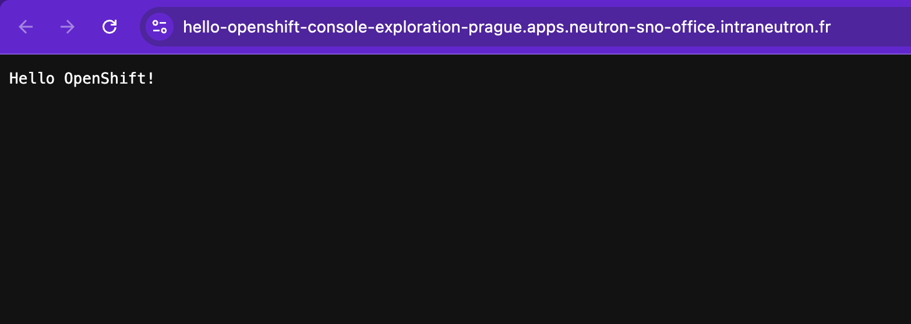
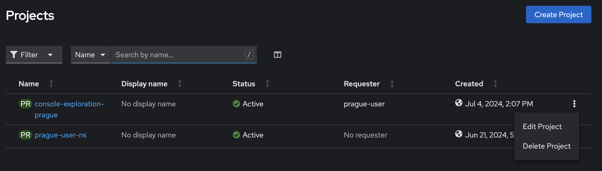

# Exercice Guidé : Exploration de la console OpenShift

## Ce que vous allez apprendre

Cet exercice vous guide pas à pas dans votre **première interaction** avec la console web d'OpenShift. Vous allez découvrir comment créer un espace de travail (un *projet*), y déployer une application à partir d'une image de conteneur, puis observer les ressources que Kubernetes a créées pour vous. Chaque étape explique **pourquoi** vous faites telle ou telle action, afin que vous compreniez les concepts sous-jacents et pas seulement la marche à suivre.

Ne vous inquiétez pas si certains termes sont nouveaux : ils seront tous expliqués au fil de l'exercice.


---

## Objectifs

A la fin de cet exercice, vous serez capable de :

- [ ] Vous connecter à la console web d'OpenShift
- [ ] Créer un **projet** (espace de travail isolé)
- [ ] Déployer une application à partir d'une **image de conteneur**
- [ ] Accéder à l'application depuis votre navigateur grâce à une **Route**
- [ ] Basculer entre les perspectives **Developer** et **Administrator**
- [ ] Identifier les ressources Kubernetes créées automatiquement (Pod, Deployment, Service, Route)
- [ ] Supprimer proprement un projet et toutes ses ressources

---


---

## Étape 1 : Accéder à la console web

**Pourquoi ?** La console web est l'interface graphique d'OpenShift. Elle permet de gérer vos applications et vos ressources Kubernetes sans avoir besoin d'utiliser la ligne de commande. C'est le point d'entrée principal pour les développeurs et les administrateurs.

### 1.1 — Ouvrir la console

1. Ouvrez votre navigateur web (Chrome ou Firefox recommandé).
2. Rendez-vous à l'adresse suivante :

```
https://console-openshift-console.apps.neutron-sno-office.neutron-it.fr/
```

:::tip Conseil
Ajoutez cette URL à vos favoris, vous en aurez besoin tout au long de la formation.
:::

3. Sur la page de connexion, sélectionnez **"Neutron Guest Identity Management"**.


4. Saisissez vos identifiants :
   - **Utilisateur** : `<CITY>-user` (par exemple : `prague-user`)


   - **Mot de passe** : `OpenShift4formation!`
5. Cliquez sur **"Log in"**.

:::warning Attention
Le nom d'utilisateur est composé du **nom de votre ville en minuscules**, suivi de `-user`. Vérifiez bien l'orthographe. Si la connexion échoue, vérifiez que vous avez bien sélectionné "Neutron Guest Identity Management" et non un autre fournisseur d'identité.
:::

### 1.3 — Découvrir l'interface

Une fois connecté, vous arrivez sur la page d'accueil de la console. Prenez quelques secondes pour repérer les éléments suivants :

- **Le menu de gauche** : il permet d'accéder aux différentes sections (Topology, Builds, Monitoring...).
- **Le sélecteur de perspective** (en haut à gauche) : il permet de basculer entre la vue **Developer** et la vue **Administrator**.


- **Le sélecteur de projet** (en haut à gauche, sous la perspective) : il permet de choisir dans quel projet vous travaillez.


:::info Perspectives Developer vs Administrator
- La perspective **Developer** est optimisée pour le développement : elle met en avant la topologie des applications, les builds et les pipelines.
- La perspective **Administrator** montre une vue plus détaillée des ressources Kubernetes (Pods, Services, Deployments, etc.) et donne accès aux paramètres du cluster.

Vous utiliserez les deux au cours de cet exercice.
:::

### Vérification

Vous avez réussi cette étape si :
- Vous voyez la console OpenShift dans votre navigateur
- Votre nom d'utilisateur apparaît en haut à droite de l'écran

---

## Étape 2 : Créer un projet

**Pourquoi ?** Dans OpenShift, un **projet** est un espace de travail isolé. Il regroupe toutes les ressources liées à une application ou un environnement. Chaque projet a ses propres droits d'accès, ses quotas de ressources et son réseau interne. C'est l'équivalent d'un *namespace* Kubernetes avec des fonctionnalités supplémentaires.

:::note Analogie
Pensez au projet comme à un **dossier** sur votre ordinateur : il vous permet d'organiser et d'isoler vos fichiers (ici, vos ressources Kubernetes) des autres utilisateurs.
:::

### 2.1 — Basculer en perspective Developer

1. En haut à gauche de la console, cliquez sur le **sélecteur de perspective**.
2. Choisissez **"Developer"**.

### 2.2 — Créer le projet

3. Cliquez sur le **sélecteur de projet** (juste en dessous), puis sur **"Create Project"**.


4. Remplissez le formulaire :
   - **Name** : `console-exploration-<CITY>` (par exemple : `console-exploration-prague`)
   - **Display Name** : `Exploration Console` (optionnel, pour un affichage plus lisible)
   - **Description** : `Mon premier projet OpenShift` (optionnel)

:::warning Règles de nommage
Le nom du projet doit :
- Être en **minuscules**
- Ne contenir que des lettres, chiffres et tirets (`-`)
- Commencer par une lettre

Exemple valide : `console-exploration-prague`
Exemple invalide : `Console_Exploration_Prague`
:::

5. Cliquez sur **"Create"**.

### Vérification

Vous avez réussi cette étape si :
- Le nom de votre projet apparaît dans le sélecteur de projet en haut à gauche
- Vous êtes dans la perspective **Developer**
- La page **Topology** s'affiche (elle est vide pour l'instant, c'est normal)

---

## Étape 3 : Déployer une application à partir d'une image de conteneur

**Pourquoi ?** L'objectif principal d'OpenShift est d'exécuter des applications conteneurisées. Une **image de conteneur** est un package qui contient tout ce dont une application a besoin pour fonctionner : le code, les bibliothèques, les dépendances et la configuration. Ici, vous allez utiliser une image toute prête (`hello-openshift`) qui affiche un simple message de bienvenue.

:::info Qu'est-ce qu'une image de conteneur ?
Une image de conteneur est un **modèle en lecture seule** qui sert à créer des conteneurs. C'est un peu comme un fichier ISO pour une machine virtuelle, mais beaucoup plus léger. L'image `hello-openshift` que nous utilisons fait seulement quelques mégaoctets.
:::

### 3.1 — Accéder au menu d'ajout

1. Dans la perspective **Developer**, cliquez sur **"+Add"** dans le menu de gauche.
2. Vous voyez plusieurs méthodes pour ajouter une application. Sélectionnez **"Container images"**.


### 3.2 — Configurer le déploiement

3. Dans le champ **"Image name from external registry"**, saisissez :

```
docker.io/openshift/hello-openshift
```

:::tip Que signifie cette adresse ?
- `docker.io` : le registre d'images (Docker Hub, le plus connu)
- `openshift` : le compte/organisation qui publie l'image
- `hello-openshift` : le nom de l'image

C'est un peu comme une URL qui pointe vers un fichier téléchargeable.
:::

4. Attendez quelques secondes qu'OpenShift valide l'image (un indicateur de chargement apparaît).
5. Examinez les valeurs qui ont été remplies automatiquement :
   - **Application name** : le nom logique du groupe d'application
   - **Name** : `hello-openshift` (le nom de votre déploiement)
   - **Target port** : le port sur lequel l'application écoute (détecté automatiquement)
   - **Create a Route** : coché par défaut (c'est ce qui rendra votre application accessible depuis un navigateur)

6. Laissez toutes les valeurs par défaut et cliquez sur **"Create"** en bas de la page.


:::note Que se passe-t-il en coulisses ?
En cliquant sur "Create", OpenShift crée automatiquement **plusieurs ressources Kubernetes** pour vous :
1. Un **Deployment** : définit comment exécuter l'application (quelle image, combien de réplicas...)
2. Un **Pod** : l'instance en cours d'exécution de votre conteneur
3. Un **Service** : un point d'accès réseau interne vers votre application
4. Une **Route** : expose le Service à l'extérieur du cluster, pour le rendre accessible via un navigateur

Vous inspecterez toutes ces ressources à l'étape 5.
:::

### Vérification

Vous avez réussi cette étape si :
- Vous êtes redirigé vers la page **Topology**
- Un cercle bleu apparaît, représentant votre déploiement `hello-openshift`
- Le cercle devient bleu foncé (le Pod est en cours d'exécution)

---

## Étape 4 : Accéder à l'application via la Route

**Pourquoi ?** Une **Route** est une ressource propre à OpenShift qui expose votre application sur une URL publique. Sans Route, votre application ne serait accessible qu'à l'intérieur du cluster. C'est le mécanisme qui fait le lien entre le monde extérieur et votre conteneur.

### 4.1 — Trouver la Route dans la Topology

1. Sur la page **Topology**, repérez le cercle représentant `hello-openshift`.
2. Cliquez dessus pour ouvrir le **panneau de détails** à droite.


### 4.2 — Ouvrir l'application

3. Dans le panneau de détails, cherchez la section **"Routes"**.
4. Cliquez sur l'URL affichée (elle ressemble à `http://hello-openshift-console-exploration-<CITY>.apps.neutron-sno-office.neutron-it.fr`).


```
Sortie attendue :
───────────────
Un nouvel onglet s'ouvre dans votre navigateur avec le message :

Hello OpenShift!
```



:::tip Astuce
Vous pouvez aussi accéder à l'application en cliquant sur la **petite icône en forme de flèche** dans le coin supérieur droit du cercle sur la vue Topology. C'est un raccourci vers la Route.
:::

### Vérification

Vous avez réussi cette étape si :
- Vous voyez le message **"Hello OpenShift!"** dans votre navigateur
- L'URL dans la barre d'adresse contient le nom de votre projet

---

## Étape 5 : Inspecter les ressources en vue Administrator

**Pourquoi ?** Quand vous avez cliqué sur "Create" à l'étape 3, OpenShift a créé plusieurs ressources Kubernetes en coulisses. La perspective **Administrator** vous permet de les voir en détail. Comprendre ces ressources est fondamental pour la suite de la formation.

### 5.1 — Basculer en perspective Administrator

1. En haut à gauche, cliquez sur le **sélecteur de perspective**.
2. Choisissez **"Administrator"**.

### 5.2 — Voir la vue d'ensemble du projet

3. Dans le menu de gauche, allez dans **"Home" > "Projects"**.
4. Cliquez sur votre projet `console-exploration-<CITY>`.


:::info Que voyez-vous ?
La page du projet affiche un tableau de bord avec :
- L'**utilisation des ressources** (CPU, mémoire)
- Le **nombre de Pods** en cours d'exécution
- Les **événements** récents (création de ressources, erreurs éventuelles)
:::

### 5.3 — Inspecter les Pods

**Qu'est-ce qu'un Pod ?** C'est la plus petite unité d'exécution dans Kubernetes. Un Pod contient un ou plusieurs conteneurs qui partagent le même réseau et le même stockage. Ici, votre Pod contient un seul conteneur : celui de `hello-openshift`.

5. Dans le menu de gauche, allez dans **"Workloads" > "Pods"**.
6. Vérifiez que le projet sélectionné est bien `console-exploration-<CITY>`.


```
Sortie attendue :
───────────────
Vous devriez voir un Pod dont le nom commence par "hello-openshift-"
suivi d'un identifiant aléatoire (ex: hello-openshift-7d4f5b8c9-xk2mn).

Status : Running
Ready  : 1/1
```

:::tip Explorer un Pod
Cliquez sur le nom du Pod pour voir ses détails : logs, événements, variables d'environnement, terminal... C'est très utile pour le débogage.
:::

### Vérification

Vous avez réussi cette étape si :
- Vous voyez **1 Pod** avec le statut **Running**
- La colonne **Ready** affiche **1/1**

### 5.4 — Inspecter le Deployment

**Qu'est-ce qu'un Deployment ?** C'est une ressource qui décrit l'état souhaité de votre application : quelle image utiliser, combien de réplicas (copies) lancer, comment effectuer les mises à jour. Kubernetes s'assure en permanence que l'état réel correspond à l'état souhaité.


```
Sortie attendue :
───────────────
Nom          : hello-openshift
Status       : Available (1 of 1 pods)
```

### Vérification

Vous avez réussi cette étape si :
- Vous voyez le Deployment `hello-openshift`
- Il indique **1 pod disponible** sur 1

### 5.5 — Inspecter le Service

**Qu'est-ce qu'un Service ?** C'est un point d'accès réseau **stable** vers votre application. Les Pods sont éphémères (ils peuvent être recréés à tout moment avec une nouvelle adresse IP), mais le Service conserve toujours la même adresse. Il joue le rôle de **répartiteur de charge** interne.

8. Dans le menu de gauche, allez dans **"Networking" > "Services"**.


```
Sortie attendue :
───────────────
Nom          : hello-openshift
Type         : ClusterIP
Port(s)      : 8080/TCP (et éventuellement 8443/TCP)
```

:::note Récapitulatif du flux réseau
Le chemin d'une requête depuis votre navigateur jusqu'à l'application est le suivant :

**Navigateur** --> **Route** (URL publique) --> **Service** (répartiteur interne) --> **Pod** (conteneur)

Chaque couche a un rôle précis, et c'est cette architecture qui rend Kubernetes si résilient.
:::

### Vérification

Vous avez réussi cette étape si :
- Vous voyez le Service `hello-openshift`
- Il est de type **ClusterIP**

---

## Étape 6 : Supprimer le projet

**Pourquoi ?** Il est important de nettoyer les ressources que vous n'utilisez plus. Supprimer un projet supprime **toutes** les ressources qu'il contient (Pods, Deployments, Services, Routes...). Cela libère des ressources sur le cluster pour les autres utilisateurs.

:::warning Suppression irréversible
La suppression d'un projet est **définitive**. Toutes les ressources, données et configurations du projet seront perdues. OpenShift vous demande de taper le nom du projet pour confirmer, afin d'éviter les suppressions accidentelles.
:::

### 6.1 — Supprimer le projet

1. Dans la perspective **Administrator**, allez dans **"Home" > "Projects"**.
2. Repérez votre projet `console-exploration-<CITY>` dans la liste.
3. Cliquez sur le **menu contextuel** (l'icône **⋮** à droite de la ligne).
4. Sélectionnez **"Delete Project"**.



5. Dans la fenêtre de confirmation, tapez le nom exact de votre projet : `console-exploration-<CITY>`.
6. Cliquez sur **"Delete"**.

```
Sortie attendue :
───────────────
Le projet disparaît de la liste après quelques secondes.
Un message de confirmation s'affiche brièvement.
```

### Vérification

Vous avez réussi cette étape si :
- Le projet n'apparaît plus dans la liste des projets
- Si vous essayez de le sélectionner dans le sélecteur de projet, il n'est plus disponible

---

## Récapitulatif

Voici un résumé de tout ce que vous avez créé et observé au cours de cet exercice :

| Ressource | Nom | Rôle | Créée à l'étape |
|---|---|---|---|
| **Projet** | `console-exploration-<CITY>` | Espace de travail isolé (namespace) | Étape 2 |
| **Deployment** | `hello-openshift` | Décrit l'état souhaité de l'application | Étape 3 (automatique) |
| **Pod** | `hello-openshift-xxxxx-xxxxx` | Instance en cours d'exécution du conteneur | Étape 3 (automatique) |
| **Service** | `hello-openshift` | Point d'accès réseau interne stable | Étape 3 (automatique) |
| **Route** | `hello-openshift` | URL publique vers l'application | Étape 3 (automatique) |

### Concepts clés retenus

| Concept | Description |
|---|---|
| **Projet / Namespace** | Espace isolé pour organiser les ressources |
| **Image de conteneur** | Package contenant l'application et ses dépendances |
| **Pod** | Plus petite unité d'exécution dans Kubernetes |
| **Deployment** | Contrôle le cycle de vie des Pods |
| **Service** | Adresse réseau stable pour accéder aux Pods |
| **Route** | Expose un Service à l'extérieur du cluster |
| **Perspective Developer** | Vue orientée développement (Topology, +Add) |
| **Perspective Administrator** | Vue détaillée des ressources Kubernetes |

:::tip Pour aller plus loin
Essayez de refaire cet exercice sans regarder les instructions. C'est le meilleur moyen de vérifier que vous avez bien compris chaque étape. Vous pouvez aussi essayer de déployer une autre image, par exemple `docker.io/nginx:latest`.
:::

---

Dans la prochaine section, nous aborderons l'architecture d'OpenShift et Kubernetes.
