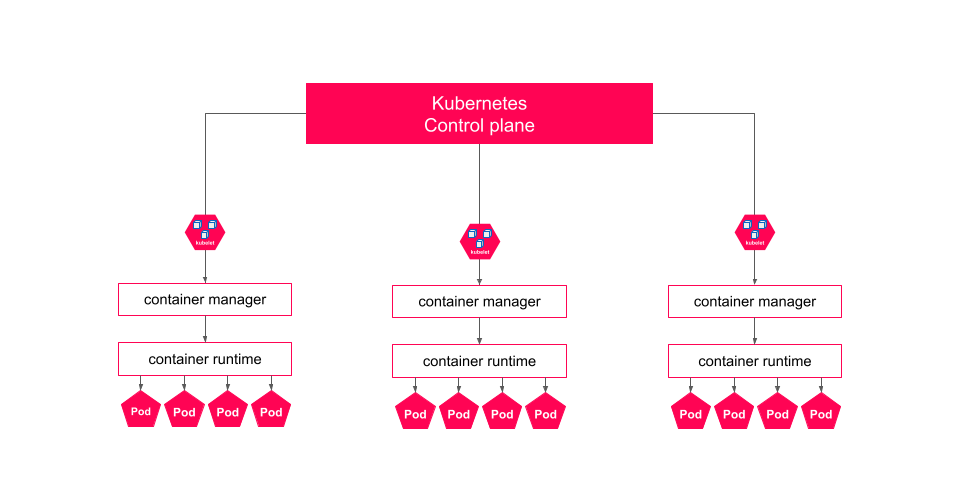
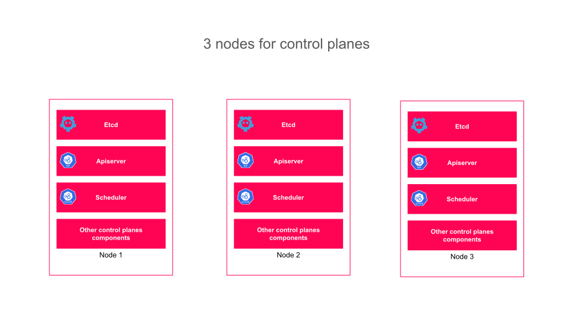

# Concepts Architecturaux de Kubernetes

## Objectif

Dans cette section, nous allons explorer l'architecture d'OpenShift.

### Concepts

Kubernetes repose sur plusieurs serveurs, ou nodes, pour garantir la résilience et l’évolutivité des applications qu’il gère. Ces nodes, qu’ils soient physiques ou virtuels, fournissent les ressources nécessaires au cluster. Il y a deux types de nodes, chacun ayant un rôle distinct dans le fonctionnement du cluster. Les nodes du plan de contrôle gèrent la coordination globale du cluster, notamment la planification des charges de travail et la gestion de l’état de configuration du cluster. Les nodes du plan de calcul exécutent les applications, en communiquant avec les nodes du plan de contrôle pour recevoir les demandes d’exécution des applications.

La communication entre le plan de contrôle et les nodes du cluster s'effectue via le service kubelet qui fonctionne sur chaque node. Bien qu'un serveur puisse servir à la fois de node de plan de contrôle et de calcul, ces rôles sont souvent séparés pour une meilleure stabilité, sécurité et gérabilité.

#### Composants du Plan de Contrôle

Pour comprendre comment Kubernetes assure la coordination et la gestion des clusters, différents composants du plan de contrôle interviennent. Ces principaux éléments sont les suivant :

- **etcd** : Une base de données distribuée clé-valeur qui stocke les configurations du cluster.
- **kube-apiserver** : Le service frontal qui expose l’API Kubernetes.
- **kube-scheduler** : Un service qui détermine les nodes de calcul disponibles pour les nouvelles demandes de pods.

#### Composants du Plan de Calcul

Les composants du plan de calcul sont les responsables de l'exécution des applications. Ces composants travaillent en étroite collaboration avec le plan de contrôle pour s'assurer que les pods sont déployés et gérés efficacement. Les principaux sont les suivants :

- **kubelet** : L'agent principal sur chaque node de calcul, chargé de l'exécution des pods demandés via l'API et le planificateur.
- **CRI (Container Runtime Interface)** : Une interface de plug-in pour la communication entre kubelet et les configurations de pods.
- **cri-o** : Un moteur d’exécution compatible OCI qui facilite la communication entre kubelet et les demandes de configuration de pods.

### Concepts Architecturaux de Red Hat Enterprise Linux CoreOS

L'ensemble de ces nodes reposent sur un OS spécifique : Red Hat Enterprise Linux CoreOS (RHCOS).

Red Hat Enterprise Linux CoreOS est une distribution Linux optimisée pour exécuter les conteneurs à grande échelle. Intégrée à OpenShift, elle fournit une base solide et sécurisée pour les nodes du cluster, avec une gestion simplifiée et automatisée. RHCOS assure que les machines hôtes sont correctement configurées sans nécessiter une intervention manuelle significative de la part des administrateurs.

L'utilisation de RHCOS est facilitée par le Machine Configuration Operator (MCO) d'OpenShift. Le MCO est responsable de la gestion et de la configuration du système d’exploitation sous-jacent des nodes. Il permet non seulement l'installation initiale, mais aussi la mise à jour et la maintenance continue des systèmes CoreOS, garantissant que les nodes restent cohérents avec les politiques et les configurations définies par les administrateurs.

En plus de ces fonctionnalités, RHCOS offre plusieurs avantages clés pour les environnements OpenShift :

1. **Sécurité Renforcée** : Grâce à des mises à jour automatiques et à des correctifs de sécurité intégrés, RHCOS maintient un haut niveau de sécurité sans intervention manuelle.
2. **Optimisation des Performances** : RHCOS est conçu pour exécuter des conteneurs de manière efficace, réduisant les coûts et améliorant les performances des applications hébergées.
3. **Simplification de la Gestion** : Avec le MCO et d'autres outils intégrés, RHCOS simplifie la gestion des nodes, permettant aux équipes DevOps de se concentrer sur le développement et le déploiement des applications.

En intégrant RHCOS, OpenShift bénéficie d'une base fiable et performante, essentielle pour exécuter des charges de travail conteneurisées à grande échelle tout en minimisant les efforts de gestion et en maximisant la sécurité et la performance.
