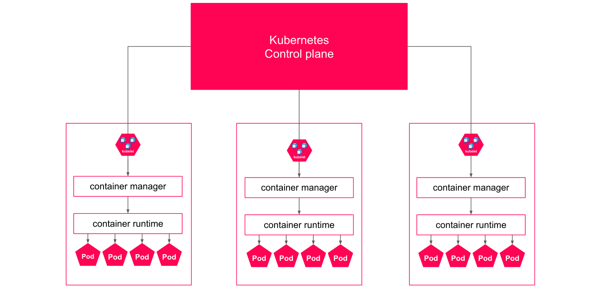
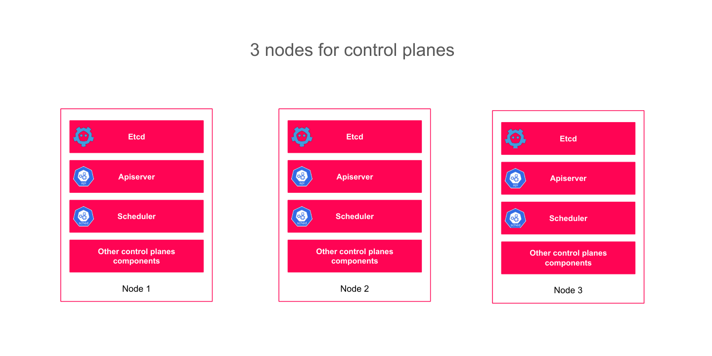
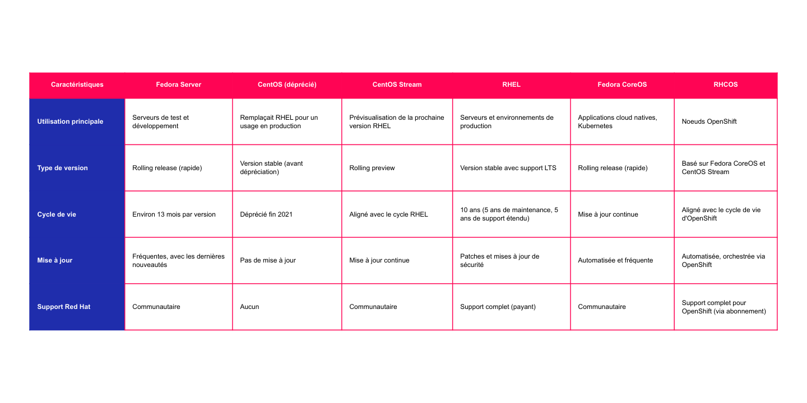
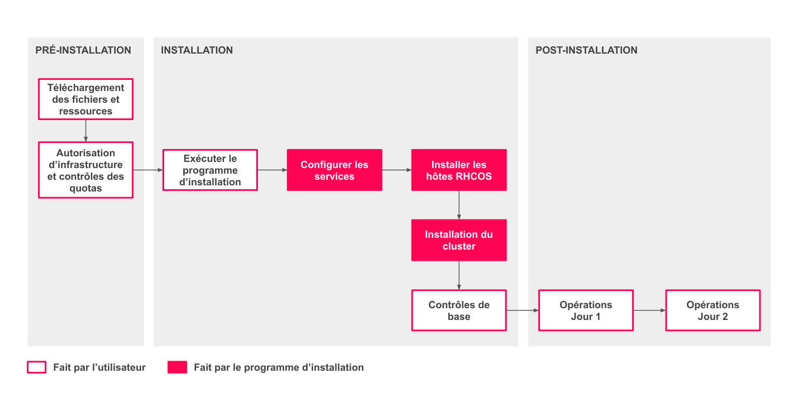
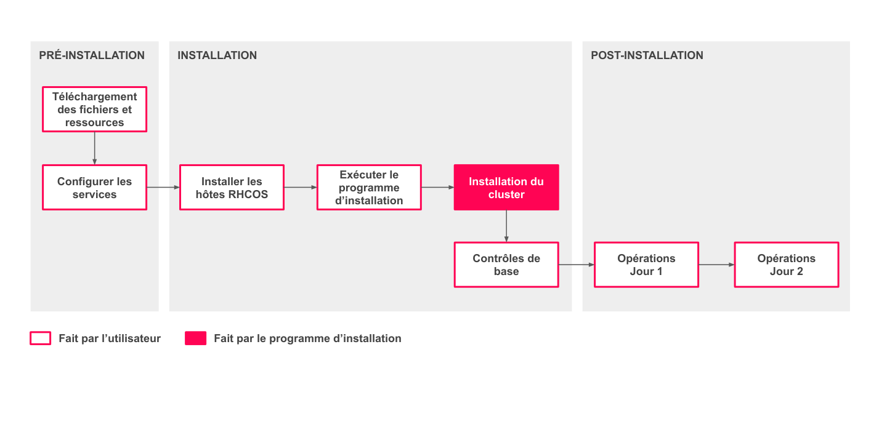

# Architecture d'OpenShift et Kubernetes

## Objectif

Comprendre l'architecture interne d'un cluster OpenShift est essentiel pour diagnostiquer des problèmes, planifier la capacité et comprendre le comportement de la plateforme sous charge. Cette section détaille les composants qui constituent un cluster, leur rôle, et la façon dont ils interagissent pour garantir que vos applications tournent de manière fiable et à l'échelle.

:::info Ce que vous allez apprendre
- La distinction entre plan de contrôle et plan de calcul
- Les composants Kubernetes du plan de contrôle et leur rôle
- Les composants spécifiques à OpenShift
- L'OS sous-jacent des nœuds OpenShift : RHCOS
:::

---

## Vue d'ensemble : un cluster = des nœuds

Un cluster Kubernetes (et donc OpenShift) est constitué d'un ensemble de **nœuds** (nodes). Un nœud est une machine, physique ou virtuelle, qui exécute des charges de travail sous la supervision de Kubernetes. Ces nœuds sont regroupés en deux catégories fonctionnelles aux rôles bien distincts.



*Architecture d'un cluster Kubernetes : plan de contrôle avec ses 4 composants et nœuds de calcul avec kubelet, CRI-O et les pods applicatifs*

| Type de nœud | Rôle | Composants clés |
|-------------|------|----------------|
| **Nœuds du plan de contrôle** (Control Plane) | Coordination globale du cluster, prise de décision | kube-apiserver, etcd, kube-scheduler, kube-controller-manager |
| **Nœuds de calcul** (Worker Nodes) | Exécution des applications et des charges de travail | kubelet, kube-proxy, CRI-O, pods applicatifs |

:::note Séparation des rôles
Dans un cluster de production OpenShift, les nœuds du plan de contrôle et les nœuds de calcul sont des machines séparées. Cette séparation garantit que la gestion du cluster n'est pas affectée par la charge des applications, et qu'une saturation des nœuds de calcul ne perturbe pas le plan de contrôle.
:::

---

## Le plan de contrôle (Control Plane)

Le plan de contrôle est le cerveau du cluster. Il prend toutes les décisions de gestion : où placer un pod, comment réagir à la défaillance d'un nœud, comment faire évoluer le nombre de réplicas. Il ne fait tourner aucune application utilisateur.



*En production, OpenShift déploie 3 nœuds de contrôle en haute disponibilité - etcd utilise le consensus Raft pour tolérer la perte d'un master*

### Composants Kubernetes du plan de contrôle

| Composant | Rôle | Particularités |
|-----------|------|----------------|
| **kube-apiserver** | Point d'entrée unique de toutes les opérations sur le cluster | Expose l'API REST Kubernetes, valide et persiste les ressources, gère l'authentification et l'autorisation |
| **etcd** | Base de données distribuée clé-valeur, source de vérité du cluster | Stocke l'état complet du cluster, hautement disponible (consensus Raft), critique pour la reprise après sinistre |
| **kube-scheduler** | Placement des pods sur les nœuds | Évalue les ressources disponibles, les contraintes d'affinité, les politiques de tolérance pour choisir le nœud optimal |
| **kube-controller-manager** | Boucles de réconciliation pour maintenir l'état désiré | Contient de nombreux contrôleurs : ReplicaSet controller, Node controller, Endpoints controller, etc. |

#### kube-apiserver en détail

L'API server est le composant le plus central du cluster. Tous les autres composants - y compris `kubectl` et `oc` - interagissent exclusivement avec l'API server. Il ne traite jamais d'état en mémoire : toutes les décisions sont basées sur les données lues depuis etcd.

```shell
# Toutes ces commandes passent par l'API server
oc get pods
oc apply -f deployment.yaml
oc delete service mon-service
```

:::info Sécurité de l'API server
L'API server gère l'authentification (qui êtes-vous ?), l'autorisation (avez-vous le droit ?) et l'admission (la ressource est-elle conforme aux politiques ?). Sur OpenShift, des webhooks d'admission supplémentaires sont ajoutés pour faire respecter les SecurityContextConstraints.
:::

#### etcd en détail

etcd est la base de données du cluster. Il stocke la définition de toutes les ressources : pods, services, déploiements, secrets, configmaps, etc. Sa disponibilité est critique : si etcd est perdu sans sauvegarde, le cluster perd son état.

:::warning Sauvegarde d'etcd
Dans un cluster de production, des sauvegardes régulières d'etcd sont indispensables. OpenShift fournit des outils de sauvegarde intégrés via le `etcd-backup` script. En cas de perte d'etcd, la seule option est de restaurer depuis une sauvegarde.
:::

#### kube-scheduler en détail

Lorsqu'un pod est créé sans nœud assigné, le scheduler analyse le cluster et sélectionne le nœud le plus adapté selon plusieurs critères :

1. **Filtrage** : élimination des nœuds ne répondant pas aux contraintes (ressources insuffisantes, taints incompatibles, affinity rules)
2. **Scoring** : classement des nœuds restants selon des règles de priorité (équilibrage de charge, localité des données)
3. **Assignation** : le nœud retenu est écrit dans l'objet Pod via l'API server

#### kube-controller-manager en détail

Le controller manager regroupe de nombreuses boucles de contrôle, chacune responsable d'un type de ressource :

| Contrôleur | Responsabilité |
|------------|---------------|
| ReplicaSet controller | Maintient le nombre de pods demandé |
| Deployment controller | Gère les rolling updates |
| Node controller | Détecte les nœuds non disponibles et déclenche la reprogrammation des pods |
| Service Account controller | Crée les comptes de service par défaut dans les nouveaux namespaces |
| Endpoint controller | Met à jour les Endpoints quand les pods changent |

---

## Les nœuds de calcul (Worker Nodes)

Les nœuds de calcul hébergent les pods applicatifs. Ils reçoivent leurs instructions du plan de contrôle et exécutent les conteneurs demandés.

### Composants d'un nœud de calcul

| Composant | Rôle |
|-----------|------|
| **kubelet** | Agent principal du nœud. Reçoit les spécifications de pods depuis l'API server, lance les conteneurs via CRI-O, surveille leur état et remonte les informations de santé |
| **kube-proxy** | Gère les règles iptables/eBPF pour le routage réseau des Services vers les pods |
| **CRI-O** | Runtime de conteneurs compatible OCI. Télécharge les images, crée et supprime les conteneurs sur demande du kubelet |
| **Pods applicatifs** | Les charges de travail déployées par les utilisateurs |

:::tip CRI-O vs Docker
OpenShift utilise **CRI-O** comme runtime de conteneurs, et non Docker. CRI-O est un runtime léger, optimisé pour Kubernetes, qui implémente uniquement l'interface CRI (Container Runtime Interface). Vous n'interagissez jamais directement avec CRI-O : c'est le kubelet qui le pilote.
:::

### Communication entre plan de contrôle et nœuds

```
Plan de contrôle                    Nœuds de calcul
┌┐                ┌┐
│  kube-apiserver │◄ TLS ►│     kubelet      │
│                 │                │  (port 10250)    │
│  kube-scheduler │                │                  │
│                 │                │    CRI-O         │
│  controller-mgr │                │                  │
│                 │                │  Pods applicatifs│
│  etcd           │                └┘
└┘
```

Toute communication entre le plan de contrôle et les nœuds de calcul est chiffrée via TLS. Le kubelet s'authentifie auprès de l'API server avec un certificat client.

---

## Composants spécifiques à OpenShift

OpenShift enrichit Kubernetes avec des opérateurs et des composants supplémentaires, tous gérés de manière déclarative via le **Cluster Version Operator (CVO)**.

### Opérateurs de plateforme (Platform Operators)

| Composant OpenShift | Rôle |
|--------------------|------|
| **Cluster Version Operator (CVO)** | Gère les mises à jour du cluster. Orchestre la mise à jour de tous les composants dans le bon ordre |
| **Machine Config Operator (MCO)** | Gère la configuration de l'OS (RHCOS) des nœuds : kernel parameters, fichiers de configuration, services systemd |
| **OpenShift API Server** | Extension de l'API server Kubernetes avec les ressources spécifiques OpenShift (Routes, BuildConfigs, Projects…) |
| **OpenShift OAuth Server** | Gestion de l'authentification via OAuth2, intégration LDAP/OIDC |
| **OpenShift Image Registry** | Registre d'images intégré pour stocker les images buildées sur le cluster |
| **OpenShift Router (HAProxy)** | Ingress controller qui termine le trafic HTTP/HTTPS et le route vers les Services via les Routes |
| **Cluster Monitoring Operator** | Déploie et configure Prometheus, Alertmanager et Grafana pour la supervision du cluster |
| **Network Operator (OVN-Kubernetes)** | Gère le réseau du cluster : SDN, NetworkPolicies, routage inter-pods |

:::info Tout est un opérateur
Dans OpenShift, les composants de la plateforme sont eux-mêmes gérés par des opérateurs. Cela signifie que leur configuration, leur mise à jour et leur réconciliation sont gérées de manière automatisée. Vous pouvez voir l'état de chaque opérateur de plateforme depuis la console dans **Administration > Cluster Settings**.
:::

---

## Red Hat Enterprise Linux CoreOS (RHCOS)

### L'OS des nœuds OpenShift

Tous les nœuds d'un cluster OpenShift standard s'exécutent sur **Red Hat Enterprise Linux CoreOS (RHCOS)**, un système d'exploitation Linux immuable et optimisé pour les conteneurs.

RHCOS est fondamentalement différent d'un Linux classique :



*RHCOS se distingue des distributions Linux classiques par son caractère immuable et son intégration native avec OpenShift*

| Caractéristique | RHCOS | Linux classique |
|----------------|-------|----------------|
| Mises à jour | Atomiques (image complète, rollback possible) | Par paquets (yum/dnf) |
| Configuration | Déclarative via Ignition/MCO | Manuelle ou via CM |
| Accès SSH | Déconseillé, réservé au débogage | Standard |
| Filesystem root | Lecture seule | Lecture-écriture |
| Runtime conteneurs | CRI-O intégré | À installer |
| Intégration OpenShift | Native (MCO) | Manuelle |

### Le Machine Config Operator (MCO)

Le MCO est le composant qui gère la configuration de RHCOS sur chaque nœud. Il traduit les `MachineConfig` objects (ressources Kubernetes) en configuration système effective sur les nœuds.

```yaml
# Exemple de MachineConfig : ajouter un paramètre kernel
apiVersion: machineconfiguration.openshift.io/v1
kind: MachineConfig
metadata:
  name: 99-worker-kernel-args
  labels:
    machineconfiguration.openshift.io/role: worker
spec:
  kernelArguments:
    - "net.ipv4.tcp_keepalive_time=200"
```

Lorsqu'une MachineConfig est appliquée, le MCO redémarre les nœuds concernés de manière contrôlée (un par un) pour appliquer la nouvelle configuration.

### Avantages de RHCOS pour OpenShift

**1. Sécurité renforcée**

- SELinux activé par défaut sur tous les nœuds
- Mises à jour de sécurité appliquées automatiquement sans intervention manuelle
- Surface d'attaque réduite grâce à un OS minimal

**2. Cohérence et reproductibilité**

- Tous les nœuds d'un même rôle sont identiques (même image OS)
- Impossible d'accumuler de la configuration dérive (configuration drift) comme sur un OS mutable
- Reprovisionning facile en cas de défaillance d'un nœud

**3. Intégration native avec OpenShift**

- Le MCO est le seul moyen de modifier la configuration des nœuds, ce qui garantit la traçabilité et la réversibilité
- Les mises à jour du cluster OpenShift incluent automatiquement les mises à jour RHCOS

:::tip Debugging sur RHCOS
Pour accéder au shell d'un nœud RHCOS à des fins de débogage, OpenShift propose la commande `oc debug node/<nom-du-noeud>`. Cette commande lance un pod privilégié sur le nœud ciblé, sans nécessiter de connexion SSH directe.

```shell
# Accéder au shell d'un nœud pour le débogage
oc debug node/worker-0
```
:::

---

## Installation d'un cluster OpenShift

OpenShift peut être installé de deux manières principales, selon le niveau de contrôle souhaité sur l'infrastructure sous-jacente.

### IPI - Installer Provisioned Infrastructure

Dans le mode IPI, l'installateur OpenShift crée et gère lui-même toute l'infrastructure (VMs, réseau, stockage) en interagissant avec l'API du fournisseur cloud ou de virtualisation.



*IPI : l'installateur crée automatiquement toute l'infrastructure - adapté aux environnements cloud (AWS, Azure, GCP, vSphere)*

### UPI - User Provisioned Infrastructure

Dans le mode UPI, l'opérateur crée et configure manuellement l'infrastructure avant de lancer l'installation d'OpenShift. C'est la méthode utilisée pour les environnements bare-metal ou les infrastructures existantes avec des contraintes réseau spécifiques.



*UPI : l'opérateur prépare l'infrastructure en amont - requis pour bare-metal ou réseaux avec contraintes fortes*

| Critère | IPI | UPI |
|---------|-----|-----|
| Rapidité | ~30-60 min | Plusieurs heures |
| Contrôle infra | Géré par OpenShift | Contrôle total |
| Complexité | Faible | Élevée |
| Cas d'usage | Cloud, vSphere | Bare-metal, infra existante |
| Approbation CSR | Automatique | Manuelle |

:::tip Quel mode choisir ?
Pour un premier cluster ou un environnement cloud, **IPI** est recommandé. Pour des contraintes spécifiques (réseau air-gapped, bare-metal, certification de sécurité), choisissez **UPI**.
:::

---


## Conclusion

L'architecture d'OpenShift repose sur une séparation claire entre le plan de contrôle (qui décide) et les nœuds de calcul (qui exécutent). Kubernetes fournit les primitives d'orchestration, et OpenShift y ajoute des opérateurs de plateforme pour les fonctionnalités enterprise. RHCOS garantit que les nœuds sont sécurisés, cohérents et gérés de manière déclarative. Cette architecture est conçue pour être résiliente, scalable et opérable sans intervention manuelle dans les cas courants.
