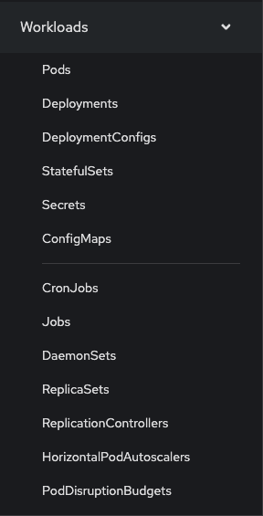
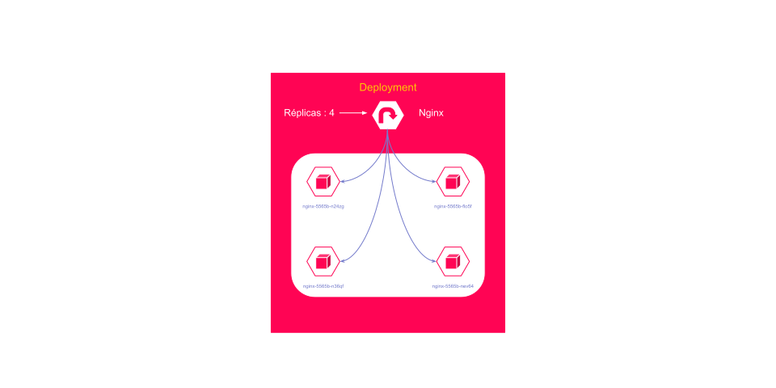
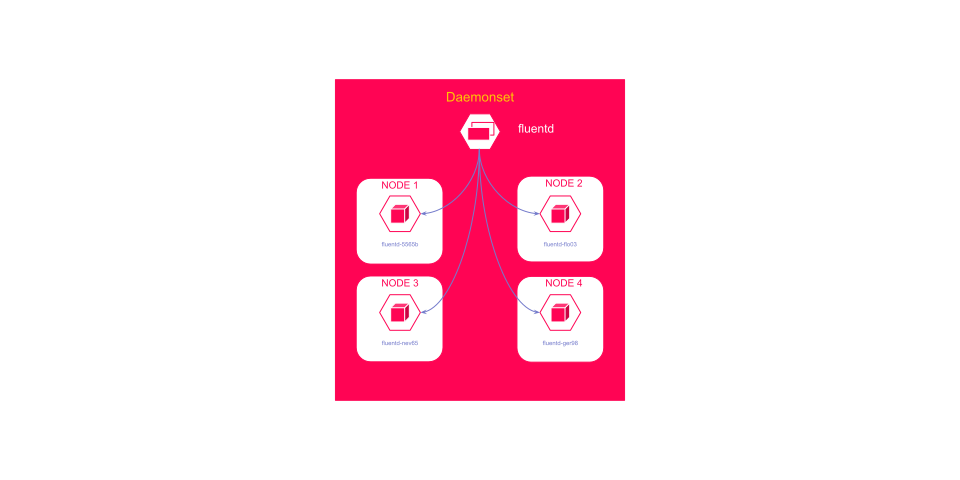
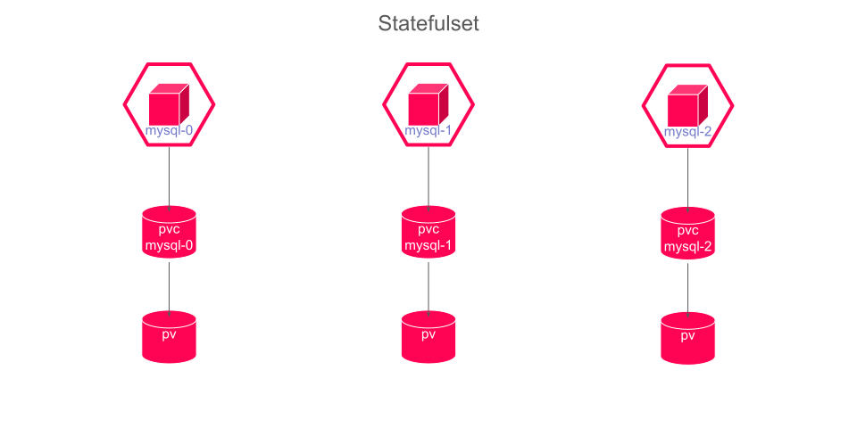
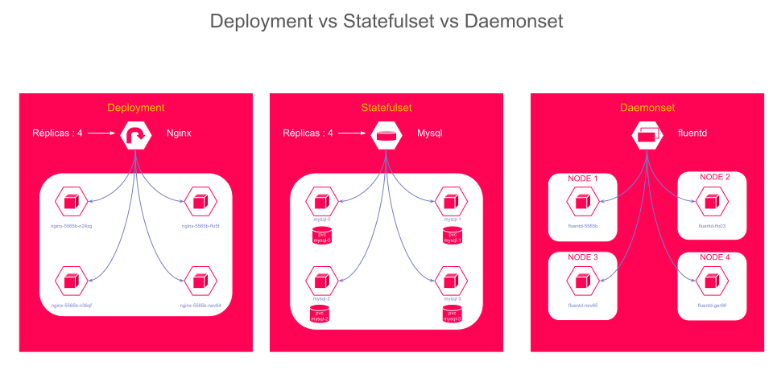

# Les Workloads dans OpenShift

Dans cette section, nous allons explorer les différents types de workloads dans OpenShift. OpenShift offre plusieurs types de ressources pour gérer et déployer des applications. Ces ressources, appelées workloads, sont essentielles pour orchestrer et maintenir les applications en production.

### Objectifs de la Section

L'objectif principal est de comprendre les différents types de workloads dans OpenShift, notamment les déploiements, les configurations de déploiement, les réplicas, les ensembles de réplicas, les daemonset et les statefulset. Nous allons également illustrer les concepts et les différences entre ces ressources et apprendre à les utiliser pour gérer des applications dans un cluster OpenShift.

### Deployments

Les déploiements sont une ressource Kubernetes qui gère la mise à jour déclarative des applications. Ils permettent de décrire l'état souhaité pour vos pods et réplicas, et le contrôleur de déploiement ajuste l'état réel pour correspondre à cet état souhaité.

Les déploiements offrent plusieurs fonctionnalités clés. Ils permettent l'utilisation de différentes stratégies de déploiement, telles que les déploiements en rollout et les déploiements de recréation, pour minimiser les temps d'arrêt. En cas de problème, ils permettent des rollbacks faciles à une version précédente. De plus, les mises à jour progressives des pods assurent que l'application reste disponible pendant les mises à jour.

### DeploymentConfig

Les `DeploymentConfig` sont spécifiques à OpenShift et offrent des fonctionnalités avancées pour le déploiement d'applications. Ces configurations permettent d'utiliser des triggers basés sur les modifications d'image, de configuration, etc. Cela permet de déclencher automatiquement un nouveau déploiement lorsqu'une image ou une configuration est mise à jour. De plus, les stratégies de déploiement sont personnalisables selon les besoins spécifiques de l'application.

Tandis que les déploiements et les configurations de déploiement se concentrent sur la gestion des versions des applications, les réplicas et les ensembles de réplicas jouent un rôle crucial dans la gestion de la disponibilité des pods.

NOTE: Les deploymentConfig sont maintenant deprecated et seront supprimé dans une prochaine version d'Openshift

### Replicas

Les réplicas garantissent qu'un nombre spécifié de pods est en cours d'exécution à tout moment. Ils sont une partie intégrante des déploiements et des ensembles de réplicas. Cette fonctionnalité est essentielle pour assurer la scalabilité de l'application, en permettant d'ajuster le nombre de réplicas en fonction de la charge. Elle assure également une tolérance aux pannes, en maintenant un certain nombre de pods en cours d'exécution même en cas de défaillance de certains d'entre eux.

### ReplicaSets

Les `ReplicaSets` s'assurent qu'un nombre spécifié de réplicas d'un pod est en cours d'exécution à tout moment. Ils remplacent les `ReplicationControllers` et sont souvent utilisés par les déploiements pour gérer les réplicas. Les `ReplicaSets` utilisent des sélecteurs de pods pour gérer quels pods sont surveillés et maintenus, assurant ainsi que le bon nombre de réplicas est toujours en cours d'exécution.

Les ensembles de réplicas sont utiles pour maintenir des instances de pods, mais qu'en est-il des applications nécessitant un pod par nœud ? C'est là que les DaemonSets entrent en jeu.

### DaemonSets

Les `DaemonSets` garantissent qu'une copie d'un pod tourne sur chaque nœud (ou un sous-ensemble de nœuds) dans le cluster. Cette fonctionnalité est particulièrement utile pour des tâches telles que le monitoring ou la gestion des logs, où chaque nœud doit exécuter un pod spécifique. Les DaemonSets simplifient la gestion en assurant une présence uniforme des pods sur les nœuds requis.

Alors que les DaemonSets assurent une copie de pod par nœud, certaines applications nécessitent un état persistant entre les réplicas. C'est là que les StatefulSets interviennent.

### StatefulSets

Les `StatefulSets` sont utilisés pour déployer et gérer des applications avec un état persistant, telles que des bases de données. Ils offrent plusieurs fonctionnalités importantes. Chaque pod dans un StatefulSet a un identifiant unique et stable, ce qui est essentiel pour des applications qui nécessitent une identité stable. De plus, les StatefulSets gèrent le stockage persistant en associant des volumes persistants spécifiques aux pods. Enfin, ils assurent une mise à jour et un scaling contrôlés, garantissant une séquence ordonnée pour le déploiement, la mise à jour et la suppression des pods.

### Tableau récapitulatif

| Objet             | Description                                                                                               | Utilisation principale                                               |
|-------------------|-----------------------------------------------------------------------------------------------------------|----------------------------------------------------------------------|
| **Pod**           | Unité de base de déploiement avec un ou plusieurs conteneurs.                                             | Exécution directe des conteneurs.                                    |
| **StatefulSet**   | Contrôleur pour applications stateful avec ordonnancement et stockage stable.                             | Bases de données, systèmes distribués en cluster.                   |
| **DaemonSet**     | Contrôleur pour assurer qu'un Pod est exécuté sur chaque nœud.                                            | Agents de logs, collecteurs de métriques, outils de sécurité.        |
| **ReplicaSet**    | Contrôleur pour garantir un nombre spécifié de répliques de Pods.                                         | Maintien d'un nombre fixe de Pods.                                   |
| **Deployment**    | Contrôleur pour déploiements déclaratifs avec mise à jour et rollback.                                    | Déploiement et mise à jour d'applications.                           |
| **DeploymentConfig** | Objet OpenShift pour déploiements avec stratégies et hooks supplémentaires.                             | Déploiement d'applications avec contrôle et flexibilité avancés.     |

Chaque type de contrôleur a des cas d'utilisation spécifiques et offre différents niveaux de gestion et de flexibilité pour le déploiement et la gestion des applications conteneurisées dans un cluster Kubernetes.

### Conclusion

Dans cette section, nous avons exploré les différents types de workloads dans OpenShift, en mettant l'accent sur les déploiements, les configurations de déploiement, les réplicas, les ensembles de réplicas, les ensembles de démons et les ensembles avec état. Comprendre et maîtriser ces concepts est crucial pour administrer et déployer des applications robustes et évolutives dans un environnement OpenShift.
