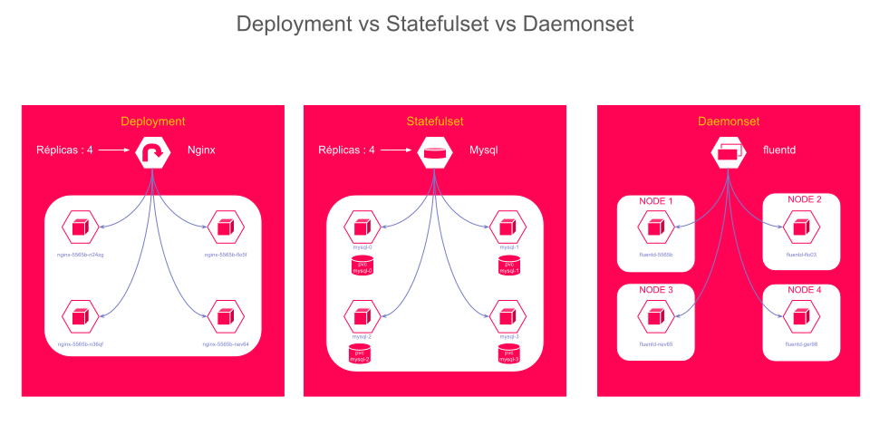

# Les Workloads dans OpenShift

Dans cette section, nous allons explorer les différents types de workloads disponibles dans OpenShift. Ces ressources, appelées **workloads**, constituent la base de l'orchestration des applications conteneurisées. Comprendre leurs différences et leurs cas d'usage respectifs est indispensable pour concevoir des architectures robustes et évolutives.

---

## Objectifs de la section

À la fin de cette section, vous serez capable de :

- Identifier les différents types de workloads proposés par OpenShift et Kubernetes
- Distinguer les rôles respectifs des Deployments, DaemonSets, StatefulSets et ReplicaSets
- Choisir le type de workload adapté à un besoin applicatif donné
- Comprendre les relations entre ces ressources et le cycle de vie des pods

---

## Vue d'ensemble des workloads

OpenShift repose sur Kubernetes et hérite de l'ensemble de ses primitives de déploiement. Un **workload** est une abstraction qui décrit comment des pods doivent être créés, maintenus et mis à jour dans le cluster.



*Représentation des trois principaux types de contrôleurs de workloads : Deployment, DaemonSet et StatefulSet.*

:::info Notion de contrôleur
Un contrôleur est une boucle de réconciliation qui surveille en permanence l'état du cluster et prend les mesures nécessaires pour que l'état réel corresponde à l'état déclaré dans le manifest YAML. Chaque type de workload est piloté par son propre contrôleur.
:::

---

## Les types de workloads en détail

### Pod

Le **Pod** est l'unité atomique de déploiement dans Kubernetes. Il regroupe un ou plusieurs conteneurs qui partagent le même réseau et les mêmes volumes. En pratique, on ne crée jamais de pods directement en production : on passe toujours par un contrôleur de niveau supérieur (Deployment, DaemonSet, StatefulSet) pour garantir la résilience.

:::warning Ne pas créer de pods nus en production
Un pod créé directement (`kind: Pod`) n'est pas recréé automatiquement en cas de panne du nœud. Utilisez toujours un contrôleur de workload pour assurer la disponibilité.
:::

---

### Deployment

Le **Deployment** est le workload de référence pour les applications **stateless**. Il permet de déclarer l'état souhaité (nombre de réplicas, image de conteneur, ressources) et délègue à son contrôleur la responsabilité d'atteindre et de maintenir cet état.

Fonctionnalités clés :

- Mise à jour progressive des pods (rolling update) avec contrôle fin du rythme de déploiement
- Retour arrière instantané vers une révision précédente (rollback)
- Scaling horizontal simple par modification du nombre de réplicas
- Gestion d'un **ReplicaSet** sous-jacent pour garantir le nombre de pods actifs

:::tip Cas d'usage typique
Le Deployment est adapté pour toute application web, API REST, worker de traitement de messages ou microservice qui ne maintient pas d'état local entre les requêtes.
:::

---

### DeploymentConfig (OpenShift)

Le **DeploymentConfig** est un objet propre à OpenShift, antérieur au Deployment Kubernetes. Il ajoute des fonctionnalités spécifiques comme les **triggers** basés sur les changements d'image ou de configuration, et des **hooks** de pré/post-déploiement.

:::warning Dépréciation des DeploymentConfig
Les `DeploymentConfig` sont désormais **dépréciés** dans les versions récentes d'OpenShift. Red Hat recommande de migrer vers les `Deployment` Kubernetes standard, qui couvrent l'ensemble des besoins courants. Les DeploymentConfig seront supprimés dans une prochaine version majeure.
:::

---

### ReplicaSet

Le **ReplicaSet** est le contrôleur chargé de garantir qu'un nombre précis de réplicas d'un pod est actif à tout instant. Il est quasi exclusivement utilisé de manière indirecte, via un Deployment. Le Deployment crée et gère des ReplicaSets successifs pour orchestrer les mises à jour progressives.

:::info ReplicaSet vs ReplicationController
Le ReplicaSet remplace l'ancien `ReplicationController`. Il supporte des sélecteurs de labels basés sur des expressions (`matchExpressions`), offrant plus de flexibilité. Dans la pratique, on ne manipule jamais un ReplicaSet directement.
:::

---

### DaemonSet

Le **DaemonSet** garantit qu'**une instance d'un pod** est exécutée sur **chaque nœud** du cluster (ou sur un sous-ensemble de nœuds défini par un sélecteur). Lorsqu'un nouveau nœud rejoint le cluster, le pod est automatiquement schedulé dessus. Lorsqu'un nœud est retiré, le pod est supprimé.

Cas d'usage typiques :

- Agents de collecte de logs (Fluentd, Filebeat)
- Exporters de métriques (Prometheus Node Exporter)
- Agents de sécurité et de détection d'intrusion (Falco)
- Plugins réseau (CNI) et agents de stockage

---

### StatefulSet

Le **StatefulSet** est conçu pour les applications **stateful** qui nécessitent une identité stable, un stockage persistant dédié par instance, et un ordonnancement séquentiel du déploiement et de la suppression des pods.

Contrairement au Deployment, chaque pod d'un StatefulSet possède :

- Un nom stable et prévisible (ex. `postgres-0`, `postgres-1`)
- Un **Persistent Volume Claim** (PVC) dédié qui lui survit
- Un ordonnancement garanti lors des opérations de scaling et de mise à jour

---

## Tableau comparatif des workloads


*Deployment (sans état), StatefulSet (avec identité et PVC par pod), DaemonSet (un pod par nœud)*

| Ressource | Type d'application | Identité stable | Stockage persistant par pod | Déploiement séquentiel | Nœud cible |
|---|---|---|---|---|---|
| **Pod** | Toutes (usage ponctuel) | Non | Non | N/A | Quelconque |
| **ReplicaSet** | Stateless | Non | Non | Non | Quelconque |
| **Deployment** | Stateless | Non | Non | Non | Quelconque |
| **DeploymentConfig** | Stateless (OpenShift) | Non | Non | Non | Quelconque |
| **DaemonSet** | Agents système | Non | Non | Non | Tous les nœuds |
| **StatefulSet** | Stateful | Oui | Oui | Oui | Quelconque |

---

## Quand utiliser quel workload ?

Le choix du bon type de workload conditionne la résilience, la scalabilité et la maintenabilité de l'application. Le tableau suivant propose des critères de sélection pratiques.

| Besoin | Workload recommandé | Justification |
|---|---|---|
| Déployer une API REST ou une application web | **Deployment** | Stateless, scaling horizontal simple, rolling update natif |
| Déployer une base de données PostgreSQL ou MySQL | **StatefulSet** | Identité stable, PVC dédié, ordonnancement séquentiel |
| Déployer un cluster Kafka ou Elasticsearch | **StatefulSet** | Chaque instance a un rôle unique et des données propres |
| Collecter les logs sur tous les nœuds | **DaemonSet** | Présence garantie sur chaque nœud, y compris les nouveaux |
| Surveiller les métriques système de chaque nœud | **DaemonSet** | Accès aux ressources du nœud (système de fichiers, réseau) |
| Déployer un plugin réseau (CNI) | **DaemonSet** | Doit être présent sur tous les nœuds dès leur ajout |
| Exécuter un job ponctuel ou périodique | **Job / CronJob** | Cycle de vie limité, pas de redémarrage automatique |

:::tip Stateless vs Stateful : la question clé
Avant de choisir un workload, posez-vous la question suivante : **l'application conserve-t-elle un état local entre deux requêtes ou entre deux redémarrages ?**
- Si non → **Deployment**
- Si oui → **StatefulSet**

Pour les agents système devant couvrir l'ensemble du cluster → **DaemonSet**.
:::

---

## Relations entre les ressources

```
Deployment
    └── ReplicaSet (géré automatiquement)
            └── Pod (0..N réplicas)

DaemonSet
    └── Pod (1 par nœud éligible)

StatefulSet
    └── Pod-0 ←→ PVC-0
    └── Pod-1 ←→ PVC-1
    └── Pod-N ←→ PVC-N
```

Un **Deployment** gère un ou plusieurs **ReplicaSets** au fil des mises à jour. À un instant donné, un seul ReplicaSet est actif ; les anciens sont conservés pour permettre les rollbacks. Chaque ReplicaSet gère un ensemble de **Pods** identiques et interchangeables.

Un **StatefulSet** gère directement ses pods, chacun ayant une identité unique et un stockage dédié. Les PVC ne sont pas supprimés lors du scaling vers le bas, préservant ainsi les données.

---

## Tableau récapitulatif complet

| Objet | Description | Utilisation principale |
|---|---|---|
| **Pod** | Unité de base avec un ou plusieurs conteneurs partageant réseau et volumes. | Exécution ponctuelle, rarement en production seul. |
| **ReplicaSet** | Garantit un nombre fixe de réplicas de pods actifs. | Utilisé indirectement via les Deployments. |
| **Deployment** | Gestion déclarative des applications stateless avec rolling update et rollback. | Applications web, APIs, microservices. |
| **DeploymentConfig** | Objet OpenShift deprecated avec triggers et hooks avancés. | Héritage ; migration vers Deployment recommandée. |
| **DaemonSet** | Un pod par nœud éligible, mis à jour de façon contrôlée. | Agents de monitoring, logs, sécurité, réseau. |
| **StatefulSet** | Pods avec identité stable, PVC dédiés et ordonnancement séquentiel. | Bases de données, clusters distribués, brokers de messages. |

---

:::info Pour aller plus loin
Les sections suivantes de ce module détaillent le fonctionnement et la configuration de chaque type de workload :
- **Section 02** : Deployments et DaemonSets — stratégies de mise à jour, rolling update, exemples YAML complets
- **Section 04** : StatefulSets — identité stable, volumeClaimTemplates, cas d'usage avec bases de données
:::
