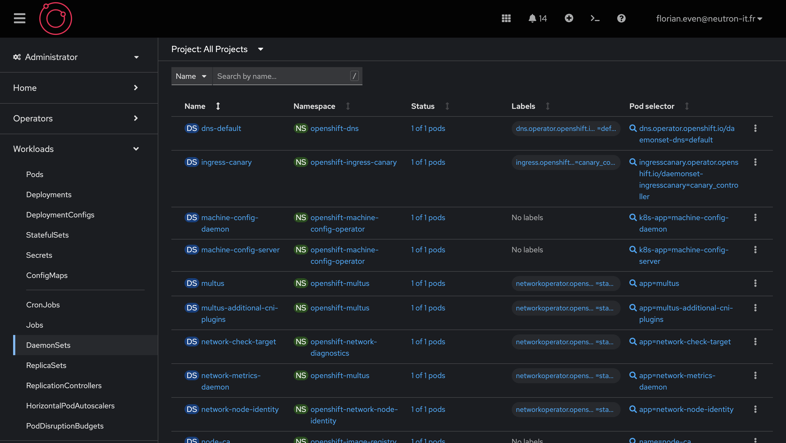

# Déploiements et DaemonSets dans OpenShift

#### Introduction

Les déploiements et les DaemonSets sont des composantes essentielles de la gestion des applications conteneurisées dans OpenShift. Tandis que les déploiements permettent de déployer, mettre à jour et gérer les applications de manière déclarative, les DaemonSets assurent qu'un pod spécifique est exécuté sur chaque nœud du cluster. Comprendre comment fonctionnent ces deux concepts dans OpenShift est crucial pour assurer la stabilité, la scalabilité et la continuité des services.

#### Objectifs de la Section

L'objectif principal de cette section est d'explorer en profondeur les déploiements et les DaemonSets dans OpenShift. Nous allons découvrir comment ils fonctionnent, leurs fonctionnalités clés, et comment les utiliser efficacement pour gérer des applications en production. À la fin de cette section, vous devriez être capable de :
- Comprendre les concepts fondamentaux des déploiements et des DaemonSets.
- Utiliser différentes stratégies de déploiement.
- Créer et gérer des DaemonSets.
- Maintenir la disponibilité des applications et des tâches critiques pendant les mises à jour.

#### Les Déploiements dans OpenShift

##### Concepts Fondamentaux

Les déploiements dans OpenShift, comme dans Kubernetes, sont des ressources déclaratives qui gèrent la mise à jour des applications. Ils permettent aux utilisateurs de spécifier l'état souhaité des applications, et le contrôleur de déploiement s'assure que l'état réel des pods et des réplicas correspond à cet état souhaité.

Un déploiement se compose de plusieurs éléments essentiels :
- **Template de Pod** : Décrit les conteneurs à exécuter, leurs images, ressources, et autres configurations.
- **Stratégies de Déploiement** : Déterminent comment les mises à jour des applications doivent être effectuées.

##### Structure d'un Template de Pod

Le template de pod est une section cruciale d'un manifest de déploiement. Il définit la configuration des pods à déployer, y compris les conteneurs, les volumes, les variables d'environnement, et d'autres spécifications nécessaires pour le bon fonctionnement de l'application.

```yaml
template:
  metadata:
    labels:
      app: my-app
  spec:
    containers:
    - name: my-container
      image: my-image:latest
      ports:
      - containerPort: 8080
      resources:
        requests:
          memory: "64Mi"
          cpu: "250m"
        limits:
          memory: "128Mi"
          cpu: "500m"
      env:
      - name: ENV_VAR
        value: "value"
```

Dans cet exemple, le template de pod spécifie un conteneur nommé `my-container` utilisant l'image `my-image:latest`. Le conteneur expose le port 8080 et a des ressources demandées et limitées pour la mémoire et le CPU. Une variable d'environnement `ENV_VAR` est également définie.

##### Stratégies de Déploiement

Les déploiements dans OpenShift offrent plusieurs stratégies pour mettre à jour les applications, chacune ayant ses avantages selon les besoins spécifiques :

1. **Rolling Updates** :
   - **Description** : Met à jour progressivement les pods de l'application, en remplaçant petit à petit les anciens pods par les nouveaux.
   - **Avantages** : Minimisation des temps d'arrêt, maintien de la disponibilité de l'application.
   - **Utilisation** : Idéale pour les mises à jour incrémentales sans interruption de service.

2. **Recreate** :
   - **Description** : Arrête tous les pods existants avant de créer les nouveaux pods.
   - **Avantages** : Simplicité, utilisation dans les cas où les mises à jour en place ne sont pas possibles.
   - **Utilisation** : Adaptée pour les mises à jour majeures où une interruption temporaire est acceptable.

##### Exemple de Manifest de Déploiement

Voici un exemple complet de manifest de déploiement pour une application simple :

```yaml
apiVersion: apps/v1
kind: Deployment
metadata:
  name: my-deployment
  labels:
    app: my-app
spec:
  replicas: 3
  selector:
    matchLabels:
      app: my-app
  template:
    metadata:
      labels:
        app: my-app
    spec:
      containers:
      - name: my-container
        image: my-image:latest
        ports:
        - containerPort: 8080
        resources:
          requests:
            memory: "64Mi"
            cpu: "250m"
          limits:
            memory: "128Mi"
            cpu: "500m"
        env:
        - name: ENV_VAR
          value: "value"
  strategy:
    type: RollingUpdate
    rollingUpdate:
      maxSurge: 1
      maxUnavailable: 1
```

Ce manifest de déploiement crée un déploiement nommé `my-deployment`, avec trois réplicas de `my-container` utilisant l'image `my-image:latest`. La stratégie de déploiement utilisée est `RollingUpdate`, avec un maximum de 1 pod supplémentaire et 1 pod indisponible pendant la mise à jour.

##### Déclencher une Mise à Jour

Pour déclencher une mise à jour d'un déploiement dans OpenShift, vous pouvez modifier l'image du conteneur ou d'autres paramètres dans le template de pod, puis appliquer ces modifications. Par exemple, pour mettre à jour l'image du conteneur, vous pouvez exécuter la commande suivante :

```bash
oc set image deployment/my-deployment my-container=my-image:new-version
```

Cette commande met à jour l'image de `my-container` dans le déploiement `my-deployment` avec `my-image:new-version`. Le contrôleur de déploiement commencera alors une mise à jour progressive des pods selon la stratégie spécifiée (par exemple, RollingUpdate).

##### Déclencher un Rollback

En cas de problème avec une mise à jour, OpenShift permet de revenir rapidement à une version précédente du déploiement. Pour déclencher un rollback, utilisez la commande suivante :

```bash
oc rollout undo deployment/my-deployment
```

Cette commande restaure le déploiement `my-deployment` à la version précédente connue comme étant stable. Le contrôleur de déploiement remplacera les pods actuels par ceux définis dans la configuration précédente.

##### Maintien de la Disponibilité

Les déploiements sont conçus pour maintenir la disponibilité des applications pendant les mises à jour. Grâce aux stratégies de déploiement comme les rolling updates, OpenShift s'assure que de nouvelles instances de pods sont créées avant que les anciennes soient supprimées, garantissant ainsi que l'application reste accessible aux utilisateurs pendant toute la durée de la mise à jour.

#### Les DaemonSets dans OpenShift

##### Concepts Fondamentaux

Les DaemonSets dans OpenShift, comme dans Kubernetes, sont des ressources déclaratives qui s'assurent qu'un pod spécifique est exécuté sur tous (ou certains) nœuds d'un cluster.

##### Spécificités par Rapport aux Déploiements

Les DaemonSets diffèrent des déploiements de plusieurs façons :
- **Ciblage des Nœuds** : Les DaemonSets s'assurent qu'un pod est exécuté sur chaque nœud spécifié, tandis que les déploiements gèrent la scalabilité des pods sans garantie de couverture sur tous les nœuds.
- **Scalabilité** : Les DaemonSets ne gèrent pas la scalabilité de la même manière que les déploiements. Ils se concentrent sur l'exécution d'un pod par nœud.
- **Mises à Jour** : Les mises à jour des DaemonSets sont appliquées de manière contrôlée pour minimiser les interruptions sur chaque nœud.
- **Tolérance aux Pannes** : Les DaemonSets sont utilisés pour des tâches qui nécessitent une haute disponibilité et tolérance aux pannes à l'échelle des nœuds.

##### Exemple de Manifest de DaemonSet

Voici un exemple complet de manifest de DaemonSet pour une application simple :

```yaml
apiVersion: apps/v1
kind: DaemonSet
metadata:
  name: my-daemonset
  labels:
    app: my-daemon
spec:
  selector:
    matchLabels:
      app: my-daemon
  template:
    metadata:
      labels:
        app: my-daemon
    spec:
      containers:
      - name: my-container
        image: my-image:latest
        ports:
        - containerPort: 8080
        resources:
          requests:
            memory: "64Mi"
            cpu: "250m"
          limits:
            memory: "128Mi"
            cpu: "500m"
        env:
        - name: ENV_VAR
          value: "value"
```

Ce manifest de DaemonSet crée un DaemonSet nommé `my-daemonset`, déployant un pod `my-container` sur chaque nœud du cluster utilisant l'image `my-image:latest`.

##### Cas d'Utilisation des DaemonSets

Les DaemonSets sont utilisés dans des scénarios spécifiques où il est crucial

 que des tâches soient exécutées sur chaque nœud. Voici quelques cas d'utilisation courants :
- **Monitoring des Nœuds** : Utilisation de DaemonSets pour déployer des agents de monitoring comme Prometheus Node Exporter sur chaque nœud pour collecter des métriques.
- **Collecte de Logs** : Déploiement de collecteurs de logs comme Fluentd ou Logstash pour centraliser les logs des nœuds et des applications.
- **Configuration de Réseau** : Utilisation de DaemonSets pour configurer des réseaux avec des outils comme Calico ou Weave sur chaque nœud.
- **Sécurité** : Déploiement d'outils de sécurité comme Falco ou d'autres systèmes de détection d'intrusion pour surveiller et sécuriser chaque nœud.



#### Conclusion

Les déploiements et les DaemonSets dans OpenShift jouent des rôles cruciaux dans la gestion efficace des applications et des tâches critiques à l'échelle des nœuds du cluster. En offrant des stratégies de déploiement flexibles et des mécanismes robustes pour les mises à jour et les rollbacks, OpenShift permet de maintenir la continuité des services et de réduire les temps d'arrêt. Maîtriser ces concepts vous permettra d'assurer une gestion fluide et stable de vos applications en production, contribuant ainsi à la résilience et à la fiabilité de vos systèmes.
