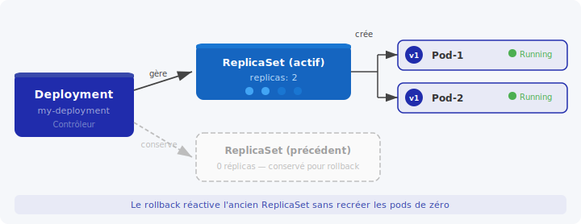
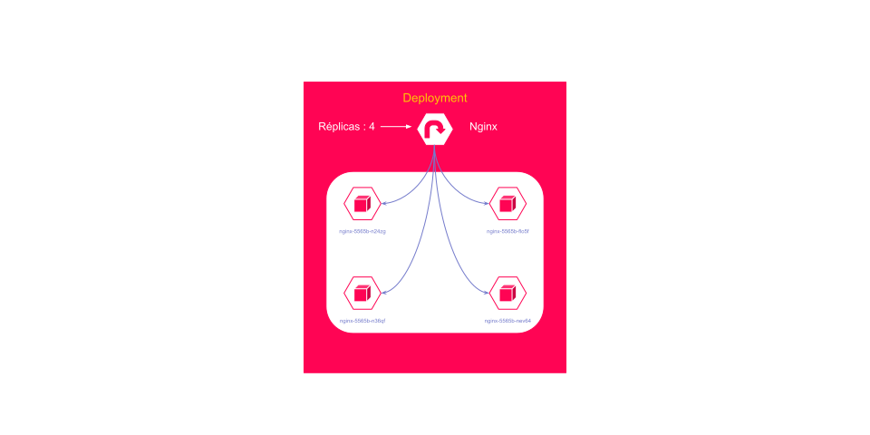
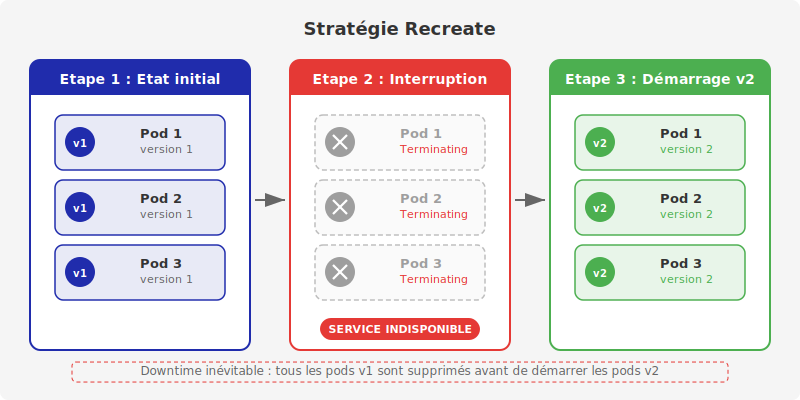
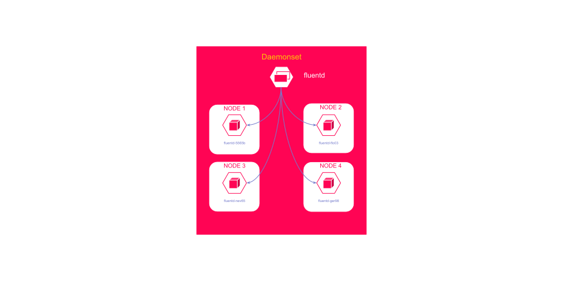

# Deployments et DaemonSets dans OpenShift

Les **Deployments** et les **DaemonSets** sont les deux workloads les plus fréquemment utilisés dans un cluster OpenShift. Bien qu'ils partagent des mécanismes communs (sélecteurs de pods, templates de pods, stratégies de mise à jour), ils répondent à des besoins fondamentalement différents : le Deployment orchestre les applications stateless avec un nombre variable de réplicas, tandis que le DaemonSet garantit la présence d'un agent sur chaque nœud du cluster.

---

## Objectifs de la section

À la fin de cette section, vous serez capable de :

- Décrire l'architecture d'un Deployment et de ses composants (ReplicaSet, pods)
- Écrire un manifest YAML complet et annoté pour un Deployment
- Configurer et comprendre les paramètres d'une stratégie de rolling update
- Déclencher une mise à jour et un rollback via `oc`
- Créer et configurer un DaemonSet avec ciblage de nœuds
- Identifier les cas d'usage appropriés pour chaque type de workload

---

## Les Deployments dans OpenShift

### Architecture d'un Deployment

Un **Deployment** est un objet déclaratif qui délègue la gestion des pods à une chaîne de contrôleurs. Lorsque vous créez ou modifiez un Deployment, le contrôleur de déploiement crée un nouveau **ReplicaSet**, qui prend en charge la création et le maintien des **pods**.



Cette architecture en deux niveaux est ce qui rend les rollbacks instantanés : il suffit de réactiver un ReplicaSet précédent.



*Schéma d'un Deployment gérant plusieurs ReplicaSets au fil des révisions.*

:::info Révisions de déploiement
Chaque modification du template de pod (changement d'image, de variables d'environnement, de ressources) crée une nouvelle **révision**. Par défaut, OpenShift conserve les 10 dernières révisions, permettant des rollbacks vers n'importe laquelle d'entre elles.
:::

---

### Structure d'un manifest de Deployment

Voici un manifest complet et annoté couvrant l'ensemble des sections importantes d'un Deployment :

```yaml
apiVersion: apps/v1
kind: Deployment
metadata:
  name: mon-application          # Nom unique du Deployment dans le namespace
  namespace: mon-projet
  labels:
    app: mon-application         # Labels pour identifier et filtrer la ressource
    version: "1.0"
spec:
  replicas: 3                    # Nombre de pods souhaités en permanence

  selector:                      # Sélecteur : doit correspondre aux labels du template
    matchLabels:
      app: mon-application

  template:                      # Template des pods gérés par ce Deployment
    metadata:
      labels:
        app: mon-application     # Doit correspondre au sélecteur ci-dessus
        version: "1.0"
    spec:
      containers:
      - name: app
        image: registry.example.com/mon-app:1.0.0   # Image avec tag explicite (pas "latest")
        ports:
        - containerPort: 8080
          protocol: TCP

        resources:               # Toujours définir les requests et limits
          requests:
            memory: "128Mi"
            cpu: "100m"
          limits:
            memory: "256Mi"
            cpu: "500m"

        env:
        - name: APP_ENV
          value: "production"
        - name: DB_PASSWORD
          valueFrom:
            secretKeyRef:        # Injection depuis un Secret OpenShift
              name: db-credentials
              key: password

        readinessProbe:          # Sonde de disponibilité : le pod reçoit du trafic uniquement si OK
          httpGet:
            path: /healthz
            port: 8080
          initialDelaySeconds: 10
          periodSeconds: 5

        livenessProbe:           # Sonde de vivacité : le pod est redémarré si la sonde échoue
          httpGet:
            path: /healthz
            port: 8080
          initialDelaySeconds: 30
          periodSeconds: 10

  strategy:                      # Stratégie de mise à jour (voir section dédiée)
    type: RollingUpdate
    rollingUpdate:
      maxSurge: 1
      maxUnavailable: 0

  revisionHistoryLimit: 5        # Nombre de ReplicaSets précédents conservés pour rollback
```

:::tip Toujours utiliser des tags d'image explicites
N'utilisez jamais `image: mon-app:latest` en production. Un tag fixe comme `1.0.0` ou un digest SHA garantit la reproductibilité et facilite les rollbacks. OpenShift ne peut pas détecter qu'une image `latest` a changé sans un trigger explicite.
:::

---

### Visualiser un Deployment dans la console OpenShift

La console web OpenShift offre une vue graphique détaillée de chaque Deployment : état des pods, historique des révisions, métriques de ressources et accès aux logs.


*La console OpenShift affiche l'état en temps réel des pods, les révisions disponibles et les options de scaling.*

Pour accéder à cette vue :

1. Connectez-vous à la console OpenShift (`https://<cluster>/`)
2. Naviguez vers **Workloads → Deployments**
3. Sélectionnez votre projet dans le sélecteur de namespace en haut
4. Cliquez sur le nom du Deployment pour accéder au détail

---

### Stratégies de déploiement

OpenShift supporte deux stratégies de mise à jour pour les Deployments Kubernetes standards.

#### RollingUpdate (mise à jour progressive)

La stratégie **RollingUpdate** est la stratégie par défaut. Elle remplace progressivement les anciens pods par les nouveaux, en garantissant qu'un minimum de pods reste disponible tout au long de la mise à jour.


*Lors d'un rolling update, les nouveaux pods sont créés avant que les anciens soient supprimés, maintenant la disponibilité du service.*

Le processus se déroule ainsi :

1. Un nouveau ReplicaSet est créé avec la nouvelle configuration
2. Des pods du nouveau ReplicaSet sont créés (dans la limite de `maxSurge`)
3. Dès que les nouveaux pods sont prêts (readinessProbe OK), des pods de l'ancien ReplicaSet sont supprimés
4. L'opération se répète jusqu'à ce que tous les pods aient été remplacés

#### Paramètres du RollingUpdate

| Paramètre | Type | Description | Exemple |
|---|---|---|---|
| `maxSurge` | Entier ou % | Nombre maximum de pods supplémentaires pouvant exister au-delà du nombre souhaité pendant la mise à jour | `1` ou `25%` |
| `maxUnavailable` | Entier ou % | Nombre maximum de pods pouvant être indisponibles pendant la mise à jour | `0` ou `25%` |

**Exemples de configurations courantes :**

| Scénario | maxSurge | maxUnavailable | Comportement |
|---|---|---|---|
| Disponibilité maximale (production) | `1` | `0` | Crée 1 nouveau pod avant d'en supprimer un ancien. Plus lent mais sans interruption. |
| Déploiement rapide (hors-prod) | `25%` | `25%` | Remplace 25% des pods simultanément. Plus rapide mais accepte une disponibilité réduite. |
| Ressources limitées | `0` | `1` | Supprime 1 ancien pod avant d'en créer un nouveau. Économe en ressources. |

:::warning maxSurge: 0 et maxUnavailable: 0 sont incompatibles
Si les deux paramètres sont à `0`, Kubernetes ne peut ni créer de nouveaux pods ni supprimer les anciens, bloquant définitivement la mise à jour. Au moins l'un des deux doit être supérieur à zéro.
:::

#### Recreate (recréation complète)

La stratégie **Recreate** arrête tous les pods existants avant de créer les nouveaux. Cela provoque une interruption de service, mais garantit qu'aucune ancienne et nouvelle version de l'application ne coexistent.



*Lors d'un recreate, tous les pods v1 sont supprimés simultanément avant que les pods v2 ne soient créés, entraînant une interruption de service.*

```yaml
strategy:
  type: Recreate
```

:::info Quand utiliser Recreate ?
Utilisez `Recreate` lorsque votre application ne supporte pas deux versions coexistantes, par exemple lors de migrations de schéma de base de données incompatibles, ou lorsque l'application utilise un verrou exclusif sur une ressource (fichier, port, etc.).
:::

---

### Commandes opérationnelles

#### Déclencher une mise à jour d'image

```bash
# Mettre à jour l'image d'un conteneur dans un Deployment
oc set image deployment/mon-application app=registry.example.com/mon-app:1.1.0 -n mon-projet
```

#### Suivre le déroulement d'une mise à jour

```bash
# Surveiller le déploiement en temps réel
oc rollout status deployment/mon-application -n mon-projet

# Afficher l'historique des révisions
oc rollout history deployment/mon-application -n mon-projet

# Détailler une révision spécifique
oc rollout history deployment/mon-application --revision=3 -n mon-projet
```

#### Effectuer un rollback

```bash
# Revenir à la révision précédente
oc rollout undo deployment/mon-application -n mon-projet

# Revenir à une révision spécifique
oc rollout undo deployment/mon-application --to-revision=2 -n mon-projet
```

#### Scaler un Deployment

```bash
# Modifier le nombre de réplicas
oc scale deployment/mon-application --replicas=5 -n mon-projet

# Mettre en pause un déploiement (pour effectuer plusieurs modifications avant de les appliquer)
oc rollout pause deployment/mon-application -n mon-projet

# Reprendre un déploiement en pause
oc rollout resume deployment/mon-application -n mon-projet
```

:::tip Mettre en pause pour les modifications groupées
Si vous devez modifier plusieurs propriétés d'un Deployment (image, variables d'environnement, ressources), mettez-le en pause avant d'effectuer les modifications, puis reprenez-le. Cela déclenche une seule mise à jour au lieu d'une par modification.
:::

---

## Les DaemonSets dans OpenShift

### Concept et architecture

Un **DaemonSet** assure qu'un pod est exécuté sur **chaque nœud éligible** du cluster. La logique de scheduling est inversée par rapport à un Deployment : ce n'est pas le scheduler qui décide où placer les pods, c'est le contrôleur DaemonSet qui cible explicitement chaque nœud.



*Chaque nœud du cluster héberge exactement une instance du pod géré par le DaemonSet.*

Comportement automatique :

- Quand un **nouveau nœud rejoint** le cluster → le DaemonSet y crée automatiquement un pod
- Quand un **nœud est supprimé** du cluster → le pod est automatiquement supprimé (garbage collected)
- Quand le **DaemonSet est supprimé** → tous ses pods sont supprimés sur l'ensemble des nœuds

---

### Cas d'usage des DaemonSets

| Catégorie | Outil | Rôle |
|---|---|---|
| Collecte de logs | Fluentd, Filebeat, Logstash | Collecte les logs des conteneurs et du système sur chaque nœud |
| Métriques système | Prometheus Node Exporter | Expose les métriques CPU, mémoire, disque, réseau du nœud |
| Réseau | Calico, Weave Net, Cilium | Configure les règles réseau et le routage sur chaque nœud |
| Stockage | Ceph, GlusterFS (agents) | Gère l'accès au stockage distribué depuis chaque nœud |
| Sécurité | Falco, Sysdig | Surveille les appels système et détecte les comportements anormaux |
| Cache | node-local-dns | Fournit un cache DNS local sur chaque nœud pour réduire la latence |

:::info Les DaemonSets système dans OpenShift
OpenShift lui-même utilise massivement des DaemonSets pour ses composants internes. On trouve notamment des DaemonSets pour les agents de monitoring (`node-exporter`), les composants réseau (`ovs-node`) et les agents de nœud (`machine-config-daemon`). Ces ressources sont visibles dans les namespaces `openshift-*`.
:::

---

### Structure d'un manifest de DaemonSet

```yaml
apiVersion: apps/v1
kind: DaemonSet
metadata:
  name: collecteur-logs
  namespace: observabilite
  labels:
    app: collecteur-logs
spec:
  selector:
    matchLabels:
      app: collecteur-logs

  template:
    metadata:
      labels:
        app: collecteur-logs
    spec:
      # Tolérations : permettent au pod d'être schedulé sur des nœuds "taintés"
      # (ex. nœuds maîtres qui rejettent par défaut les pods utilisateurs)
      tolerations:
      - key: node-role.kubernetes.io/control-plane
        operator: Exists
        effect: NoSchedule

      containers:
      - name: fluentd
        image: fluentd:v1.16
        resources:
          requests:
            memory: "128Mi"
            cpu: "50m"
          limits:
            memory: "256Mi"
            cpu: "200m"

        # Montage du système de fichiers du nœud pour accéder aux logs
        volumeMounts:
        - name: varlog
          mountPath: /var/log
          readOnly: true
        - name: varlibdockercontainers
          mountPath: /var/lib/docker/containers
          readOnly: true

      # Terminaison gracieuse étendue pour vider les buffers avant arrêt
      terminationGracePeriodSeconds: 30

      volumes:
      - name: varlog
        hostPath:
          path: /var/log
      - name: varlibdockercontainers
        hostPath:
          path: /var/lib/docker/containers

  # Stratégie de mise à jour du DaemonSet
  updateStrategy:
    type: RollingUpdate
    rollingUpdate:
      maxUnavailable: 1          # Mise à jour d'un nœud à la fois
```

:::warning Accès au système de fichiers hôte
Les DaemonSets d'agents de logs utilisent des volumes `hostPath` pour lire les logs du nœud. Dans OpenShift, cet accès est soumis aux politiques de sécurité (SCC - Security Context Constraints). Assurez-vous que le ServiceAccount du DaemonSet dispose des permissions appropriées.
:::

---

### Cibler un sous-ensemble de nœuds

Il est possible de restreindre un DaemonSet à certains nœuds via un **nodeSelector** ou une **nodeAffinity**.

#### Via un nodeSelector (simple)

```yaml
spec:
  template:
    spec:
      nodeSelector:
        kubernetes.io/os: linux
        node-role.kubernetes.io/worker: ""
```

#### Via une nodeAffinity (avancée)

```yaml
spec:
  template:
    spec:
      affinity:
        nodeAffinity:
          requiredDuringSchedulingIgnoredDuringExecution:
            nodeSelectorTerms:
            - matchExpressions:
              - key: type
                operator: In
                values:
                - monitoring-node
```

---

### Stratégie de mise à jour des DaemonSets

Les DaemonSets supportent deux stratégies de mise à jour :

| Stratégie | Description | Recommandation |
|---|---|---|
| `RollingUpdate` | Met à jour les pods nœud par nœud, en contrôlant le rythme via `maxUnavailable` | Recommandée pour la plupart des cas |
| `OnDelete` | Les pods ne sont mis à jour que lorsqu'ils sont manuellement supprimés | Pour les mises à jour manuelles et contrôlées |

---

## Différences entre Deployment et DaemonSet

| Critère | Deployment | DaemonSet |
|---|---|---|
| Nombre de pods | Configurable (replicas) | 1 par nœud éligible |
| Placement | Décidé par le scheduler | Forcé sur chaque nœud |
| Scaling | Horizontal (oc scale) | Lié au nombre de nœuds |
| Cas d'usage | Applications stateless | Agents système |
| Rollback | Oui (via révisions) | Non (pas de révisions) |
| Stratégie de mise à jour | RollingUpdate, Recreate | RollingUpdate, OnDelete |

:::tip Synthèse du choix
- Besoin de **N réplicas interchangeables** → **Deployment**
- Besoin de **1 agent sur chaque nœud** → **DaemonSet**
:::
