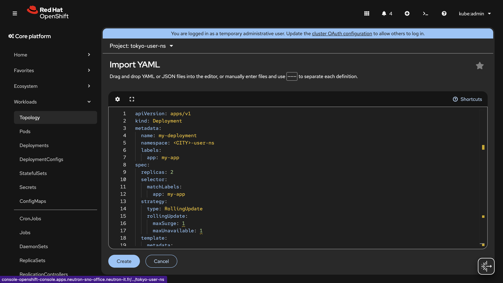

# Exercice Guidé : Les Déploiements et Rolling Updates dans OpenShift

## Ce que vous allez apprendre

Dans cet exercice, vous allez apprendre pas à pas comment **déployer une application web** sur OpenShift, la **mettre à jour sans interruption de service** grâce à la stratégie Rolling Update, puis **revenir en arrière** (rollback) en cas de problème. La transition entre les versions sera **visible directement dans votre navigateur** : la page changera de couleur lors de la mise à jour !


---

## Objectifs

A la fin de cet exercice, vous serez capable de :

- [ ] Comprendre ce qu'est un **Deployment** et pourquoi il est essentiel dans Kubernetes/OpenShift
- [ ] Créer un déploiement avec **2 réplicas**, un **Service** et une **Route**
- [ ] Accéder à votre application via une **URL publique** dans le navigateur
- [ ] Observer visuellement un **Rolling Update** lors d'une mise à jour d'image
- [ ] Consulter l'**historique des révisions** d'un déploiement
- [ ] Effectuer un **rollback** pour revenir à une version précédente

---

## Étape 1 : Comprendre ce que nous allons déployer

:::note Pourquoi un Deployment ?
Un **Deployment** est un objet Kubernetes qui gère le cycle de vie de vos pods. Il garantit que le nombre souhaité de réplicas est toujours en cours d'exécution. Si un pod tombe en panne, le Deployment en crée automatiquement un nouveau. C'est la manière standard de déployer des applications **sans état** (stateless) sur OpenShift.
:::

Nous allons déployer une application web PHP dont chaque version affiche une **page de couleur différente** : la version 1 affiche une page **bleue**, la version 2 affiche une page **verte**. Cela nous permettra de voir visuellement la transition lors du Rolling Update.

| Paramètre | Valeur | Explication |
|---|---|---|
| **Nom** | `my-deployment` | Le nom de notre déploiement |
| **Réplicas** | `2` | 2 copies du pod pour la haute disponibilité |
| **Image v1** | `quay.io/redhatworkshops/welcome-php:ffcd15` | Page d'accueil bleue |
| **Image v2** | `quay.io/redhatworkshops/welcome-php:8b052ea` | Page d'accueil verte |
| **Port** | `8080` | Port d'écoute de l'application PHP |
| **CPU request** | `10m` | Le minimum de CPU garanti |
| **CPU limit** | `100m` | Le maximum de CPU autorisé |
| **Mémoire request** | `64Mi` | Le minimum de mémoire garanti |
| **Mémoire limit** | `128Mi` | Le maximum de mémoire autorisé |

:::tip Requests vs Limits
- **Request** = le minimum garanti. Kubernetes réserve cette quantité de ressources pour votre pod.
- **Limit** = le maximum autorisé. Si le pod dépasse cette limite, il peut être redémarré (OOMKilled pour la mémoire) ou bridé (throttled pour le CPU).

Toujours définir des requests et limits est une **bonne pratique** pour éviter qu'un pod ne consomme toutes les ressources du cluster.
:::

---

## Étape 2 : Créer le fichier de déploiement

**Pourquoi cette étape ?** Nous allons créer un fichier YAML qui décrit l'ensemble des ressources nécessaires : le Deployment, le Service et la Route. Ce fichier est la "source de vérité" de notre application.

Créez un fichier nommé `my-deployment.yaml` avec le contenu suivant :

```yaml
apiVersion: apps/v1
kind: Deployment
metadata:
  name: my-deployment
  namespace: <CITY>-user-ns
  labels:
    app: my-app
spec:
  replicas: 2
  selector:
    matchLabels:
      app: my-app
  strategy:
    type: RollingUpdate
    rollingUpdate:
      maxSurge: 1
      maxUnavailable: 1
  template:
    metadata:
      labels:
        app: my-app
    spec:
      containers:
      - name: my-container
        image: quay.io/redhatworkshops/welcome-php:ffcd15
        ports:
        - containerPort: 8080
        resources:
          requests:
            memory: "64Mi"
            cpu: "10m"
          limits:
            memory: "128Mi"
            cpu: "100m"
---
apiVersion: v1
kind: Service
metadata:
  name: my-deployment
  namespace: <CITY>-user-ns
spec:
  selector:
    app: my-app
  ports:
  - port: 8080
    targetPort: 8080
---
apiVersion: route.openshift.io/v1
kind: Route
metadata:
  name: my-deployment
  namespace: <CITY>-user-ns
spec:
  to:
    kind: Service
    name: my-deployment
  port:
    targetPort: 8080
```

:::info Décryptage du YAML
Voici les sections clés à comprendre :

- **`replicas: 2`** : nous voulons 2 pods identiques en permanence.
- **`selector.matchLabels`** : le Deployment utilise ce label (`app: my-app`) pour savoir quels pods il doit gérer.
- **`strategy.type: RollingUpdate`** : lors d'une mise à jour, les pods sont remplacés progressivement (et non tous en même temps).
- **`maxSurge: 1`** : pendant la mise à jour, au maximum 1 pod supplémentaire peut être créé (donc 3 pods temporairement).
- **`maxUnavailable: 1`** : pendant la mise à jour, au maximum 1 pod peut être indisponible (donc minimum 1 pod actif).
- **`containerPort: 8080`** : le port sur lequel l'application PHP écoute dans le container.
- **`Service`** : expose les pods à l'intérieur du cluster sur le port 8080.
- **`Route`** : génère une URL publique pour accéder au Service depuis l'extérieur du cluster.
:::

---

## Étape 3 : Appliquer le déploiement

**Pourquoi cette étape ?** Nous allons envoyer notre fichier YAML à OpenShift pour créer les trois ressources (Deployment, Service, Route). Deux méthodes sont possibles : via la console web ou via le terminal.

### Méthode 1 : Via la console web (bouton +)

La console OpenShift propose un bouton **+** en haut à droite qui permet de coller directement du YAML et de créer les ressources sans quitter le navigateur.



**Procédure :**

1. Cliquez sur le bouton **+** en haut à droite de la console
2. Copiez-collez l'intégralité du contenu de votre fichier `my-deployment.yaml`
3. Remplacez `<CITY>` par votre ville dans les trois champs `namespace`
4. Cliquez sur **Create**

Les trois ressources (Deployment, Service, Route) sont créées en une seule opération.

### Méthode 2 : Via le terminal (`oc apply`)

```bash
oc apply -f my-deployment.yaml
```

**Sortie attendue :**

```
deployment.apps/my-deployment created
service/my-deployment created
route.route.openshift.io/my-deployment created
```

:::tip Bonne pratique CLI
Utilisez toujours `oc apply -f` plutôt que `oc create -f`. La commande `apply` est **idempotente** : elle crée la ressource si elle n'existe pas, ou la met à jour si elle existe déjà. Cela vous permet de relancer la commande sans erreur.
:::

---

## Étape 4 : Vérifier le déploiement et accéder à l'application

**Pourquoi cette étape ?** Après avoir créé un déploiement, il est essentiel de vérifier que tout s'est bien passé et d'accéder à l'application dans le navigateur pour confirmer qu'elle fonctionne.

### 4.1 : Vérifier l'état du Deployment

```bash
oc get deployments
```

**Sortie attendue :**

```
NAME            READY   UP-TO-DATE   AVAILABLE   AGE
my-deployment   2/2     2            2           30s
```

:::info Lecture du tableau
- **READY 2/2** : 2 pods sur 2 sont prêts.
- **UP-TO-DATE 2** : 2 pods utilisent la dernière version du template.
- **AVAILABLE 2** : 2 pods sont disponibles pour recevoir du trafic.
- Si vous voyez `0/2` dans READY, patientez quelques secondes : les pods sont en cours de démarrage.
:::

### 4.2 : Vérifier les pods

```bash
oc get pods
```

**Sortie attendue :**

```
NAME                             READY   STATUS    RESTARTS   AGE
my-deployment-5d8f6b7c4a-abc12   1/1     Running   0          30s
my-deployment-5d8f6b7c4a-def34   1/1     Running   0          30s
```

:::note
Les noms des pods contiennent un identifiant aléatoire (comme `abc12`). Vos noms seront différents de ceux affichés ici, c'est tout à fait normal.
:::

### 4.3 : Récupérer l'URL de la Route

```bash
oc get route my-deployment
```

**Sortie attendue :**

```
NAME            HOST/PORT                                                    PATH   SERVICES        PORT   TERMINATION   WILDCARD
my-deployment   my-deployment-<CITY>-user-ns.apps.<cluster-domain>                 my-deployment   8080                 None
```

Pour extraire uniquement l'URL :

```bash
oc get route my-deployment -o jsonpath='{.spec.host}'
```

### 4.4 : Ouvrir l'application dans le navigateur

Copiez l'URL affichée et ouvrez-la dans votre navigateur en préfixant avec `http://` :

```
http://my-deployment-<CITY>-user-ns.apps.<cluster-domain>
```

Vous devriez voir une **page bleue** affichant un message de bienvenue avec le numéro de version.

:::tip
Gardez cet onglet de navigateur ouvert ! Vous allez l'utiliser pour observer visuellement le changement de version lors du Rolling Update.
:::

### 4.5 : Vérifier les détails du déploiement

```bash
oc describe deployment my-deployment
```

**Sortie attendue (extraits importants) :**

```
Name:                   my-deployment
Namespace:              <CITY>-user-ns
Selector:               app=my-app
Replicas:               2 desired | 2 updated | 2 total | 2 available | 0 unavailable
StrategyType:           RollingUpdate
RollingUpdateStrategy:  1 max unavailable, 1 max surge
Pod Template:
  Containers:
   my-container:
    Image:      quay.io/redhatworkshops/welcome-php:ffcd15
    Port:       8080/TCP
    Limits:
      cpu:     100m
      memory:  128Mi
    Requests:
      cpu:     10m
      memory:  64Mi
```

### Vérification dans la console web

Ouvrez la console web OpenShift et naviguez vers **Workloads > Deployments**. Vous devriez voir votre déploiement :


Cliquez sur `my-deployment` pour voir les détails :


:::tip
La console web est un excellent outil pour **visualiser** l'état de vos ressources. Elle offre une vue graphique du nombre de pods, de leur état, et permet de voir les événements en temps réel.
:::

---

## Étape 5 : Mettre à jour l'application (Rolling Update)

**Pourquoi cette étape ?** En production, vous devrez régulièrement mettre à jour vos applications (nouvelles fonctionnalités, correctifs de sécurité). Le Rolling Update permet de faire cette mise à jour **sans interruption de service**.

### 5.1 : Comprendre le Rolling Update


:::info Comment fonctionne le Rolling Update ?
Le Rolling Update remplace les pods **un par un** (ou selon les valeurs de `maxSurge` et `maxUnavailable`). Voici le processus :

1. Un **nouveau pod** est créé avec la nouvelle image (ici la page verte).
2. OpenShift attend que le nouveau pod soit **prêt** (status Running).
3. Un **ancien pod** est alors supprimé.
4. Le processus se répète jusqu'à ce que **tous les pods** utilisent la nouvelle image.

Grâce à ce mécanisme, au moins 1 pod (sur 2) est toujours disponible pendant la mise à jour. Vos utilisateurs ne subissent **aucune interruption**.
:::

### 5.2 : Préparer l'observation

Avant de lancer la mise à jour, mettez-vous en position pour tout observer en même temps :

1. **Navigateur** : gardez l'onglet avec l'application ouverte (la page bleue).
2. **Console web OpenShift** : ouvrez **Workloads > Deployments > my-deployment** pour observer les pods en temps réel.

:::tip Astuce terminal
Ouvrez un **second terminal** et lancez la commande suivante pour observer les pods en direct pendant la mise à jour :

```bash
oc get pods -w
```

Le flag `-w` (watch) affiche les changements en temps réel. Appuyez sur `Ctrl+C` pour arrêter l'observation.
:::

### 5.3 : Lancer la mise à jour vers la version 2 (page verte)

Nous allons passer du tag `ffcd15` (page bleue) au tag `8b052ea` (page verte) :

```bash
oc set image deployment/my-deployment my-container=quay.io/redhatworkshops/welcome-php:8b052ea
```

**Sortie attendue :**

```
deployment.apps/my-deployment image updated
```

### 5.4 : Observer le Rolling Update

```bash
oc rollout status deployment/my-deployment
```

**Sortie attendue :**

```
Waiting for deployment "my-deployment" rollout to finish: 1 out of 2 new replicas have been updated...
Waiting for deployment "my-deployment" rollout to finish: 1 of 2 updated replicas are available...
deployment "my-deployment" successfully rolled out
```

### 5.5 : Confirmer le changement dans le navigateur

Retournez dans votre navigateur et **rafraîchissez la page** (F5 ou Ctrl+R).

La page doit maintenant afficher une **couleur verte**, confirmant que vous êtes sur la version 2 de l'application.

:::note Pourquoi le changement de couleur ?
Les deux tags d'image (`ffcd15` et `8b052ea`) correspondent à deux versions du code PHP avec des feuilles de style différentes. C'est un exemple typique de ce qui se passe lors d'une mise à jour : les utilisateurs voient la nouvelle interface dès que leurs pods sont migrés.
:::

### Vérification

Vérifiez que les pods utilisent bien la nouvelle image :

```bash
oc get deployment my-deployment -o jsonpath='{.spec.template.spec.containers[0].image}'
```

**Sortie attendue :**

```
quay.io/redhatworkshops/welcome-php:8b052ea
```

Vérifiez que tous les pods sont en cours d'exécution :

```bash
oc get pods
```

**Sortie attendue :**

```
NAME                             READY   STATUS    RESTARTS   AGE
my-deployment-7b9f4c8d2e-jkl78   1/1     Running   0          45s
my-deployment-7b9f4c8d2e-mno90   1/1     Running   0          38s
```

:::note
Remarquez que les noms des pods ont changé. Les anciens pods ont été supprimés et de nouveaux pods ont été créés avec la nouvelle image. Le suffixe aléatoire (`7b9f4c8d2e`) est différent de celui de l'étape précédente.
:::

---

## Étape 6 : Consulter l'historique des déploiements

**Pourquoi cette étape ?** L'historique des révisions vous permet de savoir quelles versions ont été déployées. C'est essentiel pour le **suivi des changements** et pour savoir vers quelle version revenir en cas de problème.

```bash
oc rollout history deployment/my-deployment
```

**Sortie attendue :**

```
deployment.apps/my-deployment
REVISION  CHANGE-CAUSE
1         <none>
2         <none>
```

:::info Lecture de l'historique
- **Revision 1** : notre premier déploiement avec l'image `welcome-php:ffcd15` (page bleue)
- **Revision 2** : la mise à jour avec l'image `welcome-php:8b052ea` (page verte)
- **CHANGE-CAUSE** est vide car nous n'avons pas annoté nos déploiements. Vous pouvez ajouter une cause avec :

```bash
oc annotate deployment/my-deployment kubernetes.io/change-cause="Mise à jour vers la page verte (8b052ea)"
```
:::

Pour voir les détails d'une révision spécifique :

```bash
oc rollout history deployment/my-deployment --revision=1
```

**Sortie attendue :**

```
deployment.apps/my-deployment with revision #1
Pod Template:
  Labels:       app=my-app
                pod-template-hash=5d8f6b7c4a
  Containers:
   my-container:
    Image:      quay.io/redhatworkshops/welcome-php:ffcd15
    Port:       8080/TCP
    Limits:
      cpu:     100m
      memory:  128Mi
    Requests:
      cpu:     10m
      memory:  64Mi
```

### Vérification

Confirmez que vous avez bien 2 révisions dans l'historique. La révision 1 doit contenir l'image `welcome-php:ffcd15` (page bleue) et la révision 2 l'image `welcome-php:8b052ea` (page verte).

---

## Étape 7 : Effectuer un rollback

**Pourquoi cette étape ?** En production, si une mise à jour introduit un bug ou un comportement inattendu, vous devez pouvoir **revenir rapidement** à la version précédente. C'est le principe du rollback.

:::warning Scénario
Imaginons que la version verte (`8b052ea`) de notre application pose un problème (erreurs, mauvaise lisibilité, régression...). Nous devons revenir à la version bleue (`ffcd15`) qui fonctionnait correctement.
:::

### 7.1 : Lancer le rollback

```bash
oc rollout undo deployment/my-deployment
```

**Sortie attendue :**

```
deployment.apps/my-deployment rolled back
```

:::info Que fait cette commande ?
La commande `oc rollout undo` recrée les pods avec la **configuration de la révision précédente**. Elle utilise exactement le même mécanisme de Rolling Update pour revenir en arrière, garantissant une transition sans interruption.

Vous pouvez aussi revenir à une révision spécifique avec :
```bash
oc rollout undo deployment/my-deployment --to-revision=1
```
:::

### 7.2 : Observer le rollback dans la console

Ouvrez la console web et observez le rollback en temps réel :


### Vérification

#### Vérifier le statut du déploiement

```bash
oc rollout status deployment/my-deployment
```

**Sortie attendue :**

```
deployment "my-deployment" successfully rolled out
```

#### Confirmer le retour à la page bleue dans le navigateur

Retournez dans votre navigateur et **rafraîchissez la page**. La page doit à nouveau afficher la **couleur bleue**, confirmant le retour à la version 1.

#### Vérifier que les pods sont en cours d'exécution

```bash
oc get pods
```

**Sortie attendue :**

```
NAME                             READY   STATUS    RESTARTS   AGE
my-deployment-5d8f6b7c4a-stu34   1/1     Running   0          20s
my-deployment-5d8f6b7c4a-vwx56   1/1     Running   0          15s
```

#### Vérifier l'image utilisée

```bash
oc get deployment my-deployment -o jsonpath='{.spec.template.spec.containers[0].image}'
```

**Sortie attendue :**

```
quay.io/redhatworkshops/welcome-php:ffcd15
```

:::tip Succès !
L'image est bien revenue à `welcome-php:ffcd15`. La page bleue est de retour. Le rollback a fonctionné correctement.
:::

#### Vérifier l'historique après le rollback

```bash
oc rollout history deployment/my-deployment
```

**Sortie attendue :**

```
deployment.apps/my-deployment
REVISION  CHANGE-CAUSE
2         <none>
3         <none>
```

:::note
Remarquez que le rollback a créé une **nouvelle révision** (3) au lieu de revenir à la révision 1. La révision 1 a disparu car son contenu est maintenant identique à la révision 3. OpenShift ne garde pas de doublons dans l'historique.
:::

---

## Étape 8 : Nettoyage

**Pourquoi cette étape ?** Il est important de supprimer les ressources que vous n'utilisez plus pour libérer les ressources du cluster et garder votre projet propre.

```bash
oc delete -f my-deployment.yaml
```

**Sortie attendue :**

```
deployment.apps "my-deployment" deleted
service "my-deployment" deleted
route.route.openshift.io "my-deployment" deleted
```

### Vérification

Vérifiez que le déploiement, le service, la route et les pods ont bien été supprimés :

```bash
oc get deployments,services,routes,pods
```

**Sortie attendue :**

```
No resources found in <CITY>-user-ns namespace.
```

:::tip
Lorsque vous supprimez un Deployment, tous les **ReplicaSets** et **pods** associés sont automatiquement supprimés. C'est le principe de la suppression en cascade dans Kubernetes.
:::

---

## Récapitulatif

Voici un résumé visuel de toutes les commandes et concepts vus dans cet exercice :

| Étape | Commande | Description |
|---|---|---|
| Créer les ressources | `oc apply -f my-deployment.yaml` | Crée le Deployment, Service et Route |
| Vérifier le déploiement | `oc get deployments` | Affiche l'état des déploiements |
| Lister les pods | `oc get pods` | Affiche les pods en cours d'exécution |
| Obtenir l'URL | `oc get route my-deployment` | Affiche l'URL publique de l'application |
| Détails du déploiement | `oc describe deployment my-deployment` | Affiche les détails complets |
| Mettre à jour l'image | `oc set image deployment/my-deployment my-container=<image>` | Lance un Rolling Update |
| Suivre la mise à jour | `oc rollout status deployment/my-deployment` | Affiche la progression du rollout |
| Voir l'historique | `oc rollout history deployment/my-deployment` | Liste les révisions |
| Rollback | `oc rollout undo deployment/my-deployment` | Revient à la version précédente |
| Supprimer | `oc delete -f my-deployment.yaml` | Supprime toutes les ressources |

### Concepts clés

| Concept | Explication |
|---|---|
| **Deployment** | Objet qui gère le cycle de vie des pods et garantit le nombre souhaité de réplicas |
| **ReplicaSet** | Créé automatiquement par le Deployment, il maintient le nombre de pods souhaité |
| **Service** | Expose les pods à l'intérieur du cluster, agit comme un load balancer interne |
| **Route** | Génère une URL publique pour accéder au Service depuis l'extérieur du cluster |
| **Rolling Update** | Stratégie de mise à jour qui remplace les pods progressivement, sans interruption |
| **maxSurge** | Nombre maximum de pods supplémentaires créés pendant la mise à jour |
| **maxUnavailable** | Nombre maximum de pods indisponibles pendant la mise à jour |
| **Rollback** | Retour à une version précédente du déploiement |
| **Requests** | Minimum de ressources (CPU/mémoire) garanti pour un pod |
| **Limits** | Maximum de ressources (CPU/mémoire) autorisé pour un pod |
