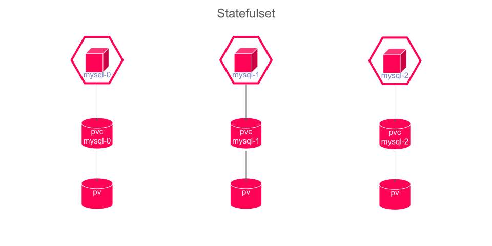
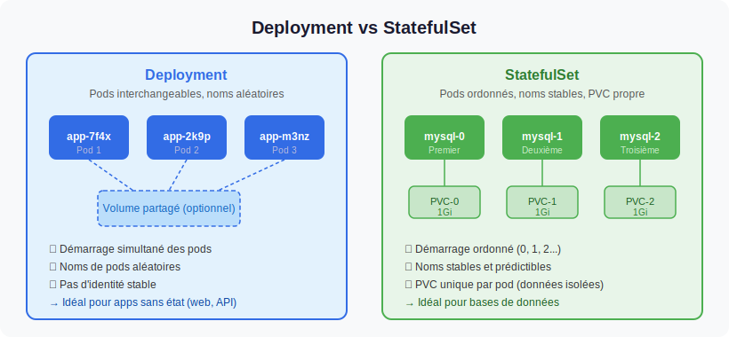

# Les StatefulSets dans OpenShift

Les **StatefulSets** constituent le mécanisme de référence pour déployer des applications **stateful** dans Kubernetes et OpenShift. Contrairement aux Deployments, où les pods sont interchangeables et éphémères, un StatefulSet garantit à chaque pod une identité stable, un stockage persistant dédié et un cycle de vie ordonné. Ces propriétés sont indispensables pour les bases de données, les clusters distribués et tous les systèmes dont le comportement dépend de l'identité de chaque instance.

---

## Objectifs de la section

À la fin de cette section, vous serez capable de :

- Expliquer les différences fondamentales entre un StatefulSet et un Deployment
- Identifier les cas d'usage appropriés pour les StatefulSets
- Écrire un manifest YAML complet avec `volumeClaimTemplates`
- Comprendre l'ordonnancement séquentiel des pods et ses implications opérationnelles
- Effectuer des opérations de scaling et de mise à jour sur un StatefulSet

---

## Qu'est-ce qu'un StatefulSet ?

Un **StatefulSet** est un contrôleur Kubernetes qui gère le déploiement et la mise à l'échelle d'un ensemble de pods en garantissant trois propriétés fondamentales :

1. **Identité stable** : chaque pod possède un nom prévisible et permanent (ex. `postgres-0`, `postgres-1`)
2. **Stockage stable** : chaque pod est associé à un Persistent Volume Claim (PVC) dédié qui lui survit
3. **Ordonnancement garanti** : les pods sont créés, mis à jour et supprimés dans un ordre déterministe



*Un StatefulSet crée des pods numérotés séquentiellement, chacun avec son propre volume persistant.*

:::info Analogie avec les serveurs physiques
On peut se représenter un StatefulSet comme une armoire de serveurs numérotés : le serveur 0, le serveur 1, le serveur 2. Chaque serveur a son propre disque dur, son propre nom sur le réseau, et ils démarrent dans l'ordre. Si le serveur 1 tombe en panne, il redémarre avec le même nom et retrouve son propre disque. C'est exactement ce que garantit un StatefulSet.
:::

---

## StatefulSet vs Deployment : comparaison détaillée



*Les Deployments conviennent aux applications stateless ; les StatefulSets aux applications stateful nécessitant une identité et un stockage persistants.*

| Critère | Deployment | StatefulSet |
|---|---|---|
| Type d'application | Stateless | Stateful |
| Identité des pods | Aléatoire (ex. `app-7d9f8b-xk2p`) | Stable et ordonnée (ex. `app-0`, `app-1`) |
| Nom DNS stable | Non | Oui (`pod-N.service.namespace.svc.cluster.local`) |
| Stockage partagé | Volume commun (optionnel) | PVC dédié par pod via `volumeClaimTemplates` |
| Survie du PVC au delete du pod | N/A | Oui (le PVC est conservé) |
| Ordre de création | Parallèle | Séquentiel (0, 1, 2...) |
| Ordre de suppression | Parallèle | Inverse (N, N-1, ..., 0) |
| Ordre de mise à jour | Progressif (rolling) | Séquentiel inverse (N → 0) |
| Rollback intégré | Oui (révisions) | Non |
| Scaling horizontal | Immédiat | Séquentiel |
| Service requis | Non (optionnel) | Service Headless obligatoire |

:::warning Le Service Headless est indispensable
Un StatefulSet doit être associé à un **Service Headless** (`clusterIP: None`). Ce service ne crée pas d'adresse IP virtuelle ; il publie directement les adresses IP des pods dans le DNS du cluster. Cela permet à chaque pod d'être adressable individuellement par son nom stable.
:::

---

## Caractéristiques clés détaillées

### 1. Identité stable et nommage prévisible

Les pods d'un StatefulSet sont nommés selon le schéma `<nom-statefulset>-<index-ordinal>`. L'index commence à `0` et s'incrémente.

Pour un StatefulSet nommé `postgresql` avec 3 réplicas :
- `postgresql-0`
- `postgresql-1`
- `postgresql-2`

Cette identité est stable : si `postgresql-1` est supprimé (par une panne ou manuellement), il sera recréé avec le même nom `postgresql-1` et retrouvera le même PVC.

### 2. DNS stable par pod

Associé à un Service Headless nommé `postgresql`, chaque pod est accessible via un nom DNS complet de la forme :

```
<nom-pod>.<nom-service>.<namespace>.svc.cluster.local
```

Exemples :
- `postgresql-0.postgresql.production.svc.cluster.local`
- `postgresql-1.postgresql.production.svc.cluster.local`

Ce mécanisme est fondamental pour les clusters distribués (Kafka, Cassandra, etcd) où chaque nœud doit connaître les adresses de ses pairs.

### 3. Volumes persistants dédiés via volumeClaimTemplates

La section `volumeClaimTemplates` d'un StatefulSet définit le modèle de PVC à créer pour chaque pod. Pour un StatefulSet de 3 réplicas avec un template nommé `data` :

| Pod | PVC créé automatiquement |
|---|---|
| `postgresql-0` | `data-postgresql-0` |
| `postgresql-1` | `data-postgresql-1` |
| `postgresql-2` | `data-postgresql-2` |

Ces PVC **ne sont pas supprimés** lorsqu'un pod est supprimé, ni lors d'un scaling vers le bas. Les données sont préservées et retrouvées automatiquement lorsque le pod est recréé.

:::warning Suppression manuelle des PVC
Si vous supprimez un StatefulSet, les PVC associés ne sont **pas supprimés automatiquement**. C'est un comportement voulu pour protéger les données. Pour libérer le stockage, vous devez supprimer les PVC manuellement après avoir supprimé le StatefulSet.
:::

### 4. Ordonnancement séquentiel

Le contrôleur StatefulSet respecte un ordre strict lors des opérations sur les pods.

**Création** : les pods sont créés de `0` vers `N`. Chaque pod doit être dans l'état `Running` et `Ready` (readinessProbe OK) avant que le pod suivant soit créé.

```
postgresql-0  →  (prêt)  →  postgresql-1  →  (prêt)  →  postgresql-2
```

**Suppression** (scaling vers le bas) : les pods sont supprimés dans l'ordre inverse, de `N` vers `0`. Chaque pod doit être complètement terminé avant que le suivant soit supprimé.

```
postgresql-2  →  (terminé)  →  postgresql-1  →  (terminé)  →  postgresql-0
```

**Mise à jour (rolling update)** : les pods sont mis à jour dans l'ordre inverse, de `N` vers `0`.

:::tip Pourquoi l'ordre inverse pour la suppression ?
Dans la plupart des clusters distribués (bases de données, brokers de messages), le nœud d'index `0` joue un rôle particulier (leader, seed node, bootstrap node). Supprimer en dernier le pod `0` garantit la stabilité du cluster pendant les opérations de scaling.
:::

---

## Cas d'usage des StatefulSets

| Application | Raison d'utiliser un StatefulSet |
|---|---|
| **PostgreSQL** (réplication primary/replica) | Identité stable pour les rôles primary/replica, PVC dédié par instance |
| **MySQL** (InnoDB Cluster) | Réplication basée sur les noms de nœuds, données persistantes |
| **MongoDB** (Replica Set) | Chaque membre du replica set a un rôle et des données propres |
| **Cassandra** | Chaque nœud gère un sous-ensemble des données (partition token), seed nodes fixes |
| **Apache Kafka** | Chaque broker a un ID unique, ses propres partitions de topics sur disque |
| **Elasticsearch** | Chaque nœud data conserve ses shards ; les nœuds master ont besoin d'identité stable |
| **Apache ZooKeeper** | Quorum basé sur les identités des nœuds (myid) |
| **etcd** | Quorum Raft nécessitant des identités stables entre les membres |
| **Redis Cluster** | Chaque nœud possède un sous-ensemble des slots de hachage |

---

## Manifest complet et annoté

### Service Headless (prérequis)

```yaml
apiVersion: v1
kind: Service
metadata:
  name: postgresql                # Ce nom est référencé dans spec.serviceName du StatefulSet
  namespace: production
  labels:
    app: postgresql
spec:
  clusterIP: None                 # Service Headless : pas d'IP virtuelle, DNS direct vers les pods
  selector:
    app: postgresql
  ports:
  - name: postgres
    port: 5432
    targetPort: 5432
```

### StatefulSet PostgreSQL avec réplication

```yaml
apiVersion: apps/v1
kind: StatefulSet
metadata:
  name: postgresql
  namespace: production
  labels:
    app: postgresql
spec:
  serviceName: "postgresql"       # Doit correspondre au nom du Service Headless ci-dessus
  replicas: 3                     # 1 primary + 2 replicas

  selector:
    matchLabels:
      app: postgresql

  template:
    metadata:
      labels:
        app: postgresql
    spec:
      # Arrêt gracieux étendu pour permettre la sauvegarde des transactions en cours
      terminationGracePeriodSeconds: 60

      initContainers:
      # Conteneur d'initialisation : configure le rôle du pod (primary ou replica)
      # en fonction de son index ordinal
      - name: init-config
        image: busybox:1.35
        command:
        - sh
        - -c
        - |
          # L'index ordinal est extrait du nom du pod
          INDEX=${HOSTNAME##*-}
          if [ "$INDEX" = "0" ]; then
            echo "primary" > /shared/role
          else
            echo "replica" > /shared/role
          fi
        volumeMounts:
        - name: shared-config
          mountPath: /shared

      containers:
      - name: postgresql
        image: postgres:15.3
        ports:
        - containerPort: 5432
          name: postgres

        env:
        - name: POSTGRES_DB
          value: "myapp"
        - name: POSTGRES_USER
          valueFrom:
            secretKeyRef:
              name: postgresql-credentials
              key: username
        - name: POSTGRES_PASSWORD
          valueFrom:
            secretKeyRef:
              name: postgresql-credentials
              key: password
        - name: PGDATA                     # Chemin des données dans le volume persistant
          value: /var/lib/postgresql/data/pgdata

        resources:
          requests:
            memory: "512Mi"
            cpu: "250m"
          limits:
            memory: "2Gi"
            cpu: "1000m"

        volumeMounts:
        - name: data                       # Correspond au nom dans volumeClaimTemplates
          mountPath: /var/lib/postgresql/data
        - name: shared-config
          mountPath: /shared

        readinessProbe:
          exec:
            command:
            - pg_isready
            - -U
            - postgres
          initialDelaySeconds: 15
          periodSeconds: 10
          timeoutSeconds: 5

        livenessProbe:
          exec:
            command:
            - pg_isready
            - -U
            - postgres
          initialDelaySeconds: 45
          periodSeconds: 20
          timeoutSeconds: 5

      volumes:
      - name: shared-config
        emptyDir: {}

  # Modèle de PVC créé automatiquement pour chaque pod
  # Un PVC distinct sera créé : data-postgresql-0, data-postgresql-1, data-postgresql-2
  volumeClaimTemplates:
  - metadata:
      name: data                           # Ce nom est utilisé dans volumeMounts ci-dessus
    spec:
      accessModes:
      - ReadWriteOnce                      # Un seul nœud peut monter ce volume en écriture
      storageClassName: ssd-retain         # StorageClass avec reclaimPolicy: Retain
      resources:
        requests:
          storage: 50Gi

  # Stratégie de mise à jour : séquentielle inverse (pod N → pod 0)
  updateStrategy:
    type: RollingUpdate
    rollingUpdate:
      partition: 0                         # Mettre à 1, 2... pour un déploiement canary
```

:::info La propriété partition pour les déploiements canary
Le paramètre `partition` de la stratégie `RollingUpdate` permet de déployer progressivement une mise à jour. Si `partition: 1`, seuls les pods d'index `>= 1` seront mis à jour. Le pod `0` (souvent le primary) reste à l'ancienne version. Cela permet de valider la mise à jour sur les réplicas avant de la déployer sur le pod principal.
:::

---

## Opérations sur les StatefulSets

### Création et vérification

```bash
# Créer le Service Headless et le StatefulSet
oc apply -f postgresql-headless-svc.yaml -n production
oc apply -f postgresql-statefulset.yaml -n production

# Suivre la création séquentielle des pods
oc get pods -l app=postgresql -n production -w

# Vérifier les PVC créés automatiquement
oc get pvc -l app=postgresql -n production
```

Sortie attendue lors de la création :

```
NAME            READY   STATUS     RESTARTS   AGE
postgresql-0    0/1     Init:0/1   0          5s
postgresql-0    1/1     Running    0          25s    ← pod 0 prêt → pod 1 peut démarrer
postgresql-1    0/1     Init:0/1   0          26s
postgresql-1    1/1     Running    0          50s    ← pod 1 prêt → pod 2 peut démarrer
postgresql-2    0/1     Init:0/1   0          51s
postgresql-2    1/1     Running    0          75s
```

### Scaling

```bash
# Augmenter le nombre de réplicas (séquentiel : pod 3 sera créé après pod 2)
oc scale statefulset/postgresql --replicas=4 -n production

# Réduire le nombre de réplicas (séquentiel inverse : pod 3 supprimé en premier)
oc scale statefulset/postgresql --replicas=2 -n production

# Vérifier que les PVC des pods supprimés sont conservés
oc get pvc -n production
# data-postgresql-0  Bound
# data-postgresql-1  Bound
# data-postgresql-2  Bound   ← PVC conservé même après suppression du pod postgresql-2
```

### Accéder à un pod spécifique

```bash
# Se connecter au pod primary (index 0)
oc exec -it postgresql-0 -n production -- psql -U postgres

# Se connecter à un replica spécifique
oc exec -it postgresql-1 -n production -- psql -U postgres -c "SELECT pg_is_in_recovery();"
```

### Mise à jour de l'image

```bash
# Mettre à jour l'image (déclenchera une mise à jour séquentielle inverse)
oc set image statefulset/postgresql postgresql=postgres:15.4 -n production

# Suivre la mise à jour
oc rollout status statefulset/postgresql -n production
```

---

## Visualiser un StatefulSet dans la console OpenShift

La console OpenShift permet de visualiser l'état des pods et des PVC d'un StatefulSet depuis l'interface graphique.


*La console affiche les pods numérotés, leur état individuel et les volumes persistants associés.*

Pour y accéder :

1. Naviguez vers **Workloads → StatefulSets** dans la console OpenShift
2. Sélectionnez votre namespace
3. Cliquez sur le StatefulSet pour voir le détail des pods et des PVC associés

---

## Points de vigilance en production

:::warning Suppression d'un StatefulSet
La suppression d'un StatefulSet ne supprime pas les pods associés immédiatement si vous utilisez `--cascade=orphan`. Sans cette option, les pods sont supprimés mais les PVC sont conservés. Vérifiez toujours l'état des PVC après suppression pour éviter des coûts de stockage imprévus.
:::

:::tip Backup avant scaling vers le bas
Avant de réduire le nombre de réplicas d'un StatefulSet de base de données, assurez-vous que les données du pod qui sera supprimé ont bien été répliquées sur les autres pods. Pour PostgreSQL, vérifiez le lag de réplication avec `SELECT * FROM pg_stat_replication;` sur le primary.
:::

:::info PodDisruptionBudget pour les StatefulSets en production
En production, associez toujours un `PodDisruptionBudget` à votre StatefulSet pour empêcher OpenShift de supprimer trop de pods simultanément lors des opérations de maintenance des nœuds (drain).

```yaml
apiVersion: policy/v1
kind: PodDisruptionBudget
metadata:
  name: postgresql-pdb
  namespace: production
spec:
  minAvailable: 2               # Toujours au moins 2 pods disponibles
  selector:
    matchLabels:
      app: postgresql
```
:::
