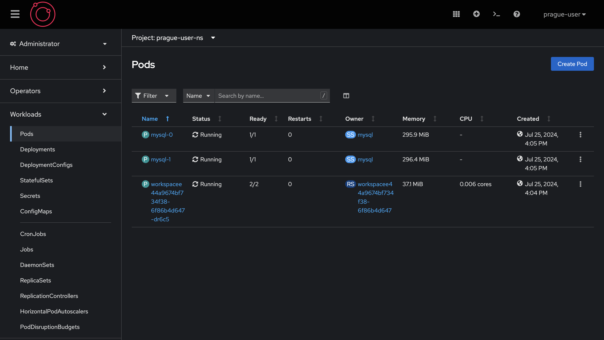
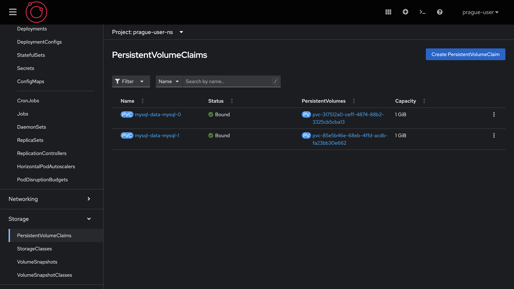

# Exercice Guidé: les StatefulSets avec MySQL

Dans cet exercice, nous allons déployer une base de données MySQL à l'aide d'un StatefulSet dans Openshift. Nous créerons deux réplicas de la base de données. Nous vérifierons ensuite que chaque réplique utilise un Persistent Volume Claim (PVC) distinct.

### Étape 1 : Créer le StatefulSet MySQL

#### 1.1. Créer un fichier de configuration StatefulSet

Créez un fichier nommé `mysql-statefulset.yaml` avec le contenu suivant :

```yaml
apiVersion: apps/v1
kind: StatefulSet
metadata:
  name: mysql
spec:
  serviceName: "mysql"
  replicas: 2
  selector:
    matchLabels:
      app: mysql
  template:
    metadata:
      labels:
        app: mysql
    spec:
      containers:
      - name: mysql
        image: registry.redhat.io/rhel8/mysql-80
        env:
        - name: MYSQL_ROOT_PASSWORD
          value: "rootpassword"
        - name: MYSQL_DATABASE
          value: "mydb"
        - name: MYSQL_USER
          value: "user"
        - name: MYSQL_PASSWORD
          value: "password"
        ports:
        - containerPort: 3306
        volumeMounts:
        - name: mysql-data
          mountPath: /var/lib/mysql/data
  volumeClaimTemplates:
  - metadata:
      name: mysql-data
    spec:
      accessModes: [ "ReadWriteOnce" ]
      resources:
        requests:
          storage: 1Gi
```

#### 1.2. Appliquer le StatefulSet

Appliquez le fichier de configuration à votre cluster Kubernetes en utilisant la commande suivante :

```sh
oc apply -f mysql-statefulset.yaml
```

### Vérifier les PVCs

#### 2.1. Listez les Pods et les PVCs créés

Utilisez la commande suivante pour lister les Pods créés par le StatefulSet :

```sh
oc get pod -l app=mysql
```

Vous devriez voir deux Pods `mysql-0` et `mysql-1`.

```shell
NAME      READY   STATUS    RESTARTS   AGE
mysql-0   1/1     Running   0          8m59s
mysql-1   1/1     Running   0          8m45s
```



Utilisez la commande suivante pour lister les PVCs créés par le StatefulSet :

```sh
oc get pvc
```

Vous devriez voir deux PVCs, un pour chaque réplique de la base de données MySQL (`mysql-data-mysql-0` et `mysql-data-mysql-1`).



### Interagir avec les bases de données

#### 3.1. Se connecter au premier pod MySQL

Connectez-vous au premier pod (`mysql-0`) :

```sh
oc exec -it mysql-0 -- bash
```

Une fois connecté, accédez à la base de données MySQL :

```sh
mysql -u user -ppassword mydb
```

#### 3.2. Écrire des données dans la première base de données

Dans le shell MySQL, créez une table et insérez des données :

```sql
CREATE TABLE test_table (id INT PRIMARY KEY, data VARCHAR(50));
INSERT INTO test_table (id, data) VALUES (1, 'Data from mysql-0');
SELECT * FROM test_table;
```

Vous devriez voir les données insérées dans la table.

```shell
mysql> SELECT * FROM test_table;
+----+-------------------+
| id | data              |
+----+-------------------+
|  1 | Data from mysql-0 |
+----+-------------------+
1 row in set (0.00 sec)
```

#### 3.3. Se connecter au second pod MySQL

Ouvrez un autre terminal et connectez-vous au second pod (`mysql-1`) :

```sh
oc exec -it mysql-1 -- bash
```

Une fois connecté, accédez à la base de données MySQL :

```sh
mysql -u user -ppassword mydb
```

#### 3.4. Écrire des données dans la seconde base de données

Dans le shell MySQL, créez une table et insérez des données :

```sql
CREATE TABLE test_table (id INT PRIMARY KEY, data VARCHAR(50));
INSERT INTO test_table (id, data) VALUES (2, 'Data from mysql-1');
SELECT * FROM test_table;
```

Vous devriez voir les données insérées dans la table.

```shell
mysql> SELECT * FROM test_table;
+----+-------------------+
| id | data              |
+----+-------------------+
|  2 | Data from mysql-1 |
+----+-------------------+
1 row in set (0.00 sec)
```

### Étape 4 : Vérifier l'indépendance des données

#### 4.1. Vérifier les données dans le premier pod

Revenez au terminal connecté à `mysql-0` et vérifiez les données :

```sql
SELECT * FROM test_table;
```

Vous devriez voir uniquement les données `Data from mysql-0`.

```shell
mysql> SELECT * FROM test_table;
+----+-------------------+
| id | data              |
+----+-------------------+
|  1 | Data from mysql-0 |
+----+-------------------+
1 row in set (0.00 sec)
```

Pour sortir:

```shell
exit
exit
```

### Conclusion

Vous avez maintenant déployé une base de données MySQL en utilisant un StatefulSet dans Kubernetes. Vous avez vérifié que chaque réplique utilise un PVC distinct et que les données sont indépendantes entre les réplicas. Cela démontre l'utilité des StatefulSets pour gérer des applications stateful nécessitant une persistance des données et une identité stable.
