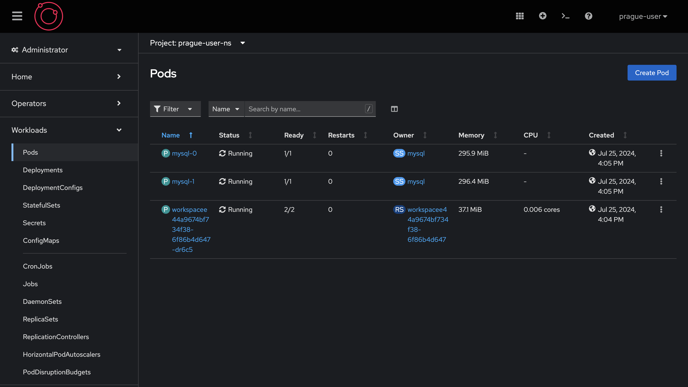
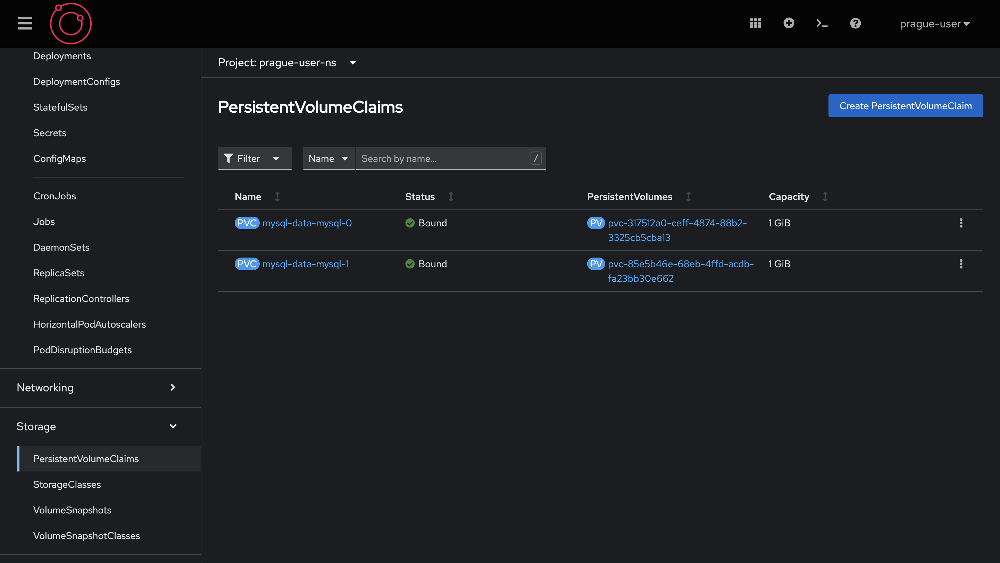

# Exercice Guidé : Les StatefulSets avec MySQL

## Ce que vous allez apprendre

Dans cet exercice, vous allez découvrir les **StatefulSets**, un type de ressource Kubernetes conçu spécialement pour les applications qui ont besoin de **conserver des données** (bases de données, systèmes de fichiers, files de messages...). Vous allez déployer une base de données MySQL avec deux réplicas et constater par vous-même que chaque réplica possède son propre espace de stockage, totalement indépendant des autres. C'est la grande différence avec un Deployment classique.


---

## Objectifs

A la fin de cet exercice, vous serez capable de :

- [ ] Expliquer la différence entre un **StatefulSet** et un **Deployment**
- [ ] Créer un **StatefulSet** MySQL avec 2 réplicas et 1 Gi de stockage chacun
- [ ] Vérifier que chaque pod reçoit un **nom stable et prévisible**
- [ ] Vérifier que chaque pod possède son propre **Persistent Volume Claim (PVC)**
- [ ] Écrire des données dans chaque instance et prouver leur **indépendance**
- [ ] Nettoyer proprement les ressources créées

---

:::tip Terminal web OpenShift
Toutes les commandes `oc` de cet exercice sont à exécuter dans le **terminal web OpenShift**. Cliquez sur l'icône de terminal en haut à droite de la console pour l'ouvrir.


:::

## Prérequis

:::info Avant de commencer
Assurez-vous que :
- Vous êtes connecté à votre cluster OpenShift avec `oc login`
- Vous travaillez dans votre propre projet (`oc project`)
- Vous avez un éditeur de texte disponible (vim, nano, VS Code...)
:::

---

## Rappel : StatefulSet vs Deployment

Avant de commencer, comprenons **pourquoi** on utilise un StatefulSet plutôt qu'un Deployment pour MySQL.

| Caractéristique | Deployment | StatefulSet |
|---|---|---|
| Nom des pods | Aléatoire (`mysql-7b9f5d-xk2p`) | Prévisible (`mysql-0`, `mysql-1`) |
| Stockage | Partagé ou éphémère | **Un volume dédié par pod** |
| Ordre de démarrage | Tous en même temps | **Séquentiel** (0, puis 1, puis 2...) |
| Ordre d'arrêt | Tous en même temps | **Inverse** (2, puis 1, puis 0) |
| Cas d'usage | Applications sans état (API, frontend) | **Applications avec état** (BDD, cache) |

:::tip Pourquoi c'est important ?
Une base de données a besoin de **conserver ses données** même si le pod redémarre. Avec un Deployment classique, les données seraient perdues ou mélangées entre les réplicas. Le StatefulSet garantit que chaque réplica garde **son propre volume** de données.
:::

---

## Étape 1 : Créer le fichier de configuration du StatefulSet

**Pourquoi ?** On va définir dans un fichier YAML toute la configuration de notre StatefulSet MySQL : le nombre de réplicas, l'image à utiliser, les variables d'environnement pour MySQL, et surtout le **template de volume** qui va créer automatiquement un PVC par pod.

Créez un fichier nommé `mysql-statefulset.yaml` avec le contenu suivant :

```yaml
apiVersion: apps/v1
kind: StatefulSet
metadata:
  name: mysql
spec:
  # Le serviceName est obligatoire pour un StatefulSet.
  # Il permet la résolution DNS de chaque pod.
  serviceName: "mysql"

  # On demande 2 réplicas : mysql-0 et mysql-1
  replicas: 2

  selector:
    matchLabels:
      app: mysql

  template:
    metadata:
      labels:
        app: mysql
    spec:
      containers:
      - name: mysql
        # Image MySQL officielle Red Hat pour OpenShift
        image: registry.access.redhat.com/rhscl/mysql-80-rhel7:latest

        # Variables d'environnement pour configurer MySQL au démarrage
        env:
        - name: MYSQL_ROOT_PASSWORD
          value: "rootpassword"
        - name: MYSQL_DATABASE
          value: "mydb"
        - name: MYSQL_USER
          value: "user"
        - name: MYSQL_PASSWORD
          value: "password"

        ports:
        - containerPort: 3306

        # Limites de ressources pour éviter qu'un pod consomme trop
        resources:
          requests:
            cpu: "100m"
            memory: "256Mi"
          limits:
            cpu: "500m"
            memory: "512Mi"

        # Le volume est monté dans le répertoire de données MySQL
        volumeMounts:
        - name: mysql-data
          mountPath: /var/lib/mysql/data

  # C'est ici la magie du StatefulSet !
  # Ce template va créer automatiquement un PVC de 1Gi pour CHAQUE pod.
  volumeClaimTemplates:
  - metadata:
      name: mysql-data
    spec:
      accessModes: [ "ReadWriteOnce" ]
      resources:
        requests:
          storage: 1Gi
```

:::note Décryptage du YAML
- **`serviceName: "mysql"`** : obligatoire pour un StatefulSet. Il crée des entrées DNS stables pour chaque pod.
- **`replicas: 2`** : on aura exactement 2 pods : `mysql-0` et `mysql-1`.
- **`volumeClaimTemplates`** : c'est la section clé ! Elle dit a Kubernetes : "Pour chaque pod, crée automatiquement un volume persistant de 1 Gi." Sans cette section, les données seraient perdues au redémarrage.
:::

:::warning Mots de passe en clair
Dans cet exercice, les mots de passe sont écrits en clair dans le YAML pour simplifier. **En production, utilisez toujours des Secrets Kubernetes** pour stocker les informations sensibles. Exemple :
```yaml
env:
- name: MYSQL_ROOT_PASSWORD
  valueFrom:
    secretKeyRef:
      name: mysql-secret
      key: root-password
```
:::

---

## Étape 2 : Déployer le StatefulSet

**Pourquoi ?** On applique le fichier YAML pour que Kubernetes crée les ressources définies : le StatefulSet, les pods, et les PVCs.

```bash
oc apply -f mysql-statefulset.yaml
```

**Sortie attendue :**

```
statefulset.apps/mysql created
```

:::tip Observation importante
Contrairement a un Deployment où tous les pods démarrent en même temps, le StatefulSet démarre les pods **un par un, dans l'ordre**. Le pod `mysql-1` ne sera créé qu'après que `mysql-0` soit en état `Running`. Vous pouvez observer ce comportement en temps réel avec la commande suivante.
:::

---

## Étape 3 : Vérifier les Pods

**Pourquoi ?** On veut s'assurer que les deux pods sont bien démarrés et que leurs noms sont **stables et prévisibles** (c'est une propriété fondamentale des StatefulSets).

```bash
oc get pods -l app=mysql
```

**Sortie attendue :**

```
NAME      READY   STATUS    RESTARTS   AGE
mysql-0   1/1     Running   0          2m
mysql-1   1/1     Running   0          1m30s
```

:::info Noms des pods
Remarquez les noms : `mysql-0` et `mysql-1`. Ce ne sont **pas** des noms aléatoires comme avec un Deployment (qui donnerait par exemple `mysql-7b9f5d-xk2p`). Ces noms sont **stables** : même si un pod redémarre, il gardera le même nom et sera rattaché au même volume de données.
:::

### Vérification

Posez-vous les questions suivantes :
- Les deux pods sont-ils en état `Running` ?
- Les noms sont-ils bien `mysql-0` et `mysql-1` ?
- Le pod `mysql-0` a-t-il un `AGE` plus grand que `mysql-1` (car il a démarré en premier) ?

Si oui, passez a l'étape suivante.



---

## Étape 4 : Vérifier les Persistent Volume Claims (PVCs)

**Pourquoi ?** C'est ici qu'on constate la **vraie valeur** des StatefulSets. Kubernetes a automatiquement créé un PVC (une demande de stockage) **par pod**. Chaque pod a son propre espace disque de 1 Gi.

```bash
oc get pvc
```

**Sortie attendue :**

```
NAME                 STATUS   VOLUME   CAPACITY   ACCESS MODES   STORAGECLASS   AGE
mysql-data-mysql-0   Bound    ...      1Gi        RWO            ...            2m
mysql-data-mysql-1   Bound    ...      1Gi        RWO            ...            1m30s
```

:::info Convention de nommage des PVCs
Le nom du PVC suit le format : `<nom-du-volume>-<nom-du-pod>`. Ici :
- `mysql-data` (nom du volumeClaimTemplate) + `mysql-0` (nom du pod) = **`mysql-data-mysql-0`**
- `mysql-data` (nom du volumeClaimTemplate) + `mysql-1` (nom du pod) = **`mysql-data-mysql-1`**

Le statut `Bound` signifie que le stockage a bien été alloué et attaché au pod.
:::



---

## Étape 5 : Écrire des données dans mysql-0

**Pourquoi ?** On va insérer des données dans le premier pod pour ensuite prouver que ces données sont **isolées** et ne sont **pas partagées** avec le second pod.

### 5.1 Se connecter au pod mysql-0

```bash
oc exec -it mysql-0 -- bash
```

**Sortie attendue :**

```
bash-4.4$
```

:::tip Que fait cette commande ?
- `oc exec` : exécute une commande dans un pod existant
- `-it` : mode interactif avec un terminal
- `mysql-0` : le nom exact du pod (grâce au StatefulSet)
- `-- bash` : on lance un shell bash dans le conteneur
:::

### 5.2 Se connecter à MySQL

```bash
mysql -u user -ppassword mydb
```

**Sortie attendue :**

```
Welcome to MySQL monitor.  Commands end with ; or \g.
[...]
mysql>
```

### 5.3 Créer une table et insérer des données

```sql
CREATE TABLE test_table (id INT PRIMARY KEY, data VARCHAR(50));
INSERT INTO test_table (id, data) VALUES (1, 'Data from mysql-0');
SELECT * FROM test_table;
```

**Sortie attendue :**

```
+----+-------------------+
| id | data              |
+----+-------------------+
|  1 | Data from mysql-0 |
+----+-------------------+
1 row in set (0.00 sec)
```

### 5.4 Quitter mysql-0

Tapez `exit` deux fois : une fois pour quitter le client MySQL, une fois pour quitter le shell du pod.

```bash
exit
exit
```

**Sortie attendue :**

```
mysql> exit
Bye
bash-4.4$ exit
exit
```

### Vérification

Vous avez inséré la ligne `Data from mysql-0` dans le pod `mysql-0`. Cette donnée est stockée sur le PVC `mysql-data-mysql-0`. Le pod `mysql-1` ne devrait **pas** avoir accès a cette donnée. C'est ce que nous allons vérifier.

---

## Étape 6 : Écrire des données dans mysql-1

**Pourquoi ?** On va maintenant insérer des données **différentes** dans le second pod pour prouver que chaque pod a son propre espace de stockage isolé.

### 6.1 Se connecter au pod mysql-1

```bash
oc exec -it mysql-1 -- bash
```

**Sortie attendue :**

```
bash-4.4$
```

### 6.2 Se connecter à MySQL

```bash
mysql -u user -ppassword mydb
```

**Sortie attendue :**

```
mysql>
```

### 6.3 Créer une table et insérer des données différentes

```sql
CREATE TABLE test_table (id INT PRIMARY KEY, data VARCHAR(50));
INSERT INTO test_table (id, data) VALUES (2, 'Data from mysql-1');
SELECT * FROM test_table;
```

**Sortie attendue :**

```
+----+-------------------+
| id | data              |
+----+-------------------+
|  2 | Data from mysql-1 |
+----+-------------------+
1 row in set (0.00 sec)
```

:::warning Point important
Remarquez que la commande `CREATE TABLE test_table` fonctionne **sans erreur** dans `mysql-1`, alors qu'on a déjà créé cette table dans `mysql-0`. Cela prouve que les deux pods ont des bases de données **totalement indépendantes**. La table créée dans `mysql-0` n'existe pas dans `mysql-1`.
:::

### 6.4 Quitter mysql-1

```bash
exit
exit
```

**Sortie attendue :**

```
mysql> exit
Bye
bash-4.4$ exit
exit
```

---

## Étape 7 : Prouver l'indépendance des données

**Pourquoi ?** C'est l'étape la plus importante. On va retourner dans `mysql-0` et vérifier qu'il contient **uniquement** ses propres données. Si les volumes étaient partagés (comme dans un Deployment avec un seul PVC), on verrait les données des deux pods mélangées.

### 7.1 Se reconnecter à mysql-0

```bash
oc exec -it mysql-0 -- bash
```

```bash
mysql -u user -ppassword mydb
```

### 7.2 Vérifier les données

```sql
SELECT * FROM test_table;
```

**Sortie attendue :**

```
+----+-------------------+
| id | data              |
+----+-------------------+
|  1 | Data from mysql-0 |
+----+-------------------+
1 row in set (0.00 sec)
```

:::tip Résultat clé
On voit **uniquement** `Data from mysql-0`. La ligne `Data from mysql-1` (id=2) n'apparaît pas. Cela confirme que chaque pod possède son propre volume de stockage, totalement isolé. C'est exactement le comportement attendu d'un StatefulSet.
:::

### 7.3 Quitter

```bash
exit
exit
```

### Vérification

Posez-vous la question : **est-ce que les données de `mysql-1` sont visibles dans `mysql-0` ?**
- Si **non** : le StatefulSet fonctionne correctement, chaque pod a son propre stockage.
- Si **oui** : il y a un problème de configuration a investiguer.

---

## Étape 8 : Tester la persistance après suppression d'un pod

**Pourquoi ?** Un des avantages majeurs des StatefulSets est que les données **survivent** au redémarrage d'un pod. Le PVC reste attaché au pod même si celui-ci est supprimé et recréé.

### 8.1 Supprimer le pod mysql-0

```bash
oc delete pod mysql-0
```

**Sortie attendue :**

```
pod "mysql-0" deleted
```

:::info Que se passe-t-il ?
Le StatefulSet va automatiquement recréer le pod `mysql-0` (car on a demandé 2 réplicas). Le nouveau pod sera rattaché au **même PVC** `mysql-data-mysql-0`, et donc retrouvera toutes ses données.
:::

### 8.2 Attendre que le pod redémarre

```bash
oc get pods -l app=mysql -w
```

**Sortie attendue :**

```
NAME      READY   STATUS    RESTARTS   AGE
mysql-0   1/1     Running   0          10s
mysql-1   1/1     Running   0          15m
```

Appuyez sur `Ctrl+C` une fois que `mysql-0` est `Running`.

### 8.3 Vérifier que les données sont toujours là

```bash
oc exec -it mysql-0 -- bash -c "mysql -u user -ppassword mydb -e 'SELECT * FROM test_table;'"
```

**Sortie attendue :**

```
+----+-------------------+
| id | data              |
+----+-------------------+
|  1 | Data from mysql-0 |
+----+-------------------+
```

:::tip Persistance confirmée
Les données sont toujours là. Le pod a été supprimé et recréé, mais le PVC a conservé les données. C'est la garantie de persistance offerte par les StatefulSets.
:::

### Vérification

Les données dans `mysql-0` sont-elles identiques a avant la suppression du pod ? Si oui, la persistance fonctionne correctement.

---

## Étape 9 : Nettoyage

**Pourquoi ?** Il est important de libérer les ressources du cluster après un exercice. On supprime le StatefulSet, puis les PVCs (qui ne sont **pas** supprimés automatiquement par sécurité).

### 9.1 Supprimer le StatefulSet

```bash
oc delete statefulset mysql
```

**Sortie attendue :**

```
statefulset.apps "mysql" deleted
```

### 9.2 Vérifier que les pods sont supprimés

```bash
oc get pods -l app=mysql
```

**Sortie attendue :**

```
No resources found in <votre-projet> namespace.
```

### 9.3 Supprimer les PVCs

```bash
oc delete pvc mysql-data-mysql-0 mysql-data-mysql-1
```

**Sortie attendue :**

```
persistentvolumeclaim "mysql-data-mysql-0" deleted
persistentvolumeclaim "mysql-data-mysql-1" deleted
```

:::warning Les PVCs ne sont pas supprimés automatiquement
Quand vous supprimez un StatefulSet, les PVCs **restent** dans le cluster. C'est un choix de sécurité de Kubernetes pour éviter de perdre des données accidentellement. Pensez toujours a les supprimer manuellement quand vous n'en avez plus besoin.
:::

### Vérification

```bash
oc get pvc
```

**Sortie attendue :**

```
No resources found in <votre-projet> namespace.
```

---

## Récapitulatif

### Ce que nous avons fait

| Étape | Action | Résultat observé |
|---|---|---|
| 1 | Créer le fichier YAML du StatefulSet | Définition de 2 réplicas MySQL avec 1 Gi de stockage chacun |
| 2 | Appliquer le StatefulSet | Kubernetes crée les pods **séquentiellement** |
| 3 | Vérifier les pods | Noms stables : `mysql-0`, `mysql-1` |
| 4 | Vérifier les PVCs | 1 PVC de 1 Gi par pod, statut `Bound` |
| 5 | Écrire dans mysql-0 | Données stockées sur `mysql-data-mysql-0` |
| 6 | Écrire dans mysql-1 | Données stockées sur `mysql-data-mysql-1` |
| 7 | Vérifier l'indépendance | Les données ne sont **pas** partagées entre les pods |
| 8 | Supprimer et recréer mysql-0 | Les données **survivent** au redémarrage |
| 9 | Nettoyage | StatefulSet et PVCs supprimés |

### StatefulSet : les 3 garanties à retenir

| Garantie | Explication | Exemple dans l'exercice |
|---|---|---|
| **Identité stable** | Chaque pod a un nom fixe et prévisible | `mysql-0`, `mysql-1` (pas de suffixe aléatoire) |
| **Stockage persistant dédié** | Chaque pod a son propre volume | `mysql-data-mysql-0` et `mysql-data-mysql-1` sont indépendants |
| **Démarrage/arrêt ordonné** | Les pods démarrent dans l'ordre | `mysql-0` démarre avant `mysql-1` |

:::note A retenir
Utilisez un **Deployment** quand votre application est **sans état** (stateless) : serveurs web, API REST, frontends...

Utilisez un **StatefulSet** quand votre application est **avec état** (stateful) : bases de données, caches distribués, systèmes de fichiers, files de messages...
:::
