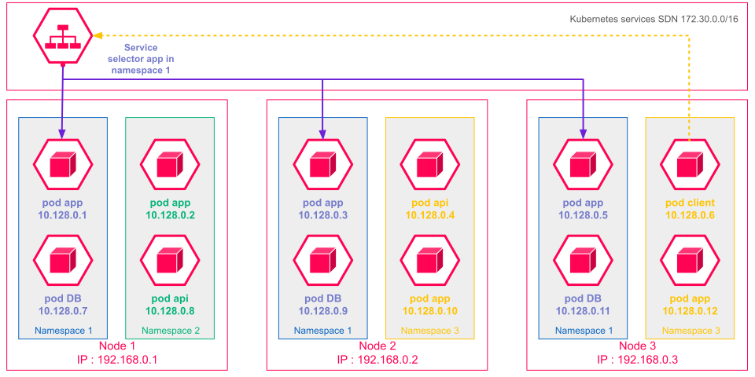
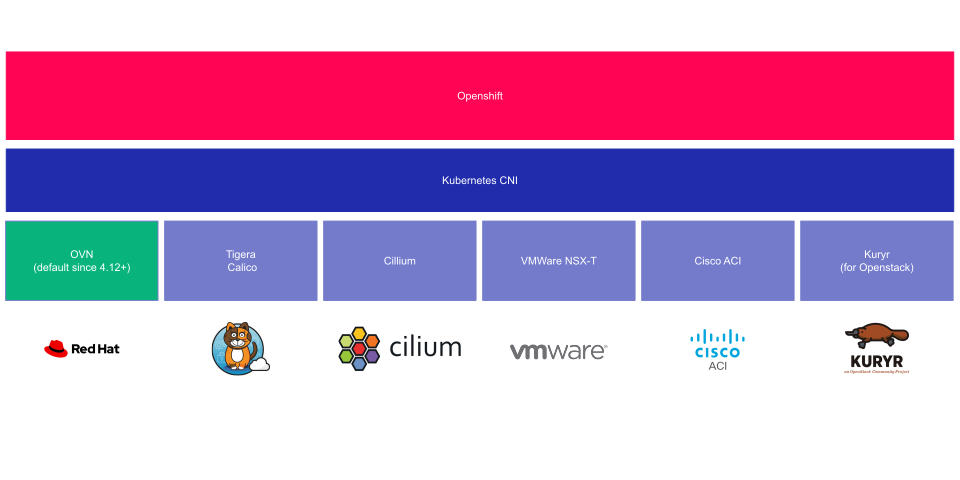

# Les réseaux dans Openshift

Dans un environnement OpenShift, la gestion du réseau est essentielle pour garantir une communication efficace et sécurisée entre les différents composants des applications déployées. Kubernetes implémente un Réseau Défini par Logiciel (SDN) pour orchestrer cette infrastructure réseau. Le SDN permet de créer un réseau virtuel englobant tous les nœuds du cluster, facilitant ainsi la communication inter-pods tout en maintenant un niveau élevé de sécurité et de gestion centralisée. Ce cours approfondira les concepts, les fonctionnalités, et les avantages du SDN dans OpenShift, ainsi que les outils et commandes nécessaires pour sa gestion.

### Objectifs de la section

1. Comprendre le concept de Réseau Défini par Logiciel (SDN) dans OpenShift.
2. Explorer les fonctionnalités et les avantages du SDN pour la gestion réseau des clusters Kubernetes.
3. Apprendre comment les différents composants du SDN interagissent pour assurer la communication entre les pods.
4. Découvrir les outils et les commandes pour configurer et gérer le SDN dans OpenShift.
5. Examiner des cas d'utilisation pratiques et des scénarios d'implémentation du SDN.

### Le Réseau Défini par Logiciel (SDN) dans OpenShift

#### 1. Qu'est-ce que le SDN ?

Le Réseau Défini par Logiciel (SDN) est une approche permettant de gérer les réseaux de manière programmée et centralisée. Dans Kubernetes, le SDN crée un réseau virtuel englobant tous les nœuds du cluster, ce qui permet une communication efficace entre tous les pods. Ce réseau virtuel est isolé, garantissant que seul le trafic interne au cluster est autorisé, ce qui améliore la sécurité.

#### 2. Fonctionnement du SDN

Le SDN dans OpenShift repose sur plusieurs concepts et composants clés :

- **Abstraction des Couches Réseau** : Le SDN permet d'abstraire les différentes couches réseau, simplifiant ainsi la gestion des services réseau.
- **Réseau Virtuel** : Crée un réseau virtuel qui englobe tous les nœuds du cluster, facilitant la communication inter-pods.
- **Isolation et Sécurité** : Assure une isolation réseau entre les pods et les nœuds, garantissant que le réseau SDN n'est pas accessible depuis l'extérieur du cluster.

#### 3. Avantages du SDN

Le SDN offre de nombreux avantages pour la gestion réseau des clusters Kubernetes :

- **Gestion Centralisée** : Permet une gestion centralisée du trafic réseau et des ressources, simplifiant ainsi les opérations réseau.
- **Scalabilité** : Facilite la mise à l'échelle des applications en permettant l'ajout ou la suppression dynamique de pods.
- **Isolation des Tenants** : Assure une isolation efficace des différents environnements de travail, permettant une meilleure sécurité et gestion des ressources.

### Fonctionnalités du Réseau Kubernetes

#### 1. Communications de Conteneur à Conteneur

Les conteneurs au sein d'un même pod peuvent communiquer entre eux via l'adresse de bouclage `localhost`. Cela permet une intégration transparente entre les services au sein d'un pod.

#### 2. Communications de Pod à Pod

Kubernetes assigne une adresse IP unique à chaque pod, ce qui permet une communication directe entre les pods sans nécessiter de traduction d'adresse réseau (NAT). Tous les pods peuvent communiquer entre eux, indépendamment de leur emplacement sur différents nœuds ou espaces de noms Kubernetes.

#### 3. Communications du Pod vers le Service

Les services Kubernetes fournissent des adresses IP stables et permanentes aux groupes de pods, permettant une communication fiable et équilibrée entre les pods. Les services agissent comme des équilibreurs de charge virtuels, distribuant le trafic de manière transparente entre les pods associés.

#### 4. Communication Externe vers le Service

Les services Kubernetes permettent également l'accès externe aux pods via des adresses IP stables, ce qui est particulièrement utile pour exposer des applications à l'extérieur du cluster.

### Utilisation des Services dans Kubernetes

#### 1. Stabilité des Adresses IP

Contrairement aux adresses IP des pods, qui sont éphémères, les adresses IP des services sont stables. Cela permet aux applications de maintenir des connexions fiables, même lorsque les pods sont redémarrés ou replanifiés.

#### 2. Équilibrage de Charge

Les services Kubernetes agissent comme des équilibreurs de charge, répartissant le trafic de manière équilibrée entre les pods associés. Cela améliore la tolérance aux pannes et la scalabilité des applications.

#### 3. Découverte de Services

Kubernetes utilise un serveur DNS interne pour la découverte de services. Chaque service reçoit un nom de domaine complet (FQDN) qui permet aux pods de le découvrir et de communiquer avec lui de manière fiable.

### Composants du SDN

#### 1. Plug-ins CNI (Container Network Interface)

Les plug-ins CNI fournissent une interface commune pour la configuration des réseaux de conteneurs. OpenShift utilise différents plug-ins comme OVN-Kubernetes, OpenShift SDN, et Kuryr pour gérer le réseau. Ces plug-ins permettent aux fournisseurs réseau de proposer leurs solutions pour une gestion centralisée, un routage dynamique, et l'isolation des tenants.

#### 2. OVN-Kubernetes

OVN-Kubernetes est le fournisseur réseau par défaut dans OpenShift 4.12. Il utilise Open Virtual Network (OVN) pour gérer le réseau de clusters et exécute Open vSwitch (OVS) sur chaque nœud. OVN configure OVS pour implémenter la configuration réseau déclarée.

#### 3. Opérateur de Réseau de Clusters (CNO)

L'Opérateur de Réseau de Clusters (CNO) est un opérateur de cluster OpenShift qui charge et configure les plug-ins CNI. Il permet de gérer la configuration réseau du cluster de manière centralisée et d'assurer que les politiques réseau sont correctement appliquées.

### Autres SDN Supportés sur OpenShift

OpenShift supporte plusieurs implémentations SDN, chacune ayant ses propres caractéristiques et avantages spécifiques. Voici un aperçu des principaux SDN supportés :

#### 1. Calico

Calico est une solution de mise en réseau et de sécurité pour les conteneurs, les machines virtuelles et les hôtes natifs. Il est particulièrement apprécié pour sa simplicité et son efficacité en termes de performance.

- **Routage Pur IP** : Utilise le routage IP pur sans overlay, ce qui réduit la complexité et améliore les performances réseau.
- **Politiques de Sécurité** : Offre des contrôles granulaires de sécurité réseau avec des politiques de réseau basées sur les labels.
- **Évolutivité** : Calico peut s'étendre pour supporter de grands clusters grâce à son architecture légère et efficace.

#### 2. Cilium

Cilium est une solution de mise en réseau basée sur eBPF (Extended Berkeley Packet Filter), qui permet une observabilité et une sécurité réseau avancées.

- **Observabilité** : Utilise eBPF pour fournir une visibilité en profondeur des communications réseau au sein des clusters Kubernetes.
- **Sécurité Avancée** : Offre des politiques de sécurité de haut niveau qui s'intègrent directement dans le noyau Linux.
- **Performances** : Bénéficie de l'efficacité de eBPF pour traiter les paquets réseau au niveau du noyau, réduisant ainsi la latence et améliorant les performances.

### Cas d'Utilisation et Scénarios d'Implémentation

#### 1. Mise en Conteneur des Applications Existantes

Le SDN dans Kubernetes permet de containeriser facilement les applications existantes sans avoir à modifier la manière dont les composants communiquent entre eux. Les conteneurs d'un pod utilisent la même pile réseau, ce qui simplifie la migration des applications traditionnelles vers un environnement conteneurisé.

#### 2. Gestion Dynamique du Trafic

Avec le SDN, les équipes peuvent gérer le trafic et les ressources réseau par programme, décidant comment exposer leurs applications en fonction des besoins. Par exemple, en réponse à une augmentation du trafic, de nouveaux pods peuvent être ajoutés dynamiquement pour gérer la charge.

#### 3. Isolation et Sécurité des Applications

Le SDN permet une isolation efficace des différents tenants au sein du même cluster, garantissant que les applications sont sécurisées et que les ressources réseau sont correctement partitionnées.

### Conclusion

Le Réseau Défini par Logiciel (SDN) dans OpenShift est un élément clé pour la gestion et l'orchestration des réseaux au sein des clusters Kubernetes. En offrant une gestion centralisée, une scalabilité dynamique, et une isolation efficace, le SDN facilite le déploiement et la maintenance des applications conteneurisées. Les services et la découverte DNS assurent une communication fiable et stable entre les différents composants de l'application, garantissant ainsi une infrastructure réseau
