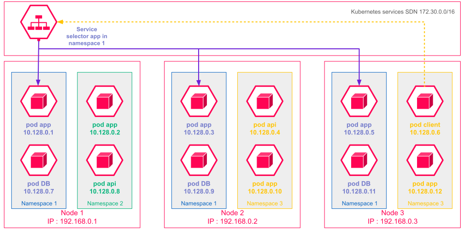
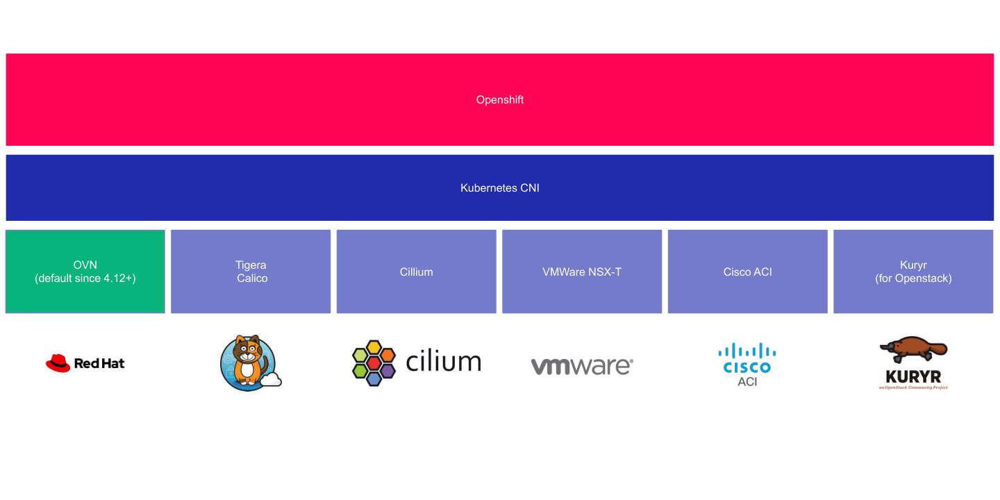

# Les réseaux dans OpenShift

Dans un environnement OpenShift, la gestion du réseau est essentielle pour garantir une communication efficace et sécurisée entre les différents composants des applications déployées. Kubernetes implémente un **Réseau Défini par Logiciel** (SDN - Software Defined Networking) pour orchestrer cette infrastructure réseau. Le SDN permet de créer un réseau virtuel englobant tous les nœuds du cluster, facilitant la communication inter-pods tout en maintenant un niveau élevé de sécurité et de gestion centralisée.


*Vue d'ensemble de la couche SDN dans un cluster OpenShift multi-nœuds*

---

## Objectifs de la section

À la fin de cette section, vous serez capable de :

1. Comprendre le concept de Réseau Défini par Logiciel (SDN) dans OpenShift.
2. Distinguer les différentes implémentations CNI disponibles (OVN-Kubernetes, OpenShift SDN, Calico, Cilium).
3. Expliquer comment les pods communiquent entre eux et avec les services.
4. Configurer des politiques réseau (NetworkPolicy) pour isoler et contrôler les flux.
5. Identifier les outils et commandes pour diagnostiquer et gérer le réseau dans OpenShift.

---

## 1. Qu'est-ce que le SDN ?

Le **Réseau Défini par Logiciel** (SDN) est une approche d'architecture réseau qui sépare le plan de contrôle (décisions de routage) du plan de données (acheminement effectif des paquets). Dans le contexte de Kubernetes et OpenShift, le SDN crée un réseau virtuel superposé (overlay) qui englobe l'ensemble des nœuds du cluster.

Cette approche apporte trois bénéfices fondamentaux :

- **Programmabilité** : le comportement réseau est déclaré via des objets Kubernetes (NetworkPolicy, Service, Route) plutôt que configuré manuellement sur chaque nœud.
- **Isolation** : chaque namespace peut être isolé logiquement des autres, même s'ils partagent la même infrastructure physique.
- **Portabilité** : une application configurée sur un cluster fonctionne identiquement sur un autre cluster utilisant le même CNI.

:::info Pourquoi le SDN est indispensable dans Kubernetes
Sans SDN, chaque pod obtiendrait une adresse IP liée à un nœud spécifique. Il serait impossible pour un pod du nœud A de joindre directement un pod du nœud B sans NAT complexe. Le SDN résout ce problème en attribuant à chaque pod une adresse IP routable dans tout le cluster, indépendamment du nœud sur lequel il s'exécute.
:::

---

## 2. Les modèles de communication dans Kubernetes

Kubernetes définit un modèle réseau strict que tout CNI doit respecter. Ce modèle repose sur quatre règles fondamentales :

### Communication conteneur à conteneur

Les conteneurs appartenant au **même pod** partagent le même espace réseau (network namespace). Ils communiquent via l'interface de bouclage `localhost` et n'ont pas besoin de ports exposés entre eux.

```
Pod A
├ conteneur-app   → localhost:8080
└ conteneur-sidecar → localhost:9090
```

Ce modèle est celui utilisé par les sidecars (Istio Envoy proxy, Fluent Bit, etc.).

### Communication pod à pod

Chaque pod reçoit une adresse IP unique et stable **pour la durée de sa vie**. Deux pods peuvent communiquer directement par IP, même s'ils sont sur des nœuds différents, sans NAT.

```
Pod A (192.168.1.10) → Pod B (192.168.2.20)
     Nœud 1                  Nœud 2
```

Le SDN crée un tunnel (VXLAN ou Geneve selon le CNI) entre les nœuds pour acheminer ces paquets.

:::warning Les IP de pods sont éphémères
L'adresse IP d'un pod est attribuée à sa création et libérée à sa suppression. Ne jamais coder en dur une IP de pod dans une application. Utilisez toujours un **Service** pour accéder à un groupe de pods.
:::

### Communication pod vers Service

Un **Service** Kubernetes fournit une adresse IP virtuelle stable (ClusterIP) qui persiste indépendamment du cycle de vie des pods. Le composant `kube-proxy` (ou son équivalent OVN) maintient les règles iptables/eBPF qui redirigent le trafic vers les pods sains.

### Communication externe vers Service

Des mécanismes supplémentaires (NodePort, LoadBalancer, Route OpenShift) permettent d'exposer les services à des clients extérieurs au cluster.



*Architecture détaillée du SDN : flux entre pods, services, et accès externe via l'Ingress Controller*

---

## 3. L'interface CNI (Container Network Interface)

### Rôle du CNI

La **Container Network Interface** (CNI) est une spécification standardisée qui définit comment les plugins réseau doivent s'intégrer avec les runtimes de conteneurs. Lorsqu'un pod est créé sur un nœud, le runtime (CRI-O dans OpenShift) appelle le plugin CNI configuré pour :

1. Créer l'interface réseau virtuelle du pod (`eth0` dans le namespace du pod).
2. Attribuer une adresse IP à ce pod depuis le sous-réseau prévu.
3. Configurer les routes nécessaires pour que ce pod soit joignable depuis les autres nœuds.

À la suppression du pod, le CNI nettoie toutes ces ressources réseau.

### L'Opérateur de Réseau de Clusters (CNO)

L'**Opérateur de Réseau de Clusters** (Cluster Network Operator - CNO) est l'opérateur OpenShift responsable du déploiement et de la configuration du plugin CNI. Il gère :

- Le déploiement des DaemonSets CNI sur tous les nœuds.
- La configuration initiale du réseau de pods (CIDR, MTU, etc.).
- Les mises à jour de la configuration réseau du cluster.

La configuration du CNO est consultable via :

```bash
oc get network.operator cluster -o yaml
```

---

## 4. OVN-Kubernetes : le CNI par défaut

### Présentation

**OVN-Kubernetes** est le plugin réseau par défaut depuis OpenShift 4.12. Il s'appuie sur deux technologies open source matures :

- **Open Virtual Network (OVN)** : couche de contrôle qui maintient la topologie réseau logique et génère la configuration.
- **Open vSwitch (OVS)** : commutateur virtuel déployé sur chaque nœud, qui applique les règles générées par OVN.

### Architecture OVN-Kubernetes

```
┌┐
│              Plan de contrôle               │
│  ┌┐   │
│  │     ovn-kubernetes (controller)      │   │
│  │  - Traduit les objets K8s en règles  │   │
│  │  - Gère les NetworkPolicies          │   │
│  └┬┘   │
└┼┘
                  │ OVN Northbound DB
        ┌┴┐
        ▼                    ▼
┌┐    ┌┐
│    Nœud 1    │    │    Nœud 2    │
│  OVS + OVN   │    │  OVS + OVN   │
│  southbound  │    │  southbound  │
└┘    └┘
```

### Fonctionnalités clés d'OVN-Kubernetes

| Fonctionnalité | Description |
|---|---|
| NetworkPolicy | Support natif et performant via OVN ACLs |
| Egress IP | Attribution d'une IP de sortie fixe par namespace |
| Egress Firewall | Restriction du trafic sortant vers des CIDR ou domaines |
| Hybrid networking | Support de nœuds Windows et Linux dans le même cluster |
| IPAM distribué | Gestion des IP de pods décentralisée par nœud |

---

## 5. Comparaison des plugins CNI supportés

OpenShift supporte plusieurs plugins CNI. Le tableau suivant synthétise leurs caractéristiques pour vous aider à choisir en fonction de votre contexte :



*Vue d'ensemble des plugins CNI disponibles - OVN-Kubernetes est le défaut depuis OpenShift 4.12*

| Critère | OVN-Kubernetes | OpenShift SDN | Calico | Cilium |
|---|---|---|---|---|
| Statut dans OCP | **Par défaut (4.12+)** | Déprécié (4.14+) | Via opérateur tiers | Via opérateur tiers |
| Technologie sous-jacente | OVN + OVS | OVS | BGP / IPIP | eBPF |
| NetworkPolicy | Oui | Oui | Oui (étendu) | Oui (étendu) |
| Egress IP fixe | Oui | Oui | Non natif | Oui |
| Performances | Elevées | Moyennes | Très élevées | Très élevées |
| Observabilité | Limitée | Limitée | Bonne | Excellente (Hubble) |
| Courbe d'apprentissage | Modérée | Faible | Modérée | Élevée |
| Cas d'usage principal | Production standard | Migration legacy | Grands clusters bare-metal | Sécurité avancée / eBPF |

:::tip Quel CNI choisir ?
Pour la grande majorité des déploiements OpenShift, **OVN-Kubernetes** est le choix recommandé. Il est activement maintenu par Red Hat, supporte toutes les fonctionnalités OpenShift natives (Egress IP, Egress Firewall, etc.) et bénéficie d'un support officiel.

Optez pour **Cilium** uniquement si vous avez des besoins avancés en observabilité réseau (via Hubble) ou si votre politique de sécurité exige des contrôles eBPF de bas niveau.
:::

### OpenShift SDN (héritage)

OpenShift SDN était le plugin par défaut avant la version 4.12. Il utilise Open vSwitch en mode VXLAN overlay. Il est **déprécié depuis OpenShift 4.14** et ne recevra plus de nouvelles fonctionnalités. La migration vers OVN-Kubernetes est fortement recommandée.

### Calico

Calico est une solution de mise en réseau privilégiant un **routage IP pur** sans overlay quand l'infrastructure le permet. Ses atouts :

- **Performance** : en mode BGP sans encapsulation, la latence est minimale.
- **Politiques de sécurité étendues** : les `GlobalNetworkPolicy` Calico vont au-delà des NetworkPolicy Kubernetes standard.
- **Évolutivité** : architecture légère adaptée aux très grands clusters.

### Cilium

Cilium repose sur **eBPF** (Extended Berkeley Packet Filter), une technologie qui permet d'exécuter du code directement dans le noyau Linux sans modifier son code source. Ses avantages :

- **Observabilité profonde** : le composant **Hubble** fournit une carte des flux réseau en temps réel.
- **Sécurité L7** : les politiques peuvent filtrer au niveau applicatif (HTTP, gRPC, Kafka).
- **Performance** : traitement des paquets au niveau du noyau, réduction de la latence.

---

## 6. Les NetworkPolicies

### Principe

Par défaut, dans Kubernetes, **tous les pods peuvent communiquer avec tous les autres pods** du cluster, quel que soit le namespace. Ce comportement permissif peut poser des problèmes de sécurité dans les environnements multi-tenants.

Les **NetworkPolicies** permettent de définir des règles d'isolation réseau au niveau des pods, en autorisant ou en refusant des flux entrants (ingress) et sortants (egress).

:::info Comment fonctionnent les NetworkPolicies
Une NetworkPolicy s'applique à un ensemble de pods sélectionnés via des labels. Si au moins une NetworkPolicy sélectionne un pod, celui-ci passe en mode "deny all" pour les flux couverts par cette politique. Seuls les flux explicitement autorisés sont alors permis.

Un pod sans aucune NetworkPolicy le ciblant reste entièrement accessible (comportement par défaut).
:::

### Exemple 1 : Isolation totale d'un namespace

Ce manifeste refuse tout trafic entrant vers les pods du namespace `production`, sauf exception explicite :

```yaml
apiVersion: networking.k8s.io/v1
kind: NetworkPolicy
metadata:
  name: default-deny-ingress
  namespace: production
spec:
  podSelector: {}       # Sélectionne tous les pods du namespace
  policyTypes:
    - Ingress
  # Aucune règle ingress = tout refuser
```

### Exemple 2 : Autoriser uniquement le frontend vers le backend

```yaml
apiVersion: networking.k8s.io/v1
kind: NetworkPolicy
metadata:
  name: allow-frontend-to-backend
  namespace: production
spec:
  podSelector:
    matchLabels:
      app: backend       # S'applique aux pods backend
  policyTypes:
    - Ingress
  ingress:
    - from:
        - podSelector:
            matchLabels:
              app: frontend  # Autorise uniquement les pods frontend
      ports:
        - protocol: TCP
          port: 8080
```

### Exemple 3 : Autoriser l'accès inter-namespaces

```yaml
apiVersion: networking.k8s.io/v1
kind: NetworkPolicy
metadata:
  name: allow-from-monitoring
  namespace: production
spec:
  podSelector:
    matchLabels:
      app: backend
  policyTypes:
    - Ingress
  ingress:
    - from:
        - namespaceSelector:
            matchLabels:
              kubernetes.io/metadata.name: monitoring
      ports:
        - protocol: TCP
          port: 9090    # Autoriser Prometheus à scraper les métriques
```

:::tip Bonne pratique : NetworkPolicy "deny all" par défaut
Dans tout namespace applicatif en production, commencez toujours par une politique `default-deny-ingress` et `default-deny-egress`, puis ajoutez des politiques permissives ciblées. Cette approche "zero trust" réduit considérablement la surface d'attaque en cas de compromission d'un pod.
:::

### Vérification des NetworkPolicies

```bash
# Lister les NetworkPolicies d'un namespace
oc get networkpolicy -n production

# Détail d'une politique
oc describe networkpolicy allow-frontend-to-backend -n production

# Vérifier la connectivité depuis un pod (test de débogage)
oc exec -n production deploy/frontend -- curl -m 3 http://backend:8080/health
```

---

## 7. Gestion réseau : commandes essentielles

### Inspecter la configuration réseau du cluster

```bash
# Voir la configuration CNI active
oc get network.config cluster -o yaml

# Voir l'état de l'opérateur réseau
oc get network.operator cluster

# Lister les pods de l'opérateur réseau
oc get pods -n openshift-network-operator
oc get pods -n openshift-ovn-kubernetes
```

### Diagnostiquer la connectivité réseau

```bash
# Obtenir l'IP d'un pod
oc get pod mon-pod -o jsonpath='{.status.podIP}'

# Lancer un pod de debug réseau temporaire
oc debug node/<nom-nœud>

# Depuis un pod existant, tester la connectivité
oc exec -it mon-pod -- ping 192.168.1.10
oc exec -it mon-pod -- curl -v http://mon-service:8080
```

### Examiner les flux réseau avec OVN

```bash
# Lister les logical switches OVN
oc exec -n openshift-ovn-kubernetes \
  $(oc get pods -n openshift-ovn-kubernetes -l app=ovnkube-master -o name | head -1) \
  -- ovn-nbctl ls-list
```

---

## Résumé

Le SDN dans OpenShift est le fondement de toute communication entre les composants applicatifs. Retenir les points clés suivants :

| Concept | Points à retenir |
|---|---|
| CNI | Interface standardisée, plugin configurable via le CNO |
| OVN-Kubernetes | CNI par défaut, basé sur OVN + OVS, fonctionnalités riches |
| Modèle réseau Kubernetes | Chaque pod a une IP unique, pas de NAT inter-pods |
| Services | Adresse IP stable pour accéder à un groupe de pods |
| NetworkPolicy | Isolation réseau déclarative, mode "deny all" recommandé |

:::info Prochaine étape
La section suivante approfondit les **Services et les Routes** dans OpenShift : comment exposer vos applications à l'intérieur et à l'extérieur du cluster, et comment configurer le chiffrement TLS sur vos routes.
:::
