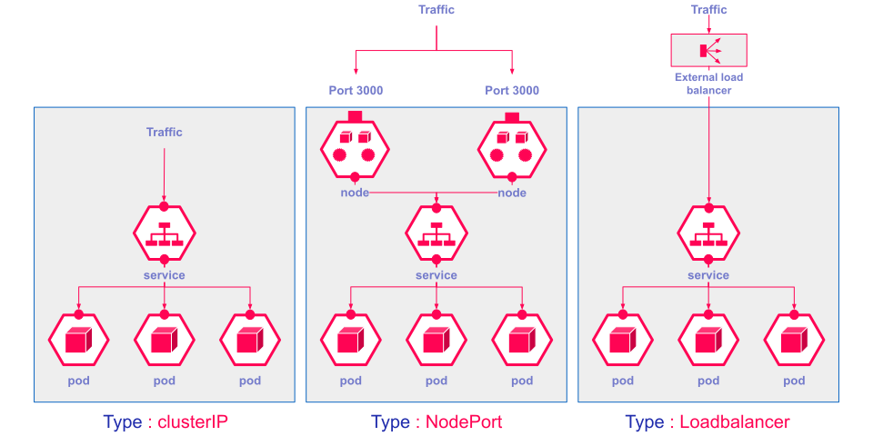
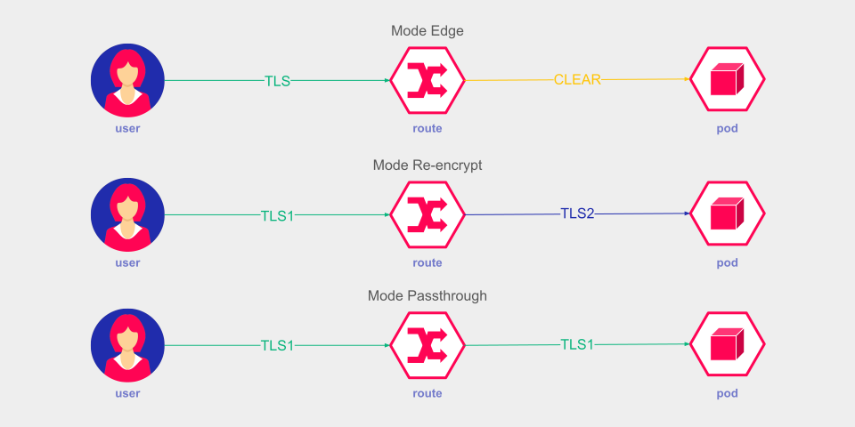

# Services et Routes dans OpenShift

### Introduction

Dans OpenShift, la gestion du trafic réseau pour les applications conteneurisées est cruciale pour garantir leur accessibilité et leur sécurité. Les **services** et les **routes** sont des composants clés de cette gestion. Les services permettent de regrouper et d'exposer des pods à l'intérieur du cluster, tandis que les routes facilitent l'accès externe aux applications. Ce cours explore en profondeur ces deux concepts, en expliquant leurs types, cas d'usage, et configurations.

### Objectifs de la Section

À la fin de cette section, vous serez capable de :
1. Comprendre à quoi servent les services dans OpenShift.
2. Expliquer les différents types de services : ClusterIP, NodePort, LoadBalancer, et leurs cas d'usage.
3. Comprendre le rôle des routes dans OpenShift pour exposer les applications externes.
4. Expliquer comment fonctionne l'Ingress Controller et les différentes options d'exposition TLS : passthrough, reencrypt, et edge.

## Les Services dans OpenShift

### Concepts Fondamentaux

Les services dans OpenShift, comme dans Kubernetes, sont utilisés pour exposer les pods à l'intérieur du cluster, permettant une communication stable entre eux. Les services abstraient les pods individuels et offrent une adresse IP stable, assurant que même si des pods sont recréés ou déplacés, le trafic peut toujours les atteindre via le service.

Un service associe un groupe de pods par le biais de labels, et dirige le trafic vers ces pods via un mécanisme de **load balancing interne**.

### Types de Services

Il existe plusieurs types de services dans OpenShift, chacun ayant ses propres cas d'utilisation :

#### 1. **ClusterIP (Service par défaut)**

##### Description
Le type de service **ClusterIP** est le plus basique et le plus utilisé. Il expose le service à l'intérieur du cluster, ce qui signifie que le service est accessible uniquement depuis d'autres pods dans le même cluster. Une adresse IP interne est attribuée au service, et le trafic est routé vers les pods sélectionnés par le service.

##### Cas d'usage
- **Communication interne** : Utilisé pour permettre aux pods d'une application de communiquer entre eux.
- **Services backend** : Idéal pour des bases de données, caches, ou autres composants internes non destinés à être accessibles depuis l'extérieur du cluster.

##### Exemple de configuration

```yaml
apiVersion: v1
kind: Service
metadata:
  name: my-clusterip-service
spec:
  selector:
    app: my-app
  ports:
  - protocol: TCP
    port: 80
    targetPort: 8080
  type: ClusterIP
```

Dans cet exemple, un service `ClusterIP` expose les pods avec le label `app: my-app` sur le port 80.

#### 2. **NodePort**

##### Description
Le service de type **NodePort** expose le service sur un port spécifique de chaque nœud du cluster. Cela permet d'accéder au service depuis l'extérieur du cluster en utilisant l'adresse IP d'un nœud et le port alloué.

##### Cas d'usage
- **Accès externe simple** : Utilisé lorsque vous avez besoin d'accéder au service depuis l'extérieur du cluster, mais sans infrastructure de load balancing externe.
- **Test et développement** : Pratique pour des environnements de test ou des déploiements simples sans utiliser des configurations plus complexes comme des LoadBalancers ou des routes.

##### Exemple de configuration

```yaml
apiVersion: v1
kind: Service
metadata:
  name: my-nodeport-service
spec:
  selector:
    app: my-app
  ports:
  - protocol: TCP
    port: 80
    targetPort: 8080
    nodePort: 30007
  type: NodePort
```

Dans cet exemple, le service `NodePort` est exposé sur le port 30007 de chaque nœud du cluster.

#### 3. **LoadBalancer**

##### Description
Le service de type **LoadBalancer** expose le service à l'extérieur du cluster en configurant automatiquement un load balancer externe qui distribue le trafic vers les nœuds du cluster. Ce type de service est généralement utilisé dans les environnements cloud où les load balancers sont fournis par le fournisseur de cloud.

##### Cas d'usage
- **Environnements Cloud** : Idéal pour des déploiements en production sur des infrastructures cloud (AWS, GCP, Azure) où le load balancer est automatiquement provisionné.
- **Exposition de services critiques** : Convient pour des applications nécessitant une haute disponibilité et une répartition automatique du trafic.

##### Exemple de configuration dans un environnement cloud

```yaml
apiVersion: v1
kind: Service
metadata:
  name: my-loadbalancer-service
spec:
  selector:
    app: my-app
  ports:
  - protocol: TCP
    port: 80
    targetPort: 8080
  type: LoadBalancer
```

Dans cet exemple, le service `LoadBalancer` demande la création d'un load balancer externe qui répartira le trafic sur les pods sélectionnés.



##### Utilisation de MetalLB pour les Environnements On-Premise
Dans les environnements on-premise (sans cloud provider), vous pouvez utiliser un composant comme **MetalLB** pour simuler un service de type LoadBalancer. MetalLB fournit un load balancing en mode bare-metal pour Kubernetes, permettant d'allouer des IPs externes sur votre réseau pour exposer vos services.

## Les Routes dans OpenShift

### Concepts Fondamentaux

Les **routes** dans OpenShift permettent d'exposer des services internes à l'extérieur du cluster. Une route associe un nom de domaine (DNS) à un service, et dirige le trafic HTTP/HTTPS vers les pods gérés par ce service. Les routes sont spécifiques à OpenShift et offrent une couche supplémentaire de gestion du trafic par rapport aux services standard de Kubernetes.

### Fonctionnement de l'Ingress Controller

L'Ingress Controller dans OpenShift agit comme un proxy qui gère les routes et le trafic entrant dans le cluster. Il est responsable de recevoir les requêtes HTTP/HTTPS externes et de les router vers les services appropriés basés sur les configurations de route.

L'Ingress Controller peut également gérer la terminaison SSL/TLS, en s'assurant que le trafic est sécurisé entre les clients externes et les services dans le cluster.

### Modes d'Exposition TLS

Lorsqu'on configure une route avec TLS dans OpenShift, il existe trois modes principaux pour gérer le chiffrement du trafic :

#### 1. **Edge Termination (Mode Edge)**

##### Description
Dans le mode **Edge Termination**, la terminaison TLS (chiffrement/déchiffrement) est effectuée par l'Ingress Controller lui-même. Le trafic entre le client et l'Ingress Controller est sécurisé via TLS, mais une fois le trafic déchiffré, il est envoyé en clair aux pods cibles à l'intérieur du cluster.

##### Cas d'usage
- **Simplicité** : Utilisé lorsqu'il est suffisant de sécuriser le trafic entre le client et le cluster, sans nécessiter un chiffrement interne.
- **Performances** : Offre une bonne performance en évitant le chiffrement supplémentaire à l'intérieur du cluster.

##### Exemple de configuration

```yaml
apiVersion: route.openshift.io/v1
kind: Route
metadata:
  name: my-edge-route
spec:
  host: example.com
  to:
    kind: Service
    name: my-service
  tls:
    termination: edge
```

#### 2. **Re-encrypt Termination (Mode Reencrypt)**

##### Description
Dans le mode **Re-encrypt Termination**, la terminaison TLS est effectuée par l'Ingress Controller, mais le trafic est ensuite ré-encrypté et acheminé vers les pods cibles en TLS. Cela assure que le trafic reste chiffré tout au long de son parcours, du client jusqu'aux pods.

##### Cas d'usage
- **Sécurité accrue** : Utilisé lorsqu'il est nécessaire de sécuriser le trafic non seulement entre le client et le cluster, mais aussi à l'intérieur du cluster.
- **Conformité** : Idéal pour les environnements nécessitant une conformité stricte en matière de sécurité des données.

##### Exemple de configuration

```yaml
apiVersion: route.openshift.io/v1
kind: Route
metadata:
  name: my-reencrypt-route
spec:
  host: example.com
  to:
    kind: Service
    name: my-service
  tls:
    termination: reencrypt
    destinationCACertificate: |
      -----BEGIN CERTIFICATE-----
      MIIBIjANBgkqh...
      -----END CERTIFICATE-----
```

#### 3. **Passthrough Termination (Mode Passthrough)**

##### Description
Dans le mode **Passthrough Termination**, l'Ingress Controller ne termine pas la connexion TLS. Au lieu de cela, il passe directement le trafic TLS au service backend sans modification. Le service backend doit être configuré pour gérer le chiffrement TLS.

##### Cas d'usage
- **Applications sensibles** : Utilisé pour des applications qui nécessitent un contrôle total sur le chiffrement TLS, ou lorsqu'une application gère déjà son propre chiffrement.
- **Performances** : Évite la surcharge du chiffrement/déchiffrement dans l'Ingress Controller, mais nécessite que le backend soit capable de gérer les connexions TLS.

##### Exemple de configuration

```yaml
apiVersion: route.openshift.io/v1
kind: Route
metadata:
  name: my-passthrough-route
spec:
  host: example.com
  to:
    kind:

 Service
    name: my-service
  tls:
    termination: passthrough
```



## Conclusion

Les services et les routes sont des composantes essentielles pour gérer le trafic réseau dans OpenShift. Les services permettent de regrouper et d'exposer des pods à l'intérieur du cluster, tandis que les routes facilitent l'accès externe. En comprenant les différents types de services et les modes d'exposition TLS, vous pouvez configurer des applications sécurisées et hautement disponibles, adaptées à divers environnements et besoins.
