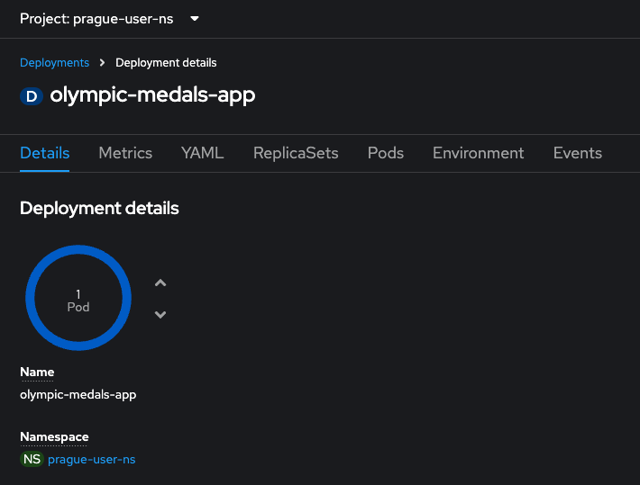
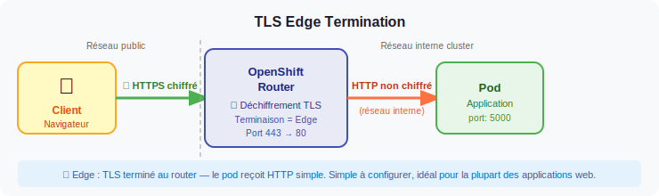

# Exercice Guidé : Les Services et les Routes dans OpenShift

## Ce que vous allez apprendre

Dans cet exercice, vous allez découvrir comment rendre une application accessible, d'abord **à l'intérieur** du cluster OpenShift, puis **depuis l'extérieur** (votre navigateur). Vous partirez d'une application déjà déployée mais totalement isolée, et vous ajouterez couche par couche les ressources réseau nécessaires pour y accéder.

C'est l'un des exercices les plus importants de cette formation : sans réseau correctement configuré, personne ne peut utiliser votre application !

## Objectifs

A la fin de cet exercice, vous serez capable de :

- [ ] Comprendre la différence entre un **Service** et une **Route**
- [ ] Créer un **Service ClusterIP** pour permettre la communication interne dans le cluster
- [ ] Créer une **Route HTTP** pour exposer l'application sur Internet
- [ ] Créer une **Route HTTPS avec TLS edge** pour sécuriser les communications
- [ ] Vérifier que chaque ressource fonctionne correctement avec les commandes `oc`

---

:::tip Terminal web OpenShift
Toutes les commandes `oc` de cet exercice sont à exécuter dans le **terminal web OpenShift**. Cliquez sur l'icône de terminal en haut à droite de la console pour l'ouvrir.


:::

## Vue d'ensemble : le chemin d'une requête

Avant de commencer, comprenons le trajet d'une requête depuis votre navigateur jusqu'à l'application :


:::info Le principe en une phrase
**Route** = porte d'entrée depuis Internet. **Service** = aiguilleur interne vers les bons pods. Sans les deux, votre application est invisible.
:::

---

## Prérequis

Une application **Olympic Medals** est déjà déployée dans votre namespace par le formateur. Cette application affiche un tableau des médailles olympiques et écoute sur le **port 5000**.



Commençons par vérifier que l'application est bien en cours d'exécution.

**Vérifiez le déploiement :**

```bash
oc get deployment olympic-medals-app
```

**Sortie attendue :**

```
NAME                 READY   UP-TO-DATE   AVAILABLE   AGE
olympic-medals-app   2/2     2            2           5m
```

**Vérifiez les pods :**

```bash
oc get pods -l app=olympic-medals-app
```

**Sortie attendue :**

```
NAME                                  READY   STATUS    RESTARTS   AGE
olympic-medals-app-xxx-yyy1           1/1     Running   0          5m
olympic-medals-app-xxx-yyy2           1/1     Running   0          5m
```

:::warning Pods non disponibles ?
Si vous voyez `0/2` dans la colonne READY ou que les pods ne sont pas en status `Running`, attendez quelques secondes et relancez les commandes. Si le problème persiste, appelez le formateur.
:::

:::tip Pourquoi 2 pods ?
Le déploiement a été configuré avec **2 réplicas**. Cela signifie que deux copies identiques de l'application tournent en parallèle. Le Service que nous allons créer répartira automatiquement le trafic entre ces deux pods (load balancing).
:::

---

## Étape 1 : Créer un Service ClusterIP

### Pourquoi cette étape ?

Pour l'instant, vos pods tournent mais **rien ne permet de les joindre de manière fiable**. Chaque pod a une adresse IP, mais ces IPs changent à chaque redémarrage. Le **Service** résout ce problème : il crée une adresse IP stable et un nom DNS interne qui pointe toujours vers les bons pods.

Un service de type `ClusterIP` est le type par défaut. Il rend l'application accessible **uniquement depuis l'intérieur du cluster** (par exemple, par d'autres pods).

:::info ClusterIP en bref
- Accessible uniquement **à l'intérieur** du cluster
- Fournit une **IP fixe** et un **nom DNS** (`olympic-medals-svc.votre-namespace.svc.cluster.local`)
- Répartit le trafic entre tous les pods qui correspondent au **sélecteur** (`app: olympic-medals-app`)
:::

### Créer le fichier YAML

Créez un fichier nommé `clusterip-service.yaml` avec le contenu suivant :

```bash
vi clusterip-service.yaml
```

:::tip Préférez nano ?
Si vous n'êtes pas à l'aise avec `vi`, utilisez `nano` à la place :
```bash
nano clusterip-service.yaml
```
Dans `nano` : collez le contenu avec **Ctrl+Shift+V**, sauvegardez avec **Ctrl+O** et quittez avec **Ctrl+X**.
:::

```yaml
apiVersion: v1
kind: Service
metadata:
  name: olympic-medals-svc
spec:
  selector:
    app: olympic-medals-app   # Le service cible tous les pods avec ce label
  ports:
  - protocol: TCP
    port: 80                  # Port exposé par le service (celui qu'on appelle)
    targetPort: 5000          # Port réel de l'application dans le pod
  type: ClusterIP             # Accessible uniquement dans le cluster
```

:::tip Comprendre port vs targetPort
- **`port: 80`** : c'est le port sur lequel le Service écoute. Les autres pods du cluster appelleront `olympic-medals-svc:80`.
- **`targetPort: 5000`** : c'est le port sur lequel l'application tourne réellement dans le conteneur. Le Service fait la traduction automatiquement.
:::

### Appliquer le service

#### Méthode 1 : Via la console web (bouton +)

Cliquez sur le bouton **+** en haut à droite de la console, collez le contenu du fichier `clusterip-service.yaml` et cliquez sur **Create**.


#### Méthode 2 : Via le terminal

```bash
oc apply -f clusterip-service.yaml
```

**Sortie attendue :**

```
service/olympic-medals-svc created
```

### Vérifier le service

Vérifiez que le service existe :

```bash
oc get svc olympic-medals-svc
```

**Sortie attendue :**

```
NAME                 TYPE        CLUSTER-IP     EXTERNAL-IP   PORT(S)   AGE
olympic-medals-svc   ClusterIP   172.30.x.x     <none>        80/TCP    10s
```

:::note EXTERNAL-IP est vide
C'est normal ! Un service `ClusterIP` n'a pas d'IP externe. Il n'est accessible que depuis l'intérieur du cluster. C'est exactement ce qu'on veut pour l'instant.
:::

Vérifiez que le service a bien trouvé les pods grâce au sélecteur :

```bash
oc describe svc olympic-medals-svc
```

**Sortie attendue (extrait) :**

```
Name:              olympic-medals-svc
Namespace:         votre-namespace
Selector:          app=olympic-medals-app
Type:              ClusterIP
IP:                172.30.x.x
Port:              <unset>  80/TCP
TargetPort:        5000/TCP
Endpoints:         10.128.x.x:5000, 10.128.x.x:5000
```

:::warning Vérifiez les Endpoints !
La ligne **Endpoints** est cruciale. Elle doit contenir **deux adresses IP** (une par pod). Si vous voyez `Endpoints: <none>`, cela signifie que le sélecteur (`app=olympic-medals-app`) ne correspond à aucun pod. Vérifiez les labels de vos pods avec `oc get pods --show-labels`.
:::

### Vérification de l'étape 1

Confirmez que tout est en ordre :

```bash
oc get endpoints olympic-medals-svc
```

**Sortie attendue :**

```
NAME                 ENDPOINTS                             AGE
olympic-medals-svc   10.128.x.x:5000,10.128.x.x:5000      1m
```

Vous devez voir **2 endpoints** (un par pod). Si c'est le cas, le Service est correctement configuré. Mais vous ne pouvez pas encore y accéder depuis votre navigateur : il faut une **Route** pour cela.

---

## Étape 2 : Créer une Route HTTP

### Pourquoi cette étape ?

Le Service que vous venez de créer fonctionne, mais il est **invisible depuis l'extérieur du cluster**. Pour qu'un utilisateur puisse accéder à l'application depuis son navigateur, il faut une **Route**.

La Route crée une URL publique (par exemple `olympic-medals-http-votre-namespace.apps.cluster.example.com`) et dirige le trafic vers votre Service.

### Créer le fichier YAML

Créez un fichier nommé `http-route.yaml` :

```bash
vi http-route.yaml
```

:::tip Préférez nano ?
Si vous n'êtes pas à l'aise avec `vi`, utilisez `nano` à la place :
```bash
nano http-route.yaml
```
Dans `nano` : collez le contenu avec **Ctrl+Shift+V**, sauvegardez avec **Ctrl+O** et quittez avec **Ctrl+X**.
:::

```yaml
apiVersion: route.openshift.io/v1
kind: Route
metadata:
  name: olympic-medals-http
spec:
  to:
    kind: Service
    name: olympic-medals-svc    # La route pointe vers le service créé à l'étape 1
  port:
    targetPort: 80              # Le port du service (pas celui du pod)
```

:::info Route = concept spécifique à OpenShift
Dans Kubernetes standard, on utilise un **Ingress**. OpenShift propose les **Routes**, qui sont plus simples à configurer et offrent plus de fonctionnalités (comme la terminaison TLS intégrée). Le principe est le même : exposer un service à l'extérieur du cluster.
:::

### Appliquer la route

#### Méthode 1 : Via la console web (bouton +)

Cliquez sur le bouton **+** en haut à droite de la console, collez le contenu du fichier `http-route.yaml` et cliquez sur **Create**.


#### Méthode 2 : Via le terminal

```bash
oc apply -f http-route.yaml
```

**Sortie attendue :**

```
route.route.openshift.io/olympic-medals-http created
```

### Récupérer l'URL de la route

```bash
oc get route olympic-medals-http
```

**Sortie attendue :**

```
NAME                  HOST/PORT                                                    PATH   SERVICES             PORT   TERMINATION   WILDCARD
olympic-medals-http   olympic-medals-http-votre-namespace.apps.cluster.example.com          olympic-medals-svc   80                   None
```

Pour obtenir directement l'URL à ouvrir :

```bash
oc get route olympic-medals-http -o jsonpath='http://{.spec.host}{"\n"}'
```

**Sortie attendue :**

```
http://olympic-medals-http-votre-namespace.apps.cluster.example.com
```

### Tester l'accès

Ouvrez l'URL obtenue dans votre navigateur. Vous devriez voir l'application Olympic Medals :


:::tip Tester depuis le terminal
Vous pouvez aussi tester avec `curl` directement depuis le terminal :
```bash
curl http://$(oc get route olympic-medals-http -o jsonpath='{.spec.host}')
```
Si vous voyez du HTML en retour, cela fonctionne !
:::

### Vérification de l'étape 2

```bash
oc get route olympic-medals-http -o jsonpath='{.spec.host}{"\n"}'
```

Vous devez obtenir un nom de domaine. Collez-le dans votre navigateur avec le préfixe `http://` et vérifiez que l'application s'affiche. Si vous voyez le tableau des médailles, l'étape 2 est réussie.

:::warning Connexion non sécurisée
Vous remarquerez que votre navigateur affiche un avertissement "Non sécurisé" dans la barre d'adresse. C'est normal : nous utilisons HTTP (sans chiffrement). Nous allons corriger cela à l'étape suivante.
:::

---

## Étape 3 : Créer une Route HTTPS (TLS Edge)

### Pourquoi cette étape ?

La route HTTP fonctionne, mais le trafic entre le navigateur et OpenShift circule **en clair** (non chiffré). N'importe qui sur le réseau pourrait intercepter les données. Pour sécuriser la connexion, il faut activer **TLS (HTTPS)**.

Le mode **edge** signifie que le chiffrement TLS est géré par le **router OpenShift** (le point d'entrée du cluster). Le trafic est chiffré entre le navigateur et le router, puis circule en HTTP classique à l'intérieur du cluster.



:::info Les 3 modes de terminaison TLS dans OpenShift
| Mode | Chiffrement | Certificat géré par |
|------|------------|-------------------|
| **Edge** | Navigateur ↔ Router uniquement | Le router OpenShift (automatique) |
| **Passthrough** | Navigateur ↔ Pod (bout en bout) | L'application elle-même |
| **Re-encrypt** | Navigateur ↔ Router + Router ↔ Pod | Les deux |

Pour cet exercice, nous utilisons le mode **edge** car c'est le plus simple : OpenShift gère le certificat TLS automatiquement.
:::

### Créer le fichier YAML

Créez un fichier nommé `https-route.yaml` :

```bash
vi https-route.yaml
```

:::tip Préférez nano ?
Si vous n'êtes pas à l'aise avec `vi`, utilisez `nano` à la place :
```bash
nano https-route.yaml
```
Dans `nano` : collez le contenu avec **Ctrl+Shift+V**, sauvegardez avec **Ctrl+O** et quittez avec **Ctrl+X**.
:::

```yaml
apiVersion: route.openshift.io/v1
kind: Route
metadata:
  name: olympic-medals-https
spec:
  to:
    kind: Service
    name: olympic-medals-svc
  port:
    targetPort: 80
  tls:
    termination: edge                        # Le router gère le TLS
    insecureEdgeTerminationPolicy: Redirect  # HTTP → redirigé automatiquement vers HTTPS
```

:::tip insecureEdgeTerminationPolicy: Redirect
Cette option est très importante. Elle fait en sorte que si quelqu'un essaie d'accéder à l'application en **HTTP**, il sera automatiquement redirigé vers **HTTPS**. C'est une bonne pratique de sécurité.
:::

### Appliquer la route

#### Méthode 1 : Via la console web (bouton +)

Cliquez sur le bouton **+** en haut à droite de la console, collez le contenu du fichier `https-route.yaml` et cliquez sur **Create**.


#### Méthode 2 : Via le terminal

```bash
oc apply -f https-route.yaml
```

**Sortie attendue :**

```
route.route.openshift.io/olympic-medals-https created
```

### Récupérer l'URL HTTPS

```bash
oc get route olympic-medals-https
```

**Sortie attendue :**

```
NAME                   HOST/PORT                                                     PATH   SERVICES             PORT   TERMINATION   WILDCARD
olympic-medals-https   olympic-medals-https-votre-namespace.apps.cluster.example.com          olympic-medals-svc   80     edge          None
```

Pour obtenir l'URL complète :

```bash
oc get route olympic-medals-https -o jsonpath='https://{.spec.host}{"\n"}'
```

**Sortie attendue :**

```
https://olympic-medals-https-votre-namespace.apps.cluster.example.com
```

### Tester l'accès HTTPS

Ouvrez l'URL HTTPS dans votre navigateur. Vous devriez voir :
- L'application Olympic Medals qui s'affiche normalement
- Un cadenas dans la barre d'adresse indiquant que la connexion est sécurisée


:::tip Testez la redirection HTTP → HTTPS
Essayez d'accéder à la même URL en remplaçant `https://` par `http://`. Vous serez automatiquement redirigé vers la version HTTPS grâce à `insecureEdgeTerminationPolicy: Redirect`.
:::

### Vérification de l'étape 3

```bash
oc get route olympic-medals-https -o jsonpath='{.spec.tls.termination}{"\n"}'
```

**Sortie attendue :**

```
edge
```

Vérifiez aussi dans votre navigateur que le cadenas est bien affiché et que la connexion est en HTTPS.

---

## Étape 4 : Inspecter la Configuration Réseau Complète

### Pourquoi cette étape ?

Il est important de savoir visualiser toutes les ressources réseau de votre namespace d'un seul coup. Cela vous sera utile pour diagnostiquer des problèmes.

### Lister toutes les ressources réseau

```bash
oc get svc,route
```

**Sortie attendue :**

```
NAME                         TYPE        CLUSTER-IP     EXTERNAL-IP   PORT(S)   AGE
service/olympic-medals-svc   ClusterIP   172.30.x.x     <none>        80/TCP    10m

NAME                                                   HOST/PORT                                                      PATH   SERVICES             PORT   TERMINATION   WILDCARD
route.route.openshift.io/olympic-medals-http    olympic-medals-http-votre-namespace.apps.cluster.example.com            olympic-medals-svc   80                   None
route.route.openshift.io/olympic-medals-https   olympic-medals-https-votre-namespace.apps.cluster.example.com           olympic-medals-svc   80     edge          None
```

:::note Ce que vous devez voir
- **1 Service** de type `ClusterIP` sur le port 80
- **2 Routes** : une HTTP (sans terminaison TLS) et une HTTPS (avec terminaison `edge`)
- Les deux routes pointent vers le **même service** `olympic-medals-svc`
:::

### Vérification de l'étape 4

Vérifiez que vous avez bien 1 service et 2 routes :

```bash
oc get svc --no-headers | wc -l
```

**Sortie attendue :**

```
1
```

```bash
oc get route --no-headers | wc -l
```

**Sortie attendue :**

```
2
```

---

## Étape 5 : Nettoyage

### Pourquoi cette étape ?

Pour garder votre namespace propre et préparer les exercices suivants, supprimez les ressources réseau que vous avez créées. Le déploiement de l'application sera conservé.

:::warning Ne supprimez PAS le déploiement
Nous supprimons uniquement le Service et les Routes. Le Deployment `olympic-medals-app` sera réutilisé dans les exercices suivants.
:::

### Supprimer le service

```bash
oc delete svc olympic-medals-svc
```

**Sortie attendue :**

```
service "olympic-medals-svc" deleted
```

### Supprimer les routes

```bash
oc delete route olympic-medals-http olympic-medals-https
```

**Sortie attendue :**

```
route.route.openshift.io "olympic-medals-http" deleted
route.route.openshift.io "olympic-medals-https" deleted
```

### Vérification de l'étape 5

```bash
oc get svc,route
```

**Sortie attendue :**

```
No resources found in votre-namespace namespace.
```

Vérifiez que l'application tourne toujours :

```bash
oc get pods -l app=olympic-medals-app
```

**Sortie attendue :**

```
NAME                                  READY   STATUS    RESTARTS   AGE
olympic-medals-app-xxx-yyy1           1/1     Running   0          20m
olympic-medals-app-xxx-yyy2           1/1     Running   0          20m
```

Les pods sont toujours en fonctionnement : seules les ressources réseau ont été supprimées.

---

## Récapitulatif

Voici un résumé de tout ce que vous avez mis en place dans cet exercice :

| Ressource | Type | Rôle | Accessible depuis | Port |
|-----------|------|------|-------------------|------|
| `olympic-medals-svc` | Service ClusterIP | Aiguilleur interne vers les pods | Intérieur du cluster uniquement | 80 → 5000 |
| `olympic-medals-http` | Route HTTP | URL publique non chiffrée | Internet (navigateur) | HTTP (80) |
| `olympic-medals-https` | Route HTTPS (TLS edge) | URL publique chiffrée | Internet (navigateur) | HTTPS (443) |

:::tip Ce qu'il faut retenir
1. Un **Pod** seul est isolé et son IP est éphémère
2. Un **Service ClusterIP** donne une IP et un nom DNS stables pour accéder aux pods depuis l'intérieur du cluster
3. Une **Route** expose le Service à l'extérieur du cluster avec une URL publique
4. Le mode **TLS edge** permet de sécuriser la connexion sans modifier l'application
5. La chaîne complète est : **Navigateur → Route → Service → Pod(s)**
:::
