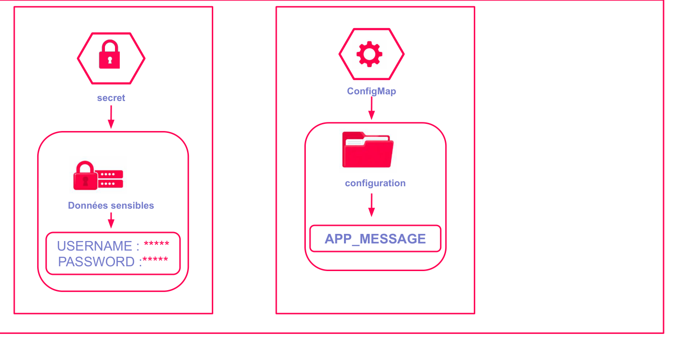

# ConfigMaps et Secrets dans OpenShift

## Introduction

Dans OpenShift, toute application déployée en production a besoin de deux catégories d'informations exogènes à son image : des **paramètres de configuration** (URL d'un service tiers, niveau de log, nombre de threads…) et des **données sensibles** (mots de passe, clés API, certificats TLS). Embarquer ces informations directement dans l'image Docker serait une erreur grave : cela empêche de réutiliser la même image dans plusieurs environnements et expose les secrets dans les registres d'images.

Kubernetes - et par extension OpenShift - résout ce problème avec deux objets distincts :

- Les **ConfigMaps** : pour toutes les données de configuration non sensibles.
- Les **Secrets** : pour les données confidentielles qui exigent un niveau de protection supplémentaire.

Ces deux ressources permettent d'**externaliser la configuration** du code applicatif et de respecter le principe [12-factor app](https://12factor.net/config), selon lequel la configuration doit être injectée via l'environnement, jamais codée en dur.


*Schéma d'injection d'un ConfigMap et d'un Secret dans un Pod via variables d'environnement et volumes montés.*

---

## Objectifs de la section

A la fin de cette section, vous serez capable de :

- Distinguer les cas d'usage d'un ConfigMap et d'un Secret.
- Creer et inspecter ces ressources via `oc` et la console web OpenShift.
- Injecter une configuration dans un Pod, soit comme variable d'environnement, soit comme fichier monté.
- Identifier les bonnes pratiques de sécurité autour des Secrets.

---

## Comparaison rapide : ConfigMap vs Secret



*Secret → données sensibles chiffrées (credentials, tokens). ConfigMap → configuration non sensible (variables d'environnement, fichiers de config)*

| Caracteristique | ConfigMap | Secret |
|---|---|---|
| Type de données | Non sensibles | Sensibles |
| Encodage au repos | Texte brut | Base64 (encodage, pas chiffrement) |
| Chiffrement etcd | Non (par défaut) | Optionnel (EncryptionConfiguration) |
| Cas d'usage typique | Parametres app, URLs, feature flags | Mots de passe, tokens, certificats TLS |
| Taille maximale | 1 MiB | 1 MiB |
| Controle d'acces RBAC | Standard | Verbes `get`/`list` limités par convention |
| Affichage console | Valeurs visibles | Valeurs masquées par défaut |

:::info[Base64 n'est pas du chiffrement]
Les données d'un Secret sont **encodées en Base64**, ce qui n'est pas une forme de chiffrement. N'importe qui ayant accès au Secret YAML peut décoder les valeurs avec `base64 -d`. La sécurité repose sur les politiques RBAC qui restreignent l'accès à la ressource Secret, et optionnellement sur le chiffrement au niveau de etcd via `EncryptionConfiguration`.
:::

---

## Les ConfigMaps

### Concept fondamental

Un **ConfigMap** est une ressource Kubernetes de type clé-valeur. Il peut contenir :

- Des paires simples `cle: valeur` (scalaires).
- Des fichiers de configuration entiers (valeurs multi-lignes : `.properties`, `.ini`, `nginx.conf`, etc.).

Le ConfigMap est découplé du Pod : on peut modifier le ConfigMap sans reconstruire l'image. Le Pod lira la nouvelle valeur soit au prochain démarrage (variable d'environnement), soit dynamiquement si la configuration est montée en volume (avec un délai de propagation de quelques secondes).

### Cas d'usage courants

- Parametres de connexion à une base de données (hors mot de passe).
- URL d'un service externe (API tierce, service de cache).
- Niveau de journalisation (`INFO`, `DEBUG`, `ERROR`).
- Feature flags pour activer/désactiver des fonctionnalités.
- Fichiers de configuration complets (`application.properties`, `config.yaml`).

### Créer un ConfigMap en YAML

```yaml
apiVersion: v1
kind: ConfigMap
metadata:
  name: app-config
  namespace: formation
data:
  # Paires clé-valeur simples
  WELCOME_MESSAGE: "Bonjour"
  APP_MODE: "production"
  LOG_LEVEL: "INFO"
  DATABASE_HOST: "postgres.formation.svc.cluster.local"
  DATABASE_PORT: "5432"
  # Fichier de configuration embarqué
  app.properties: |
    server.port=8080
    cache.ttl=300
    feature.new-ui=true
```

:::tip[Nommage des clés]
Utilisez des noms de clés explicites et cohérents avec votre convention d'équipe. Pour les variables d'environnement, préférez le format `MAJUSCULES_AVEC_TIRETS_BAS`. Pour les fichiers embarqués, utilisez le nom de fichier réel comme clé (ex. `nginx.conf`, `application.yml`).
:::

### Créer un ConfigMap via la CLI

```bash
# Depuis des valeurs littérales
oc create configmap app-config \
  --from-literal=WELCOME_MESSAGE="Bonjour" \
  --from-literal=APP_MODE="production"

# Depuis un fichier existant (la clé = nom du fichier)
oc create configmap app-config \
  --from-file=app.properties=./config/app.properties

# Depuis un répertoire entier
oc create configmap app-config --from-file=./config/

# Vérifier le contenu
oc describe configmap app-config
oc get configmap app-config -o yaml
```

### Visualiser un ConfigMap dans la console OpenShift

Depuis la console web, naviguez vers **Workloads > ConfigMaps** dans le projet souhaité. Cliquez sur le ConfigMap pour voir le détail de ses clés et valeurs, ainsi que l'onglet **YAML** pour l'édition directe.


*Vue détail d'un ConfigMap dans la console OpenShift : section Data avec les paires clé-valeur et apercu YAML.*

---

## Les Secrets

### Concept fondamental

Un **Secret** est structurellement très proche d'un ConfigMap, mais concu pour les données sensibles. OpenShift applique plusieurs protections supplémentaires :

- Les valeurs sont encodées en Base64 dans l'API et dans etcd.
- La console web masque les valeurs par défaut (un clic est nécessaire pour les afficher).
- Les Secrets de type `kubernetes.io/dockerconfigjson` ou `kubernetes.io/tls` sont traités spécifiquement par OpenShift.
- Le champ `stringData` permet de fournir les valeurs en clair lors de la création (Kubernetes les encode automatiquement).

### Types de Secrets

| Type | Usage |
|---|---|
| `Opaque` | Données generiques, usage libre |
| `kubernetes.io/tls` | Certificat TLS (tls.crt + tls.key) |
| `kubernetes.io/dockerconfigjson` | Authentification registre Docker |
| `kubernetes.io/basic-auth` | Identifiants utilisateur/mot de passe |
| `kubernetes.io/ssh-auth` | Cle privée SSH |
| `bootstrap.kubernetes.io/token` | Token de bootstrap de noeud |

### Créer un Secret en YAML

```yaml
apiVersion: v1
kind: Secret
metadata:
  name: app-secret
  namespace: formation
type: Opaque
# stringData : valeurs en clair, converties automatiquement en base64
stringData:
  DB_PASSWORD: "MonMotDePasse!2024"
  API_KEY: "sk-prod-abcdef123456"
```

Ou avec le champ `data` (valeurs déjà encodées en Base64) :

```yaml
apiVersion: v1
kind: Secret
metadata:
  name: app-secret
  namespace: formation
type: Opaque
data:
  # echo -n "MonMotDePasse!2024" | base64
  DB_PASSWORD: TW9uTW90RGVQYXNzZSEyMDI0
  # echo -n "sk-prod-abcdef123456" | base64
  API_KEY: c2stcHJvZC1hYmNkZWYxMjM0NTY=
```

### Créer un Secret via la CLI

```bash
# Secret Opaque depuis des valeurs littérales
oc create secret generic app-secret \
  --from-literal=DB_PASSWORD="MonMotDePasse!2024" \
  --from-literal=API_KEY="sk-prod-abcdef123456"

# Secret TLS depuis des fichiers de certificat
oc create secret tls mon-certificat-tls \
  --cert=./certs/tls.crt \
  --key=./certs/tls.key

# Vérifier (les valeurs apparaissent encodées)
oc get secret app-secret -o yaml

# Décoder une valeur manuellement
oc get secret app-secret -o jsonpath='{.data.DB_PASSWORD}' | base64 -d
```

:::warning[Ne jamais committer un Secret YAML en clair dans Git]
Même avec `stringData`, un fichier Secret YAML contient vos données sensibles en clair. N'utilisez jamais `git add` sur un fichier Secret. Préférez des outils comme **Sealed Secrets**, **External Secrets Operator** ou **HashiCorp Vault** pour gérer les secrets de façon sécurisée dans vos pipelines GitOps.
:::

---

## Injecter une configuration dans un Pod

Il existe deux méthodes d'injection, chacune adaptée à des besoins différents.

### Méthode 1 : Variables d'environnement

La façon la plus simple d'injecter une valeur individuelle dans un conteneur.

**Depuis un ConfigMap :**

```yaml
env:
  - name: WELCOME_MESSAGE
    valueFrom:
      configMapKeyRef:
        name: app-config
        key: WELCOME_MESSAGE
  - name: APP_MODE
    valueFrom:
      configMapKeyRef:
        name: app-config
        key: APP_MODE
```

**Toutes les clés d'un ConfigMap en une seule déclaration :**

```yaml
envFrom:
  - configMapRef:
      name: app-config
```

**Depuis un Secret :**

```yaml
env:
  - name: DB_PASSWORD
    valueFrom:
      secretKeyRef:
        name: app-secret
        key: DB_PASSWORD
```

### Méthode 2 : Volumes montés

Idéale pour injecter des fichiers de configuration complets. Chaque clé du ConfigMap ou du Secret devient un fichier dans le répertoire monté.

```yaml
apiVersion: v1
kind: Pod
metadata:
  name: mon-application
spec:
  containers:
    - name: app
      image: mon-image:latest
      volumeMounts:
        # ConfigMap monté en volume
        - name: config-volume
          mountPath: /etc/app/config
          readOnly: true
        # Secret monté en volume
        - name: secret-volume
          mountPath: /etc/app/secrets
          readOnly: true
  volumes:
    - name: config-volume
      configMap:
        name: app-config
    - name: secret-volume
      secret:
        secretName: app-secret
        # Permissions restrictives sur les fichiers de secrets
        defaultMode: 0400
```

Dans le conteneur, on aura par exemple :
- `/etc/app/config/WELCOME_MESSAGE` contenant `Bonjour`
- `/etc/app/config/app.properties` contenant le contenu du fichier
- `/etc/app/secrets/DB_PASSWORD` contenant le mot de passe en clair

### Comparaison des deux méthodes d'injection

| Critere | Variables d'environnement | Volume monté |
|---|---|---|
| Simplicité | Tres simple | Un peu plus verbeux |
| Mise à jour sans redémarrage | Non | Oui (avec délai ~1 min) |
| Adapté aux fichiers de config | Non | Oui |
| Risque de fuite dans les logs | Oui (si l'app logge son env) | Moindre |
| Granularité | Par clé individuelle ou tout le CM | Par clé ou tout le CM/Secret |
| Permissions fichiers | N/A | Configurable (mode Unix) |

:::tip[Bonne pratique : volumes pour les secrets]
Préférez le **montage en volume** pour les Secrets. Les variables d'environnement peuvent être exposées accidentellement (commande `env` dans le conteneur, logs d'initialisation, dumps de crash). Un fichier avec les permissions `0400` est plus difficile à exposer par inadvertance.
:::

---

## Mise à jour d'un ConfigMap et impact sur les Pods

```bash
# Modifier un ConfigMap existant
oc edit configmap app-config

# Ou appliquer un nouveau fichier YAML
oc apply -f app-config.yaml

# Forcer le redémarrage des pods pour prendre en compte les nouvelles variables d'env
oc rollout restart deployment/mon-application
```

:::info[Mise à jour dynamique via volumes]
Lorsqu'un ConfigMap est monté en volume, Kubernetes met à jour les fichiers dans le conteneur automatiquement après un délai (de l'ordre de 30 à 120 secondes, selon la configuration du kubelet). L'application doit être capable de relire sa configuration à chaud pour en bénéficier. Les variables d'environnement, elles, ne sont jamais mises à jour sans redémarrage du Pod.
:::

---

## Bonnes pratiques

1. **Separez toujours ConfigMaps et Secrets** : ne mélangez pas données sensibles et non sensibles dans un même objet.
2. **Utilisez des namespaces** : un Secret n'est accessible que dans son namespace, ce qui constitue une frontière d'isolation naturelle.
3. **Appliquez le principe du moindre privilege** : via RBAC, accordez le droit `get` sur les Secrets uniquement aux ServiceAccounts qui en ont besoin.
4. **Versionnez vos ConfigMaps** : en suffixant leur nom avec un hash ou une version (`app-config-v2`), vous pouvez faire des rollbacks propres.
5. **Auditez les accès** : activez l'audit Kubernetes pour tracer les lectures de Secrets en production.
6. **Evitez de stocker des secrets dans les images** : utilisez toujours l'injection via Secrets, jamais des `ENV` dans un Dockerfile.

---

## Résumé

Les **ConfigMaps** et les **Secrets** sont les deux primitives fondamentales de la gestion de configuration dans OpenShift. Ils permettent de séparer le code de la configuration, de réutiliser la même image dans plusieurs environnements, et de gérer les données sensibles de façon centralisée et auditée. La maîtrise de ces deux ressources est un prérequis pour tout déploiement professionnel sur OpenShift.
