# Exercice Guidé : Les ConfigMaps et les Secrets dans OpenShift

## Ce que vous allez apprendre

Dans cet exercice, vous allez découvrir comment **séparer la configuration de votre application du code source**. C'est une bonne pratique fondamentale dans le monde des conteneurs : plutôt que de coder en dur vos paramètres (messages, modes, mots de passe...), vous les stockez dans des objets Kubernetes dédiés. Vous apprendrez à utiliser deux objets essentiels : les **ConfigMaps** (pour la configuration classique) et les **Secrets** (pour les données sensibles), puis à les injecter dans une application.

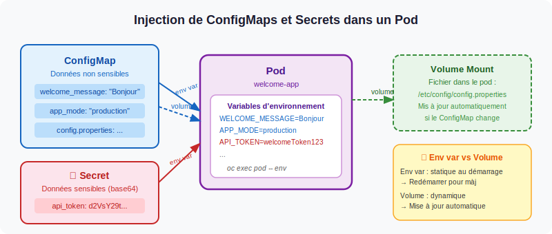

## Objectif de l'exercice

:::info Objectif
Créer un ConfigMap et un Secret puis les utiliser pour configurer une application déjà
déployée dans le cluster (nginx).
:::

À l'issue de cet exercice, vous serez capable de :

- ✅ Créer un **ConfigMap** depuis la console OpenShift
- ✅ Créer un **Secret** depuis la console OpenShift
- ✅ Injecter un ConfigMap comme **variable d'environnement** dans un Pod
- ✅ Injecter un Secret comme **variable d'environnement** dans un Pod
- ✅ Vérifier que la configuration est bien prise en compte par l'application

## Étape 1 — Créer le ConfigMap

Aller dans **Workloads → ConfigMaps**
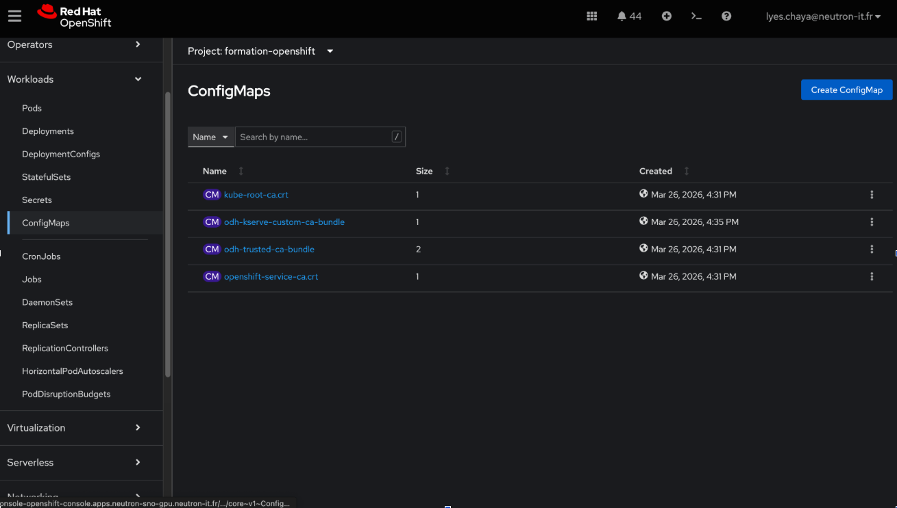
Cliquer sur **Create ConfigMap**

Remplir :

- **Name** : `nginx-config-2`
- **Key** : `APP_MESSAGE`
- **Value** : `Bienvenue dans nginx avec ConfigMap`

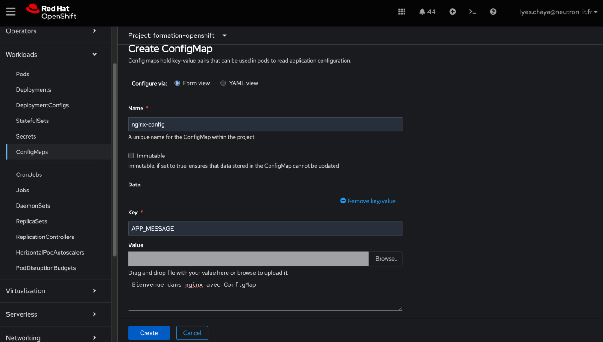

Cliquer sur **Create**

Le ConfigMap **nginx-config** apparaît maintenant dans la liste.

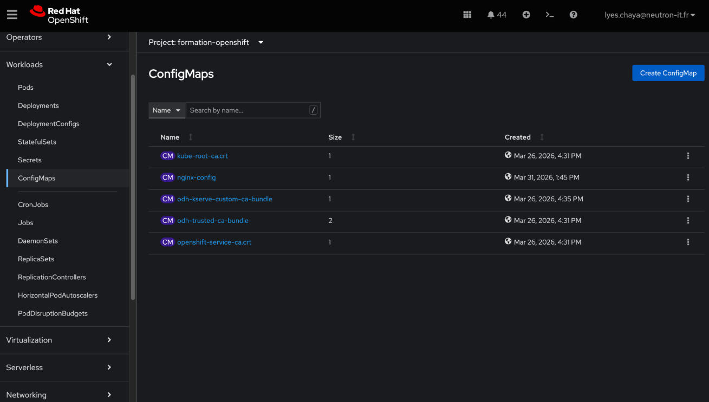

:::tip
Le ConfigMap **nginx-config** est maintenant créé avec la clé `APP_MESSAGE` et la valeur
`Bienvenue dans nginx avec ConfigMap`.
:::
## Étape 2 — Créer le Secret

Aller dans **Workloads → Secrets**

Cliquer **Create → Key/Value Secret**

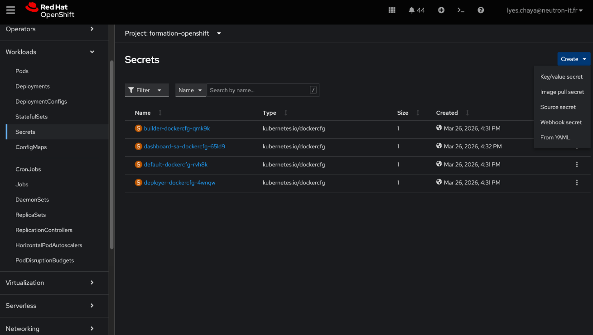

Remplir :

- **Name** : `nginx-secret-2`
- **Key** : `USERNAME` / **Value** : `admin`
- **Key** : `PASSWORD` / **Value** : `admin123`

:::info Pourquoi deux clés ?
Un Secret peut contenir plusieurs paires clé/valeur. Ici on stocke à la fois le nom
d'utilisateur et le mot de passe dans le même Secret **nginx-secret**.
:::
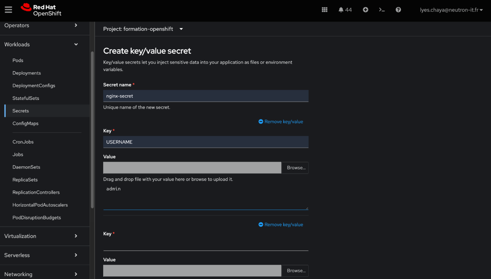

Cliquer sur **Create**

Le Secret **nginx-secret** apparaît maintenant dans la liste.

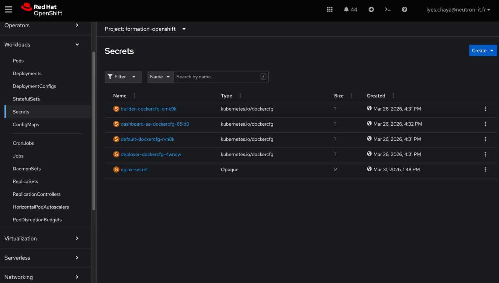

:::tip
Les valeurs du Secret sont automatiquement **encodées en base64** par OpenShift.
Elles ne sont jamais affichées en clair dans la console.
:::
## Étape 3 — Ajouter ConfigMap et Secret dans le Deployment

Aller dans **Workloads → Deployments**

- Cliquer sur **nginx-unprivileged-2**
- Cliquer sur **Actions → Edit Deployment**

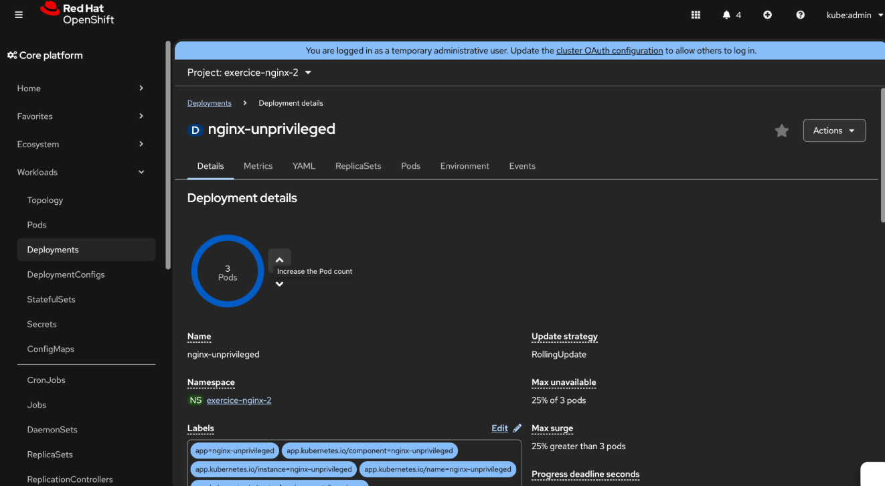

Dans la section **Environment Variables**, clique sur :

**Add from ConfigMap or Secret**

Remplir pour le ConfigMap :

- **Environment Variable Name** : `APP_MESSAGE`
- **Select Resource** : choisir `ConfigMap`
- **ConfigMap Name** : `nginx-config`
- **Key** : `APP_MESSAGE`

Cliquer encore sur **Add from ConfigMap or Secret**

Remplir pour le Secret (USERNAME) :

- **Environment Variable Name** : `USERNAME`
- **Select Resource** : choisir `Secret`
- **Secret Name** : `nginx-secret`
- **Key** : `USERNAME`

Cliquer encore sur **Add from ConfigMap or Secret**

Remplir pour le Secret (PASSWORD) :

- **Environment Variable Name** : `PASSWORD`
- **Select Resource** : choisir `Secret`
- **Secret Name** : `nginx-secret`
- **Key** : `PASSWORD`

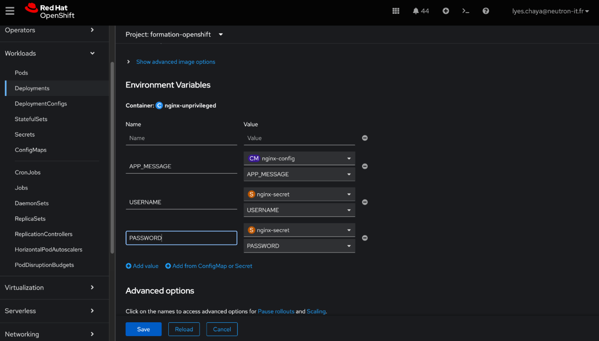

:::tip
Tu peux voir dans la section **Environment Variables** :
- `APP_MESSAGE` provenant du **ConfigMap** `nginx-config` (icône violette CM)
- `USERNAME` provenant du **Secret** `nginx-secret` (icône orange S)
- `PASSWORD` provenant du **Secret** `nginx-secret` (icône orange S)
:::

Cliquer sur **Save**
OpenShift va redémarrer automatiquement les Pods.

## Étape 4 — Vérifier les variables d'environnement

**Workloads → Pods**

- Cliquer sur un pod **nginx**
- Puis **Environment**

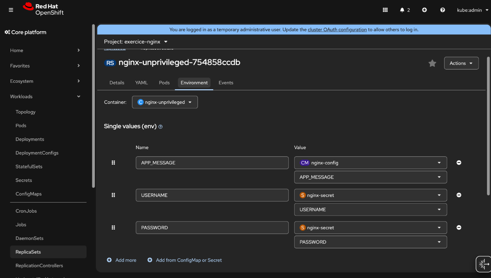

Vous pouvez voir les 3 variables d'environnement injectées :

- `APP_MESSAGE` → provenant du **ConfigMap** `nginx-config`
- `USERNAME` → provenant du **Secret** `nginx-secret`
- `PASSWORD` → provenant du **Secret** `nginx-secret`

:::info Ce que vous avez fait
Vous avez créé un ConfigMap `nginx-config` pour stocker la variable `APP_MESSAGE` et un Secret
`nginx-secret` pour les données sensibles `USERNAME` et `PASSWORD`. Ces valeurs ont ensuite été
injectées dans le Deployment comme variables d'environnement, permettant aux Pods d'y accéder
sans hardcoder les valeurs dans l'image.
:::
## Étape 5 — Vérifier depuis le Terminal du Pod

Aller dans **Workloads → Pods**, cliquer sur un pod nginx puis **Terminal**

Taper les commandes suivantes :

```bash
$ echo $APP_MESSAGE
Bienvenue dans nginx avec ConfigMap

$ echo $USERNAME
admin

$ echo $PASSWORD
admin123
```

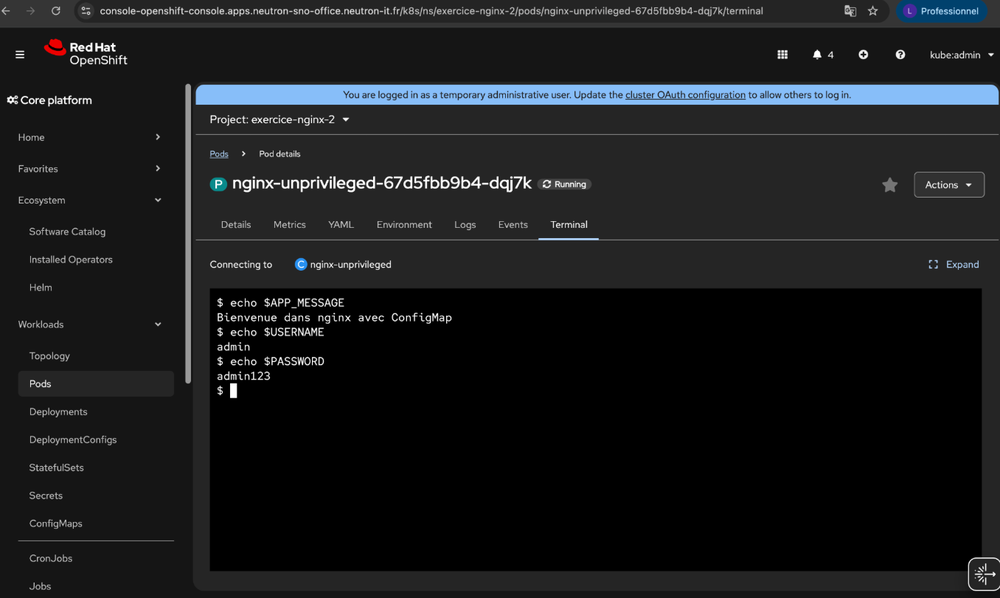

:::tip Félicitations ! 🎉
Les variables d'environnement sont bien injectées dans le Pod depuis le ConfigMap et le Secret.
:::

---

## Étape 6 — Vérifier depuis le navigateur

Pour accéder à la route, ouvre ton navigateur et tape cette URL en **http** (pas https) :
http://nginx-route-2-formation-openshift.apps.neutron-sno-gpu.neutron-it.fr/

Le Dashboard affiche toutes les variables injectées :

- **ConfigMap** `nginx-config-2` → `APP_MESSAGE` : `Bienvenue dans NGINX avec ConfigMap`
- **Secret** `nginx-secret-2` → `USERNAME` : `admin` / `PASSWORD` : `admin123`
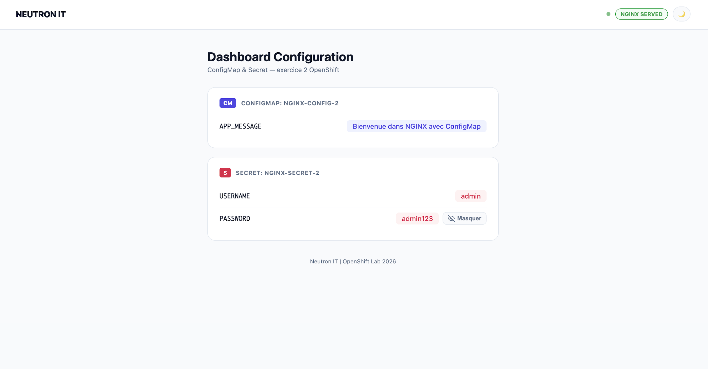
:::tip
Le Dashboard confirme que le ConfigMap et le Secret sont bien injectés dans l'application
et que les valeurs sont correctement affichées.
:::

## Étape 7 — Tester la mise à jour du ConfigMap et du Secret
### Modifier le ConfigMap

Aller dans **Workloads → ConfigMaps → nginx-config-2**

Modifier la valeur :

- **Key** : `APP_MESSAGE`
- **Value** : `Bienvenue dans NGINX`

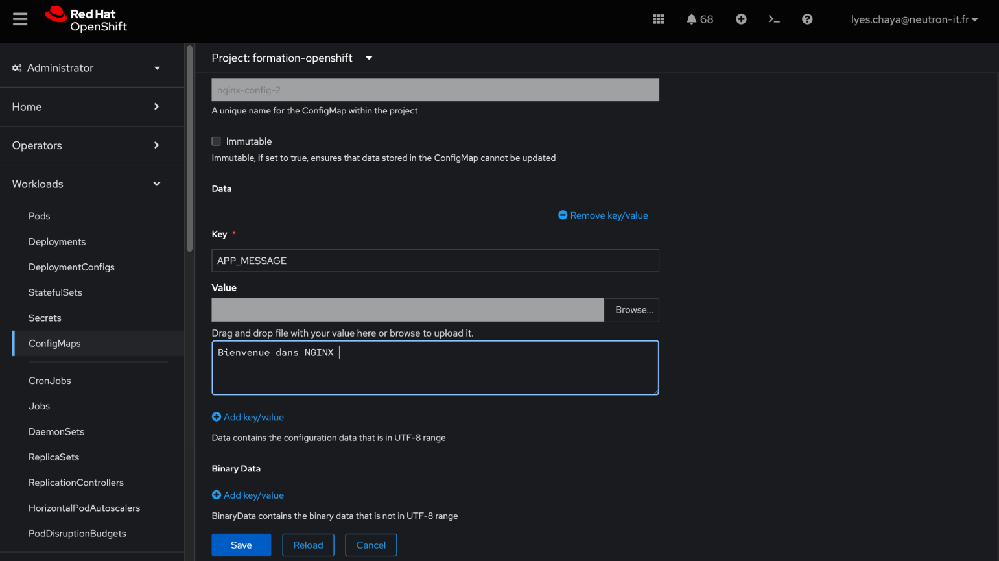

Cliquer sur **Save**
### Modifier le Secret

Aller dans **Workloads → Secrets → nginx-secret-2**

Modifier les valeurs :

- **Key** : `USERNAME` / **Value** : `admin`
- **Key** : `PASSWORD` / **Value** : `admin2026`

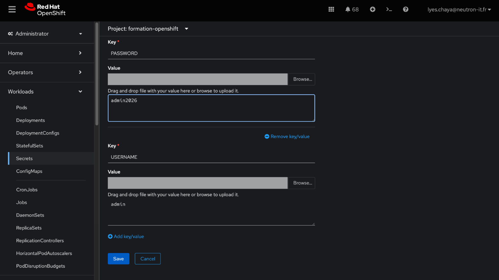

Cliquer sur **Save**
### Redémarrer le Deployment

Pour que les modifications soient prises en compte, aller dans **Workloads → Deployments → nginx-unprivileged-2**

Cliquer sur **Actions → Restart rollout**

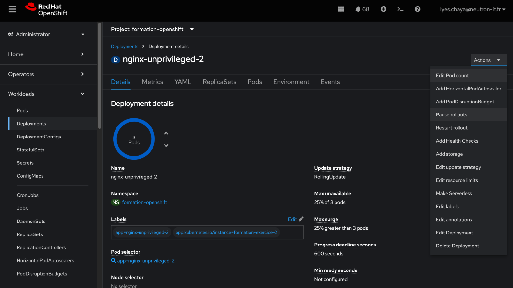

### Vérifier le résultat

Accéder à la route depuis le navigateur, le dashboard affiche maintenant les nouvelles valeurs :

- **ConfigMap** `nginx-config-2` → `APP_MESSAGE` : `Bienvenue dans NGINX`
- **Secret** `nginx-secret-2` → `USERNAME` : `admin` / `PASSWORD` : `admin2026`

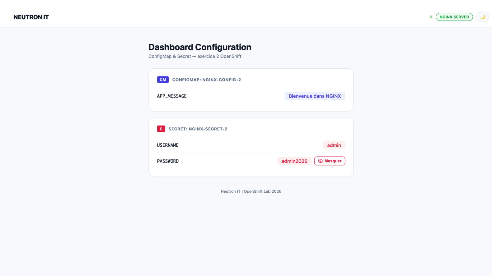

:::tip Félicitations ! 🎉
Vous avez modifié un ConfigMap et un Secret puis redémarré le Deployment pour appliquer
les changements. Les nouvelles valeurs sont bien visibles dans le dashboard.
:::
## Résumé de l'exercice

| Étape | Action | Résultat |
|-------|--------|---------|
| 1 | Créer le ConfigMap **nginx-config** | Variable `APP_MESSAGE` stockée |
| 2 | Créer le Secret **nginx-secret** | Variables `USERNAME` et `PASSWORD` stockées |
| 3 | Injecter dans le Deployment | Variables disponibles dans les Pods |
| 4 | Vérifier depuis le Terminal | Variables affichées correctement |
| 5 | Modifier le ConfigMap et le Secret | Nouvelles valeurs mises à jour |
| 6 | Redémarrer le Deployment | Pods relancés avec les nouvelles valeurs |
| 7 | Accéder à la route | Dashboard affiche la configuration mise à jour |

:::tip Ce que vous avez appris
- Créer un **ConfigMap** pour stocker des données de configuration non sensibles
- Créer un **Secret** pour stocker des données sensibles
- Injecter des variables d'environnement dans un **Deployment**
- Vérifier les variables depuis le **Terminal** du Pod
- Modifier un ConfigMap et un Secret et **redémarrer le Deployment** pour appliquer les changements
:::
