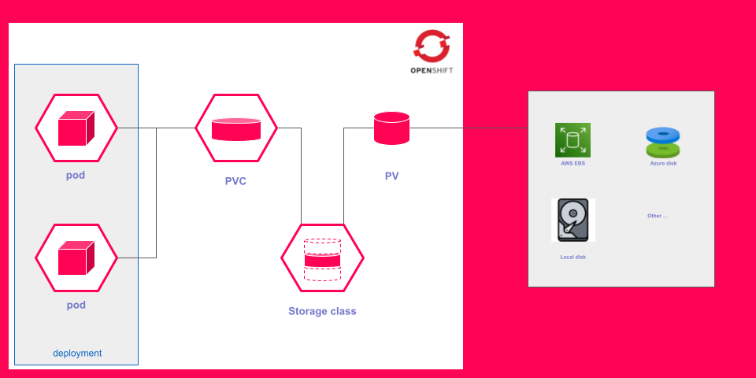

# Persistent Volumes (PV) et Persistent Volume Claims (PVC) dans OpenShift

### Introduction

Dans l'architecture des applications modernes, la gestion du stockage persistant est cruciale pour assurer la durabilité et l'intégrité des données. OpenShift, en tant que plateforme Kubernetes, propose des mécanismes robustes pour gérer le stockage, à savoir les **Persistent Volumes (PV)** et les **Persistent Volume Claims (PVC)**. Les PV représentent des ressources de stockage physique disponibles dans le cluster, tandis que les PVC sont des requêtes des utilisateurs pour consommer ce stockage. Cette section explore ces deux concepts, leurs cas d’usage, et leur configuration dans OpenShift.

### Objectifs de la Section

À la fin de cette section, vous serez capable de :

- Comprendre le rôle des Persistent Volumes et des Persistent Volume Claims dans OpenShift.
- Expliquer les différences fondamentales entre PV et PVC, ainsi que leurs cas d’utilisation respectifs.
- Créer et consommer des PV et des PVC dans des applications déployées sur OpenShift.

## Les Persistent Volumes dans OpenShift

### Concepts Fondamentaux

Les **Persistent Volumes (PV)** sont des ressources de stockage dans un cluster OpenShift qui ont été provisionnées par un administrateur ou par un mécanisme d'approvisionnement dynamique. Contrairement aux volumes éphémères, les PV sont indépendants du cycle de vie des pods. Ils sont conçus pour conserver les données même après la suppression ou le redémarrage des applications. Cela en fait un choix idéal pour les applications qui nécessitent un stockage durable, comme les bases de données ou les systèmes de fichiers partagés.

### Cas d'Usage des Persistent Volumes

- **Stockage de données critiques** : Les PV sont utilisés pour stocker des données essentielles pour les applications, telles que les fichiers de configuration, les données d’utilisateur et les sauvegardes.
- **Partage de données entre plusieurs pods** : Les PV peuvent être configurés pour permettre l’accès simultané à plusieurs pods, ce qui est essentiel pour les applications nécessitant un accès partagé aux données.
- **Indépendance du cycle de vie des applications** : Les PV permettent de dissocier le stockage des applications, facilitant ainsi les mises à jour, les migrations et la gestion des ressources.

### Types de Persistent Volumes

Il existe plusieurs types de Persistent Volumes que vous pouvez utiliser dans OpenShift, notamment :

1. **NFS (Network File System)** : Permet le partage de fichiers à travers un réseau, idéal pour les applications qui nécessitent un accès simultané à des fichiers.
2. **iSCSI (Internet Small Computer System Interface)** : Utilisé pour le stockage en bloc, offrant des performances élevées pour les bases de données et les systèmes de fichiers.
3. **Ceph** : Un système de stockage distribué qui fournit à la fois le stockage objet et le stockage en bloc, adapté aux environnements de cloud.
4. **Cloud Storage (AWS EBS, GCP Persistent Disk)** : Intégration avec des solutions de stockage dans le cloud pour une scalabilité et une durabilité accrues.

### Exemple de Création de Persistent Volume

Voici un exemple YAML pour créer un **Persistent Volume** utilisant NFS :

```yaml
apiVersion: v1
kind: PersistentVolume
metadata:
  name: nfs-pv
spec:
  capacity:
    storage: 20Gi
  accessModes:
    - ReadWriteMany
  persistentVolumeReclaimPolicy: Recycle
  nfs:
    path: /mnt/nfs
    server: nfs-server.example.com
```

Dans cet exemple, le **Persistent Volume** `nfs-pv` a une capacité de 20 GiB, est accessible en mode `ReadWriteMany` (plusieurs pods peuvent écrire) et utilise un serveur NFS pour le stockage.

### Utilisation des Persistent Volumes dans une Application

Pour utiliser un PV, vous devez le lier à un **Persistent Volume Claim (PVC)**. Voici comment déclarer un PVC qui demande ce volume :

```yaml
apiVersion: v1
kind: PersistentVolumeClaim
metadata:
  name: nfs-pvc
spec:
  accessModes:
    - ReadWriteMany
  resources:
    requests:
      storage: 20Gi
```

Ce PVC demande 20 GiB de stockage en mode `ReadWriteMany`, et sera automatiquement lié à un PV disponible qui satisfait cette demande.

## Les Persistent Volume Claims dans OpenShift

### Concepts Fondamentaux

Les **Persistent Volume Claims (PVC)** sont des requêtes de stockage que les utilisateurs créent pour consommer des volumes persistants. Ils permettent aux développeurs de spécifier leurs besoins en matière de stockage (taille, mode d’accès) sans se préoccuper des détails sous-jacents de la façon dont le stockage est provisionné.

### Cas d'Usage des Persistent Volume Claims

- **Simplification de l’accès au stockage** : Les PVC rendent le stockage plus accessible pour les développeurs, qui peuvent se concentrer sur le développement d’applications sans se soucier des aspects techniques du stockage.
- **Approvisionnement dynamique** : OpenShift peut automatiquement créer des PV pour répondre à la demande des PVC, ce qui simplifie la gestion du stockage dans des environnements dynamiques.
- **Gestion des accès** : Les PVC permettent de gérer facilement qui a accès à quel stockage, en intégrant des contrôles d’accès basés sur les rôles (RBAC).

### Exemple de Création de Persistent Volume Claim

Voici un exemple de création d’un PVC :

```yaml
apiVersion: v1
kind: PersistentVolumeClaim
metadata:
  name: app-pvc
spec:
  accessModes:
    - ReadWriteOnce
  resources:
    requests:
      storage: 10Gi
```

Dans cet exemple, le PVC `app-pvc` demande un volume de 10 GiB en mode `ReadWriteOnce`, ce qui signifie qu’un seul pod pourra écrire sur le volume à la fois.

### Utilisation des Persistent Volume Claims dans une Application

Les PVC sont généralement montés dans des pods comme suit :

```yaml
apiVersion: v1
kind: Pod
metadata:
  name: my-app
spec:
  containers:
    - name: app-container
      image: my-app-image
      volumeMounts:
        - mountPath: /data
          name: app-storage
  volumes:
    - name: app-storage
      persistentVolumeClaim:
        claimName: app-pvc
```

Dans cet exemple, le PVC `app-pvc` est monté dans le conteneur à l'emplacement `/data`, permettant à l'application d’accéder au stockage persistant.

## Gestion du Cycle de Vie des Persistent Volumes

### Recyclage des Persistent Volumes

Une fois qu’un PVC n’est plus utilisé, le PV peut être récupéré et réutilisé. La politique de recyclage détermine comment le PV est traité après sa libération :

- **Retain** : Le PV est conservé et doit être supprimé manuellement.
- **Recycle** : Le PV est nettoyé et peut être réutilisé.
- **Delete** : Le PV est supprimé automatiquement.

### Exemples de Stratégies de Recyclage

Voici un exemple d'un PV avec une stratégie de recyclage définie :

```yaml
apiVersion: v1
kind: PersistentVolume
metadata:
  name: example-pv
spec:
  capacity:
    storage: 10Gi
  accessModes:
    - ReadWriteOnce
  persistentVolumeReclaimPolicy: Recycle
  hostPath:
    path: /mnt/data
```

Dans cet exemple, le PV `example-pv` est configuré avec la politique de recyclage `Recycle`, ce qui signifie qu'il sera nettoyé et prêt à être utilisé à nouveau après que le PVC associé soit libéré.

## Comparaison entre Persistent Volumes et Persistent Volume Claims

| **Caractéristique**            | **Persistent Volume (PV)**         | **Persistent Volume Claim (PVC)**  |
|--------------------------------|------------------------------------|------------------------------------|
| **Ressource**                  | Représentation de stockage          | Demande de stockage par l'utilisateur|
| **Gestion**                    | Provisionnée par l'administrateur   | Créée par le développeur            |
| **Type d'accès**               | Définie par l'administrateur       | Spécifiée par l'utilisateur          |
| **Cycle de vie**               | Indépendant des pods               | Dépend du cycle de vie des pods     |
| **Politique de recyclage**     | Spécifiée dans le PV               | N/A                                 |




## Conclusion

Les **Persistent Volumes** et les **Persistent Volume Claims** sont des composants essentiels pour la gestion du stockage persistant dans OpenShift. Grâce à leur conception abstraite, ils permettent aux développeurs de se concentrer sur la création d'applications tout en garantissant que leurs données sont stockées de manière durable et sécurisée. En comprenant bien ces concepts et en maîtrisant leur configuration, vous pourrez optimiser la gestion des ressources de stockage dans vos déploiements OpenShift, tout en respectant les meilleures pratiques de sécurité et de performance.
