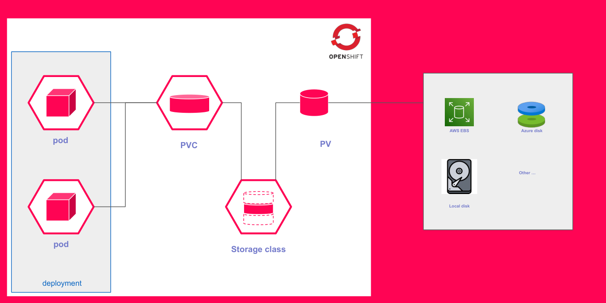

# Approvisionnement des volumes de données persistantes

## Introduction

Dans OpenShift, les conteneurs sont par nature **éphémères** : lorsqu'un Pod est supprimé ou recréé, tous les fichiers écrits dans son système de fichiers sont perdus. C'est le comportement attendu pour les applications sans état (stateless). Mais de nombreuses applications - bases de données, systèmes de fichiers partagés, caches persistants - ont besoin de conserver leurs données au-delà du cycle de vie d'un Pod.

OpenShift répond à ce besoin via deux objets complémentaires :

- Le **PersistentVolume (PV)** : une ressource de stockage réelle provisionnée dans le cluster.
- Le **PersistentVolumeClaim (PVC)** : la demande formulée par un développeur ou une application pour consommer ce stockage.

Cette abstraction en deux couches découple le **comment** (infrastructure de stockage, gérée par l'administrateur) du **quoi** (besoin applicatif, exprimé par le développeur).


*Comparaison entre un volume emptyDir (éphémère, lié au Pod) et un PVC (persistant, survit au Pod).*

---

## Objectifs de la section

A la fin de cette section, vous serez capable de :

- Expliquer le cycle de vie du stockage persistant dans OpenShift.
- Distinguer PersistentVolume, PersistentVolumeClaim et StorageClass.
- Creer un PVC et l'attacher à un Pod.
- Choisir le bon mode d'accès selon votre cas d'usage.
- Gérer le cycle de vie d'un PVC (creation, liaison, libération, suppression).

---

## Volumes éphémères vs volumes persistants

Avant d'entrer dans le détail des PV et PVC, il est important de comprendre les différents types de volumes disponibles dans Kubernetes/OpenShift.

### emptyDir : stockage temporaire intra-Pod

```yaml
volumes:
  - name: cache-volume
    emptyDir: {}
```

- Créé vide au démarrage du Pod.
- Partageable entre les conteneurs d'un même Pod.
- **Détruit avec le Pod** : aucune persistance.
- Usage typique : cache temporaire, données de travail, partage entre init-container et conteneur principal.

### hostPath : montage direct depuis le noeud

```yaml
volumes:
  - name: host-logs
    hostPath:
      path: /var/log/app
      type: DirectoryOrCreate
```

- Monte un chemin du système de fichiers du noeud dans le conteneur.
- **Lie le Pod à un noeud specifique** : à éviter en production.
- Usage typique : développement local, accès aux logs du système, DaemonSets.

:::warning[hostPath en production]
L'utilisation de `hostPath` en production est fortement déconseillée. Elle crée une dépendance au noeud physique, casse la portabilité du Pod et peut exposer des fichiers systèmes sensibles. Utilisez des PVC à la place.
:::

### PersistentVolumeClaim : stockage durable

Le PVC est la solution recommandée pour tout stockage qui doit survivre au cycle de vie du Pod. Il fait l'interface avec le système de stockage sous-jacent (NFS, Ceph, AWS EBS, etc.) de façon transparente.

---

## Architecture : PV, PVC et StorageClass

Ces trois ressources forment une chaîne d'abstraction :



*Le pod demande du stockage via un PVC, qui se lie à un PV provisionné depuis une StorageClass*

```
[ Application / Pod ]
        |
        | utilise
        v
[ PersistentVolumeClaim (PVC) ]    <-- ressource namespace
        |
        | se lie à
        v
[ PersistentVolume (PV) ]          <-- ressource cluster (globale)
        |
        | provisionné par
        v
[ StorageClass ]                   <-- définit le provisioner
        |
        | appelle
        v
[ Backend de stockage ]            <-- NFS, Ceph, AWS EBS, Azure Disk...
```

| Ressource | Portée | Gérée par | Rôle |
|---|---|---|---|
| StorageClass | Cluster | Administrateur | Definit le type de stockage et le provisioner |
| PersistentVolume | Cluster | Administrateur / Provisioner dynamique | Représente un volume physique réel |
| PersistentVolumeClaim | Namespace | Développeur / Operateur | Exprime le besoin en stockage |

---

## Les modes d'accès

Le mode d'accès déclare comment le volume peut être monté sur les noeuds du cluster.

| Mode | Abréviation | Description |
|---|---|---|
| `ReadWriteOnce` | RWO | Un seul noeud peut monter le volume en lecture/ecriture |
| `ReadOnlyMany` | ROX | Plusieurs noeuds peuvent monter le volume en lecture seule |
| `ReadWriteMany` | RWX | Plusieurs noeuds peuvent monter le volume en lecture/ecriture |
| `ReadWriteOncePod` | RWOP | Un seul Pod peut monter le volume en lecture/ecriture (K8s 1.22+) |

:::info[RWX et le type de stockage]
Tous les backends de stockage ne supportent pas tous les modes. Par exemple, les disques blocs (AWS EBS, Azure Disk) ne supportent que `RWO`. Pour `RWX`, il faut un système de fichiers réseau : NFS, CephFS, Azure Files. Vérifiez la compatibilité de votre StorageClass avant de demander RWX.
:::

---

## Les PersistentVolumes

### Provisionnement statique

Dans le provisionnement statique, l'administrateur crée manuellement les PV à l'avance. Les PVC se lient ensuite aux PV disponibles qui correspondent à leurs critères.

```yaml
apiVersion: v1
kind: PersistentVolume
metadata:
  name: nfs-pv-01
spec:
  capacity:
    storage: 20Gi
  accessModes:
    - ReadWriteMany
  persistentVolumeReclaimPolicy: Retain
  storageClassName: nfs-manual
  nfs:
    path: /mnt/nfs/data01
    server: nfs-server.example.com
```

### Provisionnement dynamique

Dans le provisionnement dynamique - la méthode recommandée - l'administrateur configure une **StorageClass**. Lorsqu'un PVC est créé, Kubernetes appelle automatiquement le provisioner de la StorageClass pour créer un PV correspondant. Le développeur n'a pas à se soucier des PV.

### Politique de reclamation (Reclaim Policy)

Lorsqu'un PVC est supprimé, la politique de réclamation du PV détermine ce qu'il advient du volume et des données :

| Politique | Comportement |
|---|---|
| `Retain` | Le PV et ses données sont conservés. L'administrateur doit manuellement nettoyer et recréer le PV pour le réutiliser. |
| `Delete` | Le PV et le stockage sous-jacent (disque cloud, volume NFS…) sont supprimés automatiquement. Politique par défaut des StorageClass dynamiques. |
| `Recycle` | Deprecated. Le contenu du volume est effacé (`rm -rf`) et le PV est remis à disposition. Non recommandé. |

:::tip[Choisir Retain en production]
En production, préférez la politique `Retain` pour les données critiques. Cela évite toute suppression accidentelle de données lors d'une suppression de PVC (opération humaine ou automatique dans un pipeline CI/CD). La contrepartie est une opération de nettoyage manuelle.
:::

---

## Les PersistentVolumeClaims

### Créer un PVC

```yaml
apiVersion: v1
kind: PersistentVolumeClaim
metadata:
  name: postgres-pvc
  namespace: formation
spec:
  accessModes:
    - ReadWriteOnce
  resources:
    requests:
      storage: 1Gi
  storageClassName: standard-csi
```

Ce PVC demande :
- 1 GiB de stockage minimum.
- Un accès `ReadWriteOnce` (un seul noeud en écriture).
- L'utilisation de la StorageClass `standard-csi`.

Le provisioner de `standard-csi` va automatiquement créer un PV et lier le PVC à celui-ci.

### Cycle de vie d'un PVC

```
  Création PVC
       |
       v
   [Pending]  <-- En attente d'un PV disponible
       |
       | PV trouvé ou créé dynamiquement
       v
   [Bound]    <-- PVC lié à un PV, prêt à l'emploi
       |
       | PVC supprimé
       v
  [Released]  <-- PV libéré (avec politique Retain)
       |
       | ou automatiquement avec politique Delete
       v
  [Deleted]   <-- PV et données supprimés
```

:::warning[Statut Pending persistant]
Si votre PVC reste en statut `Pending` plusieurs minutes, les causes les plus fréquentes sont : aucune StorageClass correspondante, capacité insuffisante, mode d'accès non supporté par le backend, ou quota de namespace dépassé. Utilisez `oc describe pvc <nom>` pour lire les events et diagnostiquer le problème.
:::

### Créer un PVC via la CLI

```bash
# Appliquer le manifeste YAML
oc apply -f postgres-pvc.yaml

# Vérifier l'état du PVC
oc get pvc
oc describe pvc postgres-pvc

# Voir le PV créé dynamiquement
oc get pv
```

### Gérer les PVCs dans la console OpenShift

Depuis la console, naviguez vers **Storage > PersistentVolumeClaims** dans votre projet. La vue liste affiche l'état de chaque PVC, la capacité allouée, le volume lié et la StorageClass utilisée.


*Vue liste des PersistentVolumeClaims dans la console OpenShift. Le PVC `postgres-pvc` est en statut Bound (vert), `app-data-pvc` est en statut Pending (orange) en attente de provisionnement.*

---

## Attacher un PVC à un Pod

### Déclaration dans un Deployment

```yaml
apiVersion: apps/v1
kind: Deployment
metadata:
  name: postgres
  namespace: formation
spec:
  replicas: 1
  selector:
    matchLabels:
      app: postgres
  template:
    metadata:
      labels:
        app: postgres
    spec:
      containers:
        - name: postgres
          image: postgres:15
          env:
            - name: POSTGRES_PASSWORD
              valueFrom:
                secretKeyRef:
                  name: postgres-secret
                  key: POSTGRES_PASSWORD
            - name: PGDATA
              value: /var/lib/postgresql/data/pgdata
          volumeMounts:
            - name: postgres-storage
              mountPath: /var/lib/postgresql/data
      volumes:
        - name: postgres-storage
          persistentVolumeClaim:
            claimName: postgres-pvc
```

:::info[RWO et les replicas]
Avec un mode d'accès `ReadWriteOnce`, le volume ne peut être monté que sur un seul noeud. Si vous définissez `replicas: 2` avec un PVC RWO, les deux Pods seront schedulés sur le même noeud (possible) ou le deuxième restera en `Pending` s'il est schedulé sur un noeud différent. Pour les bases de données, maintenez `replicas: 1` avec RWO, ou utilisez des solutions de clustering dédiées (Patroni, Galera) avec RWX.
:::

### Utilisation avec un StatefulSet

Pour les applications avec état nécessitant plusieurs réplicas, le **StatefulSet** est préférable au Deployment. Il crée un PVC dédié par réplica via `volumeClaimTemplates` :

```yaml
apiVersion: apps/v1
kind: StatefulSet
metadata:
  name: app-stateful
  namespace: formation
spec:
  replicas: 3
  serviceName: "app-headless"
  selector:
    matchLabels:
      app: app-stateful
  template:
    metadata:
      labels:
        app: app-stateful
    spec:
      containers:
        - name: app
          image: mon-app:latest
          volumeMounts:
            - name: data
              mountPath: /data
  volumeClaimTemplates:
    - metadata:
        name: data
      spec:
        accessModes: ["ReadWriteOnce"]
        storageClassName: standard-csi
        resources:
          requests:
            storage: 5Gi
```

Cela crée automatiquement `data-app-stateful-0`, `data-app-stateful-1`, `data-app-stateful-2` - un PVC par réplica.

---

## Redimensionner un PVC

Si la StorageClass supporte `allowVolumeExpansion: true`, il est possible d'agrandir un PVC sans le supprimer :

```bash
# Editer la demande de capacité
oc patch pvc postgres-pvc -p '{"spec":{"resources":{"requests":{"storage":"5Gi"}}}}'

# Surveiller l'expansion
oc describe pvc postgres-pvc
```

:::warning[Expansion irréversible]
L'expansion d'un PVC est une opération **irréversible** : il n'est pas possible de réduire la taille d'un PVC. Planifiez soigneusement la taille initiale et agrandissez uniquement lorsque nécessaire.
:::

---

## Résumé

| Concept | Description courte |
|---|---|
| emptyDir | Volume temporaire, détruit avec le Pod |
| hostPath | Montage depuis le noeud, à éviter en production |
| PersistentVolume (PV) | Stockage réel dans le cluster, géré par l'admin ou le provisioner |
| PersistentVolumeClaim (PVC) | Demande de stockage par le développeur |
| StorageClass | Definit le provisioner et les paramètres de stockage |
| RWO | ReadWriteOnce : un seul noeud en R/W |
| RWX | ReadWriteMany : plusieurs noeuds en R/W |
| Retain | Politique de réclamation : données conservées après suppression PVC |
| Delete | Politique de réclamation : données supprimées avec le PVC |

Les PersistentVolumes et PersistentVolumeClaims sont la brique fondamentale pour exécuter des applications avec état (bases de données, systèmes de fichiers partagés) de façon fiable sur OpenShift. Comprendre leur cycle de vie et les modes d'accès vous permettra d'éviter les erreurs classiques (perte de données, Pods bloqués en Pending) et de dimensionner correctement votre stockage.
