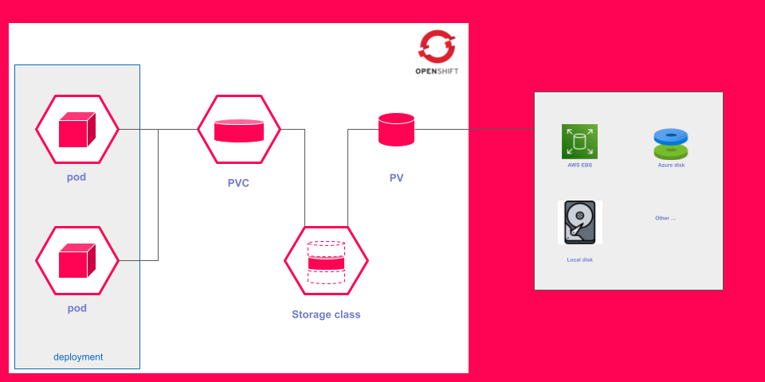

# Exercice Guidé : Persistent Volumes (PV), PVC et Storage Class

## Objectifs

A la fin de cet exercice, vous serez capable de :

- [ ] Comprendre la différence entre le stockage **éphémère** (`emptyDir`) et le stockage **persistant** (PVC)
- [ ] Observer concrètement la **perte de données** causée par un volume `emptyDir`
- [ ] Créer un **PersistentVolumeClaim** (PVC) via le formulaire de la console
- [ ] Modifier un déploiement pour **remplacer** un volume éphémère par un PVC
- [ ] Vérifier que les données **survivent** à la suppression d'un pod
- [ ] Inspecter les **Storage Classes** disponibles dans le cluster

---

## Ce que vous allez apprendre

Dans cet exercice, vous allez travailler avec une application **Todo App** connectée à une base de données **PostgreSQL**. Au départ, PostgreSQL utilise un volume éphémère (`emptyDir`) : cela signifie que les données sont **perdues** à chaque fois que le pod est supprimé ou redémarré. Vous allez constater ce problème par vous-même, puis le résoudre en passant à un stockage persistant grâce à un **PVC** (PersistentVolumeClaim). Enfin, vous vérifierez que vos données survivent désormais aux redémarrages.

Le schéma ci-dessous illustre la différence fondamentale entre ces deux approches :


:::info Pourquoi cet exercice est important
En production, une base de données qui perd ses données au moindre redémarrage serait catastrophique. Comprendre le stockage persistant est **indispensable** pour tout opérateur d'applications sur OpenShift ou Kubernetes.
:::

---

## Prérequis

Une application **Todo App** connectée à PostgreSQL est **déjà déployée** dans votre namespace. L'application utilise actuellement un stockage éphémère (`emptyDir`).

:::note Ce qui est déjà en place
- Un **Deployment** `todo-app` : l'interface web de la liste de tâches
- Un **Deployment** `postgres` : la base de données PostgreSQL
- Un **Service** et une **Route** pour accéder à l'application
- Un **Secret** `postgres-credentials` contenant les identifiants de la base de données
- Le volume de PostgreSQL est configuré en `emptyDir` (stockage éphémère)
:::

### Vérifier les déploiements

Dans la console OpenShift, naviguez vers **Workloads** → **Deployments**.

Vérifiez que `todo-app` et `postgres` sont bien présents et que leur colonne **Ready** affiche `1/1`.

### Récupérer l'URL de l'application

Naviguez vers **Networking** → **Routes**, puis cliquez sur le lien dans la colonne **Location** de la route `todo-route`.

Vous devriez voir l'interface de la Todo App dans votre navigateur.

:::tip Premier test
Ajoutez **2 ou 3 tâches** dans l'interface (par exemple : "Acheter du pain", "Lire la documentation OpenShift"). Vous en aurez besoin pour l'étape suivante.
:::

---

## Étape 1 : Observer la perte de données avec le stockage éphémère

### Pourquoi cette étape ?

Avant de résoudre un problème, il faut le **voir** de ses propres yeux. Vous allez constater ce qui se passe quand une base de données utilise un volume `emptyDir` et que son pod est supprimé.

### 1.1 - Vérifier le type de volume actuel

Dans la console, naviguez vers **Workloads** → **Deployments** → cliquez sur **postgres** → onglet **YAML**.

Cherchez la section `volumes` dans le spec du pod template. Vous devriez voir :

```yaml
volumes:
  - name: postgres-storage
    emptyDir: {}
```

:::info Que signifie emptyDir ?
Un volume `emptyDir` est un répertoire **vide** créé en même temps que le pod. Il existe uniquement **tant que le pod existe**. Dès que le pod est supprimé, le répertoire et tout son contenu sont **définitivement supprimés**.
:::

### 1.2 - Ajouter des tâches dans l'application

Si ce n'est pas déjà fait, ouvrez la Todo App dans votre navigateur et ajoutez quelques tâches. Vous devriez voir quelque chose comme ceci :


### 1.3 - Supprimer le pod PostgreSQL

Naviguez vers **Workloads** → **Pods**. Repérez le pod dont le nom commence par `postgres-`. Cliquez sur les **trois points** (⋮) à droite de ce pod, puis sélectionnez **Delete Pod**.

Dans la fenêtre de confirmation, cliquez sur **Delete**.

:::warning Que se passe-t-il en arrière-plan ?
Quand vous supprimez un pod géré par un Deployment, Kubernetes en **recrée automatiquement un nouveau**. Mais le nouveau pod démarre avec un volume `emptyDir` **vide** — toutes les données de l'ancien pod sont perdues.
:::

Attendez que le nouveau pod postgres repasse à l'état **Running** (colonne **Status** dans la liste des pods).

### 1.4 - Constater la perte de données

Retournez dans votre navigateur et **rafraîchissez la page** de la Todo App.


**Les tâches ont disparu.** La base de données est vide car le nouveau pod a démarré avec un volume `emptyDir` vierge.

:::warning Leçon importante
Avec `emptyDir`, les données sont **éphémères**. Ce type de volume ne doit **jamais** être utilisé pour des données que vous souhaitez conserver (bases de données, fichiers utilisateurs, etc.).
:::

### Vérification de l'étape 1

Avant de passer à la suite, assurez-vous que :

- [x] Vous avez vérifié que le déploiement PostgreSQL utilise bien `emptyDir` dans l'onglet YAML
- [x] Vous avez ajouté des tâches dans la Todo App
- [x] Vous avez supprimé le pod PostgreSQL via la console
- [x] Vous avez constaté que les tâches ont **disparu** après le redémarrage

---

## Étape 2 : Créer un PersistentVolumeClaim (PVC)

### Pourquoi cette étape ?

Pour que les données survivent à la suppression d'un pod, nous avons besoin d'un **stockage indépendant du pod**. C'est exactement ce que fournit un **PersistentVolumeClaim** (PVC) : une demande de stockage persistant qui sera satisfaite par le cluster.



:::info Comment fonctionne le PVC ?
1. Vous créez un **PVC** : c'est une **demande** de stockage (par exemple : "je veux 1 Go en lecture-écriture")
2. Le cluster trouve ou crée un **PV** (Persistent Volume) qui correspond à cette demande
3. Le PVC est **lié** (Bound) au PV
4. Vous montez le PVC dans votre pod — le stockage persiste même si le pod est supprimé
:::

### 2.1 - Créer le PVC via le formulaire

Dans la console, naviguez vers **Storage** → **PersistentVolumeClaims** → cliquez sur **Create PersistentVolumeClaim**.

Remplissez le formulaire avec les valeurs suivantes :

| Champ | Valeur |
|---|---|
| **StorageClass** | *(laisser la valeur par défaut)* |
| **PersistentVolumeClaim name** | `postgres-pvc` |
| **Access mode** | `Single user (RWO)` |
| **Size** | `1 GiB` |
| **Volume mode** | `Filesystem` |

Cliquez sur **Create**.

:::tip Explication des champs
- **Single user (RWO — ReadWriteOnce)** : le volume peut être monté en lecture-écriture par **un seul noeud** à la fois. C'est le mode standard pour les bases de données.
- **1 GiB** : pour notre exercice, 1 Go est largement suffisant.
- **StorageClass par défaut** : le cluster choisit automatiquement comment provisionner le stockage physique.
:::


## Étape 3 : Modifier le déploiement PostgreSQL pour utiliser le PVC

### Pourquoi cette étape ?

Le PVC existe maintenant, mais PostgreSQL ne l'utilise pas encore. Nous devons modifier le déploiement pour **remplacer** le volume `emptyDir` par notre PVC.

### 3.1 - Modifier le YAML du déploiement

Dans la console, naviguez vers **Workloads** → **Deployments** → cliquez sur **postgres** → onglet **YAML**.

Repérez la section `volumes` dans le pod template spec :

```yaml
volumes:
  - name: postgres-storage
    emptyDir: {}
```

Remplacez-la par :

```yaml
volumes:
  - name: postgres-storage
    persistentVolumeClaim:
      claimName: postgres-pvc
```

Cliquez sur **Save**.

:::info Qu'est-ce qui change ?
On remplace uniquement la définition du volume. La clé `emptyDir: {}` disparaît, remplacée par `persistentVolumeClaim` avec la référence vers notre PVC `postgres-pvc`. Tout le reste du déploiement reste **identique**.
:::

### 3.2 - Suivre le rollout

Après la sauvegarde, OpenShift déclenche automatiquement un nouveau déploiement. Dans la console, restez sur la page du déploiement `postgres` et observez l'onglet **Details** : un nouveau pod est en cours de création.

Attendez que la colonne **Ready** repasse à `1/1`.

### 3.3 - Confirmer la configuration

Cliquez à nouveau sur l'onglet **YAML** du déploiement `postgres` et vérifiez que la section volumes contient bien :

```yaml
volumes:
  - name: postgres-storage
    persistentVolumeClaim:
      claimName: postgres-pvc
```

:::tip Confirmé !
Le volume `emptyDir` a bien été remplacé par un `persistentVolumeClaim`. PostgreSQL utilise maintenant un stockage persistant.
:::

### Vérification de l'étape 3

Avant de passer à la suite, assurez-vous que :

- [x] Vous avez modifié la section `volumes` dans l'onglet YAML du déploiement
- [x] Le déploiement a bien redémarré (`Ready: 1/1`)
- [x] Le YAML confirme l'utilisation du PVC `postgres-pvc`

---

## Étape 4 : Tester la persistance des données

### Pourquoi cette étape ?

C'est le moment de vérité. Nous allons reproduire exactement le même scénario que l'étape 1 (ajouter des tâches, supprimer le pod) et vérifier que cette fois-ci, **les données sont conservées**.

### 4.1 - Ajouter de nouvelles tâches

Ouvrez la Todo App dans votre navigateur et ajoutez de nouvelles tâches (par exemple : "Apprendre les PVC", "Maîtriser OpenShift").


### 4.2 - Supprimer le pod PostgreSQL

Comme à l'étape 1, naviguez vers **Workloads** → **Pods**, repérez le pod `postgres-`, cliquez sur les **trois points** (⋮) → **Delete Pod** → **Delete**.

Attendez que le nouveau pod repasse à l'état **Running**.

### 4.3 - Vérifier que les données sont toujours là

Retournez dans votre navigateur et **rafraîchissez la page**.

**Les tâches sont toujours présentes !**

:::tip Succès !
Contrairement à l'étape 1, les données ont survécu à la suppression du pod. Le PVC a conservé les données de PostgreSQL de manière **indépendante** du cycle de vie du pod.
:::

### Vérification de l'étape 4

Avant de passer à la suite, assurez-vous que :

- [x] Vous avez ajouté des tâches dans la Todo App
- [x] Vous avez supprimé le pod PostgreSQL via la console
- [x] Après le redémarrage, les tâches sont **toujours présentes**

---

## Étape 5 : Inspecter le PVC et la Storage Class

### Pourquoi cette étape ?

Maintenant que le PVC fonctionne, prenons un moment pour comprendre **comment** le cluster a satisfait notre demande de stockage.

### 5.1 - Détails du PVC

Naviguez vers **Storage** → **PersistentVolumeClaims** → cliquez sur **postgres-pvc**.

Vous pouvez lire les informations clés sur la page de détail :

:::info Lecture des détails
- **Status: Bound** — Le PVC est lié à un PV, tout va bien
- **Capacity: 1 GiB** — Le stockage alloué correspond à notre demande
- **Access Modes: RWO** — ReadWriteOnce, comme demandé
- **StorageClass** — La classe de stockage utilisée (celle par défaut du cluster)
- **Volume** — L'identifiant du PV créé automatiquement
:::


## Étape 6 : Nettoyage

### Pourquoi cette étape ?

Il est important de nettoyer les ressources créées pendant l'exercice pour ne pas laisser de stockage inutilisé dans le cluster.

### 6.1 - Remettre le déploiement en emptyDir

Naviguez vers **Workloads** → **Deployments** → **postgres** → onglet **YAML**.

Remplacez la section volumes :

```yaml
volumes:
  - name: postgres-storage
    persistentVolumeClaim:
      claimName: postgres-pvc
```

Par :

```yaml
volumes:
  - name: postgres-storage
    emptyDir: {}
```

Cliquez sur **Save**.

### 6.2 - Supprimer le PVC

Naviguez vers **Storage** → **PersistentVolumeClaims**. Cliquez sur les **trois points** (⋮) à droite de `postgres-pvc` → **Delete PersistentVolumeClaim** → **Delete**.

:::warning Suppression du PVC
Quand vous supprimez un PVC dont la politique de récupération (Reclaim Policy) est `Delete`, le PV associé et les données qu'il contient sont **supprimés définitivement**. En production, assurez-vous toujours d'avoir une sauvegarde avant de supprimer un PVC.
:::

Vérifiez que la liste des PVC est vide (ou ne contient plus `postgres-pvc`).

---

## Récapitulatif

Voici un tableau résumant les différences que vous avez observées :

| Critère | `emptyDir` (éphémère) | PVC (persistant) |
|---|---|---|
| **Durée de vie** | Liée au pod | Indépendante du pod |
| **Données après suppression du pod** | Perdues | Conservées |
| **Cas d'usage** | Cache, fichiers temporaires | Bases de données, fichiers utilisateurs |
| **Création** | Automatique avec le pod | Via la console ou YAML |
| **Taille** | Limitée par le noeud | Définie dans le PVC |
| **Résultat dans l'exercice** | Tâches disparues | Tâches conservées |

:::tip A retenir
- **`emptyDir`** = stockage temporaire, détruit avec le pod
- **PVC** = demande de stockage persistant, survit à la suppression du pod
- **PV** = le stockage réel fourni par le cluster
- **Storage Class** = le "type" de stockage disponible, permet l'approvisionnement dynamique
- En production, toute application **stateful** (base de données, file d'attente, etc.) doit utiliser un **PVC**
:::

## Conclusion

Vous avez réalisé les étapes suivantes :

1. **Constaté le problème** : avec `emptyDir`, les données PostgreSQL sont perdues à chaque redémarrage de pod
2. **Créé un PVC** : via le formulaire **Storage** → **PersistentVolumeClaims** → **Create**
3. **Modifié le déploiement** : remplacement du volume `emptyDir` par le PVC dans l'onglet YAML
4. **Vérifié la solution** : les données survivent maintenant à la suppression du pod
5. **Exploré l'infrastructure** : consultation du PVC, des Storage Classes et du PV dans la console

Vous maîtrisez maintenant les bases du stockage persistant dans OpenShift. Cette compétence est essentielle pour déployer des applications de production qui nécessitent la durabilité des données.
