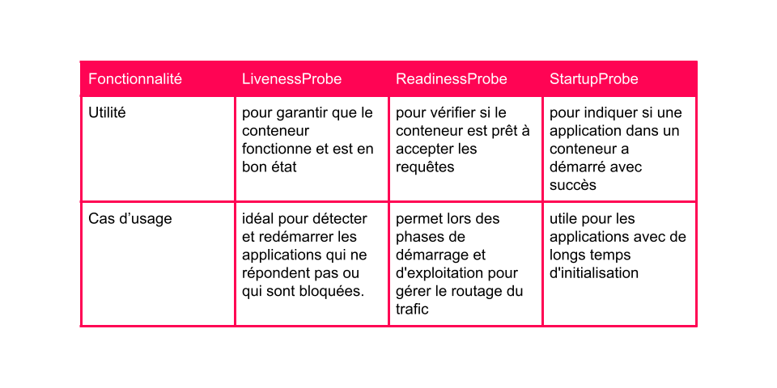

# Sondes d’intégrité des applications dans OpenShift

## Introduction

Dans l'environnement dynamique des conteneurs, la disponibilité et la performance des applications sont primordiales. Les sondes d'intégrité (ou *probes*) dans OpenShift jouent un rôle crucial dans la gestion de cette disponibilité. Elles permettent à Kubernetes d'évaluer l'état de santé d'une application, d'automatiser les redémarrages en cas de défaillance et d'assurer que le trafic est dirigé uniquement vers des pods en bon état de fonctionnement. Cet article se penche sur le fonctionnement des sondes d'intégrité, leur importance dans le cycle de vie des applications et comment les configurer efficacement.

## Rôle des Sondes d’intégrité

Les sondes d'intégrité sont des mécanismes permettant à Kubernetes de vérifier l'état d'un pod à intervalles réguliers. Elles sont essentielles pour plusieurs raisons :

### 1. Détéction rapide des défaillances

Lorsque des pods échouent, les sondes d'intégrité permettent à Kubernetes de détecter rapidement la défaillance et d'agir en conséquence, par exemple en redémarrant automatiquement le pod. Cela réduit le temps d'indisponibilité et garantit que les utilisateurs peuvent continuer à interagir avec l'application sans interruption prolongée.

### 2. Basculement et équilibrage de charge

Les sondes aident également à diriger le trafic uniquement vers les pods qui fonctionnent correctement. Si un pod échoue à répondre à une sonde d'intégrité, Kubernetes le retire automatiquement de la rotation de service, empêchant ainsi les requêtes de lui être envoyées. Cela assure une meilleure répartition de la charge entre les pods sains, optimisant ainsi la performance de l'application.

### 3. Surveillance des performances

Les sondes d'intégrité jouent un rôle clé dans la surveillance des performances des applications. Elles permettent de détecter les problèmes potentiels avant qu'ils n'affectent les utilisateurs. En surveillant les conditions d'échec des pods, les administrateurs peuvent réagir rapidement aux problèmes et prévenir les interruptions de service.

### 4. Mise à l’échelle efficace

Lorsqu'il s'agit de mise à l'échelle des applications, les sondes d'intégrité aident Kubernetes à déterminer quand un nouveau réplica est prêt à recevoir des demandes. Cela permet une mise à l'échelle automatique des ressources, garantissant que l'application dispose toujours de la capacité nécessaire pour traiter le trafic entrant.

## Types de Sondes

Kubernetes propose trois types principaux de sondes d'intégrité : les sondes Liveness, Readiness et Startup. Chaque type remplit un rôle distinct dans la gestion de l'état des applications.

Voici les paragraphes réécrits avec plus de détails :

### 1. Sondes Liveness

Les sondes Liveness sont des mécanismes cruciaux pour surveiller la santé des conteneurs dans un environnement Kubernetes. Elles permettent de déterminer si un conteneur fonctionne toujours comme prévu en effectuant des vérifications régulières tout au long de la durée de vie de l'application. Si, après un certain nombre de tentatives échouées, une sonde Liveness ne reçoit pas de réponse positive, Kubernetes prend l'initiative de redémarrer automatiquement le pod concerné. Cela est particulièrement bénéfique pour les applications qui peuvent rencontrer des problèmes, tels que des états bloqués ou non réactifs, souvent dus à des exceptions non gérées ou à des fuites de mémoire. En redémarrant le pod, Kubernetes rétablit rapidement le service, minimisant ainsi les interruptions et garantissant une disponibilité continue sans nécessiter d'intervention humaine. Ce mécanisme d'auto-réparation contribue à maintenir un niveau élevé de fiabilité et de résilience des applications déployées.

### 2. Sondes Readiness

Les sondes Readiness jouent un rôle essentiel dans la gestion de la disponibilité des applications en vérifiant si un pod est prêt à recevoir du trafic utilisateur. Lorsque la sonde Readiness échoue, Kubernetes retire temporairement le pod du service, empêchant ainsi le routage du trafic vers une application qui n'est pas prête à gérer les demandes entrantes. Ce mécanisme est particulièrement important pour les applications qui peuvent nécessiter un certain temps de préparation avant d'être opérationnelles, comme lors de l'établissement de connexions initiales avec des bases de données, de l'exécution de tâches de démarrage longues ou de la finalisation de configurations nécessaires. En retirant le pod du service pendant cette période de préparation, Kubernetes contribue à éviter les erreurs et les expériences utilisateur négatives. Une fois que la sonde Readiness renvoie une réponse positive, le pod est réintégré au service, garantissant ainsi une transition fluide pour les utilisateurs finaux et un service fiable.

### 3. Sondes Startup

Les sondes Startup sont spécifiquement conçues pour gérer les applications dont le processus de démarrage est long ou complexe. Contrairement aux sondes Liveness et Readiness, qui sont appelées à intervalles réguliers tout au long de la vie d'un pod, les sondes Startup ne sont invoquées qu'une seule fois, lors du démarrage initial de l'application. Si la sonde échoue après un temps prédéfini, Kubernetes redémarre le pod. Ce mécanisme permet de garantir que les sondes Liveness restent réactives et ne soient pas submergées par des vérifications incessantes pendant la phase de démarrage, ce qui pourrait fausser les résultats. En intégrant des sondes Startup, les développeurs peuvent mieux gérer les applications qui nécessitent un temps de préparation prolongé, comme celles qui effectuent des initialisations complexes ou qui chargent des données critiques avant de commencer à traiter les requêtes. Cela permet non seulement d'améliorer la stabilité des applications, mais aussi d'optimiser l'expérience utilisateur en s'assurant que les services ne sont disponibles qu'une fois pleinement opérationnels.



## Types de Test

Lors de la configuration des sondes d'intégrité, il est crucial de choisir le type de test approprié. Kubernetes propose plusieurs méthodes pour évaluer l'état des conteneurs :

### 1. HTTP GET

Ce type de sonde envoie une requête HTTP à un point de terminaison spécifié de l'application. La sonde réussit si le serveur renvoie un code de réponse HTTP compris entre 200 et 399. Ce type de test est idéal pour les applications web, car il permet de vérifier la réponse de l'application à des requêtes réelles.

### 2. Commande de conteneur

Pour ce type de sonde, Kubernetes exécute une commande spécifiée à l'intérieur du conteneur. Si la commande renvoie un code d'état 0, le test est considéré comme réussi. Ce type de test peut être utilisé pour vérifier l'état interne d'une application, en exécutant des scripts de diagnostic ou d'autres commandes.

### 3. Socket TCP

Ce type de test vérifie si une connexion TCP peut être établie avec le conteneur. Le test réussit uniquement si la connexion est réussie, ce qui est utile pour s'assurer que l'application écoute sur le bon port.

## Horaires et Seuils

La configuration des sondes d'intégrité nécessite une attention particulière aux paramètres de minutage et de seuils. Deux variables clés à prendre en compte sont :

- **periodSeconds** : Ce paramètre détermine la fréquence à laquelle la sonde est exécutée. Un intervalle trop court peut conduire à une surcharge inutile des ressources, tandis qu'un intervalle trop long pourrait retarder la détection des problèmes.

- **failureThreshold** : Ce paramètre définit le nombre d'échecs consécutifs nécessaires avant que la sonde soit considérée comme échouée. Par exemple, une sonde avec une valeur de `failureThreshold` de 3 et `periodSeconds` de 5 peut permettre jusqu'à 15 secondes avant de déclencher une action corrective. Cette configuration offre un équilibre entre la réactivité et la tolérance aux pannes temporaires.

## Configuration des Sondes

Les sondes d'intégrité peuvent être configurées directement dans les fichiers YAML des ressources Kubernetes, telles que les déploiements. Voici un exemple de configuration d'une sonde Liveness dans un déploiement :

```yaml
apiVersion: apps/v1
kind: Deployment
metadata:
  name: web-server
spec:
  template:
    spec:
      containers:
      - name: web-server
        livenessProbe:
          httpGet:
            path: /health
            port: 3000
          initialDelaySeconds: 15
          periodSeconds: 10
          failureThreshold: 3
```

Dans cet exemple, la sonde Liveness est configurée pour effectuer une requête HTTP sur le chemin `/health` du serveur web. La sonde attendra 15 secondes après le démarrage avant de commencer les vérifications, puis s'exécutera toutes les 10 secondes, en permettant jusqu'à trois échecs consécutifs avant de redémarrer le pod.

### Commande en Ligne de Commande

Les sondes peuvent également être ajoutées ou modifiées via la ligne de commande en utilisant la commande `oc set probe`. Par exemple, pour ajouter une sonde Readiness à un déploiement :

```bash
oc set probe deployment/front-end --readiness --failure-threshold 6 --period-seconds 10 --get-url http://:8080/healthz
```

Cette commande configure une sonde Readiness qui teste la santé de l'application à l'URL spécifiée, avec un seuil d'échec et une fréquence définis.

## Conclusion

Les sondes d'intégrité dans OpenShift sont un élément fondamental pour maintenir la disponibilité et la performance des applications. En intégrant ces sondes dans vos déploiements, vous pouvez non seulement améliorer la résilience de vos applications, mais aussi garantir une expérience utilisateur fluide et sans interruption. Une bonne configuration des sondes d'intégrité est essentielle pour assurer la réactivité du système et la détection précoce des problèmes, permettant ainsi aux équipes de développement et d'exploitation de réagir rapidement et de maintenir la qualité du service.
