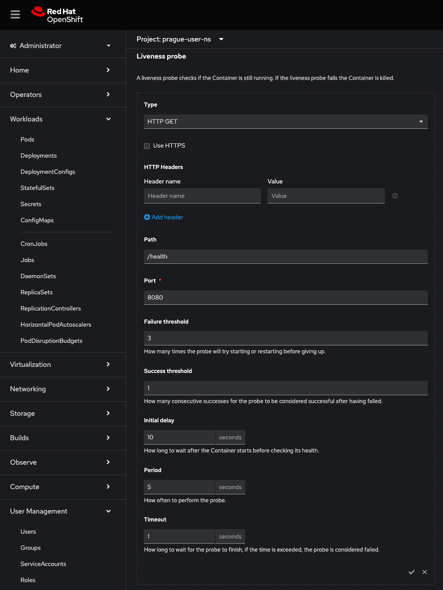
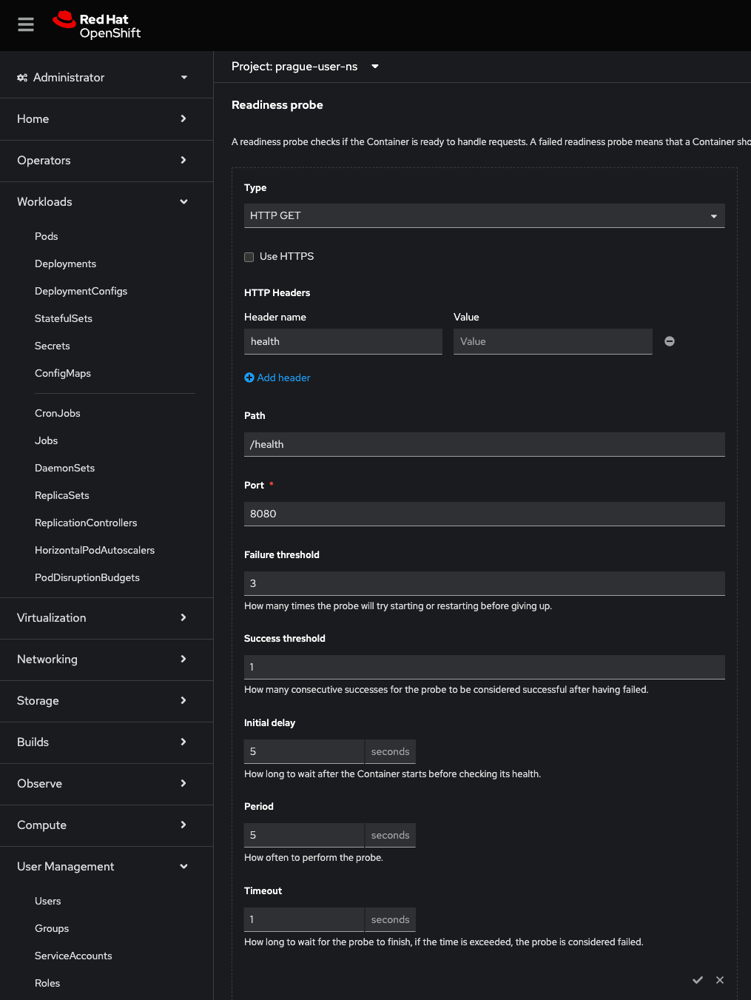
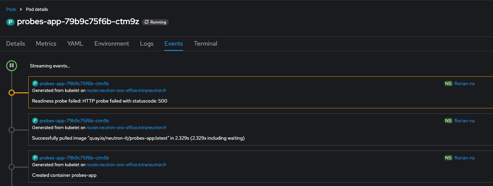

# Exercice Guidé : Comprendre l'Utilité des Readiness et Liveness Probes dans OpenShift

Cet exercice vous guidera à travers le déploiement d'une application sur OpenShift, l'ajout de sondes de readiness et liveness via la console OpenShift, puis la simulation de défaillances pour observer leur comportement respectif. 

---

### Objectif

Cet exercice vise à démontrer :
1. Comment une **readiness probe** empêche le trafic d'atteindre un conteneur non prêt.
2. Comment une **liveness probe** redémarre un conteneur en cas de problème.


### Étape 1 : Déploiement de l’Application

1. **Déployez le fichier `deployment.yaml` suivant**. Il s’agit d’une application Node.js avec deux endpoints : `/healthz` pour la liveness probe et `/readyz` pour la readiness probe. Les états de santé peuvent être modifiés via des endpoints `/toggle-ready` et `/toggle-live` pour tester les sondes.

   ```yaml
   apiVersion: apps/v1
   kind: Deployment
   metadata:
     name: probes-app
   spec:
     replicas: 1
     selector:
       matchLabels:
         app: probes-app
     template:
       metadata:
         labels:
           app: probes-app
       spec:
         containers:
         - name: probes-app
           image: quay.io/neutron-it/probes-app:latest
           ports:
           - containerPort: 8080
   ```

2. **Appliquez le fichier de déploiement** :
   ```bash
   oc apply -f deployment.yaml
   ```

3. **Vérifiez que le Pod est en cours d’exécution** :
   ```bash
   oc get pods -l app=probes-app
   ```

---

### Étape 2 : Ajouter les Probes via la Console OpenShift

1. **Accédez à votre projet dans la console OpenShift**.

2. **Ouvrez la section "Workloads" > "Deployments"** et sélectionnez votre application `probes-app`.

3. Dans l’onglet **Actions**, sélectionnez **Add Health Checks** pour ajouter des sondes de readiness et de liveness.

4. **Ajoutez une liveness probe** :
   - Type : HTTP
   - Path : `/healthz`
   - Port : `8080`
   - Initial Delay : `10` secondes
   - Timeout : `1` seconde
   - Period : `5` secondes
   - Failure Threshold : `3`



5. **Ajoutez une readiness probe** :
   - Type : HTTP
   - Path : `/readyz`
   - Port : `8080`
   - Initial Delay : `5` secondes
   - Timeout : `1` seconde
   - Period : `5` secondes
   - Failure Threshold : `3`



6. **Enregistrez les modifications** pour que les probes soient ajoutées à la configuration de déploiement.


### Étape 3 : Tester la Readiness Probe avec `oc rsh`

1. **Désactivez la Readiness Probe** :
   Accédez au pod `probes-app` en utilisant `oc rsh` et exécutez la commande suivante pour désactiver la readiness :
   ```bash
   oc rsh <nom_du_pod_demo-app> #get it with "oc get po"
   oc rsh probes-app
   curl http://localhost:8080/toggle-ready
   ```

   Cette commande rendra le pod "non prêt" en modifiant l’état de la readiness probe.

2. **Vérifiez l’État de Readiness en Local** :
   Toujours à partir du même shell, exécutez la commande suivante pour vérifier la disponibilité du endpoint de readiness sur `localhost` :
   ```bash
   curl http://localhost:8080/readyz
   ```

   Si la readiness probe est correctement configurée pour échouer, vous devriez recevoir une erreur indiquant que le pod n'est pas en état de readiness.

3. **Observez les Événements dans la Console** :
   - Retournez dans la console OpenShift, ouvrez la page de votre pod `probes-app`, et consultez l'onglet **Overview** ou **Events**.
   - Vous devriez voir que le pod a été marqué comme "Non Prêt" et que le service a donc arrêté de router le trafic vers celui-ci.

   

4. **Réactivez la Readiness Probe** :
   Dans le même shell, exécutez cette commande pour réactiver la readiness :
   ```bash
   curl http://localhost:8080/toggle-ready
   ```

5. **Vérifiez que le Pod est à Nouveau Prêt** :
   Exécutez de nouveau :
   ```bash
   curl http://localhost:8080/readyz
   ```
   
   Cette fois, le endpoint devrait répondre avec `200 OK`, indiquant que le pod est prêt à recevoir du trafic.

   


### Étape 4 : Tester la Liveness Probe

1. **Désactivez la liveness probe** :
   Dans le pod `probes-app`, exécutez la commande suivante pour simuler une défaillance de liveness :
   ```bash
   curl http://localhost:8080/toggle-live
   ```

2. **Observez le redémarrage du pod dans OpenShift** :
   - Allez dans l’onglet **Events** et observez les événements de redémarrage. OpenShift va tenter de redémarrer le conteneur après quelques secondes, une fois le seuil d’échec atteint.

3. **Réactivez la liveness probe** pour éviter les redémarrages continus :
   Retournez dans le pod `probes-app` et exécutez :
   ```bash
   curl http://localhost:8080/toggle-live
   ```

---

### Résumé

Dans cet exercice, vous avez pu observer :
- **Readiness Probe** : comment OpenShift empêche le trafic d’atteindre le pod quand la readiness probe échoue.
- **Liveness Probe** : comment OpenShift redémarre automatiquement le conteneur lorsque la liveness probe échoue, garantissant la résilience de l’application.

Ces sondes jouent un rôle crucial pour maintenir des applications fiables et robustes sur OpenShift.