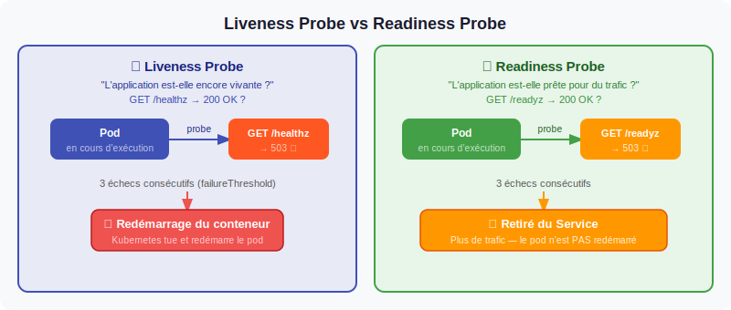
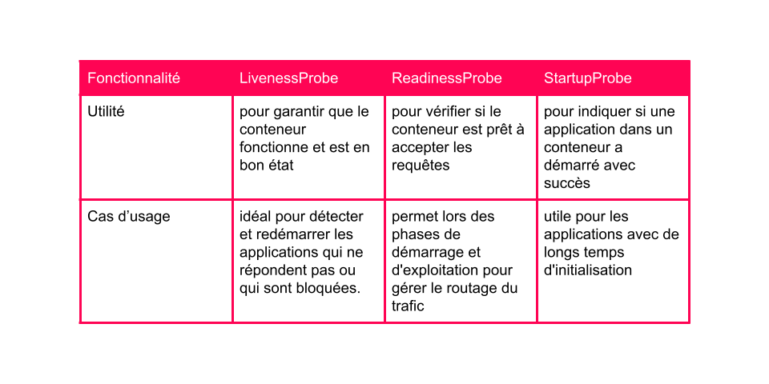

# Exercice Guidé : Readiness et Liveness Probes dans OpenShift

## Objectifs

A la fin de cet exercice, vous serez capable de :

- [ ] Comprendre la difference entre une **liveness probe** et une **readiness probe**
- [ ] Ajouter des sondes de sante (*probes*) sur une application via la console OpenShift
- [ ] Simuler une panne applicative et observer le redemarrage automatique du conteneur
- [ ] Simuler une indisponibilite temporaire et observer le retrait du pod des endpoints du service
- [ ] Verifier la configuration des probes en ligne de commande

---

## Ce que vous allez apprendre

Dans un environnement de production, les applications peuvent tomber en panne ou devenir temporairement indisponibles. Sans mecanisme de surveillance, ces situations passent inapercues et les utilisateurs subissent des erreurs.

Les **probes** (sondes de sante) sont le mecanisme de Kubernetes pour surveiller automatiquement vos applications. Elles permettent a OpenShift de **detecter les problemes** et d'**agir automatiquement** : redemarrer un conteneur plante ou arreter d'envoyer du trafic a un pod qui n'est pas pret.

Dans cet exercice, vous allez configurer ces sondes sur une application de test, puis simuler des pannes pour observer comment OpenShift reagit.



:::info Deux types de probes, deux roles differents
- **Liveness Probe** : "Est-ce que mon application est encore vivante ?" Si non, OpenShift **redemarre** le conteneur.
- **Readiness Probe** : "Est-ce que mon application est prete a recevoir du trafic ?" Si non, OpenShift **arrete d'envoyer du trafic** au pod, mais ne le redemarre pas.
:::

---

## Prerequis

Une application **probes-app** est deja deployee dans votre namespace. Elle utilise l'image `quay.io/neutron-it/probes-app:latest` et ecoute sur le port **8080**.

Elle expose quatre endpoints :

| Endpoint | Role |
|---|---|
| `/healthz` | Endpoint de liveness -- retourne `200 OK` si le pod est "vivant" |
| `/readyz` | Endpoint de readiness -- retourne `200 OK` si le pod est "pret" |
| `/toggle-live` | Bascule l'etat de liveness (simule une panne ou la retablit) |
| `/toggle-ready` | Bascule l'etat de readiness (simule une indisponibilite ou la retablit) |

:::tip A quoi servent les endpoints /toggle- ?
Dans la vraie vie, une application tombe en panne toute seule (bug, fuite memoire, etc.). Ici, les endpoints `/toggle-live` et `/toggle-ready` nous permettent de **simuler** ces situations pour observer le comportement des probes sans attendre une vraie panne.
:::

Verifiez que l'application est en cours d'execution :

```bash
oc get deployment probes-app
```

**Sortie attendue :**

```
NAME         READY   UP-TO-DATE   AVAILABLE   AGE
probes-app   1/1     1            1           5m
```

:::warning Si le deploiement n'est pas pret
Si la colonne `READY` n'affiche pas `1/1`, attendez quelques instants et relancez la commande. Si le probleme persiste, verifiez que vous etes dans le bon namespace avec `oc project`.
:::

---

## Etape 1 : Ajouter les Probes via la Console OpenShift

**Pourquoi cette etape ?** Par defaut, OpenShift ne surveille pas la sante de votre application. Sans probes, un conteneur qui plante silencieusement continuera a recevoir du trafic, causant des erreurs pour les utilisateurs. Vous allez maintenant ajouter cette surveillance.

### 1.1. Acceder au deploiement

1. Ouvrez la console OpenShift dans votre navigateur.
2. Dans le menu de gauche, cliquez sur **Workloads** puis **Deployments**.
3. Cliquez sur le deploiement `probes-app`.

### 1.2. Ouvrir le formulaire d'ajout de probes

4. En haut a droite, cliquez sur le menu **Actions**.
5. Selectionnez **"Add Health Checks"**.

:::note Pourquoi passer par la console ?
La console OpenShift offre un formulaire visuel qui simplifie la configuration des probes. Vous pourriez aussi les ajouter en YAML ou en ligne de commande, mais la console est plus intuitive pour debuter.
:::

### 1.3. Configurer la Liveness Probe

6. Cliquez sur **"Add Liveness Probe"** et remplissez les champs suivants :

| Parametre | Valeur | Explication |
|---|---|---|
| Type | **HTTP GET** | OpenShift enverra une requete HTTP pour verifier la sante |
| Path | `/healthz` | L'URL a interroger sur le conteneur |
| Port | `8080` | Le port de l'application |
| Initial Delay | `10` secondes | Temps d'attente avant la premiere verification (laisse le temps a l'app de demarrer) |
| Period | `5` secondes | Intervalle entre chaque verification |
| Failure Threshold | `3` | Nombre d'echecs consecutifs avant de considerer le pod comme mort |


:::tip Comprendre le Failure Threshold
Avec un **Period** de 5 secondes et un **Failure Threshold** de 3, OpenShift attendra **3 echecs consecutifs** (soit environ 15 secondes) avant de redemarrer le conteneur. Cela evite de redemarrer sur un simple ralentissement passager.
:::

### 1.4. Configurer la Readiness Probe

7. Cliquez sur **"Add Readiness Probe"** et remplissez les champs suivants :

| Parametre | Valeur | Explication |
|---|---|---|
| Type | **HTTP GET** | Meme mecanisme que la liveness probe |
| Path | `/readyz` | L'URL de readiness a interroger |
| Port | `8080` | Le port de l'application |
| Initial Delay | `5` secondes | Temps d'attente avant la premiere verification |
| Period | `5` secondes | Intervalle entre chaque verification |
| Failure Threshold | `3` | Nombre d'echecs consecutifs avant de considerer le pod comme non pret |


### 1.5. Sauvegarder

8. Cliquez sur **"Save"** pour appliquer les probes.

:::info Que se passe-t-il quand vous sauvegardez ?
OpenShift modifie la specification du deploiement pour inclure les probes. Cela declenche un **nouveau deploiement** : le pod actuel est supprime et un nouveau pod est cree avec les probes configurees.
:::

### 1.6. Attendre le redemarrage du pod

Surveillez le redemarrage du pod en temps reel :

```bash
oc get pods -l app=probes-app -w
```

**Sortie attendue :**

```
NAME                          READY   STATUS              RESTARTS   AGE
probes-app-old-xxx            1/1     Running             0          5m
probes-app-old-xxx            1/1     Terminating         0          5m
probes-app-new-yyy            0/1     ContainerCreating   0          2s
probes-app-new-yyy            1/1     Running             0          10s
```

:::tip Arreter le suivi en temps reel
Appuyez sur `Ctrl+C` pour arreter la commande `oc get pods -w` une fois que le nouveau pod est en status `Running` avec `1/1` dans la colonne `READY`.
:::

### Verification -- Etape 1

Verifiez que les probes sont bien configurees :

```bash
oc describe deployment probes-app | grep -A 5 "Liveness\|Readiness"
```

**Sortie attendue :**

```
    Liveness:   http-get http://:8080/healthz delay=10s timeout=1s period=5s #success=1 #failure=3
    Readiness:  http-get http://:8080/readyz delay=5s timeout=1s period=5s #success=1 #failure=3
```

Si vous voyez ces deux lignes, les probes sont correctement configurees. Vous pouvez passer a l'etape suivante.

---

## Etape 2 : Tester la Readiness Probe

**Pourquoi cette etape ?** Vous allez simuler une situation ou l'application est encore en vie mais **pas prete a recevoir du trafic** (par exemple : elle attend la connexion a une base de donnees). Vous verrez comment OpenShift retire automatiquement le pod de la liste des endpoints du service.

### 2.1. Ouvrir un shell dans le pod

Connectez-vous au pod pour pouvoir interagir avec l'application depuis l'interieur :

```bash
oc rsh deployment/probes-app
```

**Sortie attendue :**

```
$
```

:::note Qu'est-ce que `oc rsh` ?
La commande `oc rsh` ouvre un **shell distant** (Remote SHell) dans le conteneur. Cela vous permet d'executer des commandes directement a l'interieur du pod, comme si vous etiez connecte sur la machine.
:::

### 2.2. Desactiver la readiness

Depuis le shell dans le pod, basculez l'etat de readiness :

```bash
curl http://localhost:8080/toggle-ready
```

**Sortie attendue :**

```
Ready: false
```

:::warning Attention
A partir de maintenant, l'endpoint `/readyz` retourne une erreur. OpenShift va detecter cet echec au prochain cycle de verification (dans les 5 prochaines secondes).
:::

### 2.3. Verifier que le pod est marque comme non pret

Attendez environ 15 secondes (3 echecs x 5 secondes), puis verifiez l'etat de readiness :

```bash
curl http://localhost:8080/readyz
```

**Sortie attendue :**

```
HTTP/1.1 503 Service Unavailable
```

### 2.4. Observer les evenements dans la console

1. Retournez dans la console OpenShift.
2. Allez dans **Workloads** > **Pods** > cliquez sur le pod `probes-app`.
3. Cliquez sur l'onglet **Events**.

Vous devriez voir un evenement indiquant que le pod est marque comme **"Non Pret"** (`Readiness probe failed`).


:::info Consequence concrete
Le pod n'est **plus inclus dans les endpoints du service**. Cela signifie qu'aucun trafic utilisateur ne lui est envoye. Si d'autres replicas etaient disponibles, ils prendraient le relais automatiquement.
:::

### 2.5. Reactiver la readiness

Toujours depuis le shell dans le pod :

```bash
curl http://localhost:8080/toggle-ready
```

**Sortie attendue :**

```
Ready: true
```

Verifiez que le pod est de nouveau pret :

```bash
curl http://localhost:8080/readyz
```

**Sortie attendue :**

```
HTTP/1.1 200 OK
```

Le pod recoit a nouveau du trafic. OpenShift l'a automatiquement reinclus dans les endpoints du service.

### 2.6. Sortir du shell

```bash
exit
```

### Verification -- Etape 2

Verifiez que le pod est de nouveau marque comme pret :

```bash
oc get pods -l app=probes-app
```

**Sortie attendue :**

```
NAME                          READY   STATUS    RESTARTS   AGE
probes-app-xxx-yyy            1/1     Running   0          10m
```

La colonne `READY` doit afficher `1/1`. Si elle affiche `0/1`, attendez quelques secondes que la readiness probe reussisse.

---

## Etape 3 : Tester la Liveness Probe

**Pourquoi cette etape ?** Vous allez simuler une situation ou l'application est **completement plantee** (elle ne repond plus du tout). Vous verrez comment OpenShift **redemarre automatiquement** le conteneur sans intervention humaine.

### 3.1. Ouvrir un shell dans le pod

```bash
oc rsh deployment/probes-app
```

**Sortie attendue :**

```
$
```

### 3.2. Simuler une panne

Basculez l'etat de liveness pour simuler un crash applicatif :

```bash
curl http://localhost:8080/toggle-live
```

**Sortie attendue :**

```
Live: false
```

:::warning Que va-t-il se passer ?
L'endpoint `/healthz` retourne maintenant une erreur. Apres 3 echecs consecutifs (environ 15 secondes), OpenShift va **tuer le conteneur et le redemarrer**. Votre session shell sera automatiquement coupee.
:::

### 3.3. Observer le redemarrage automatique

Attendez 15 a 20 secondes. Votre session shell sera interrompue car le conteneur est redemarre. C'est normal.

Depuis votre terminal local, verifiez l'etat du pod :

```bash
oc get pods -l app=probes-app
```

**Sortie attendue :**

```
NAME                          READY   STATUS    RESTARTS   AGE
probes-app-xxx-yyy            1/1     Running   1          15m
```

:::tip Le compteur RESTARTS
Remarquez que la colonne **RESTARTS** est passee a **1**. Cela confirme qu'OpenShift a detecte la panne via la liveness probe et a automatiquement redemarre le conteneur. Apres le redemarrage, l'application repart dans un etat sain (les flags de liveness et readiness sont reinitialises a `true`).
:::

### 3.4. Consulter les evenements du pod

Pour voir le detail de ce qui s'est passe :

```bash
oc describe pod -l app=probes-app | grep -A 3 "Liveness probe failed"
```

**Sortie attendue :**

```
  Warning  Unhealthy  ...  Liveness probe failed: HTTP probe failed with statuscode: 503
  Normal   Killing    ...  Container probes-app failed liveness probe, will be restarted
```

### Verification -- Etape 3

Verifiez que l'application est de nouveau en bonne sante apres le redemarrage :

```bash
oc rsh deployment/probes-app curl http://localhost:8080/healthz
```

**Sortie attendue :**

```
HTTP/1.1 200 OK
```

```bash
oc rsh deployment/probes-app curl http://localhost:8080/readyz
```

**Sortie attendue :**

```
HTTP/1.1 200 OK
```

L'application fonctionne a nouveau normalement apres le redemarrage automatique.

---

## Etape 4 : Verifier la Configuration des Probes

**Pourquoi cette etape ?** Il est important de savoir verifier la configuration des probes en ligne de commande. Cela vous sera utile pour debugger des problemes en production.

Affichez la configuration de la liveness probe :

```bash
oc get deployment probes-app -o jsonpath='{.spec.template.spec.containers[0].livenessProbe}' | python3 -m json.tool
```

**Sortie attendue :**

```json
{
    "httpGet": {
        "path": "/healthz",
        "port": 8080,
        "scheme": "HTTP"
    },
    "initialDelaySeconds": 10,
    "periodSeconds": 5,
    "failureThreshold": 3,
    "timeoutSeconds": 1,
    "successThreshold": 1
}
```

Affichez la configuration de la readiness probe :

```bash
oc get deployment probes-app -o jsonpath='{.spec.template.spec.containers[0].readinessProbe}' | python3 -m json.tool
```

**Sortie attendue :**

```json
{
    "httpGet": {
        "path": "/readyz",
        "port": 8080,
        "scheme": "HTTP"
    },
    "initialDelaySeconds": 5,
    "periodSeconds": 5,
    "failureThreshold": 3,
    "timeoutSeconds": 1,
    "successThreshold": 1
}
```

### Verification -- Etape 4

Confirmez visuellement que les deux probes sont bien presentes avec un seul appel :

```bash
oc describe deployment probes-app | grep -E "Liveness|Readiness"
```

**Sortie attendue :**

```
    Liveness:   http-get http://:8080/healthz delay=10s timeout=1s period=5s #success=1 #failure=3
    Readiness:  http-get http://:8080/readyz delay=5s timeout=1s period=5s #success=1 #failure=3
```

---

## Etape 5 : Nettoyage

**Pourquoi cette etape ?** En environnement de formation partage, il est important de nettoyer les ressources que vous n'utilisez plus pour liberer de la capacite pour les autres participants.

Supprimez le deploiement :

```bash
oc delete deployment probes-app
```

**Sortie attendue :**

```
deployment.apps "probes-app" deleted
```

### Verification -- Etape 5

Verifiez que le deploiement a bien ete supprime :

```bash
oc get deployment probes-app
```

**Sortie attendue :**

```
Error from server (NotFound): deployments.apps "probes-app" not found
```

---

## Tableau recapitulatif : Liveness vs Readiness

| | **Liveness Probe** | **Readiness Probe** |
|---|---|---|
| **Question posee** | "Est-ce que l'application est vivante ?" | "Est-ce que l'application est prete a servir du trafic ?" |
| **Endpoint utilise** | `/healthz` | `/readyz` |
| **Action en cas d'echec** | **Redemarrage** du conteneur | **Retrait** du pod des endpoints du service |
| **Le pod est-il supprime ?** | Non, il est redemarre | Non, il reste en place |
| **Le trafic est-il coupe ?** | Oui (le temps du redemarrage) | Oui (jusqu'a ce que la probe reussisse a nouveau) |
| **Cas d'usage typique** | Application bloquee, deadlock, crash silencieux | Chargement de cache, attente de connexion DB, maintenance |
| **Consequence si absente** | Un conteneur plante reste en execution indefiniment | Un pod non pret continue de recevoir du trafic (erreurs pour les utilisateurs) |



---

## Resume

Dans cet exercice, vous avez appris a :

1. **Configurer des probes** via la console OpenShift en remplissant un formulaire visuel.
2. **Tester la readiness probe** : quand l'application n'est pas prete, OpenShift la retire automatiquement du service. Aucun trafic ne lui est envoye. Quand elle redevient prete, le trafic reprend.
3. **Tester la liveness probe** : quand l'application est en panne, OpenShift redemarre automatiquement le conteneur. L'application repart dans un etat sain.
4. **Verifier la configuration** en ligne de commande avec `oc describe` et `oc get -o jsonpath`.

:::tip Bonne pratique en production
Configurez **toujours** les deux types de probes sur vos applications en production. La liveness probe garantit la resilience (redemarrage automatique), et la readiness probe garantit la disponibilite (pas de trafic vers un pod non pret). Sans probes, vos utilisateurs subiront des erreurs evitables.
:::
