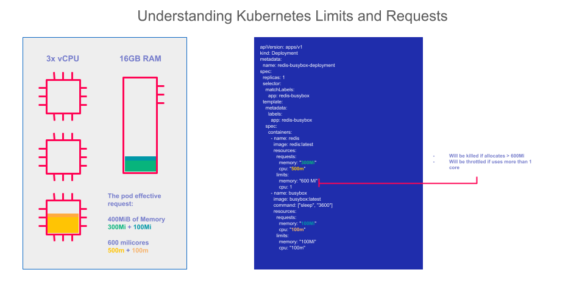

# Gestion des Limites, Requests et Quotas dans OpenShift

La gestion des ressources dans OpenShift est essentielle pour maintenir la stabilité, la sécurité et l'efficacité des applications. Les limites, les requests et les quotas permettent d'assurer que les applications ne consomment pas plus de ressources que nécessaire, et qu'aucun projet ou utilisateur ne monopolise les ressources du cluster.

---

### 1. Vue d’ensemble des Limites, Requests et Quotas

- **Requests** : Les *requests* sont les ressources minimales dont un conteneur a besoin pour fonctionner correctement. Elles garantissent que le conteneur aura accès à cette quantité minimale de ressources pendant son exécution. OpenShift utilise les requests pour planifier les pods sur les nœuds.

- **Limites** : Les *limites* sont la quantité maximale de ressources qu'un conteneur peut utiliser. Si le conteneur tente de dépasser cette limite, OpenShift peut restreindre son accès aux ressources supplémentaires, évitant ainsi une surcharge des ressources du cluster.

- **Quotas** : Les *quotas* imposent des restrictions sur la quantité totale de ressources qu’un projet (ou un namespace) peut consommer. Les quotas permettent de contrôler l'utilisation des ressources au niveau du projet, ce qui aide à garantir une répartition équitable entre les différents projets et utilisateurs dans un cluster.

Ces trois éléments fonctionnent en synergie pour assurer un environnement stable, bien planifié et équitable pour les applications déployées dans OpenShift.

---

### 2. Requests et Limites : Détails et Fonctionnement

#### 2.1. Requests (Demandes Minimales)

Les requests sont une quantité de ressources (comme le CPU et la mémoire) que le conteneur réclame pour fonctionner. Voici comment elles agissent :

- **Planification des Pods** : Quand un pod est créé, Kubernetes et OpenShift utilisent les requests pour choisir un nœud capable de fournir les ressources nécessaires. Si un nœud ne peut pas répondre aux demandes de ressource du pod, il ne sera pas sélectionné.
  
- **Garantie de Ressources** : Les requests permettent de réserver une portion de ressources pour le conteneur, assurant qu'il pourra au minimum accéder à cette quantité.

Exemple de définition de requests pour le CPU et la mémoire dans un manifeste YAML :

```yaml
resources:
  requests:
    cpu: "500m"          # Demande de 500 milliCPU, soit 0.5 CPU
    memory: "256Mi"      # Demande de 256 Mio de mémoire
```

#### 2.2. Limites (Limites Maximales)

Les limites définissent la quantité maximale de ressources que le conteneur est autorisé à consommer. Les limites aident à éviter qu'un conteneur ne monopolise les ressources en cas de surcharge. 

- **En cas de Dépassement** : Si un conteneur dépasse les limites de CPU, Kubernetes et OpenShift vont limiter la consommation CPU de ce conteneur, le ralentissant si nécessaire. Si le conteneur dépasse la limite de mémoire, le pod est alors tué et redémarré.

Exemple de définition des limites pour le CPU et la mémoire dans un manifeste YAML :

```yaml
resources:
  limits:
    cpu: "1"             # Limite de 1 CPU complet
    memory: "512Mi"      # Limite de 512 Mio de mémoire
```

#### 2.3. Relation entre Requests et Limites

1. **Requests ≤ Limites** : Les requests ne peuvent pas dépasser les limites. Un conteneur doit être configuré pour consommer au moins sa demande minimale, mais il ne doit jamais dépasser la limite fixée.

2. **Planification et Utilisation** :
   - OpenShift utilise les requests pour choisir un nœud lors de la création du pod.
   - Une fois le pod exécuté, il peut augmenter sa consommation jusqu'à la limite définie.
   - Un conteneur qui consomme plus de ressources que sa request mais moins que sa limite est permis tant que des ressources sont disponibles sur le nœud.



---

### 3. Quotas : Définition et Utilisation

Les quotas permettent de contrôler la quantité totale de ressources qu'un projet peut consommer, assurant une distribution équitable des ressources du cluster entre différents projets. Les quotas s’appliquent au niveau du namespace, permettant de restreindre les ressources accessibles par les utilisateurs dans ce contexte.

#### 3.1. Types de Quotas

OpenShift propose plusieurs types de quotas pour contrôler différents aspects de l'utilisation des ressources :

- **Quotas de Ressources** : Limite le CPU, la mémoire, et le nombre de pods qu'un projet peut consommer.
- **Quotas de Comptage d’Objets** : Restreint le nombre d’objets Kubernetes dans le projet, comme les ConfigMaps, PersistentVolumeClaims, Services, etc.
- **Quotas d’Accès aux Stockages** : Contrôle l'utilisation des volumes de stockage, y compris la taille totale des PersistentVolumeClaims.

#### 3.2. Exemple de Quota de Ressources

Voici un exemple de configuration YAML d’un quota de ressources limitant la quantité totale de CPU et de mémoire pour un projet :

```yaml
apiVersion: v1
kind: ResourceQuota
metadata:
  name: compute-resources
  namespace: mon-projet
spec:
  hard:
    requests.cpu: "2"          # Limite de CPU pour toutes les demandes dans le projet
    requests.memory: "2Gi"     # Limite de mémoire totale demandée dans le projet
    limits.cpu: "4"            # Limite CPU maximale pour le projet
    limits.memory: "4Gi"       # Limite mémoire maximale pour le projet
```

#### 3.3. Exemple de Quota d’Objets

Ce quota limite le nombre de pods et de services qu'un projet peut créer :

```yaml
apiVersion: v1
kind: ResourceQuota
metadata:
  name: object-counts
  namespace: mon-projet
spec:
  hard:
    pods: "10"                 # Limite à 10 pods pour le projet
    services: "5"              # Limite à 5 services pour le projet
```

#### 3.4. Exemple de Quota de Stockage

Un quota de stockage limite l’espace de stockage alloué dans le projet :

```yaml
apiVersion: v1
kind: ResourceQuota
metadata:
  name: storage-quota
  namespace: mon-projet
spec:
  hard:
    requests.storage: "10Gi"   # Limite à 10 Gio pour le stockage total demandé dans le projet
```

---

### 4. Stratégies de Mise en Place des Quotas

Pour une gestion optimale des ressources dans OpenShift, il est recommandé de mettre en place des quotas adaptés aux besoins de chaque projet. Quelques stratégies :

1. **Analyse des Besoins** : Comprendre les besoins spécifiques des projets. Par exemple, une application critique peut nécessiter un quota de ressources plus élevé.

2. **Définition des Limites Standards** : En collaboration avec les équipes, établir des limites de CPU et de mémoire standard, en fonction des ressources disponibles dans le cluster.

3. **Contrôle et Suivi des Quotas** : Surveiller l’utilisation des ressources avec des outils de monitoring pour ajuster les quotas en fonction de la charge réelle et éviter le gaspillage.

4. **Implémentation Progressive** : Introduire progressivement les quotas dans le cluster, en appliquant des limites moins strictes au début pour permettre aux équipes de s’adapter.

---

### 5. Exemple Pratique : Application d’un Quota et Analyse

Pour illustrer, imaginons que nous avons un projet appelé `mon-projet` qui héberge une application de calcul intensif. Nous appliquons un quota pour limiter l'utilisation des ressources :

1. **Création d’un quota de ressources** :
   - Le quota limite l’application à 4 CPU et 4 Gio de mémoire.
   - Le nombre de pods est limité à 15.

   ```yaml
   apiVersion: v1
   kind: ResourceQuota
   metadata:
     name: high-compute-quota
     namespace: mon-projet
   spec:
     hard:
       requests.cpu: "4"
       requests.memory: "4Gi"
       pods: "15"
   ```

2. **Déploiement d’une Application et Vérification des Limites** :
   - Déployons plusieurs pods et vérifions leur consommation de ressources via la commande `oc describe quota` :
   
   ```bash
   oc describe quota high-compute-quota -n mon-projet
   ```

   - Cette commande affiche l’état du quota et les ressources utilisées. Si l’utilisation de CPU atteint la limite, OpenShift refusera la création de nouveaux pods dans ce namespace jusqu'à ce que des ressources soient libérées.

---

### Conclusion

Les **requests**, **limites**, et **quotas** sont des composants clés dans OpenShift pour gérer les ressources et maintenir la stabilité du cluster. Grâce à ces outils, les administrateurs peuvent :
- Prévenir la surconsommation de ressources par un projet ou un conteneur spécifique.
- Optimiser la planification des pods et garantir que chaque application dispose des ressources minimales nécessaires pour fonctionner.
- Répartir équitablement les ressources du cluster entre plusieurs projets, tout en surveillant et en ajustant les quotas selon les besoins.

Cette approche permet de créer un environnement de production résilient, évolutif et équitable pour toutes les applications exécutées dans OpenShift.