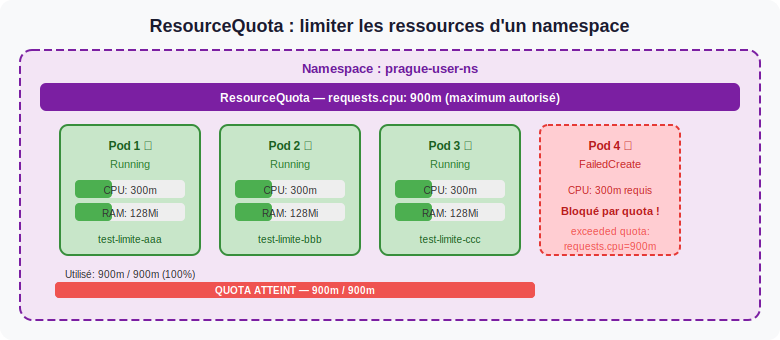

# Gestion des Ressources dans OpenShift : Requests, Limits, LimitRange et ResourceQuota

## Introduction

Dans un cluster OpenShift partagé entre plusieurs équipes et projets, la gestion rigoureuse des ressources est une condition essentielle à la stabilité et à l'équité du système. Sans contraintes, un seul pod peut consommer la totalité du CPU disponible sur un nœud et provoquer la dégradation ou l'éviction des autres applications. À l'échelle d'un namespace, un projet mal configuré peut saturer les ressources du cluster entier.

OpenShift s'appuie sur trois niveaux de contrôle complémentaires pour éviter ces situations :

1. **Requests et Limits** : définissent les ressources allouées à chaque conteneur individuellement.
2. **LimitRange** : applique des valeurs par défaut et des plafonds au niveau d'un namespace.
3. **ResourceQuota** : impose un budget global de ressources consommables pour l'ensemble d'un namespace.



*Diagramme illustrant les trois niveaux de contrôle des ressources dans OpenShift : du conteneur individuel (requests/limits) au namespace (LimitRange, ResourceQuota).*

---

## Requests, Limits et Quotas : vue d'ensemble comparée

| Concept | Niveau d'application | Rôle | Effet en cas de dépassement |
|---|---|---|---|
| **Request** | Conteneur | Ressources minimales garanties, utilisées pour la planification | Le pod n'est pas planifié sur un nœud insuffisant |
| **Limit** | Conteneur | Ressources maximales autorisées | CPU throttlé, pod tué si dépassement mémoire (OOMKilled) |
| **LimitRange** | Namespace | Valeurs par défaut et plafonds par conteneur/pod | Pod refusé à la création si hors des bornes |
| **ResourceQuota** | Namespace | Budget agrégé de ressources pour tous les pods du namespace | Création de nouveaux pods refusée si quota atteint |

---

## Requests et Limits

### Requests (réservations minimales)

Une *request* déclare la quantité minimale de ressources dont un conteneur a besoin pour fonctionner correctement. Le scheduler de Kubernetes utilise cette valeur pour sélectionner un nœud ayant suffisamment de capacité disponible. La request est une **garantie** : le conteneur se verra toujours allouer au moins cette quantité.

```yaml
resources:
  requests:
    cpu: "250m"      # 250 millicores = 0.25 CPU
    memory: "256Mi"  # 256 mébioctets de RAM
```

### Limits (plafonds de consommation)

Une *limit* fixe la quantité maximale de ressources qu'un conteneur est autorisé à consommer. Les comportements en cas de dépassement diffèrent selon la ressource :

- **CPU** : le conteneur est *throttlé* (ralenti) - il ne peut pas obtenir plus de cycles CPU que la limite, mais il n'est pas tué.
- **Mémoire** : si le conteneur tente d'allouer plus de mémoire que sa limite, il est immédiatement tué par le noyau Linux avec un signal OOMKilled (Out Of Memory), et Kubernetes le redémarre.

```yaml
resources:
  limits:
    cpu: "500m"      # Maximum 0.5 CPU
    memory: "512Mi"  # Maximum 512 mébioctets
```

### Exemple complet requests + limits

```yaml
apiVersion: apps/v1
kind: Deployment
metadata:
  name: welcome-app
  namespace: production
spec:
  template:
    spec:
      containers:
      - name: welcome-app
        image: quay.io/example/welcome-app:v2
        resources:
          requests:
            cpu: "250m"
            memory: "256Mi"
          limits:
            cpu: "500m"
            memory: "512Mi"
```

:::warning OOMKilled et absence de requests/limits
Un conteneur déployé sans requests ni limits n'a aucune garantie de ressources et peut être évincé à tout moment lorsque le nœud est sous pression mémoire. En production, l'absence de limits mémoire est la cause la plus fréquente de pods en état `OOMKilled`. Il est fortement recommandé de toujours définir des requests et des limits pour chaque conteneur en production.
:::

---

## Classes de QoS (Quality of Service)

Kubernetes attribue automatiquement une classe de QoS à chaque pod en fonction de la configuration de ses requests et limits. Cette classe détermine la priorité du pod lors des décisions d'éviction sur les nœuds sous pression.

| Classe QoS | Conditions | Comportement lors d'une pression mémoire |
|---|---|---|
| **Guaranteed** | Requests == Limits pour CPU et mémoire (tous les conteneurs) | Derniers évincés, priorité maximale |
| **Burstable** | Au moins un conteneur a des requests < limits, ou requests définies sans limits | Évincés après BestEffort, selon l'utilisation réelle |
| **BestEffort** | Aucune request ni limit définie sur aucun conteneur | Premiers évincés en cas de pression ressources |

:::info Classe Guaranteed et performance prédictible
Les pods de classe Guaranteed sont idéaux pour les workloads critiques car leurs ressources sont entièrement réservées sur le nœud. En revanche, ils mobilisent de la capacité même lorsqu'ils ne l'utilisent pas. Pour les applications de production sensibles à la latence, privilégiez des pods Guaranteed avec des valeurs requests/limits identiques et bien calibrées.
:::

---

## LimitRange : valeurs par défaut et contraintes par namespace

Un objet `LimitRange` permet à un administrateur de définir, au niveau d'un namespace :

- Des **valeurs par défaut** pour les requests et limits (appliquées automatiquement aux conteneurs qui n'en définissent pas).
- Des **plafonds et planchers** (min/max) pour les requests et limits de chaque conteneur ou pod.

```yaml
apiVersion: v1
kind: LimitRange
metadata:
  name: default-limits
  namespace: production
spec:
  limits:
  - type: Container
    default:           # Limits appliquées par défaut si non spécifiées
      cpu: "500m"
      memory: "512Mi"
    defaultRequest:    # Requests appliquées par défaut si non spécifiées
      cpu: "100m"
      memory: "128Mi"
    max:               # Plafond absolu par conteneur
      cpu: "2"
      memory: "2Gi"
    min:               # Plancher absolu par conteneur
      cpu: "50m"
      memory: "64Mi"
```

Vérifier les LimitRange actives dans un namespace :

```bash
oc get limitrange -n production
oc describe limitrange default-limits -n production
```

:::tip Valeurs de départ pour les requests/limits
En l'absence de données de profiling, une bonne heuristique de départ est :
- Request CPU : 100m à 250m pour la plupart des microservices
- Request mémoire : 128Mi à 256Mi
- Limit CPU : 2x à 4x la request
- Limit mémoire : 2x la request (préférer des valeurs identiques pour une classe Guaranteed)

Affinez ces valeurs après observation de la consommation réelle via les métriques OpenShift ou un outil comme Vertical Pod Autoscaler en mode recommendation.
:::

---

## ResourceQuota : budget global par namespace

Un `ResourceQuota` impose un plafond sur la somme des ressources consommables dans un namespace entier. Contrairement au LimitRange qui agit au niveau du pod individuel, le ResourceQuota agit sur l'ensemble des objets du namespace.

### Quota de ressources de calcul

```yaml
apiVersion: v1
kind: ResourceQuota
metadata:
  name: compute-quota
  namespace: production
spec:
  hard:
    requests.cpu: "4"          # Total CPU demandé dans le namespace
    requests.memory: "8Gi"     # Total mémoire demandée dans le namespace
    limits.cpu: "8"            # Total CPU limité dans le namespace
    limits.memory: "16Gi"      # Total mémoire limitée dans le namespace
```

### Quota sur le nombre d'objets

```yaml
apiVersion: v1
kind: ResourceQuota
metadata:
  name: object-quota
  namespace: production
spec:
  hard:
    pods: "20"                          # Maximum 20 pods
    services: "10"                      # Maximum 10 services
    persistentvolumeclaims: "10"        # Maximum 10 PVC
    configmaps: "30"                    # Maximum 30 ConfigMaps
    secrets: "30"                       # Maximum 30 Secrets
```

### Quota de stockage

```yaml
apiVersion: v1
kind: ResourceQuota
metadata:
  name: storage-quota
  namespace: production
spec:
  hard:
    requests.storage: "100Gi"           # Stockage total demandé
    gold.storageclass.storage.k8s.io/requests.storage: "50Gi"  # Par StorageClass
```

### Consulter l'utilisation d'un quota

```bash
oc describe quota compute-quota -n production
```

Exemple de sortie :

```
Name:            compute-quota
Namespace:       production
Resource         Used    Hard
--------         ----    ----
limits.cpu       2500m   8
limits.memory    4Gi     16Gi
requests.cpu     1250m   4
requests.memory  2Gi     8Gi
```

### Vue console OpenShift


*Vue de la console OpenShift affichant l'utilisation des ResourceQuotas d'un namespace : ressources consommées vs limites définies, avec indicateurs visuels de saturation.*

La console OpenShift offre une vue synthétique des quotas depuis **Administration > ResourceQuotas** (vue administrateur) ou depuis la vue Projet dans la perspective développeur.

---

## Scénario pratique complet

Voici un exemple de configuration complète pour un namespace de production hébergeant plusieurs microservices :

**1. LimitRange pour les valeurs par défaut :**

```yaml
apiVersion: v1
kind: LimitRange
metadata:
  name: default-limits
  namespace: mon-app-prod
spec:
  limits:
  - type: Container
    default:
      cpu: "400m"
      memory: "256Mi"
    defaultRequest:
      cpu: "100m"
      memory: "128Mi"
    max:
      cpu: "2"
      memory: "4Gi"
```

**2. ResourceQuota globale pour le namespace :**

```yaml
apiVersion: v1
kind: ResourceQuota
metadata:
  name: prod-quota
  namespace: mon-app-prod
spec:
  hard:
    requests.cpu: "8"
    requests.memory: "16Gi"
    limits.cpu: "16"
    limits.memory: "32Gi"
    pods: "40"
    services: "20"
```

**3. Vérification post-déploiement :**

```bash
# État du quota
oc describe quota prod-quota -n mon-app-prod

# Vérifier si un pod a bien des requests/limits
oc get pod welcome-app-7b9c4d8f6-xk2p9 -o jsonpath='{.spec.containers[*].resources}'

# Lister les pods sans requests CPU définis
oc get pods -o json | jq '.items[] | select(.spec.containers[].resources.requests.cpu == null) | .metadata.name'
```

---

## Résumé

La gestion des ressources dans OpenShift repose sur une hiérarchie à trois niveaux :

1. **Requests/Limits** au niveau du conteneur : garantissent un comportement prédictible et protègent le nœud des applications gourmandes.
2. **LimitRange** au niveau du namespace : garantissent que tous les pods ont des requests/limits et encadrent les valeurs acceptables.
3. **ResourceQuota** au niveau du namespace : garantissent qu'aucun projet ne monopolise les ressources du cluster.

Ces trois mécanismes fonctionnent de manière complémentaire et doivent être déployés ensemble dans tout environnement de production multi-tenant.
