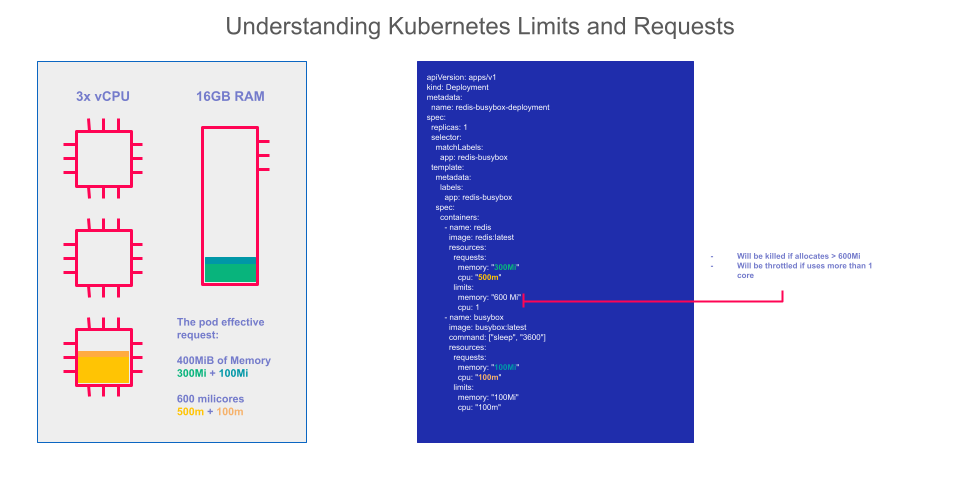

# Exercice Guidé : Gestion des Requests, Limites et Quotas dans OpenShift

## Ce que vous allez apprendre

Dans cet exercice, vous allez mettre en pratique les concepts de **requests**, **limites** et **quotas** vus dans le cours précédent. Vous allez créer un déploiement avec des contraintes de ressources, puis configurer un **ResourceQuota** qui limite la consommation globale de votre namespace. Enfin, vous observerez concrètement ce qui se passe quand OpenShift refuse de créer des pods parce que le quota est atteint.


## Objectifs

A la fin de cet exercice, vous serez capable de :

- [ ] Configurer les **requests** et **limites** de CPU et mémoire sur un déploiement
- [ ] Comprendre la différence entre request (minimum garanti) et limite (maximum autorisé)
- [ ] Créer un **ResourceQuota** pour restreindre la consommation globale d'un namespace
- [ ] Observer et interpréter le comportement d'OpenShift lorsqu'un quota est dépassé
- [ ] Analyser les consommations via la colonne **Used** vs **Hard** d'un quota

---

:::tip Terminal web OpenShift
Toutes les commandes `oc` de cet exercice sont à exécuter dans le **terminal web OpenShift**. Cliquez sur l'icône de terminal en haut à droite de la console pour l'ouvrir.


:::

## Rappel visuel : Requests vs Limites



:::info Rappel des concepts clés
- **Request** = ce que le pod **réserve** au minimum. Le scheduler utilise cette valeur pour choisir un noeud.
- **Limite** = ce que le pod **ne peut pas dépasser**. Si le CPU est dépassé, le pod est ralenti (*throttled*). Si la mémoire est dépassée, le pod est tué (*OOMKilled*).
- **Quota** = le budget total du namespace. C'est la somme maximale de toutes les requests (ou limites) de tous les pods du namespace.
:::

---

## Etape 1 : Créer un Déploiement avec Requests et Limites

### Pourquoi cette étape ?

Avant de mettre en place un quota, il faut d'abord déployer une application avec des **requests** et **limites** définies. Sans ces valeurs, OpenShift ne peut pas comptabiliser les ressources consommées par le quota.

### Instructions

Créez un fichier nommé `deployment-limite.yaml` :

```yaml
apiVersion: apps/v1
kind: Deployment
metadata:
  name: quota-demo-app
  namespace: <CITY>-user-ns
spec:
  replicas: 1
  selector:
    matchLabels:
      app: quota-demo-app
  template:
    metadata:
      labels:
        app: quota-demo-app
    spec:
      containers:
      - name: limite-container
        image: registry.access.redhat.com/ubi8/ubi:latest
        command: ["sh", "-c", "while true; do echo Hello OpenShift; sleep 5; done"]
        resources:
          requests:
            memory: "128Mi"
            cpu: "300m"
          limits:
            memory: "256Mi"
            cpu: "600m"
```

:::tip Comprendre les valeurs
| Ressource | Request (minimum garanti) | Limite (maximum autorisé) |
|-----------|--------------------------|--------------------------|
| CPU | `300m` = 0.3 CPU (30% d'un coeur) | `600m` = 0.6 CPU (60% d'un coeur) |
| Mémoire | `128Mi` = 128 Mégaoctets | `256Mi` = 256 Mégaoctets |

L'unité `m` signifie **millicores**. 1000m = 1 CPU complet.
:::

Appliquez le déploiement :

```bash
oc apply -f deployment-limite.yaml
```

**Sortie attendue :**

```
deployment.apps/quota-demo-app created
```

Vérifiez que le pod est en état `Running` :

```bash
oc get pods -l app=quota-demo-app
```

**Sortie attendue :**

```
NAME                              READY   STATUS    RESTARTS   AGE
quota-demo-app-5d4f7b8c9-x7k2p   1/1     Running   0          15s
```

Consultez les requests et limites appliquées au pod :

```bash
oc describe pod -l app=quota-demo-app | grep -A 6 "Limits:"
```

**Sortie attendue :**

```
    Limits:
      cpu:     600m
      memory:  256Mi
    Requests:
      cpu:     300m
      memory:  128Mi
```

### Vérification

:::note Checklist de vérification - Etape 1
Avant de passer à l'étape suivante, assurez-vous que :
- Le pod `quota-demo-app-xxx` est en état **Running** (colonne `STATUS`)
- La colonne `READY` affiche **1/1**
- Les requests et limites correspondent bien aux valeurs du YAML (300m / 600m pour le CPU, 128Mi / 256Mi pour la mémoire)
:::

---

## Etape 2 : Configurer un ResourceQuota

### Pourquoi cette étape ?

Un **ResourceQuota** permet à l'administrateur de définir un budget de ressources pour un namespace entier. C'est comme un plafond de dépenses : tous les pods du namespace se partagent ce budget. Si un nouveau pod ferait dépasser le budget, OpenShift refuse de le créer.

### Instructions

Créez un fichier `quota.yaml` :

```yaml
apiVersion: v1
kind: ResourceQuota
metadata:
  name: quota-formation
  namespace: <CITY>-user-ns
spec:
  hard:
    requests.cpu: "900m"       # Max 900 millicores en requests
    requests.memory: "512Mi"   # Max 512 Mi en requests
    limits.cpu: "2"            # Max 2 CPU en limits
    limits.memory: "1Gi"       # Max 1 Gi en limits
    pods: "5"                  # Max 5 pods
```

:::info Un quota ArgoCD est déjà en place
Votre namespace possède déjà un quota `formation-quota` géré par ArgoCD avec des limites plus larges. Le quota `quota-formation` que vous créez ici est **plus restrictif** (`requests.cpu: 900m`), c'est donc lui qui sera contraignant pour cet exercice.
:::

:::warning Pourquoi 900m pour le CPU request ?
Le quota de `900m` en `requests.cpu` est choisi volontairement pour permettre **exactement 3 pods** de notre déploiement (3 x 300m = 900m). Cela va nous permettre d'observer le blocage quand on tentera de créer un 4eme pod.
:::

:::info Le calcul du quota en détail
Chaque pod de notre déploiement demande **300m de CPU en request**. Avec un quota de **900m** :

| Nombre de pods | CPU requests utilisés | % du quota | Statut |
|:-:|:-:|:-:|:-:|
| 1 pod | 300m | 33% | Autorisé |
| 2 pods | 600m | 67% | Autorisé |
| 3 pods | 900m | 100% | Autorisé (pile la limite) |
| **4 pods** | **1200m** | **133%** | **REFUSE** |

Le 4eme pod nécessiterait 1200m au total, ce qui dépasse les 900m autorisés.
:::

Appliquez le quota :

```bash
oc apply -f quota.yaml
```

**Sortie attendue :**

```
resourcequota/quota-formation created
```

Vérifiez que le quota est bien configuré et que le pod existant est déjà comptabilisé :

```bash
oc describe resourcequota quota-formation
```

**Sortie attendue :**

```
Name:              quota-formation
Namespace:         votre-namespace
Resource           Used    Hard
--------           ----    ----
limits.cpu         600m    2
limits.memory      256Mi   1Gi
pods               1       5
requests.cpu       300m    900m
requests.memory    128Mi   512Mi
```

:::tip Lire le tableau Used vs Hard
- **Used** = ce qui est actuellement consommé par les pods existants dans le namespace
- **Hard** = la limite maximale autorisée par le quota
- Quand **Used** atteint **Hard** pour n'importe quelle ressource, plus aucun nouveau pod ne peut etre créé
:::

### Vérification

Vérifiez que votre quota est bien créé (vous verrez les deux quotas présents dans le namespace) :

```bash
oc get resourcequota
```

**Sortie attendue :**

```
NAME               AGE   REQUEST                                                                   LIMIT
formation-quota    10m   requests.cpu: 302m/2, requests.memory: 136Mi/1Gi, ...                    limits.cpu: 600m/2, ...
quota-formation    5s    requests.cpu: 300m/900m, requests.memory: 128Mi/512Mi, pods: 1/5          limits.cpu: 600m/2, limits.memory: 256Mi/1Gi
```

:::note Checklist de vérification - Etape 2
Avant de passer à l'étape suivante, assurez-vous que :
- Le quota `quota-formation` existe dans la liste
- La colonne **Used** pour `requests.cpu` affiche **300m** (notre unique pod)
- La colonne **Hard** pour `requests.cpu` affiche **900m**
:::

---

## Etape 3 : Tester le Dépassement du Quota

### Pourquoi cette étape ?

C'est le coeur de l'exercice. Nous allons demander à OpenShift de créer **4 réplicas** de notre déploiement. Comme le quota n'autorise que 900m de CPU requests (soit 3 pods x 300m), le 4eme pod sera **refusé**. Cela permet de voir concrètement comment les quotas protègent le cluster.

### Instructions

Scalez le déploiement à 4 réplicas :

```bash
oc scale deployment/quota-demo-app --replicas=4
```

**Sortie attendue :**

```
deployment.apps/quota-demo-app scaled
```

:::warning La commande ne retourne pas d'erreur !
La commande `oc scale` met à jour l'objet Deployment (qui demande 4 réplicas), mais c'est le **ReplicaSet controller** qui essaie ensuite de créer les pods. C'est lui qui sera bloqué par le quota. L'erreur apparait dans les **events**, pas dans la sortie de la commande.
:::

Vérifiez combien de pods sont effectivement en cours d'exécution :

```bash
oc get pods -l app=quota-demo-app
```

**Sortie attendue :**

```
NAME                           READY   STATUS    RESTARTS   AGE
quota-demo-app-5d4f7b8c9-x7k2p   1/1     Running   0          5m
quota-demo-app-5d4f7b8c9-ab3cd   1/1     Running   0          30s
quota-demo-app-5d4f7b8c9-ef4gh   1/1     Running   0          30s
```

Seulement **3 pods** sur les 4 demandés sont en état Running. Le 4eme n'a jamais été créé.

Consultez les événements pour comprendre pourquoi :

```bash
oc get events --sort-by='.lastTimestamp' | tail -5
```

**Sortie attendue :**

```
LAST SEEN   TYPE      REASON              OBJECT                                  MESSAGE
30s         Normal    ScalingReplicaSet   deployment/quota-demo-app               Scaled up replica set quota-demo-app-5d4f7b8c9 to 4
30s         Warning   FailedCreate        replicaset/quota-demo-app-5d4f7b8c9    Error creating: pods "quota-demo-app-5d4f7b8c9-ij5kl" is forbidden: exceeded quota: quota-formation, requested: requests.cpu=300m, used: requests.cpu=900m, limited: requests.cpu=900m
```

:::info Décryptage du message d'erreur
Décomposons le message ligne par ligne :

| Partie du message | Signification |
|---|---|
| `FailedCreate` | OpenShift n'a pas pu créer le pod |
| `exceeded quota: quota-formation` | Le quota nommé `quota-formation` (celui que vous avez créé) a été dépassé |
| `requested: requests.cpu=300m` | Le 4ème pod demande 300m de CPU supplémentaires |
| `used: requests.cpu=900m` | Les 3 pods existants utilisent déjà 900m (le maximum autorisé par votre quota) |
| `limited: requests.cpu=900m` | Votre quota autorise au maximum 900m |

En résumé : les 3 premiers pods ont consommé la totalité du budget CPU défini dans `quota-formation`. Le quota `formation-quota` (géré par ArgoCD) n'intervient pas ici car sa limite est plus haute.
:::

Vérifiez le nombre de réplicas souhaité vs disponible sur le déploiement :

```bash
oc get deployment quota-demo-app
```

**Sortie attendue :**

```
NAME          READY   UP-TO-DATE   AVAILABLE   AGE
quota-demo-app   3/4     3            3           6m
```

:::tip Lire la colonne READY
**3/4** signifie que le déploiement souhaite 4 réplicas mais que seulement 3 sont prêts. OpenShift continuera de tenter de créer le 4eme pod, mais il sera refusé à chaque fois tant que le quota est atteint.
:::

### Vérification

:::note Checklist de vérification - Etape 3
Assurez-vous que :
- Vous voyez exactement **3 pods** Running (pas 4)
- Le déploiement affiche **3/4** dans la colonne READY
- Les events montrent un message **FailedCreate** avec `exceeded quota`
:::

---

## Etape 4 : Analyser les Consommations des Quotas

### Pourquoi cette étape ?

Savoir lire l'état d'un quota est une compétence essentielle pour le dépannage en production. Quand une équipe se plaint que ses pods ne se créent pas, c'est souvent un problème de quota.

### Instructions

Consultez l'état détaillé du quota avec les 3 pods actifs :

```bash
oc describe resourcequota quota-formation
```

**Sortie attendue :**

```
Name:              quota-formation
Namespace:         votre-namespace
Resource           Used    Hard
--------           ----    ----
limits.cpu         1800m   2
limits.memory      768Mi   1Gi
pods               3       5
requests.cpu       900m    900m
requests.memory    384Mi   512Mi
```

:::info Analyse des résultats
Avec 3 pods actifs, voici le calcul pour chaque ressource :

| Ressource | Calcul (3 pods) | Used | Hard | Marge restante |
|---|---|---|---|---|
| requests.cpu | 3 x 300m | **900m** | 900m | **0 - BLOQUANT** |
| requests.memory | 3 x 128Mi | 384Mi | 512Mi | 128Mi |
| limits.cpu | 3 x 600m | 1800m | 2000m | 200m |
| limits.memory | 3 x 256Mi | 768Mi | 1Gi | 256Mi |
| pods | 3 | 3 | 5 | 2 |

On voit clairement que c'est le **requests.cpu** qui bloque : Used = Hard = 900m. Meme s'il reste de la marge sur les autres ressources, un seul dépassement suffit pour bloquer la création de nouveaux pods.
:::

Pour surveiller la consommation réelle de CPU et mémoire de chaque pod (et non pas les requests/limites, mais l'utilisation effective) :

```bash
oc adm top pod -l app=quota-demo-app
```

**Sortie attendue :**

```
NAME                           CPU(cores)   MEMORY(bytes)
quota-demo-app-5d4f7b8c9-x7k2p   1m           0Mi
quota-demo-app-5d4f7b8c9-ab3cd   1m           0Mi
quota-demo-app-5d4f7b8c9-ef4gh   1m           0Mi
```

:::tip Différence entre request et usage réel
Remarquez que chaque pod utilise seulement **1m de CPU** et **0Mi de mémoire** en réalité, alors qu'il réserve **300m de CPU** et **128Mi de mémoire**. C'est normal : notre application ne fait qu'afficher "Hello OpenShift" toutes les 5 secondes, elle est quasi inactive. Mais le quota se base sur les **requests** (les réservations), pas sur l'utilisation réelle.
:::

### Vérification

:::note Checklist de vérification - Etape 4
Assurez-vous que :
- `requests.cpu` affiche **Used = 900m** et **Hard = 900m** (quota saturé)
- Le nombre de pods affiche **Used = 3**
- La commande `oc adm top pod` montre que l'utilisation réelle est bien inférieure aux requests
:::

---

## Etape 5 : Nettoyer l'Environnement

### Pourquoi cette étape ?

Il est important de supprimer les ressources créées pendant l'exercice pour ne pas encombrer le namespace partagé et libérer le quota pour les autres exercices.

### Instructions

Supprimez le déploiement et le quota que vous avez créé (`quota-formation`). Ne supprimez pas `formation-quota`, il est géré par ArgoCD :

```bash
oc delete deployment quota-demo-app
oc delete resourcequota quota-formation
```

**Sortie attendue :**

```
deployment.apps "quota-demo-app" deleted
resourcequota "quota-formation" deleted
```

Vérifiez que tout est bien nettoyé. Seul `formation-quota` doit rester :

```bash
oc get deployment -l app=quota-demo-app
oc get resourcequota
```

**Sortie attendue :**

```
No resources found in votre-namespace namespace.
NAME              AGE
formation-quota   1h
```

### Vérification

:::note Checklist de vérification - Etape 5
Assurez-vous que :
- Plus aucun pod `quota-demo-app` ne tourne (`oc get pods`)
- Seul `formation-quota` apparaît dans `oc get resourcequota` (votre `quota-formation` est supprimé)
- Le quota `quota-formation` n'existe plus (`oc get resourcequota`)
:::

---

## Récapitulatif

Le tableau ci-dessous résume les actions réalisées et les concepts clés de chaque étape :

| Etape | Action | Concept clé | Commande principale |
|:-:|---|---|---|
| 1 | Créer un déploiement avec requests et limites | Les **requests** réservent un minimum, les **limites** imposent un maximum | `oc apply -f deployment-limite.yaml` |
| 2 | Créer un ResourceQuota | Le quota définit un **budget global** pour le namespace | `oc apply -f quota.yaml` |
| 3 | Scaler au-delà du quota | OpenShift **refuse** de créer des pods si le quota est atteint | `oc scale deployment/quota-demo-app --replicas=4` |
| 4 | Analyser Used vs Hard | Le diagnostic se fait en comparant **Used** et **Hard** dans le quota | `oc describe resourcequota` |
| 5 | Nettoyer | Toujours supprimer les ressources de test | `oc delete deployment` / `oc delete resourcequota` |

:::warning Bonne pratique en production
En production, définissez **toujours** :
1. Des **requests et limites** sur chaque conteneur, pour que le scheduler puisse planifier correctement les pods
2. Des **ResourceQuotas** sur chaque namespace, pour empêcher qu'un projet ne consomme toutes les ressources du cluster
3. Des **LimitRanges** (non couvert dans cet exercice) pour imposer des valeurs par défaut quand un développeur oublie de spécifier ses requests/limites
:::
