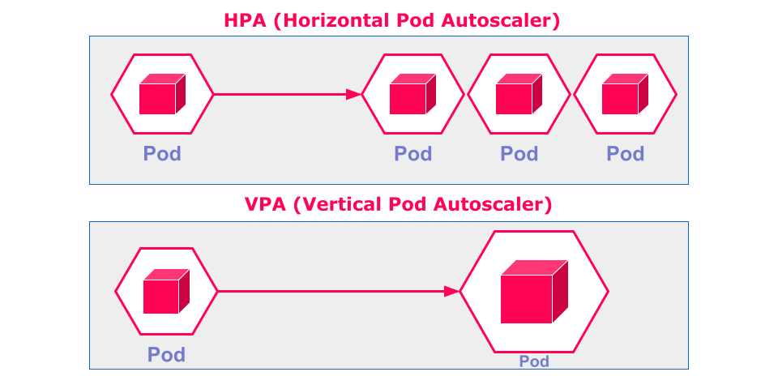

# Haute disponibilité des applications dans Kubernetes : Mise à l’échelle automatique

#### 1. Différence entre le scaling vertical et le scaling horizontal

Pour garantir la haute disponibilité d'une application dans Kubernetes, il est important de comprendre les deux approches principales de mise à l’échelle : le **scaling vertical** et le **scaling horizontal**.

- **Scaling vertical (mise à l’échelle verticale)** : Cette approche consiste à augmenter les ressources (CPU, mémoire) allouées à un pod unique. Par exemple, si un pod manque de mémoire pour traiter les requêtes entrantes, on peut augmenter la quantité de mémoire allouée à ce pod. Cela permet au pod de traiter plus de charge, mais il y a une limite physique liée aux ressources disponibles sur les nœuds du cluster. L'inconvénient principal de cette approche est qu'elle ne permet pas d'assurer une redondance des pods : un pod plus grand ne protège pas contre les défaillances, car si le pod unique échoue, le service est interrompu.

- **Scaling horizontal (mise à l’échelle horizontale)** : Cette méthode consiste à augmenter le nombre de réplicas de pods pour distribuer la charge sur plusieurs instances. Au lieu d’augmenter les ressources d’un seul pod, on crée de nouvelles instances de ce pod pour répondre à la demande. Cette approche est idéale pour assurer la résilience et la haute disponibilité, car plusieurs réplicas de l’application peuvent fonctionner simultanément. Si un pod tombe en panne, les autres prennent le relais, maintenant ainsi le service en ligne.



Dans Kubernetes, le **HorizontalPodAutoscaler (HPA)** est utilisé pour la mise à l’échelle horizontale, tandis que le **Vertical Pod Autoscaler (VPA)** est utilisé pour ajuster les ressources allouées à chaque pod. Cependant, l’approche horizontale est souvent privilégiée pour sa capacité à distribuer la charge et à offrir une meilleure tolérance aux pannes.

#### 2. Mise à l’échelle automatique des pods avec l’HorizontalPodAutoscaler (HPA)

La mise à l’échelle horizontale permet donc de garantir que les applications restent disponibles et performantes même face à des variations de charge importantes. Kubernetes offre la possibilité de mettre à l’échelle automatiquement les déploiements en fonction de la charge des pods de l’application à travers la ressource **HorizontalPodAutoscaler (HPA)**. Cette mise à l'échelle permet d'adapter le nombre de réplicas de pods à la charge réelle, garantissant ainsi une utilisation optimale des ressources du cluster tout en maintenant la réactivité de l'application.

L’HPA s’appuie sur les métriques de performance collectées par le sous-système **OpenShift Metrics**, qui est préinstallé dans OpenShift 4. Cela simplifie la configuration, car aucune installation supplémentaire n’est nécessaire, contrairement à OpenShift 3.

#### 3. Fonctionnement de l’autoscaler de pod horizontal

L’autoscaler de pod horizontal fonctionne en boucle et effectue les actions suivantes toutes les 15 secondes :

- **Récupération des métriques** : L’autoscaler obtient les détails de la métrique à partir de la ressource HPA.
- **Collecte des données de performance** : Pour chaque pod ciblé, l’HPA collecte les métriques de performance telles que l’utilisation du processeur et de la mémoire.
- **Calcul de l’utilisation** : L’HPA calcule le pourcentage d’utilisation de chaque pod à partir des métriques collectées et des ressources demandées (CPU ou mémoire).
- **Ajustement du nombre de réplicas** : En se basant sur la moyenne d’utilisation et les demandes de ressources moyennes, l’HPA ajuste le nombre de réplicas afin de maintenir une utilisation équilibrée des ressources.

#### 4. Configuration de l’HPA pour un déploiement

Pour activer la mise à l’échelle automatique d’un déploiement, il est nécessaire de définir des demandes de ressources (CPU et/ou mémoire) pour les pods. Cela permet à l’HPA de calculer le pourcentage d’utilisation des ressources et d’ajuster le nombre de réplicas en conséquence.

La méthode la plus simple pour créer une ressource HPA est d’utiliser la commande `oc autoscale`. Par exemple :

```bash
oc autoscale deployment/hello --min 1 --max 10 --cpu-percent 80
```

Cette commande crée un HPA qui ajuste automatiquement le nombre de réplicas du déploiement `hello` pour maintenir l’utilisation de la CPU en dessous de 80 %. Les options `--min` et `--max` définissent respectivement le nombre minimal et maximal de réplicas que l’HPA peut ajuster.

#### 5. Créer un HPA à partir d’un fichier YAML

Il est également possible de définir un HPA en utilisant un fichier YAML pour plus de flexibilité :

```yaml
apiVersion: autoscaling/v2
kind: HorizontalPodAutoscaler
metadata:
  name: hello
spec:
  minReplicas: 1
  maxReplicas: 10
  metrics:
  - type: Resource
    resource:
      name: cpu
      target:
        type: Utilization
        averageUtilization: 80
  scaleTargetRef:
    apiVersion: apps/v1
    kind: Deployment
    name: hello
```

Ce fichier YAML définit un HPA qui ajuste le nombre de réplicas entre 1 et 10 en fonction de l’utilisation moyenne de la CPU. Si la consommation moyenne de CPU dépasse 80 %, l’HPA ajoutera des réplicas pour alléger la charge sur chaque pod. Inversement, si l’utilisation moyenne est inférieure à 80 %, l’HPA réduira le nombre de réplicas.

Pour appliquer ce fichier, utilisez la commande suivante :

```bash
oc apply -f hello-hpa.yaml
```

#### 6. Précautions lors de la mise à l’échelle

Il est important de noter que la valeur affichée dans la colonne `TARGETS` de la commande `oc get hpa` peut initialement être `<unknown>`. Cela indique que les métriques ne sont pas encore disponibles pour les pods, et il peut falloir quelques minutes pour que cette valeur se mette à jour. Si la valeur reste `<unknown>`, cela peut signifier que les pods ne disposent pas de demandes de ressources définies.

**Conseil :** Les pods créés via `oc create deployment` n’ont pas de demandes de ressources par défaut. Pour permettre une mise à l’échelle efficace, il est recommandé de modifier les ressources de déploiement ou de définir des limites par défaut pour les projets.

#### 7. Mise à l’échelle basée sur la mémoire

En plus de la CPU, il est possible de configurer la mise à l’échelle en fonction de la mémoire :

```yaml
apiVersion: autoscaling/v2
kind: HorizontalPodAutoscaler
metadata:
  name: hello
spec:
  minReplicas: 1
  maxReplicas: 10
  metrics:
  - type: Resource
    resource:
      name: memory
      target:
        type: Utilization
        averageUtilization: 80
```

Dans cet exemple, l’HPA ajuste le nombre de réplicas en fonction de l’utilisation de la mémoire. Cependant, cette méthode peut être moins efficace pour les applications dont la consommation de mémoire globale augmente proportionnellement au nombre de réplicas.

#### 8. Résilience et gestion des pics de charge

Pour garantir une haute disponibilité, il est recommandé de conserver un nombre minimum de pods en réserve pour faire face aux pics de charge soudains. Cela permet de maintenir une bonne réactivité de l'application même en cas d’augmentation rapide de la demande. À l’inverse, un nombre excessif de pods peut surcharger les ressources du cluster, il est donc important de bien ajuster les valeurs `minReplicas` et `maxReplicas`.

En configurant correctement l'HPA, vous pouvez optimiser la consommation de ressources et améliorer la réactivité de vos applications, assurant ainsi une haute disponibilité dans des environnements dynamiques comme ceux gérés par Kubernetes et OpenShift.
