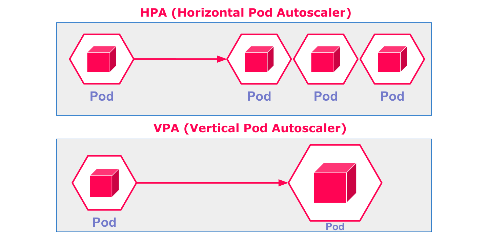

# Mise à l'échelle automatique des applications dans OpenShift

## Introduction

La mise à l'échelle automatique est l'un des mécanismes fondamentaux qui distinguent une plateforme de conteneurs d'un simple gestionnaire de processus. Plutôt que de dimensionner les applications pour le pic de charge maximal prévu (et gaspiller des ressources en dehors de ces pics), la mise à l'échelle automatique permet à l'infrastructure d'adapter dynamiquement la capacité en fonction de la demande réelle.

OpenShift propose plusieurs approches de mise à l'échelle automatique, chacune répondant à un besoin différent. Cette page se concentre sur la mise à l'échelle horizontale automatique via le **HorizontalPodAutoscaler (HPA)**, l'outil le plus couramment utilisé, et présente brièvement les alternatives.

---

## Scaling vertical vs scaling horizontal

Avant d'aborder l'automatisation, il est important de comprendre les deux stratégies de base :

| Dimension | Scaling vertical | Scaling horizontal |
|---|---|---|
| **Principe** | Augmenter les ressources d'un pod existant (CPU, RAM) | Augmenter le nombre de réplicas de pods |
| **Résultat** | Un pod plus puissant | Plusieurs pods identiques en parallèle |
| **Tolérance aux pannes** | Faible (point de défaillance unique) | Forte (redondance naturelle) |
| **Limite** | Plafonnée par la capacité du nœud le plus grand | Limitée par la scalabilité de l'application |
| **Outil Kubernetes** | Vertical Pod Autoscaler (VPA) | HorizontalPodAutoscaler (HPA) |
| **Impact sur le service** | Redémarrage du pod nécessaire | Transparent pour les utilisateurs |

Dans la grande majorité des cas de production, **le scaling horizontal est privilégié** car il améliore simultanément les performances et la résilience. Une application correctement conçue (stateless, sans affinité de session serveur) bénéficie naturellement de la multiplication des réplicas.



*HPA ajoute des réplicas (copies du pod) - VPA augmente les ressources d'un pod existant*

---

## Le HorizontalPodAutoscaler (HPA)

### Principe de fonctionnement

Le HPA est un contrôleur Kubernetes qui observe en permanence les métriques de performance d'un ensemble de pods et ajuste automatiquement le nombre de réplicas d'un Deployment, StatefulSet ou ReplicaSet pour maintenir les métriques cibles dans les valeurs définies.

La boucle de contrôle s'exécute toutes les **15 secondes** et effectue les étapes suivantes :

1. Interroge le serveur de métriques (`metrics-server`) pour récupérer les valeurs actuelles.
2. Calcule le ratio entre la consommation actuelle et la cible définie.
3. Détermine le nombre de réplicas désiré selon la formule :

```
Replicas désirés = ceil(Replicas actuels × (Utilisation actuelle / Utilisation cible))
```

Par exemple, avec 3 réplicas à 90% CPU et une cible à 70% :

```
ceil(3 × (90 / 70)) = ceil(3.857) = 4 réplicas
```

:::info Prérequis : metrics-server
Le HPA nécessite que le composant `metrics-server` soit actif dans le cluster pour collecter les métriques de CPU et mémoire des pods. Dans OpenShift 4, ce composant est inclus dans la plateforme via le sous-système OpenShift Monitoring et est actif par défaut - aucune installation supplémentaire n'est nécessaire. Pour vérifier son état : `oc get pods -n openshift-monitoring | grep metrics-server`
:::

### Types de métriques supportées

| Type | Description | Exemple |
|---|---|---|
| **Resource (CPU)** | Utilisation CPU moyenne des pods par rapport aux requests | `averageUtilization: 70` |
| **Resource (Memory)** | Utilisation mémoire moyenne des pods par rapport aux requests | `averageUtilization: 80` |
| **Pods** | Métrique personnalisée par pod (ex: requêtes/seconde) | `averageValue: "1k"` |
| **Object** | Métrique d'un objet Kubernetes (ex: longueur d'une queue) | `value: "500"` |
| **External** | Métrique externe au cluster (ex: messages dans une queue SQS) | `value: "100"` |

---

## Configuration d'un HPA

### Via la commande oc autoscale

La méthode la plus rapide pour créer un HPA basique basé sur la CPU :

```bash
oc autoscale deployment/welcome-app \
  --min 2 \
  --max 10 \
  --cpu-percent 70
```

### Via un fichier YAML (recommandé)

La déclaration YAML offre plus de flexibilité et permet de versionner la configuration dans un dépôt Git :

**HPA basé sur la CPU :**

```yaml
apiVersion: autoscaling/v2
kind: HorizontalPodAutoscaler
metadata:
  name: welcome-app-hpa
  namespace: production
spec:
  scaleTargetRef:
    apiVersion: apps/v1
    kind: Deployment
    name: welcome-app
  minReplicas: 2
  maxReplicas: 10
  metrics:
  - type: Resource
    resource:
      name: cpu
      target:
        type: Utilization
        averageUtilization: 70
```

**HPA basé sur la mémoire :**

```yaml
apiVersion: autoscaling/v2
kind: HorizontalPodAutoscaler
metadata:
  name: welcome-app-hpa-memory
  namespace: production
spec:
  scaleTargetRef:
    apiVersion: apps/v1
    kind: Deployment
    name: welcome-app
  minReplicas: 2
  maxReplicas: 10
  metrics:
  - type: Resource
    resource:
      name: memory
      target:
        type: Utilization
        averageUtilization: 80
```

**HPA multi-métriques (CPU + mémoire) :**

```yaml
apiVersion: autoscaling/v2
kind: HorizontalPodAutoscaler
metadata:
  name: welcome-app-hpa-multi
  namespace: production
spec:
  scaleTargetRef:
    apiVersion: apps/v1
    kind: Deployment
    name: welcome-app
  minReplicas: 2
  maxReplicas: 10
  metrics:
  - type: Resource
    resource:
      name: cpu
      target:
        type: Utilization
        averageUtilization: 70
  - type: Resource
    resource:
      name: memory
      target:
        type: Utilization
        averageUtilization: 80
  behavior:
    scaleDown:
      stabilizationWindowSeconds: 300   # Attendre 5 min avant de réduire
      policies:
      - type: Percent
        value: 10
        periodSeconds: 60               # Réduire au max 10% par minute
    scaleUp:
      stabilizationWindowSeconds: 0    # Monter rapidement
      policies:
      - type: Percent
        value: 100
        periodSeconds: 15              # Doubler les réplicas toutes les 15s si besoin
```

Pour appliquer la configuration :

```bash
oc apply -f welcome-app-hpa.yaml
```

:::tip Valeurs de cible CPU recommandées
Une cible de 70% d'utilisation CPU est généralement un bon compromis : elle laisse suffisamment de marge pour absorber les pics entre deux cycles d'évaluation (15 secondes) tout en maintenant les pods suffisamment chargés pour éviter un sur-provisionnement. Évitez des cibles supérieures à 90% car le HPA ne peut pas réagir instantanément - il y aura toujours un délai entre la montée en charge et l'arrivée des nouveaux pods.
:::

---

## Vue dans la console OpenShift


*Vue de la console OpenShift affichant le détail d'un HorizontalPodAutoscaler : réplicas actuels (3), cible CPU à 70%, utilisation courante à 45%, et barre de progression visuelle.*

Pour accéder à la vue HPA dans la console :

1. Naviguer vers **Workloads > HorizontalPodAutoscalers** dans la perspective Administrateur
2. Sélectionner le HPA souhaité pour voir le détail de son état
3. L'onglet **Details** affiche les métriques actuelles, les limites min/max et le dernier événement de scaling

### Commandes de suivi

```bash
# Afficher l'état du HPA
oc get hpa -n production

# Exemple de sortie
# NAME               REFERENCE              TARGETS    MINPODS   MAXPODS   REPLICAS
# welcome-app-hpa    Deployment/welcome-app 45%/70%    2         10        3

# Détail complet
oc describe hpa welcome-app-hpa -n production

# Suivre les événements de scaling en temps réel
oc get events -n production --field-selector reason=SuccessfulRescale
```

---

## Comportements importants et précautions

### Prérequis : requests CPU/mémoire obligatoires

Le HPA calcule l'utilisation **relative aux requests** définies sur les conteneurs. Sans requests, l'utilisation est indéfinie et la colonne `TARGETS` affiche `<unknown>`.

```bash
# Vérifier que les requests sont définies
oc get deployment welcome-app -o jsonpath='{.spec.template.spec.containers[*].resources.requests}'
```

### Délais de stabilisation

Par défaut, Kubernetes attend 5 minutes avant de réduire le nombre de réplicas (stabilisation à la baisse) pour éviter les oscillations. La montée en charge est plus agressive. Ces comportements sont configurables via le champ `behavior` de la spec HPA (voir exemple multi-métriques ci-dessus).

### Interaction avec PodDisruptionBudget

:::warning HPA et PodDisruptionBudget : interaction à surveiller
Lorsqu'un HPA réduit le nombre de réplicas (scale down) en même temps qu'un rolling update ou une maintenance de nœud est en cours, le `PodDisruptionBudget (PDB)` peut bloquer la suppression de pods si le nombre de pods disponibles tomberait en dessous du seuil défini. Dans ce cas, le scale down est simplement retardé jusqu'à ce que le PDB soit satisfait. Cependant, si les valeurs `minReplicas` de l'HPA et `minAvailable` du PDB sont mal coordonnées, cela peut entraîner un blocage permanent. Règle pratique : `minAvailable (PDB) < minReplicas (HPA)`.
:::

---

## Comparaison HPA, VPA et KEDA

| Outil | Axe de scaling | Métriques | Cas d'usage idéal |
|---|---|---|---|
| **HPA** | Horizontal (nombre de pods) | CPU, mémoire, métriques custom | Applications stateless soumises à des variations de charge |
| **VPA** | Vertical (ressources par pod) | CPU, mémoire | Applications dont le sizing est difficile à estimer, workloads batch |
| **KEDA** | Horizontal (piloté par événements) | Files de messages, bases de données, HTTP, cron | Traitements asynchrones, workers de queue, scale-to-zero |

:::note KEDA dans OpenShift
KEDA (Kubernetes Event-driven Autoscaling) est disponible en tant qu'opérateur dans le catalogue OperatorHub d'OpenShift. Il étend le HPA natif pour supporter des dizaines de sources de métriques externes (Kafka, RabbitMQ, AWS SQS, Prometheus, etc.) et permet notamment le **scale-to-zero** - une capacité que le HPA natif ne supporte pas (minimum 1 réplica).
:::

---

## Résumé

Le HorizontalPodAutoscaler est l'outil de référence pour la mise à l'échelle automatique dans OpenShift. Pour une configuration efficace :

1. **Toujours définir des requests CPU et/ou mémoire** sur les conteneurs ciblés par le HPA.
2. **Choisir une cible d'utilisation réaliste** : 60-70% pour la CPU est un bon point de départ.
3. **Définir un `minReplicas` >= 2** pour les applications de production afin d'assurer la haute disponibilité même en dehors des pics.
4. **Coordonner le HPA avec le PodDisruptionBudget** pour éviter les conflits lors des opérations de maintenance.
5. **Surveiller les événements de scaling** pour détecter les oscillations ou les blocages.
6. **Envisager KEDA** pour les workloads pilotés par des événements ou nécessitant le scale-to-zero.
