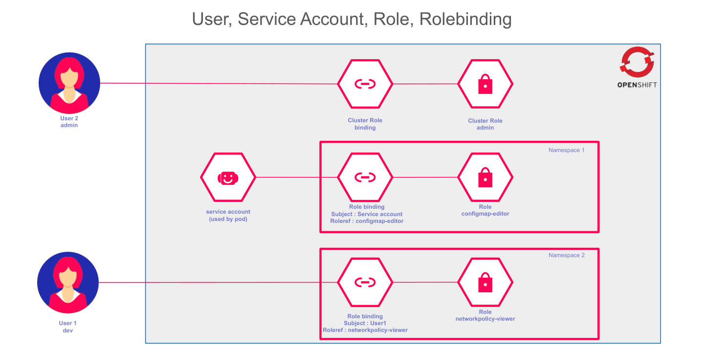
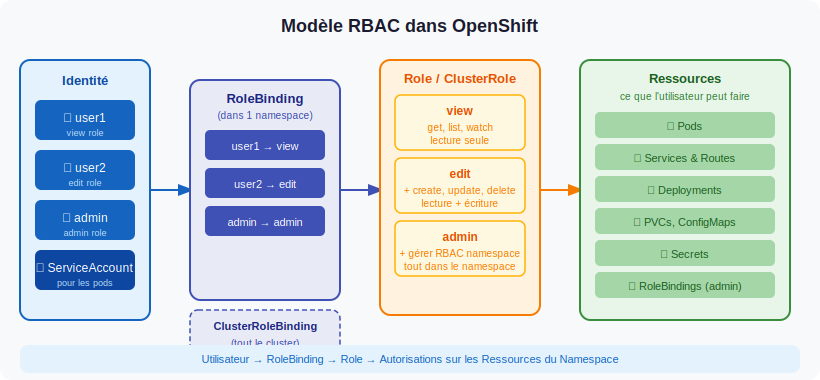

# Gestion des Autorisations avec RBAC et les Service Accounts

## Introduction

La gestion des accès est l'un des piliers de la sécurité d'un cluster OpenShift. Sans un contrôle rigoureux des droits, n'importe quel utilisateur ou application pourrait modifier, supprimer ou créer des ressources critiques. OpenShift implémente le **contrôle d'accès basé sur les rôles** (RBAC - Role-Based Access Control), hérité de Kubernetes et enrichi de fonctionnalités propres à la plateforme.

Ce chapitre couvre :
- les concepts fondamentaux du RBAC (règles, rôles, bindings),
- les types d'utilisateurs et de sujets,
- les **Service Accounts** — identités pour les applications et les pods,
- la création de rôles personnalisés et leur attribution via YAML et CLI.

---

## Types d'Utilisateurs et de Sujets dans OpenShift

OpenShift distingue trois grandes catégories de **sujets** pouvant recevoir des permissions RBAC :

| Type | Description | Exemple |
|------|-------------|---------|
| **Utilisateurs** (User) | Personnes physiques qui interagissent avec le cluster | `paris-user`, `admin` |
| **Groupes** (Group) | Ensemble d'utilisateurs | `developers`, `ops-team` |
| **Comptes de service** (ServiceAccount) | Identités utilisées par les applications et les pods | `default`, `mon-app-sa` |

:::note Compte kubeadmin
Le compte `kubeadmin` est un compte d'administration temporaire créé lors de l'installation. Il est recommandé de le supprimer après avoir configuré un fournisseur d'identité et attribué le rôle `cluster-admin` à un utilisateur permanent.
:::

---

## Le Contrôle d'Accès Basé sur les Rôles (RBAC)

### Concepts fondamentaux

Le RBAC repose sur trois concepts imbriqués :

1. **Les règles (Rules)** : définissent quelles actions (`verbs`) sont autorisées sur quelles ressources (`resources`) dans quels groupes d'API (`apiGroups`).
2. **Les rôles (Roles / ClusterRoles)** : regroupent un ensemble de règles en une unité cohérente.
3. **Les bindings (RoleBindings / ClusterRoleBindings)** : associent un rôle à un ou plusieurs sujets (utilisateurs, groupes, comptes de service).



*Vue d'ensemble de l'architecture RBAC : les sujets obtiennent des permissions via des bindings qui les associent à des rôles.*

### Les quatre objets RBAC

| Objet | Portée | Description |
|-------|--------|-------------|
| **Role** | Namespace | Définit des permissions limitées à un namespace donné |
| **ClusterRole** | Cluster entier | Définit des permissions valables dans tous les namespaces |
| **RoleBinding** | Namespace | Associe un Role (ou ClusterRole) à un sujet dans un namespace |
| **ClusterRoleBinding** | Cluster entier | Associe un ClusterRole à un sujet sur l'ensemble du cluster |



:::info Règle de portée
Un `RoleBinding` qui référence un `ClusterRole` ne confère les permissions de ce rôle **que dans le namespace** où le binding est créé. C'est une façon d'utiliser un rôle commun tout en limitant sa portée.
:::

---

## Rôles Intégrés dans OpenShift

OpenShift fournit un ensemble de rôles préconfigurés couvrant les besoins les plus courants.

### Rôles de projet (namespace-scoped)

| Rôle | Description | Cas d'usage |
|------|-------------|-------------|
| `admin` | Gestion complète des ressources du projet, y compris les droits d'accès | Chef de projet, lead technique |
| `edit` | Création, modification et suppression des ressources applicatives | Développeur |
| `view` | Lecture seule sur toutes les ressources du projet | Auditeur, observateur |

### Rôles de cluster (cluster-scoped)

| Rôle | Description | Cas d'usage |
|------|-------------|-------------|
| `cluster-admin` | Superadministrateur - accès total à toutes les ressources | Administrateur plateforme |
| `cluster-reader` | Lecture seule sur toutes les ressources du cluster | Auditeur de sécurité |

:::warning Utilisation de cluster-admin
Le rôle `cluster-admin` doit être attribué avec la plus grande parcimonie. Un utilisateur `cluster-admin` peut modifier ou supprimer n'importe quelle ressource du cluster, y compris les composants système critiques.
:::

---

## Les Verbs RBAC

Les `verbs` définissent les actions autorisées sur une ressource :

| Verb | Action |
|------|--------|
| `get` | Lire une ressource par son nom |
| `list` | Lister toutes les ressources d'un type |
| `watch` | Observer les changements en temps réel |
| `create` | Créer une nouvelle ressource |
| `update` | Modifier une ressource existante |
| `patch` | Appliquer une modification partielle |
| `delete` | Supprimer une ressource |

---

## Créer un Rôle Personnalisé

Lorsque les rôles intégrés ne correspondent pas aux besoins, il est possible de créer un rôle sur mesure.

```yaml
apiVersion: rbac.authorization.k8s.io/v1
kind: Role
metadata:
  name: pod-reader
  namespace: mon-namespace
rules:
  - apiGroups: [""]          # "" désigne l'API core (pods, services, configmaps...)
    resources: ["pods", "pods/log"]
    verbs: ["get", "list", "watch"]
  - apiGroups: ["apps"]
    resources: ["deployments"]
    verbs: ["get", "list"]
```

---

## Les Service Accounts

### Pourquoi les Service Accounts ?

Les **Service Accounts** sont des identités RBAC destinées aux **applications et aux pods**, pas aux humains. Ils permettent à un pod de s'identifier auprès de l'API OpenShift et d'obtenir des permissions spécifiques.

**Cas d'usage typiques :**
- Un pod qui doit lire la liste des autres pods du namespace (monitoring, service discovery)
- Un opérateur ou contrôleur qui doit créer/modifier des ressources
- Une application CI/CD qui déploie des ressources via l'API

:::info Service Account par défaut
Chaque namespace possède un Service Account `default` créé automatiquement. Tous les pods qui ne spécifient pas de Service Account utilisent ce compte `default`. Par sécurité, ce compte n'a aucune permission RBAC supplémentaire.
:::

### Créer un Service Account

```yaml
apiVersion: v1
kind: ServiceAccount
metadata:
  name: mon-app-sa
  namespace: mon-namespace
```

```bash
oc create serviceaccount mon-app-sa -n mon-namespace
```

### Associer un rôle à un Service Account

Un Service Account est un sujet RBAC comme un utilisateur. On lui associe un rôle via un `RoleBinding` :

```yaml
apiVersion: rbac.authorization.k8s.io/v1
kind: RoleBinding
metadata:
  name: mon-app-sa-pod-reader
  namespace: mon-namespace
subjects:
  - kind: ServiceAccount
    name: mon-app-sa
    namespace: mon-namespace
roleRef:
  kind: Role
  name: pod-reader
  apiGroup: rbac.authorization.k8s.io
```

### Utiliser un Service Account dans un Pod

Un pod utilise un Service Account en le spécifiant dans son spec :

```yaml
apiVersion: v1
kind: Pod
metadata:
  name: mon-pod
  namespace: mon-namespace
spec:
  serviceAccountName: mon-app-sa   # ← référence le SA
  containers:
    - name: mon-conteneur
      image: registry.access.redhat.com/ubi8/ubi:latest
```

### Comment fonctionne l'authentification SA ?

Quand un pod démarre avec un Service Account, OpenShift monte automatiquement un **token JWT** dans le conteneur (`/var/run/secrets/kubernetes.io/serviceaccount/token`). Ce token est utilisé par les clients API (kubectl, oc, les SDK) pour s'authentifier auprès de l'API Server.

```bash
# Depuis l'intérieur d'un pod, voir le token monté
cat /var/run/secrets/kubernetes.io/serviceaccount/token

# Interroger l'API avec le token (exemple depuis un pod)
TOKEN=$(cat /var/run/secrets/kubernetes.io/serviceaccount/token)
curl -sk -H "Authorization: Bearer $TOKEN" \
  https://kubernetes.default.svc/api/v1/namespaces/mon-namespace/pods
```

---

## Créer des Bindings (RoleBinding)

### Via la CLI

```bash
# Attribuer un rôle intégré à un utilisateur dans un namespace
oc policy add-role-to-user view paris-user -n mon-namespace

# Attribuer un rôle intégré à un Service Account
oc policy add-role-to-user view -z mon-app-sa -n mon-namespace
# L'option -z désigne un Service Account (par opposition à -u pour un utilisateur)

# Vérifier les droits de l'utilisateur courant
oc auth can-i create pods -n mon-namespace
oc auth can-i --list -n mon-namespace
```

### Via YAML

```yaml
apiVersion: rbac.authorization.k8s.io/v1
kind: RoleBinding
metadata:
  name: paris-user-view
  namespace: mon-namespace
subjects:
  - kind: User
    name: paris-user
    apiGroup: rbac.authorization.k8s.io
roleRef:
  kind: ClusterRole
  name: view
  apiGroup: rbac.authorization.k8s.io
```

---

## Bonnes Pratiques RBAC

1. **Principe du moindre privilège** : n'attribuez que les permissions strictement nécessaires.
2. **Utilisez des Service Accounts dédiés** : ne laissez pas vos applications utiliser le SA `default` — créez un SA spécifique avec uniquement les permissions nécessaires.
3. **Préférez les groupes aux utilisateurs individuels** : un binding sur un groupe est plus facile à maintenir.
4. **Auditez régulièrement** : `oc get rolebindings -n mon-namespace` pour lister les accès.
5. **Gérez les bindings via GitOps** : vos bindings dans Git = traçabilité complète.

:::warning Ne pas confondre "admin" et "cluster-admin"
Le rôle `admin` est un rôle de projet : contrôle total sur un namespace. Le rôle `cluster-admin` donne un accès total à l'intégralité du cluster.
:::
