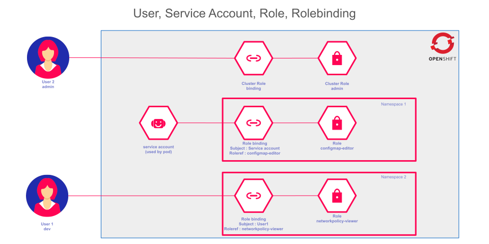
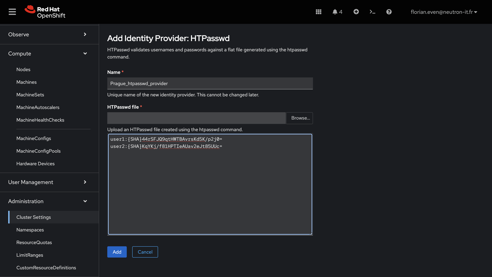

# Exercice Guidé : Gestion des Utilisateurs et RBAC dans OpenShift

:::note Mode Demonstration
Cet exercice est realise en **mode demonstration par le formateur**. Observez attentivement chaque etape. Vous n'avez pas besoin d'executer les commandes vous-memes, mais suivez la logique pour bien comprendre le fonctionnement du RBAC dans OpenShift.
:::

---

## Ce que vous allez apprendre

Dans cet exercice, nous allons partir de zero et configurer pas a pas la gestion des utilisateurs sur un cluster OpenShift. Vous allez decouvrir comment un administrateur cree des comptes utilisateurs, leur attribue des permissions differentes, et verifie que chaque utilisateur ne peut faire que ce qui lui est autorise.

Le concept central est le **RBAC** (Role-Based Access Control) : au lieu de donner tous les droits a tout le monde, on attribue des **roles** precis a chaque utilisateur. C'est un pilier de la securite sur Kubernetes et OpenShift.


---

## Objectifs

A la fin de cet exercice, vous serez capables de :

- [ ] Comprendre ce qu'est le RBAC et pourquoi il est essentiel
- [ ] Creer des utilisateurs avec l'outil `htpasswd`
- [ ] Integrer ces utilisateurs dans OpenShift via un Identity Provider
- [ ] Attribuer des roles differents (`view`, `edit`) a des utilisateurs
- [ ] Verifier les permissions avec `oc auth can-i`
- [ ] Comprendre la difference entre les roles `view`, `edit`, `admin` et `cluster-admin`

---

:::tip Terminal web OpenShift
Toutes les commandes `oc` de cet exercice sont à exécuter dans le **terminal web OpenShift**. Cliquez sur l'icône de terminal en haut à droite de la console pour l'ouvrir.


:::

## Prerequis

- Un cluster OpenShift operationnel avec des droits administratifs.
- OpenShift CLI (`oc`) configure et connecte avec un compte admin.

:::info Contexte de la formation
Les utilisateurs de la formation (`paris-user`, `tokyo-user`, etc.) sont deja configures avec le provider `htpasswd`. Chaque utilisateur a le role `admin` dans son propre namespace `<city>-user-ns`.

Dans cet exercice, nous allons creer **deux nouveaux utilisateurs temporaires** (`user1` et `user2`) pour demontrer la gestion des roles, sans toucher aux comptes existants.
:::

---

## Schema du RBAC dans OpenShift

Avant de commencer, observons comment le RBAC fonctionne dans OpenShift :



:::tip Retenir l'essentiel
Le RBAC repose sur trois elements :
1. **Un utilisateur** (User) : la personne qui se connecte
2. **Un role** (Role) : un ensemble de permissions (ex. : lire, creer, supprimer)
3. **Un RoleBinding** : le lien qui associe un utilisateur a un role dans un namespace donne
:::

---

## Etapes de l'Exercice

### Etape 1 : Creer le fichier HTPasswd pour les nouveaux utilisateurs

**Pourquoi cette etape ?**
OpenShift ne gere pas directement les mots de passe. Il utilise des **Identity Providers** (fournisseurs d'identite). Le plus simple pour une demo est `htpasswd`, un format de fichier qui stocke des couples login/mot de passe chiffres.



Sur la machine du formateur, nous generons un fichier htpasswd avec deux utilisateurs de test :

```bash
# Creer le fichier avec user1 (le flag -c cree un nouveau fichier)
htpasswd -c -B -b /tmp/htpasswd-demo user1 password1
```

:::info Explication des options
| Option | Signification |
|--------|--------------|
| `-c` | **Create** : cree un nouveau fichier (attention, ecrase un fichier existant !) |
| `-B` | Utilise l'algorithme **bcrypt** pour chiffrer le mot de passe (plus securise) |
| `-b` | **Batch** : le mot de passe est passe directement en ligne de commande |
:::

**Sortie attendue :**
```
Adding password for user user1
```

Maintenant, ajoutons un deuxieme utilisateur **sans** le flag `-c` (sinon on ecraserait le fichier !) :

```bash
# Ajouter user2 au fichier existant (PAS de -c ici !)
htpasswd -B -b /tmp/htpasswd-demo user2 password2
```

**Sortie attendue :**
```
Adding password for user user2
```

Verifions le contenu du fichier :

```bash
cat /tmp/htpasswd-demo
```

**Sortie attendue :**
```
user1:$2y$05$abc123...longuechainechiffree...
user2:$2y$05$def456...longuechainechiffree...
```

:::warning Attention
Les mots de passe affiches sont **chiffres** (haches). C'est normal : on ne stocke jamais un mot de passe en clair. Si vous voyez `password1` en clair dans le fichier, c'est que quelque chose s'est mal passe.
:::

#### Verification

```bash
# Le fichier doit contenir exactement 2 lignes (1 par utilisateur)
wc -l /tmp/htpasswd-demo
```

**Sortie attendue :**
```
2 /tmp/htpasswd-demo
```

---

### Etape 2 : Creer le Secret HTPasswd dans OpenShift

**Pourquoi cette etape ?**
OpenShift stocke les configurations sensibles (mots de passe, certificats, cles) dans des objets appeles **Secrets**. Nous devons envoyer notre fichier htpasswd au cluster sous forme de Secret pour que OpenShift puisse l'utiliser.

```bash
oc create secret generic htpasswd-demo \
  --from-file=htpasswd=/tmp/htpasswd-demo \
  -n openshift-config
```

:::info Explication de la commande
- `secret generic` : cree un Secret de type generique (non-TLS)
- `--from-file=htpasswd=...` : la cle dans le Secret sera `htpasswd`, et sa valeur sera le contenu du fichier
- `-n openshift-config` : le Secret est cree dans le namespace `openshift-config`, la ou OpenShift cherche ses configurations
:::

**Sortie attendue :**
```
secret/htpasswd-demo created
```

#### Verification

```bash
oc get secret htpasswd-demo -n openshift-config
```

**Sortie attendue :**
```
NAME             TYPE     DATA   AGE
htpasswd-demo    Opaque   1      5s
```

---

### Etape 3 : Configurer le Provider d'Identite

**Pourquoi cette etape ?**
Creer un Secret ne suffit pas : il faut dire a OpenShift **d'utiliser** ce Secret comme source d'authentification. On fait cela en modifiant la configuration OAuth du cluster.

```bash
oc edit oauth cluster
```

Ajoutez le bloc suivant dans `spec.identityProviders` :

```yaml
  - htpasswd:
      fileData:
        name: htpasswd-demo
    mappingMethod: claim
    name: demo-htpasswd
    type: HTPasswd
```

:::tip Astuce
Si la section `identityProviders` contient deja des providers (comme celui de la formation), ajoutez simplement le nouveau bloc a la suite. Les providers peuvent coexister.
:::

Sauvegardez et fermez l'editeur. OpenShift va automatiquement redemarrer les pods d'authentification pour prendre en compte la modification.

Attendons que les pods redemarrent :

```bash
oc get pods -n openshift-authentication -w
```

**Sortie attendue :**
```
NAME                               READY   STATUS        RESTARTS   AGE
oauth-openshift-6b7f4c5d8-abc12   1/1     Terminating   0          2d
oauth-openshift-7c8f5d6e9-xyz34   0/1     Pending       0          5s
oauth-openshift-7c8f5d6e9-xyz34   1/1     Running       0          30s
```

:::note Patience
Le redemarrage des pods OAuth peut prendre **1 a 2 minutes**. Attendez que tous les pods soient en etat `Running` et `READY 1/1` avant de passer a l'etape suivante.
:::

#### Verification

```bash
# Tester que user1 peut se connecter
oc login -u user1 -p password1
```

**Sortie attendue :**
```
Login successful.
You don't have any projects. You can try to create a new project, by running
    oc new-project <projectname>
```

```bash
# Revenir en admin pour la suite
oc login -u <admin-user> -p <admin-password>
```

---

### Etape 4 : Creer un namespace et attribuer des roles differents

**Pourquoi cette etape ?**
Nous allons maintenant creer un espace de travail (namespace/projet) et donner des **permissions differentes** a chaque utilisateur. C'est le coeur du RBAC : qui a le droit de faire quoi, et ou.

Creons d'abord un projet pour notre demonstration :

```bash
oc new-project rbac-demo
```

**Sortie attendue :**
```
Now using project "rbac-demo" on server "https://api.ocp4.example.com:6443".
```

Donnons a `user1` le role **view** (lecture seule) :

```bash
oc policy add-role-to-user view user1 -n rbac-demo
```

**Sortie attendue :**
```
clusterrole.rbac.authorization.k8s.io/view added: "user1"
```

:::info Role "view" en detail
Le role `view` permet de **voir** les ressources (pods, services, deployments, configmaps...) mais **interdit** de les creer, modifier ou supprimer. C'est le role ideal pour un developpeur qui a seulement besoin de monitorer une application.
:::

Donnons a `user2` le role **edit** (lecture + ecriture) :

```bash
oc policy add-role-to-user edit user2 -n rbac-demo
```

**Sortie attendue :**
```
clusterrole.rbac.authorization.k8s.io/edit added: "user2"
```

:::info Role "edit" en detail
Le role `edit` permet de **voir, creer, modifier et supprimer** la plupart des ressources dans le namespace. Cependant, il **ne permet pas** de gerer les permissions (pas de creation de RoleBindings). C'est le role ideal pour un developpeur qui doit deployer et maintenir ses applications.
:::

#### Verification

Verifions les RoleBindings crees dans le namespace :

```bash
oc get rolebinding -n rbac-demo
```

**Sortie attendue :**
```
NAME                    ROLE                               AGE
admin                   ClusterRole/admin                  1m
edit                    ClusterRole/edit                   30s
system:deployers        ClusterRole/system:deployer        1m
system:image-builders   ClusterRole/system:image-builder   1m
system:image-pullers    ClusterRole/system:image-puller    1m
view                    ClusterRole/view                   45s
```

:::tip Comment lire ce tableau
Les lignes `view` et `edit` sont celles que nous venons de creer. Les autres (admin, system:deployers, etc.) sont crees automatiquement par OpenShift lors de la creation du projet.
:::

---

### Etape 5 : Tester les acces de user1 (role view)

**Pourquoi cette etape ?**
Nous allons maintenant prouver que le RBAC fonctionne. En se connectant en tant que `user1`, on doit pouvoir **lire** mais pas **ecrire**.

```bash
oc login -u user1 -p password1
```

**Sortie attendue :**
```
Login successful.
```

**Test 1 : Lister les pods (AUTORISE)**

```bash
oc get pods -n rbac-demo
```

**Sortie attendue :**
```
No resources found in rbac-demo namespace.
```

:::tip Pourquoi "No resources found" ?
C'est normal ! Le namespace est vide, il n'y a pas encore de pods. L'important est que la commande a **fonctionne** (pas d'erreur "Forbidden"). Cela prouve que `user1` a bien le droit de **lire**.
:::

**Test 2 : Creer un pod (INTERDIT)**

```bash
oc run nginx --image=nginx -n rbac-demo
```

**Sortie attendue :**
```
Error from server (Forbidden): pods is forbidden: User "user1" cannot create resource "pods" in API group "" in the namespace "rbac-demo"
```

:::warning Resultat attendu
L'erreur `Forbidden` est **le comportement souhaite**. Elle prouve que le role `view` empeche bien `user1` de creer des ressources. Le RBAC fonctionne correctement.
:::

#### Verification

```bash
# Verifier que user1 ne peut pas non plus supprimer
oc delete pod nginx -n rbac-demo
```

**Sortie attendue :**
```
Error from server (Forbidden): pods "nginx" is forbidden: User "user1" cannot delete resource "pods"...
```

---

### Etape 6 : Tester les acces de user2 (role edit)

**Pourquoi cette etape ?**
Maintenant, connectons-nous avec `user2` qui a le role `edit`. On s'attend a ce qu'il puisse **lire ET ecrire** des ressources.

```bash
oc login -u user2 -p password2
```

**Sortie attendue :**
```
Login successful.
```

**Test 1 : Lister les pods (AUTORISE)**

```bash
oc get pods -n rbac-demo
```

**Sortie attendue :**
```
No resources found in rbac-demo namespace.
```

**Test 2 : Creer un pod (AUTORISE)**

```bash
oc run nginx --image=nginx -n rbac-demo
```

**Sortie attendue :**
```
pod/nginx created
```

:::tip Difference visible
Contrairement a `user1`, `user2` a pu creer le pod sans erreur. C'est la difference concrete entre les roles `view` et `edit`.
:::

**Test 3 : Verifier que le pod tourne**

```bash
oc get pods -n rbac-demo
```

**Sortie attendue :**
```
NAME    READY   STATUS    RESTARTS   AGE
nginx   1/1     Running   0          30s
```

**Test 4 : Gerer les permissions (INTERDIT)**

```bash
oc policy add-role-to-user view user1 -n rbac-demo
```

**Sortie attendue :**
```
Error from server (Forbidden): rolebindings.rbac.authorization.k8s.io is forbidden: User "user2" cannot create resource...
```

:::info Pourquoi cette erreur ?
Meme avec le role `edit`, `user2` ne peut pas gerer les permissions (creer des RoleBindings). Seul le role `admin` ou `cluster-admin` permet de gerer qui a acces a quoi. C'est une separation de responsabilites importante pour la securite.
:::

#### Verification

```bash
# user2 peut aussi supprimer des ressources
oc delete pod nginx -n rbac-demo
```

**Sortie attendue :**
```
pod "nginx" deleted
```

---

### Etape 7 : Verifier les permissions sans se connecter (`oc auth can-i`)

**Pourquoi cette etape ?**
En production, un administrateur ne va pas se connecter avec chaque compte pour tester les permissions. OpenShift fournit un outil puissant : `oc auth can-i`, qui permet de simuler les permissions de n'importe quel utilisateur.

```bash
# Revenir en tant qu'admin
oc login -u <admin-user> -p <admin-password>
```

**Test pour user1 :**

```bash
# user1 peut-il lister les pods ?
oc auth can-i get pods --as=user1 -n rbac-demo
```

**Sortie attendue :**
```
yes
```

```bash
# user1 peut-il creer des pods ?
oc auth can-i create pods --as=user1 -n rbac-demo
```

**Sortie attendue :**
```
no
```

```bash
# user1 peut-il supprimer des deployments ?
oc auth can-i delete deployments --as=user1 -n rbac-demo
```

**Sortie attendue :**
```
no
```

**Test pour user2 :**

```bash
# user2 peut-il creer des pods ?
oc auth can-i create pods --as=user2 -n rbac-demo
```

**Sortie attendue :**
```
yes
```

```bash
# user2 peut-il supprimer des services ?
oc auth can-i delete services --as=user2 -n rbac-demo
```

**Sortie attendue :**
```
yes
```

```bash
# user2 peut-il gerer les permissions ?
oc auth can-i create rolebindings --as=user2 -n rbac-demo
```

**Sortie attendue :**
```
no
```

:::tip Astuce avancee : lister toutes les permissions
Pour voir **toutes** les permissions d'un utilisateur dans un namespace, utilisez :
```bash
oc auth can-i --list --as=user1 -n rbac-demo
```
Cela affiche un tableau complet de toutes les actions autorisees.
:::

#### Verification

```bash
# Resume rapide : comparer les deux utilisateurs
echo "=== user1 (view) ==="
oc auth can-i create pods --as=user1 -n rbac-demo
oc auth can-i get pods --as=user1 -n rbac-demo

echo "=== user2 (edit) ==="
oc auth can-i create pods --as=user2 -n rbac-demo
oc auth can-i get pods --as=user2 -n rbac-demo
```

**Sortie attendue :**
```
=== user1 (view) ===
no
yes
=== user2 (edit) ===
yes
yes
```

---

## Nettoyage

:::warning Important
Toujours nettoyer les ressources temporaires apres une demo pour eviter de laisser des comptes actifs inutiles sur le cluster.
:::

```bash
# Supprimer le projet et toutes ses ressources
oc delete project rbac-demo
```

**Sortie attendue :**
```
project.project.openshift.io "rbac-demo" deleted
```

```bash
# Supprimer les utilisateurs temporaires
oc delete user user1 user2
```

**Sortie attendue :**
```
user.user.openshift.io "user1" deleted
user.user.openshift.io "user2" deleted
```

```bash
# Supprimer les identites associees
oc delete identity demo-htpasswd:user1 demo-htpasswd:user2
```

**Sortie attendue :**
```
identity.user.openshift.io "demo-htpasswd:user1" deleted
identity.user.openshift.io "demo-htpasswd:user2" deleted
```

```bash
# Supprimer le secret
oc delete secret htpasswd-demo -n openshift-config
```

**Sortie attendue :**
```
secret "htpasswd-demo" deleted
```

```bash
# Retirer le provider demo-htpasswd de la configuration OAuth
oc edit oauth cluster
# Supprimez le bloc correspondant a "demo-htpasswd" dans spec.identityProviders
```

---

## Resume des Roles OpenShift

Voici un tableau comparatif des roles par defaut dans OpenShift. C'est le tableau de reference a retenir :

| Permission | `view` | `edit` | `admin` | `cluster-admin` |
|---|---|---|---|---|
| **Lire** les ressources (get, list, watch) | Oui | Oui | Oui | Oui |
| **Creer** des ressources (create) | Non | Oui | Oui | Oui |
| **Modifier** des ressources (update, patch) | Non | Oui | Oui | Oui |
| **Supprimer** des ressources (delete) | Non | Oui | Oui | Oui |
| **Gerer les permissions** (RoleBindings) | Non | Non | Oui (namespace) | Oui (cluster) |
| **Portee** | Namespace | Namespace | Namespace | Cluster entier |

:::note Regle d'or
Appliquez toujours le **principe du moindre privilege** : donnez a chaque utilisateur uniquement les permissions dont il a besoin, rien de plus. Un developpeur qui monitore ? Role `view`. Un developpeur qui deploie ? Role `edit`. Un chef d'equipe qui gere son namespace ? Role `admin`.
:::

---

## Recapitulatif de l'exercice

| Etape | Ce que nous avons fait | Commande cle |
|---|---|---|
| 1 | Cree un fichier htpasswd avec 2 utilisateurs | `htpasswd -c -B -b` |
| 2 | Stocke les identifiants dans un Secret OpenShift | `oc create secret generic` |
| 3 | Configure le provider d'identite OAuth | `oc edit oauth cluster` |
| 4 | Attribue des roles differents (view/edit) | `oc policy add-role-to-user` |
| 5 | Prouve que user1 (view) ne peut que lire | `oc get pods` / `oc run` |
| 6 | Prouve que user2 (edit) peut lire et ecrire | `oc run nginx` |
| 7 | Verifie les permissions sans se connecter | `oc auth can-i --as=` |

---

## Conclusion

Dans cet exercice, vous avez observe comment :

- **Creer des utilisateurs** avec `htpasswd` et les integrer dans OpenShift via un Identity Provider
- **Attribuer des roles differents** (`view`, `edit`) a des utilisateurs dans un namespace specifique
- **Verifier concretement** que les permissions fonctionnent en testant les actions autorisees et interdites
- **Utiliser `oc auth can-i`** pour auditer les permissions sans changer d'utilisateur

:::tip A retenir
Le RBAC n'est pas qu'un concept theorique : c'est un outil concret que vous utiliserez au quotidien pour securiser vos clusters. La commande `oc auth can-i` est votre meilleur allie pour verifier rapidement les permissions de n'importe quel utilisateur.
:::
