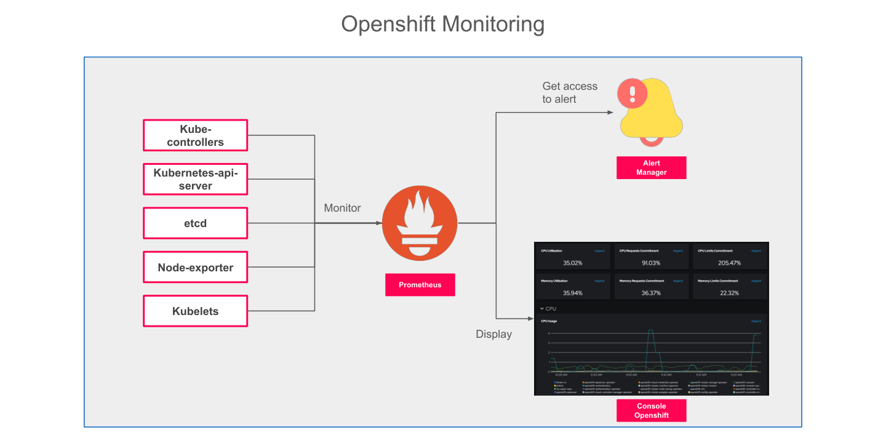

# Observabilité du Cluster OpenShift

## Introduction

L'observabilité est la capacité à comprendre l'état interne d'un système à partir de ses sorties externes. Dans le contexte d'un cluster OpenShift, cela signifie être capable de répondre à des questions comme : les nœuds sont-ils sains ? Les applications consomment-elles trop de mémoire ? Y a-t-il des erreurs réseau répétées ? Des pods sont-ils en boucle de redémarrage ?

OpenShift intègre nativement une stack d'observabilité complète, basée sur des outils open-source de référence. Ce chapitre présente l'architecture de monitoring, les métriques essentielles, les requêtes PromQL et les bonnes pratiques d'exploitation.

---

## Les Trois Piliers de l'Observabilité

L'observabilité d'une plateforme cloud-native repose sur trois disciplines complémentaires :

| Pilier | Description | Outil dans OpenShift |
|--------|-------------|----------------------|
| **Métriques** | Mesures numériques collectées à intervalles réguliers (CPU, mémoire, latence, taux d'erreur) | Prometheus |
| **Logs** | Enregistrements textuels des événements produits par les applications et les composants système | OpenShift Logging (Loki / Elasticsearch) |
| **Traces** | Suivi du chemin d'une requête à travers les différents microservices | OpenShift Distributed Tracing (Jaeger / Tempo) |

:::info Portée de ce chapitre
Ce chapitre se concentre sur les **métriques** et l'**alerting**, qui constituent la couche d'observabilité activée par défaut dans tout cluster OpenShift. Les logs et les traces nécessitent l'installation d'opérateurs supplémentaires.
:::

---

## Architecture de la Stack de Monitoring

OpenShift déploie automatiquement une stack de monitoring complète dans le namespace `openshift-monitoring`. Cette stack est entièrement gérée par l'opérateur **Cluster Monitoring Operator (CMO)**, qui assure sa configuration, sa mise à jour et sa haute disponibilité.



*Architecture de la stack de monitoring OpenShift : Prometheus collecte les métriques, Alertmanager gère les notifications, et la console affiche les dashboards.*

### Les composants principaux

| Composant | Rôle | Namespace |
|-----------|------|-----------|
| **Prometheus** | Collecte et stockage des métriques, évaluation des règles d'alerte | `openshift-monitoring` |
| **Alertmanager** | Réception, déduplication et routage des alertes vers les canaux de notification | `openshift-monitoring` |
| **Thanos Querier** | Agrégation des métriques entre plusieurs instances Prometheus | `openshift-monitoring` |
| **Grafana** | Tableaux de bord de visualisation (lecture seule par défaut) | `openshift-monitoring` |
| **kube-state-metrics** | Exporte les métriques d'état des objets Kubernetes (Deployments, Pods, Nodes) | `openshift-monitoring` |
| **node-exporter** | Exporte les métriques système des nœuds (CPU, RAM, disque, réseau) | `openshift-monitoring` |

### Monitoring des applications utilisateur

En plus du monitoring de la plateforme, OpenShift permet d'activer un monitoring dédié aux **workloads utilisateur**. Cela déploie une instance Prometheus séparée dans `openshift-user-workload-monitoring`.

```bash
# Activer le monitoring des workloads utilisateur
oc patch configmap cluster-monitoring-config \
  -n openshift-monitoring \
  --type=merge \
  -p '{"data":{"config.yaml":"enableUserWorkload: true\n"}}'
```

:::tip Séparation des concerns
La séparation entre le monitoring de la plateforme et celui des workloads utilisateur permet aux équipes applicatives de définir leurs propres règles d'alerte sans impacter la configuration système.
:::

---

## Consulter les Métriques depuis la Console

La console OpenShift expose une interface dédiée à l'observabilité sous la section **Observe** du menu latéral.


*Vue "Dashboards" dans la console OpenShift : le tableau de bord "Kubernetes / Compute Resources / Namespace" affiche l'utilisation CPU, mémoire et le nombre de pods pour un namespace sélectionné.*

### Les sous-sections disponibles

| Section | Contenu |
|---------|---------|
| **Dashboards** | Tableaux de bord préconfigurés (nœuds, namespaces, pods, Kubernetes) |
| **Metrics** | Interface de requêtes PromQL avec graphiques interactifs |
| **Alerts** | Liste des alertes actives et de leur historique |
| **Targets** | Etat des cibles de scraping Prometheus (up/down) |

---

## Métriques Essentielles à Surveiller

### Métriques de ressources computationnelles

| Métrique | Signification | Seuil d'alerte typique |
|----------|---------------|------------------------|
| CPU usage par pod | Consommation CPU réelle vs limite configurée | > 90% de la limite |
| Memory usage par pod | Consommation mémoire réelle vs limite | > 85% de la limite |
| CPU throttling | Pourcentage du temps où le pod est limité en CPU | > 25% |
| OOMKill | Nombre de fois où un pod a été tué pour dépassement mémoire | > 0 |

### Métriques réseau

| Métrique | Signification |
|----------|---------------|
| `container_network_receive_bytes_total` | Octets reçus par conteneur |
| `container_network_transmit_bytes_total` | Octets envoyés par conteneur |
| `container_network_receive_errors_total` | Erreurs de réception réseau |

### Métriques d'état des workloads

| Métrique | Signification |
|----------|---------------|
| `kube_pod_container_status_restarts_total` | Nombre de redémarrages d'un conteneur |
| `kube_deployment_status_replicas_unavailable` | Replicas non disponibles dans un Deployment |
| `kube_node_status_condition` | Etat de santé d'un nœud |
| `kubelet_running_pods` | Nombre de pods actifs sur un nœud |

### Métriques de stockage

| Métrique | Signification |
|----------|---------------|
| `kubelet_volume_stats_used_bytes` | Espace utilisé dans un volume persistant |
| `kubelet_volume_stats_capacity_bytes` | Capacité totale d'un volume persistant |
| `kubelet_volume_stats_inodes_free` | Inodes disponibles (saturation système de fichiers) |

---

## Requêtes PromQL : Exemples Pratiques

**PromQL** (Prometheus Query Language) est le langage de requête natif de Prometheus. Il permet d'interroger, d'agréger et de transformer les métriques collectées.

### Utilisation CPU d'un namespace

```promql
# CPU utilisé par tous les pods d'un namespace (en cores)
sum(rate(container_cpu_usage_seconds_total{namespace="webapp", container!=""}[5m]))
```

### Pourcentage de mémoire utilisée par un pod

```promql
# Ratio mémoire utilisée / limite pour chaque conteneur
container_memory_working_set_bytes{namespace="webapp"}
  /
container_spec_memory_limit_bytes{namespace="webapp"} * 100
```

### Détecter les pods en redémarrage fréquent

```promql
# Pods avec plus de 5 redémarrages dans le namespace "webapp"
kube_pod_container_status_restarts_total{namespace="webapp"} > 5
```

### Taux d'erreurs HTTP (si métriques applicatives exposées)

```promql
# Taux d'erreurs 5xx sur les 5 dernières minutes
rate(http_requests_total{status=~"5..", namespace="webapp"}[5m])
```

### Espace disque restant sur les volumes persistants (alerte < 20%)

```promql
(
  kubelet_volume_stats_capacity_bytes - kubelet_volume_stats_used_bytes
) / kubelet_volume_stats_capacity_bytes * 100 < 20
```

:::info Accès à l'interface PromQL
Dans la console OpenShift, accédez à **Observe > Metrics** pour saisir et exécuter des requêtes PromQL directement depuis le navigateur, avec visualisation graphique intégrée.
:::

---

## Gestion des Alertes avec Alertmanager

### Architecture de l'alerting

Le flux d'alerte dans OpenShift suit ce chemin :

1. **Prometheus** évalue en continu les règles d'alerte (PrometheusRule).
2. Quand une condition est vraie pendant la durée `for` configurée, l'alerte passe en état **firing**.
3. **Alertmanager** reçoit l'alerte et applique les règles de routage.
4. L'alerte est transmise aux **receivers** configurés (email, Slack, PagerDuty, webhook).

### Configurer un receiver Alertmanager

```yaml
apiVersion: monitoring.coreos.com/v1beta1
kind: AlertmanagerConfig
metadata:
  name: slack-alerts
  namespace: webapp
spec:
  route:
    receiver: slack-notifications
    groupBy: ['alertname', 'namespace']
    groupWait: 30s
    groupInterval: 5m
    repeatInterval: 12h
  receivers:
    - name: slack-notifications
      slackConfigs:
        - apiURL:
            name: slack-webhook-secret
            key: url
          channel: '#openshift-alerts'
          title: 'Alerte OpenShift — {{ .GroupLabels.alertname }}'
          text: 'Namespace: {{ .GroupLabels.namespace }}'
```

### Créer une règle d'alerte personnalisée

```yaml
apiVersion: monitoring.coreos.com/v1
kind: PrometheusRule
metadata:
  name: webapp-alerts
  namespace: webapp
spec:
  groups:
    - name: webapp.rules
      interval: 30s
      rules:
        - alert: PodRestartingTooOften
          expr: |
            rate(kube_pod_container_status_restarts_total{namespace="webapp"}[15m]) * 60 > 1
          for: 5m
          labels:
            severity: warning
          annotations:
            summary: "Pod {{ $labels.pod }} redémarre trop souvent"
            description: "Le pod {{ $labels.pod }} du namespace {{ $labels.namespace }} a redémarré plus d'une fois par minute sur les 15 dernières minutes."
```

:::warning Alertes système prédéfinies
OpenShift fournit plus de 200 règles d'alerte prédéfinies couvrant tous les composants de la plateforme. Avant de créer vos propres règles, vérifiez dans **Observe > Alerts** si une alerte similaire n'existe pas déjà.
:::

---

## Tableaux de Bord Préconfigurés

La console OpenShift inclut plusieurs tableaux de bord Grafana accessibles directement dans **Observe > Dashboards** :

| Tableau de bord | Contenu |
|-----------------|---------|
| `Kubernetes / Compute Resources / Cluster` | Vue globale du cluster (CPU, mémoire, pods) |
| `Kubernetes / Compute Resources / Namespace` | Ressources consommées par namespace |
| `Kubernetes / Compute Resources / Pod` | Ressources d'un pod spécifique |
| `Kubernetes / Networking / Namespace` | Trafic réseau par namespace |
| `Node Exporter / Nodes` | Métriques système des nœuds (disque, réseau, charge) |
| `OpenShift / etcd` | Santé et performance du cluster etcd |

---

## Commandes CLI Utiles pour le Monitoring

```bash
# Lister toutes les règles d'alerte actives
oc get prometheusrule --all-namespaces

# Voir les alertes en cours de déclenchement
oc get alerts -n openshift-monitoring

# Accéder à l'interface Prometheus (port-forward)
oc port-forward svc/prometheus-k8s 9090:9090 -n openshift-monitoring

# Accéder à l'interface Alertmanager (port-forward)
oc port-forward svc/alertmanager-main 9093:9093 -n openshift-monitoring

# Vérifier l'état du Cluster Monitoring Operator
oc get clusteroperator monitoring
```

---

## Bonnes Pratiques d'Observabilité

1. **Définissez des limites de ressources** sur tous vos pods : sans limites, les métriques d'utilisation relative (CPU throttling, mémoire en %) n'ont pas de sens.
2. **Créez des alertes sur les symptômes, pas sur les causes** : une alerte "taux d'erreur > 1%" est plus utile qu'une alerte "CPU > 80%".
3. **Instrumentez vos applications** : exposez un endpoint `/metrics` au format Prometheus pour bénéficier du monitoring applicatif en plus du monitoring infrastructure.
4. **Testez vos alertes** : utilisez `amtool` ou l'interface Alertmanager pour simuler des alertes et vérifier que les receivers sont bien configurés.
5. **Archivez les métriques importantes** : Prometheus conserve les métriques par défaut pendant 15 jours. Pour une rétention plus longue, configurez Thanos avec un stockage objet externe.

:::tip Monitoring des quotas de ressources
Ajoutez une alerte sur l'utilisation des `ResourceQuota` de chaque namespace. Quand un quota est à 80% de sa limite, il est temps d'anticiper une augmentation ou une optimisation.
```promql
kube_resourcequota{type="used"} / kube_resourcequota{type="hard"} > 0.8
```
:::
