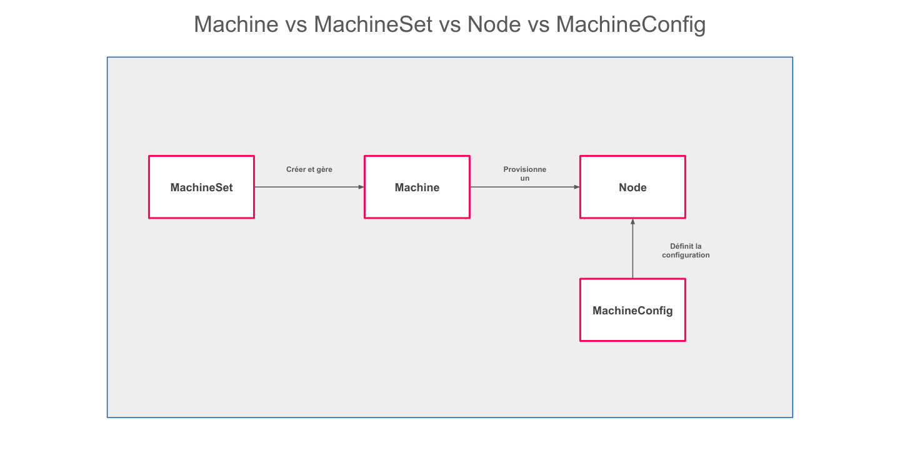

# Nœuds, MachineSets et MachineConfigs

## Introduction

La gestion de l'infrastructure physique et virtuelle d'un cluster OpenShift passe par trois niveaux d'abstraction complémentaires : les **Nœuds** (Nodes), les **MachineSets** et les **MachineConfigs**. Comprendre la distinction entre ces trois concepts est essentiel pour administrer efficacement un cluster en production.

- Les **Nœuds** sont la vue Kubernetes de la capacité de calcul disponible.
- Les **MachineSets** gèrent le cycle de vie des machines sous-jacentes (provisionnement, scaling, remplacement).
- Les **MachineConfigs** standardisent et appliquent la configuration système des nœuds (OS, services, fichiers de configuration).



*Relation entre les trois niveaux d'abstraction : le MachineSet provisionne des Machines qui deviennent des Nœuds Kubernetes. Le MachineConfig configure le système d'exploitation de ces nœuds via le Machine Config Operator.*

---

## Comparaison : Node vs MachineSet vs MachineConfig

| Concept | Couche | Rôle | Qui le gère |
|---------|--------|------|-------------|
| **Node** | Kubernetes | Représente la capacité de calcul (CPU, RAM) disponible pour les pods | Kubernetes Scheduler |
| **Machine** | OpenShift Machine API | Représente une instance de machine (VM, bare-metal) dans le fournisseur cloud | Machine API Operator |
| **MachineSet** | OpenShift Machine API | Groupe de machines avec une configuration commune, gère le scaling | Machine API Operator |
| **MachineConfig** | OpenShift MCO | Configuration système appliquée à l'OS des nœuds (CoreOS) | Machine Config Operator |
| **MachineConfigPool** | OpenShift MCO | Regroupe des nœuds ayant la même configuration cible | Machine Config Operator |

:::info Architecture immutable avec CoreOS
OpenShift utilise **Red Hat CoreOS (RHCOS)** comme système d'exploitation des nœuds. RHCOS est un OS immuable : la racine du système est en lecture seule, et les modifications se font via des MachineConfigs, pas manuellement sur les nœuds.
:::

---

## Les Nœuds (Nodes)

### Anatomie d'un nœud OpenShift

Un nœud OpenShift exécute plusieurs composants essentiels :

| Composant | Rôle |
|-----------|------|
| **CRI-O** | Runtime de conteneurs (remplace Docker dans OpenShift 4) |
| **kubelet** | Agent Kubernetes local — gère le cycle de vie des pods |
| **kube-proxy** | Gestion des règles réseau iptables/nftables |
| **OVN-Kubernetes** | Plugin réseau SDN (Software Defined Networking) |

### Types de nœuds

OpenShift distingue deux catégories principales de nœuds :

| Type | Rôle | Workloads hébergés |
|------|------|-------------------|
| **Control Plane (master)** | Exécution du plan de contrôle Kubernetes | API Server, etcd, Scheduler, Controller Manager |
| **Worker (compute)** | Exécution des charges applicatives | Pods utilisateur, opérateurs, services |
| **Infra** | Nœuds dédiés aux composants d'infrastructure | Ingress Controller, Monitoring, Registry |

:::tip Nœuds infra
En production, il est recommandé de créer des nœuds `infra` dédiés aux composants OpenShift (monitoring, logging, registry) pour éviter que ces workloads n'entrent en concurrence avec les applications utilisateur.
:::

### Consulter l'état des nœuds

```bash
# Lister tous les nœuds avec leur rôle et leur état
oc get nodes

# Afficher des informations détaillées sur un nœud
oc describe node <nom-du-nœud>

# Voir la consommation de ressources par nœud
oc adm top nodes

# Lister les pods d'un nœud spécifique
oc get pods --all-namespaces --field-selector spec.nodeName=<nom-du-nœud>
```

### Déboguer un nœud avec `oc debug`

Quand un nœud présente des anomalies (processus bloqués, problème réseau, corruption de configuration), la commande `oc debug node` permet d'ouvrir un shell privilégié sur le nœud sans SSH direct.

```bash
# Ouvrir un shell de débogage sur un nœud
oc debug node/<nom-du-nœud>

# Dans le shell de débogage, accéder au système de fichiers du nœud
chroot /host

# Vérifier l'état du service kubelet
systemctl status kubelet

# Consulter les journaux du kubelet
journalctl -u kubelet --since "1 hour ago"

# Vérifier l'état du réseau
ip route show
ss -tlnp

# Quitter le débogage
exit
```

:::warning Prudence en mode debug
Le pod de débogage s'exécute avec des privilèges élevés et accès au système de fichiers du nœud. Toute modification de fichiers dans `/host` modifie directement le nœud. Limitez les interventions au strict nécessaire.
:::

### Cordon, Drain et Delete

Pour effectuer des opérations de maintenance sur un nœud (mise à jour, remplacement), OpenShift suit un processus en plusieurs étapes :

```bash
# 1. Cordon : empêcher de nouveaux pods d'être schedulés sur le nœud
oc adm cordon <nom-du-nœud>

# 2. Drain : évacuer les pods existants vers d'autres nœuds
oc adm drain <nom-du-nœud> --ignore-daemonsets --delete-emptydir-data

# 3. Maintenance / remplacement...

# 4. Uncordon : remettre le nœud en service
oc adm uncordon <nom-du-nœud>
```

---

## MachineSets : Gestion Automatisée des Nœuds

### Principe de fonctionnement

Un **MachineSet** est l'équivalent, pour les machines physiques/virtuelles, de ce que le `ReplicaSet` est pour les pods. Il garantit qu'un nombre défini de machines correspondant à une certaine configuration est toujours disponible dans le cluster.

Le **Machine API Operator** surveille en permanence l'état des machines et prend les actions correctives nécessaires :
- Si une machine tombe en panne, elle est automatiquement remplacée.
- Si le nombre de replicas est augmenté, de nouvelles machines sont provisionnées dans le cloud.
- Si le nombre est réduit, les machines excédentaires sont drainées puis supprimées.

### Exemple de MachineSet sur AWS

```yaml
apiVersion: machine.openshift.io/v1beta1
kind: MachineSet
metadata:
  name: cluster-worker-us-east-1a
  namespace: openshift-machine-api
  labels:
    machine.openshift.io/cluster-api-cluster: mon-cluster
spec:
  replicas: 3
  selector:
    matchLabels:
      machine.openshift.io/cluster-api-cluster: mon-cluster
      machine.openshift.io/cluster-api-machineset: cluster-worker-us-east-1a
  template:
    metadata:
      labels:
        machine.openshift.io/cluster-api-cluster: mon-cluster
        machine.openshift.io/cluster-api-machineset: cluster-worker-us-east-1a
        machine.openshift.io/cluster-api-machine-role: worker
        machine.openshift.io/cluster-api-machine-type: worker
    spec:
      providerSpec:
        value:
          apiVersion: awsproviderconfig.openshift.io/v1beta1
          kind: AWSMachineProviderConfig
          ami:
            id: ami-0abc123456789def0
          instanceType: m5.xlarge
          placement:
            availabilityZone: us-east-1a
            region: us-east-1
          subnet:
            filters:
              - name: tag:Name
                values:
                  - mon-cluster-worker-us-east-1a
          iamInstanceProfile:
            id: mon-cluster-worker-profile
```

### Scaling manuel d'un MachineSet

```bash
# Voir tous les MachineSets
oc get machinesets -n openshift-machine-api

# Scaler un MachineSet à 5 replicas
oc scale machineset cluster-worker-us-east-1a \
  --replicas=5 \
  -n openshift-machine-api

# Surveiller la progression du provisionnement
oc get machines -n openshift-machine-api -w
```

### Scaling automatique avec MachineAutoscaler

```yaml
apiVersion: "autoscaling.openshift.io/v1beta1"
kind: "MachineAutoscaler"
metadata:
  name: "worker-autoscaler"
  namespace: openshift-machine-api
spec:
  minReplicas: 2
  maxReplicas: 10
  scaleTargetRef:
    apiVersion: machine.openshift.io/v1beta1
    kind: MachineSet
    name: cluster-worker-us-east-1a
```

---

## MachineConfigs : Configuration Système des Nœuds

### Principe de fonctionnement

Le **Machine Config Operator (MCO)** est responsable de la configuration continue de l'OS des nœuds. Il réconcilie la configuration déclarée (via des objets `MachineConfig`) avec l'état réel du système d'exploitation.

Quand un nouveau `MachineConfig` est appliqué :
1. Le MCO calcule la configuration résultante (en fusionnant tous les MachineConfigs applicables).
2. Il applique les changements nœud par nœud (**rolling update**).
3. Chaque nœud concerné est mis en maintenance, reconfiguré, puis redémarré.
4. Le nœud ne revient en service que si la configuration a été appliquée avec succès.

### Cas d'usage des MachineConfigs

| Cas d'usage | Description |
|-------------|-------------|
| Modifier la configuration du kubelet | Ajuster les logs, les limites de pods par nœud |
| Ajouter des fichiers système | Déposer des certificats CA, des fichiers de configuration |
| Activer/désactiver des services systemd | Activer `iscsid` pour le stockage iSCSI, désactiver des services non nécessaires |
| Configurer les paramètres kernel (sysctl) | Ajuster `net.ipv4.ip_forward`, limites de connexions, etc. |
| Ajouter des extensions kernel modules | Charger des modules noyau spécifiques au démarrage |
| Configurer le registre de conteneurs | Ajouter des miroirs de registry, des registres non sécurisés |

### Exemple : ajouter un fichier de configuration

```yaml
apiVersion: machineconfiguration.openshift.io/v1
kind: MachineConfig
metadata:
  name: 50-worker-chrony-config
  labels:
    machineconfiguration.openshift.io/role: worker
spec:
  config:
    ignition:
      version: 3.2.0
    storage:
      files:
        - path: /etc/chrony.conf
          mode: 0644
          overwrite: true
          contents:
            source: data:text/plain;charset=utf-8,pool%20ntp.example.com%20iburst%0Adriftfile%20%2Fvar%2Flib%2Fchrony%2Fdrift%0Amakestep%201.0%203%0Artcsync%0Alogdir%20%2Fvar%2Flog%2Fchrony
```

### Exemple : activer un service systemd

```yaml
apiVersion: machineconfiguration.openshift.io/v1
kind: MachineConfig
metadata:
  name: 40-worker-enable-iscsid
  labels:
    machineconfiguration.openshift.io/role: worker
spec:
  config:
    ignition:
      version: 3.2.0
    systemd:
      units:
        - name: iscsid.service
          enabled: true
```

### MachineConfigPools

Les nœuds sont regroupés en **MachineConfigPools (MCP)** selon leur rôle. Par défaut, il en existe deux : `master` et `worker`. Il est possible d'en créer d'autres pour les nœuds infra.

```bash
# Lister les MachineConfigPools
oc get mcp

# Observer l'application d'un MachineConfig en temps réel
oc get mcp -w

# Vérifier les MachineConfigs appliqués à un pool
oc describe mcp worker
```

Un MachineConfigPool affiche son état via plusieurs colonnes importantes :

| Colonne | Signification |
|---------|---------------|
| `UPDATED` | Nombre de nœuds à jour avec la configuration cible |
| `UPDATING` | Nombre de nœuds en cours de mise à jour |
| `DEGRADED` | Nombre de nœuds en erreur |

:::warning Impact sur la disponibilité
L'application d'un MachineConfig entraîne le redémarrage de chaque nœud concerné. En production, planifiez l'application des MachineConfigs pendant des fenêtres de maintenance, et vérifiez que vos workloads ont des `PodDisruptionBudgets` configurés pour éviter toute interruption de service.
:::

---

## Taints, Tolérances et Node Selectors

### Taints et Tolérances

Les **taints** (souillures) permettent de marquer un nœud pour repousser les pods qui ne déclarent pas explicitement une tolérance. C'est le mécanisme inverse des labels/sélecteurs : plutôt que d'attirer des pods, les taints repoussent.

**Ajouter une taint sur un nœud :**

```bash
# Syntaxe : oc adm taint nodes <node> <key>=<value>:<effect>
# Effects disponibles : NoSchedule, PreferNoSchedule, NoExecute

# Marquer un nœud comme réservé pour les workloads GPU
oc adm taint nodes worker-gpu-01 dedicated=gpu:NoSchedule

# Retirer une taint
oc adm taint nodes worker-gpu-01 dedicated=gpu:NoSchedule-
```

**Déclarer une tolérance dans un pod :**

```yaml
apiVersion: v1
kind: Pod
metadata:
  name: gpu-workload
spec:
  tolerations:
    - key: "dedicated"
      operator: "Equal"
      value: "gpu"
      effect: "NoSchedule"
  containers:
    - name: gpu-app
      image: my-gpu-app:latest
```

| Effect | Comportement |
|--------|-------------|
| `NoSchedule` | Les pods sans tolérance ne sont pas schedulés sur ce nœud |
| `PreferNoSchedule` | Kubernetes évite de scheduler des pods sans tolérance, mais peut le faire si nécessaire |
| `NoExecute` | Les pods sans tolérance sont évincés du nœud (et ne peuvent pas y être schedulés) |

### Node Selectors

Les **node selectors** permettent de contraindre un pod à s'exécuter sur des nœuds ayant des labels spécifiques.

**Ajouter un label sur un nœud :**

```bash
# Labelliser un nœud avec un type de matériel
oc label node worker-gpu-01 hardware-type=gpu

# Vérifier les labels d'un nœud
oc get node worker-gpu-01 --show-labels
```

**Utiliser un nodeSelector dans un pod ou Deployment :**

```yaml
apiVersion: apps/v1
kind: Deployment
metadata:
  name: gpu-inference
spec:
  replicas: 2
  selector:
    matchLabels:
      app: gpu-inference
  template:
    metadata:
      labels:
        app: gpu-inference
    spec:
      nodeSelector:
        hardware-type: gpu
      containers:
        - name: inference
          image: inference-app:latest
```

### Node Affinity (alternative avancée)

Pour des règles de placement plus fines (obligatoires ou préférentielles), utilisez les **node affinity rules** :

```yaml
spec:
  affinity:
    nodeAffinity:
      requiredDuringSchedulingIgnoredDuringExecution:
        nodeSelectorTerms:
          - matchExpressions:
              - key: hardware-type
                operator: In
                values:
                  - gpu
                  - fpga
      preferredDuringSchedulingIgnoredDuringExecution:
        - weight: 1
          preference:
            matchExpressions:
              - key: zone
                operator: In
                values:
                  - us-east-1a
```

:::tip Combiner taints et node selectors
En production, combinez les deux mécanismes : utilisez des taints pour s'assurer que seuls les workloads autorisés s'exécutent sur les nœuds spécialisés, et utilisez des node selectors dans les Deployments pour que ces workloads soient bien dirigés vers les bons nœuds.
:::

---

## Bonnes Pratiques

1. **Ne modifiez jamais un nœud manuellement** : toute modification manuelle sera écrasée par le MCO. Utilisez toujours des MachineConfigs pour les changements de configuration système.
2. **Nommez vos MachineConfigs avec un préfixe numérique** : le MCO les fusionne et les applique dans l'ordre alphabétique. Un prefixe `00-`, `50-`, `99-` permet de contrôler l'ordre d'application.
3. **Testez les MachineConfigs sur un nœud de test** : créez un MachineConfigPool dédié avec un seul nœud avant de déployer une nouvelle configuration sur l'ensemble du pool `worker`.
4. **Surveillez l'état des MachineConfigPools** : un pool en état `DEGRADED` indique qu'un nœud n'a pas pu appliquer la configuration. Consultez les journaux du MCO pour diagnostiquer.
5. **Documentez vos MachineConfigs** : chaque MachineConfig doit avoir une annotation `description` expliquant son objectif pour faciliter la maintenance future.
