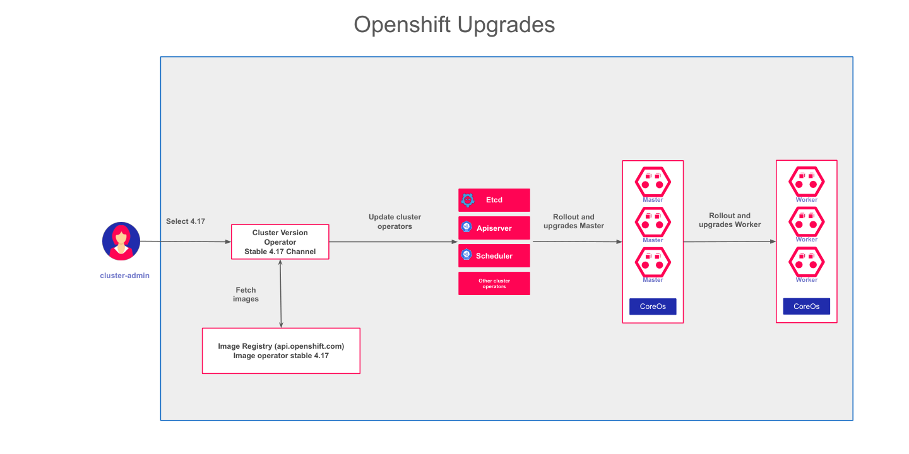

# Gestion des Mises à Jour du Cluster OpenShift

## Introduction

La mise à jour d'un cluster OpenShift est une opération critique qui concerne simultanément plusieurs couches de la plateforme : le système d'exploitation des nœuds (Red Hat CoreOS), les composants Kubernetes, les opérateurs de la plateforme et les configurations associées. OpenShift intègre un mécanisme de mise à jour **Over-the-Air (OTA)** qui orchestre l'ensemble de ce processus de manière automatisée et sécurisée.

Ce chapitre présente le fonctionnement du mécanisme de mise à jour, les canaux de distribution disponibles, et les procédures à suivre pour effectuer une mise à jour en production en toute sécurité.

---

## Principe du Mécanisme Over-the-Air (OTA)

### Qu'est-ce qu'une mise à jour OTA ?

Contrairement à une mise à jour traditionnelle qui nécessite une intervention manuelle sur chaque machine, le mécanisme OTA d'OpenShift :

1. Interroge automatiquement le **Cincinnati Graph API** (service cloud Red Hat) pour connaître les mises à jour disponibles.
2. Vérifie la compatibilité entre la version actuelle et les versions cibles (graphe de mise à jour).
3. Télécharge les nouvelles images de conteneurs depuis le registry Red Hat.
4. Orchestre l'application des mises à jour dans un ordre précis, sans interruption de service.

:::info Connectivité requise
Par défaut, le cluster doit pouvoir accéder à `api.openshift.com` pour consulter le graphe de mises à jour. Dans les environnements air-gapped (sans accès Internet), une configuration spécifique avec un miroir de registry local est nécessaire.
:::



*Le CVO orchestre la mise à jour de toutes les couches du cluster dans un ordre déterminé*

### Le Cluster Version Operator (CVO)

Le **Cluster Version Operator** est le chef d'orchestre de toutes les mises à jour. Il s'exécute dans le namespace `openshift-cluster-version` et est responsable de :

- surveiller en continu la version courante du cluster,
- comparer avec les versions disponibles dans le canal sélectionné,
- appliquer les mises à jour des **ClusterOperators** dans un ordre séquentiel déterminé par les dépendances,
- gérer les erreurs et les rollbacks si nécessaire.

```bash
# Vérifier l'état du Cluster Version Operator
oc get clusteroperator version

# Voir la version actuelle et les mises à jour disponibles
oc get clusterversion

# Affichage détaillé avec historique
oc describe clusterversion version
```

---

## Les Canaux de Mise à Jour

OpenShift utilise un système de **canaux** (channels) pour segmenter les mises à jour selon leur niveau de stabilité et de test.

| Canal | Stabilité | Recommandation | Description |
|-------|-----------|---------------|-------------|
| `stable-4.x` | Haute | Production | Versions ayant passé tous les tests de qualité Red Hat et un délai de validation en conditions réelles |
| `fast-4.x` | Bonne | Pre-production | Versions disponibles peu après leur sortie, avant le délai de validation du canal stable |
| `candidate-4.x` | Variable | Test / Validation | Release candidates en cours de qualification, non destinées à la production |
| `eus-4.x` | Haute | Production LTS | Extended Update Support - versions avec un cycle de support étendu (recommandées pour les clusters à faible fréquence de mise à jour) |

:::tip Canal recommandé en production
Pour les environnements de production, utilisez toujours le canal **`stable-4.x`**. Il offre la meilleure garantie de stabilité car les versions y arrivent après une période d'observation sur le canal `fast`.
:::

:::info Canaux EUS
Les canaux EUS (`eus-4.8`, `eus-4.10`, etc.) permettent de passer directement d'une version mineure à une autre (ex : 4.8 vers 4.10) sans passer par toutes les versions intermédiaires. C'est particulièrement utile pour les clusters qui ne peuvent pas être mis à jour fréquemment.
:::

### Changer de canal

```bash
# Passer au canal stable-4.14
oc patch clusterversion version \
  --type merge \
  -p '{"spec":{"channel":"stable-4.14"}}'

# Vérifier le canal actif
oc get clusterversion -o jsonpath='{.items[0].spec.channel}'
```

---

## Etapes d'une Mise à Jour : Vue d'Ensemble

Une mise à jour OpenShift suit un déroulement en plusieurs phases bien définies :

### Phase 1 - Vérification et préparation

1. Le CVO télécharge le manifeste de la nouvelle version depuis le Cincinnati Graph API.
2. Il vérifie que le chemin de mise à jour est valide (certaines versions ne peuvent pas être atteintes directement).
3. Il vérifie que tous les ClusterOperators sont dans un état `Available` avant de démarrer.

### Phase 2 - Mise à jour du plan de contrôle

4. Le CVO met à jour les composants critiques du plan de contrôle (API Server, etcd, Controller Manager, Scheduler).
5. Chaque ClusterOperator est mis à jour séquentiellement. Si l'un d'eux échoue, le processus se met en pause.

### Phase 3 - Mise à jour des nœuds workers

6. Le **Machine Config Operator** applique la nouvelle configuration CoreOS sur les nœuds workers, un par un (rolling update).
7. Pour chaque nœud : cordon → drain des pods → redémarrage → uncordon.
8. Le scheduler Kubernetes replace les pods évacués sur les autres nœuds disponibles.

### Phase 4 - Validation

9. Le CVO vérifie que tous les nœuds sont dans l'état `Ready` et que tous les ClusterOperators sont `Available`.
10. La mise à jour est marquée comme terminée avec la nouvelle version.

---

## Procédure de Mise à Jour en Production

### Avant la mise à jour

:::warning Sauvegarder avant toute mise à jour
Avant toute mise à jour de version mineure, effectuez une sauvegarde de la configuration du cluster. En particulier :
- Exportez la configuration etcd (snapshot etcd).
- Sauvegardez les ressources critiques (namespaces, secrets, ConfigMaps).
- Documentez l'état actuel du cluster.

```bash
# Vérifier que tous les opérateurs sont sains
oc get clusteroperators

# Vérifier l'état des nœuds
oc get nodes

# Vérifier les alertes actives (aucune critique ne doit être présente)
oc get alerts -n openshift-monitoring
```
:::

### Vérifier les mises à jour disponibles

```bash
# Afficher la version courante et les mises à jour disponibles
oc adm upgrade

# Exemple de sortie :
# Cluster version is 4.13.15
#
# Upstream is unset, so the cluster will use an appropriate default.
# Channel: stable-4.14 (available channels: candidate-4.13, candidate-4.14, fast-4.13, fast-4.14, stable-4.13, stable-4.14)
#
# Recommended updates:
#   VERSION     IMAGE
#   4.14.8      quay.io/openshift-release-dev/ocp-release@sha256:...
#   4.13.22     quay.io/openshift-release-dev/ocp-release@sha256:...
```

### Lancer la mise à jour

```bash
# Mise à jour vers la dernière version recommandée du canal
oc adm upgrade --to-latest

# Mise à jour vers une version spécifique
oc adm upgrade --to=4.14.8

# Mise à jour forcée vers une version non recommandée (déconseillé)
oc adm upgrade --to=4.14.8 --allow-not-recommended
```

### Surveiller la progression

```bash
# Surveiller l'état de la mise à jour en temps réel
oc get clusterversion -w

# Voir les détails de progression
oc describe clusterversion version

# Surveiller les ClusterOperators pendant la mise à jour
watch -n 10 'oc get clusteroperators'

# Surveiller les nœuds pendant la mise à jour
watch -n 10 'oc get nodes'

# Surveiller les MachineConfigPools
watch -n 10 'oc get mcp'
```

### Interpréter l'état de la mise à jour

```bash
# Etat des ClusterOperators pendant une mise à jour
NAME                                       AVAILABLE   PROGRESSING   DEGRADED
authentication                             True        False         False
console                                    True        True          False    # En cours de mise à jour
dns                                        True        False         False
etcd                                       True        False         False
kube-apiserver                             True        False         False
machine-config                             True        True          False    # MCO en cours
monitoring                                 True        False         False
network                                    True        False         False
```

:::info Durée d'une mise à jour
Une mise à jour d'une version mineure (ex : 4.13 vers 4.14) prend typiquement entre **45 minutes et 2 heures** selon la taille du cluster et les conditions réseau. Une mise à jour patch (ex : 4.14.7 vers 4.14.8) prend environ 20 à 40 minutes.
:::

---

## Mise à Jour des Nœuds et Continuité de Service

### PodDisruptionBudgets (PDB)

Pour garantir la continuité de service pendant l'éviction des pods, définissez des **PodDisruptionBudgets** sur vos applications critiques.

```yaml
apiVersion: policy/v1
kind: PodDisruptionBudget
metadata:
  name: webapp-pdb
  namespace: webapp
spec:
  # Garantit qu'au moins 2 replicas sont disponibles pendant la mise à jour
  minAvailable: 2
  selector:
    matchLabels:
      app: webapp
```

```yaml
apiVersion: policy/v1
kind: PodDisruptionBudget
metadata:
  name: api-pdb
  namespace: webapp
spec:
  # Garantit qu'au plus 1 replica est indisponible à la fois
  maxUnavailable: 1
  selector:
    matchLabels:
      app: api
```

:::warning PDB et blocage de mise à jour
Un PDB trop restrictif (ex : `minAvailable: 100%`) peut **bloquer la mise à jour** si aucun pod ne peut être évincé. Assurez-vous que vos PDB permettent au moins l'éviction d'un pod à la fois.
:::

### MaxUnavailable dans les MachineConfigPools

Il est possible de contrôler le nombre de nœuds mis à jour simultanément dans un pool :

```yaml
apiVersion: machineconfiguration.openshift.io/v1
kind: MachineConfigPool
metadata:
  name: worker
spec:
  maxUnavailable: "10%"  # Met à jour 10% des nœuds à la fois
  # ou une valeur absolue :
  # maxUnavailable: 2
```

---

## Vérification Post-Mise à Jour

Après la fin d'une mise à jour, effectuez les vérifications suivantes :

```bash
# 1. Confirmer la nouvelle version
oc get clusterversion

# 2. Vérifier que tous les opérateurs sont disponibles
oc get clusteroperators | grep -v "True.*False.*False"
# (cette commande ne doit rien afficher si tout est sain)

# 3. Vérifier l'état de tous les nœuds
oc get nodes | grep -v "Ready"
# (cette commande ne doit rien afficher si tous les nœuds sont Ready)

# 4. Vérifier les MachineConfigPools
oc get mcp
# UPDATED doit être égal au total des nœuds dans chaque pool

# 5. Vérifier les alertes
oc get prometheusrule --all-namespaces
```

---

## Résolution des Problèmes Courants

### Mise à jour bloquée sur un ClusterOperator

```bash
# Identifier l'opérateur en échec
oc get clusteroperators | grep -v "True.*False.*False"

# Obtenir les détails de l'erreur
oc describe clusteroperator <nom-de-l-operateur>

# Consulter les logs de l'opérateur
oc logs -n openshift-<nom-de-l-operateur> -l app=<nom-de-l-operateur> --tail=100
```

### Nœud bloqué en cours de mise à jour

```bash
# Identifier les nœuds en cours de mise à jour
oc get nodes | grep SchedulingDisabled

# Vérifier les logs du Machine Config Daemon sur le nœud
oc logs -n openshift-machine-config-operator \
  $(oc get pod -n openshift-machine-config-operator \
    -l k8s-app=machine-config-daemon \
    --field-selector spec.nodeName=<nom-du-nœud> \
    -o name)
```

---

## Tableau de Bord des Versions et Mises à Jour

La console OpenShift offre une vue graphique de l'état du cluster et des mises à jour disponibles. Accédez à **Administration > Cluster Settings** pour :

- voir la version actuelle du cluster,
- consulter les mises à jour disponibles,
- lancer une mise à jour depuis l'interface,
- suivre la progression de la mise à jour avec un indicateur visuel,
- consulter l'historique des mises à jour passées.

:::tip Fenêtres de maintenance
En production, planifiez les mises à jour durant des fenêtres de maintenance prédéfinies, de préférence en dehors des heures de pointe. Communiquez ces fenêtres à vos équipes applicatives pour qu'elles s'assurent que leurs applications sont résilientes (replicas multiples, PDB configurés).
:::
