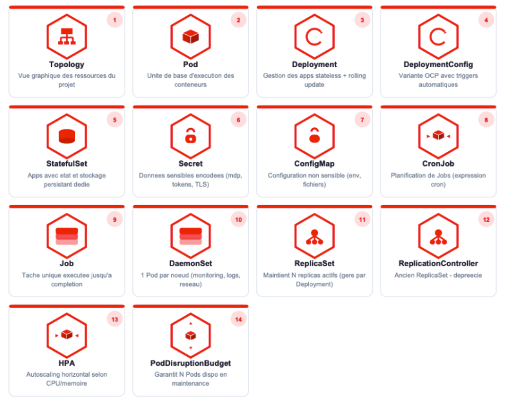

# Chapitre 2 : Maîtriser les ressources de base dans OpenShift

## 1. Introduction aux Workloads

### Définition d'un Workload dans OpenShift / Kubernetes

Un Workload dans Kubernetes / OpenShift est une ressource qui permet de déployer et gérer des applications dans le cluster, généralement sous forme de Pods et de conteneurs.

Exemples de Workloads :

## Rôle des Workloads dans l'exécution des applications

Les Workloads dans Kubernetes / OpenShift permettent de déployer, exécuter et gérer les
applications dans le cluster. Ils contrôlent :

- La **création des Pods** et leur configuration
- La **mise à l'échelle (scaling)** automatique ou manuelle
- La **mise à jour** des applications sans interruption de service
- La **disponibilité** et la résilience des applications

:::tip Bonne pratique
On ne déploie jamais un Pod directement en production. On utilise toujours un Workload
(Deployment, StatefulSet, etc.) qui va gérer le cycle de vie des Pods automatiquement.
:::

## Les types de Workloads dans OpenShift

OpenShift propose 14 types de ressources pour gérer vos applications :

| # | Ressource | Description |
|---|-----------|-------------|
| 1 | **Topology** | Vue graphique des ressources du projet |
| 2 | **Pod** | Unité de base d'exécution des conteneurs |
| 3 | **Deployment** | Gestion des apps stateless + rolling update |
| 4 | **DeploymentConfig** | Variante OCP avec triggers automatiques |
| 5 | **StatefulSet** | Apps avec état et stockage persistant dédié |
| 6 | **Secret** | Données sensibles encodées (mdp, tokens, TLS) |
| 7 | **ConfigMap** | Configuration non sensible (env, fichiers) |
| 8 | **CronJob** | Planification de Jobs (expression cron) |
| 9 | **Job** | Tâche unique exécutée jusqu'à complétion |
| 10 | **DaemonSet** | 1 Pod par nœud (monitoring, logs, réseau) |
| 11 | **ReplicaSet** | Maintient N replicas actifs (géré par Deployment) |
| 12 | **ReplicationController** | Ancien ReplicaSet - déprécié |
| 13 | **HPA** | Autoscaling horizontal selon CPU/mémoire |
| 14 | **PodDisruptionBudget** | Garantit N Pods dispo en maintenance |

:::warning DeploymentConfig vs Deployment
Dans les anciennes versions d'OpenShift, on utilisait le **DeploymentConfig** (spécifique OCP).
Aujourd'hui, il est recommandé d'utiliser le **Deployment** natif Kubernetes qui est plus
portable et mieux supporté.
:::