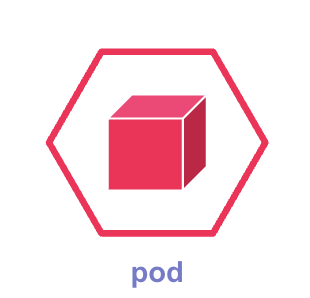
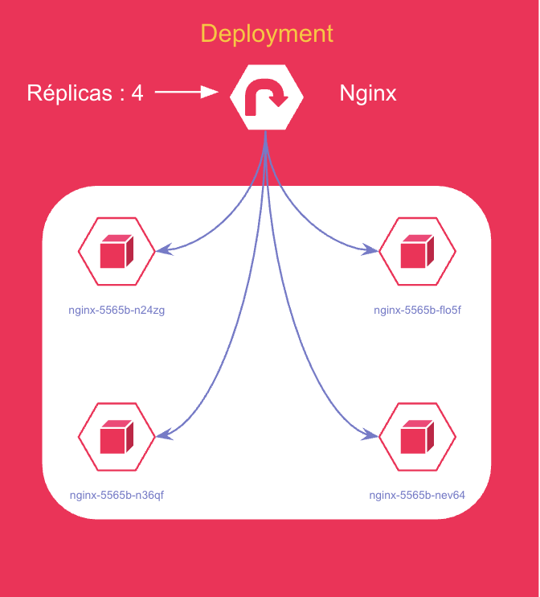
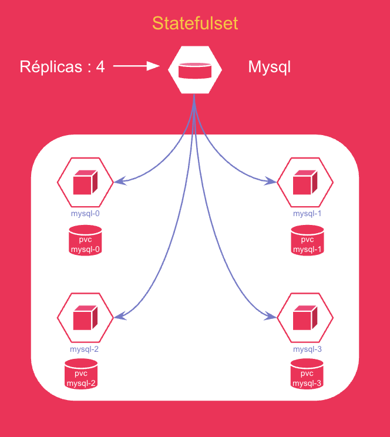

# Les ressources principales

## Pod

L'unité la plus petite dans OpenShift. Un Pod contient un ou plusieurs conteneurs qui partagent
le même réseau et stockage. C'est l'élément fondamental de toute application déployée.



:::info Qu'est-ce qu'un Pod ?
Un Pod est l'unité d'exécution de base dans OpenShift / Kubernetes. Il encapsule un ou plusieurs
conteneurs, leurs ressources de stockage, une adresse IP unique dans le cluster, et des options
qui définissent comment les conteneurs doivent s'exécuter.
:::

**Caractéristiques d'un Pod :**

- Un Pod peut contenir **un ou plusieurs conteneurs**
- Tous les conteneurs d'un Pod **partagent la même adresse IP**
- Les conteneurs d'un Pod **communiquent entre eux via localhost**
- Un Pod est **éphémère** : s'il tombe, il n'est pas relancé automatiquement (c'est le rôle des contrôleurs)

:::warning Important
On ne déploie jamais un Pod directement en production. On utilise toujours un **Deployment**
ou un **StatefulSet** qui va gérer automatiquement le cycle de vie des Pods.
:::

---

## Deployment

Un Deployment est un objet API natif de Kubernetes/OpenShift qui permet de définir et gérer
l'état désiré d'une application en spécifiant un modèle de Pod et le nombre de réplicas à
exécuter. Il crée et gère des **ReplicaSets** afin d'assurer la création, la mise à jour et
le maintien du cycle de vie des Pods.



Par exemple, la définition de déploiement suivante crée un ReplicaSet afin de lancer un Pod Nginx :
```yaml
apiVersion: apps/v1        # Version de l'API Kubernetes utilisée pour les Deployments
kind: Deployment           # Type de ressource : Deployment
metadata:                  # Informations générales sur la ressource
  name: nginx              # Nom du Deployment
  namespace: mon-projet    # Namespace / projet OpenShift
spec:                      # ① Spécification du Deployment
  replicas: 4              # ② Nombre de Pods à créer
  selector:                # ③ Sélecteur pour identifier les Pods
    matchLabels:
      app: nginx           # Le Deployment gère les Pods avec ce label
  template:                # ④ Modèle de Pod qui sera créé
    metadata:
      labels:
        app: nginx         # Label appliqué aux Pods
    spec:                  # ⑤ Spécification du Pod
      containers:          # ⑥ Liste des conteneurs du Pod
      - name: nginx        # Nom du conteneur
        image: nginx:1.24  # Image Docker utilisée
        ports:
        - containerPort: 80  # Port exposé par le conteneur
```

① **Spécification du Deployment** → Définit comment l'application doit être déployée.

② **Nombre de réplicas** → Kubernetes va créer **4 Pods nginx**.

③ **Selector (sélecteur)** → Permet au Deployment de **trouver et gérer les Pods** avec le label `app: nginx`.

④ **Modèle de Pod (template)** → Décrit **comment chaque Pod doit être créé**.

⑤ **Spécification du Pod** → Configuration interne du Pod.

⑥ **Conteneur** → Définition du conteneur **nginx** avec l'image et le port.

---

## StatefulSet

StatefulSet est utilisé dans Kubernetes pour gérer des applications avec des **données
persistantes**, comme les bases de données. Chaque Pod possède une **identité unique** et son
**propre stockage**.



**Différence entre Deployment et StatefulSet :**

| Critère | Deployment | StatefulSet |
|---------|------------|-------------|
| Type d'application | Stateless (sans état) | Stateful (avec état) |
| Identité des Pods | Aléatoire | Unique et stable (mysql-0, mysql-1...) |
| Stockage | Partagé | Dédié par Pod |
| Cas d'usage | nginx, API REST | MySQL, PostgreSQL, Kafka |

Dans notre exemple, le StatefulSet déploie une base de données MySQL avec 4 pods
(`mysql-0`, `mysql-1`, `mysql-2`, `mysql-3`) :

```yaml
apiVersion: apps/v1
kind: StatefulSet
metadata:
  name: mysql
  namespace: mon-projet
spec:                                    # ① Spécification du StatefulSet
  serviceName: mysql-service            # ② Service pour l'identité réseau des Pods
  replicas: 4                           # ③ Nombre de Pods MySQL à créer
  selector:                             # ④ Sélecteur pour identifier les Pods
    matchLabels:
      app: mysql
  template:                             # ⑤ Modèle de création des Pods
    metadata:
      labels:
        app: mysql
    spec:                               # ⑥ Spécification du Pod
      containers:
      - name: mysql
        image: mysql:8.0               # ⑦ Image Docker utilisée
        ports:
        - containerPort: 3306          # ⑧ Port utilisé par MySQL
        env:                           # ⑨ Variables d'environnement
        - name: MYSQL_ROOT_PASSWORD
          value: password123
        volumeMounts:                  # ⑩ Montage du stockage dans le conteneur
        - name: mysql-storage
          mountPath: /var/lib/mysql
  volumeClaimTemplates:                # ⑪ Création automatique des volumes persistants
  - metadata:
      name: mysql-storage
    spec:
      accessModes: ["ReadWriteOnce"]
      resources:
        requests:
          storage: 1Gi
```

① **Spécification du StatefulSet** → Configuration globale du StatefulSet.

② **serviceName** → Donne une identité réseau stable aux Pods.

③ **replicas** → Nombre de Pods MySQL à créer.

④ **selector** → Identifie les Pods gérés par le StatefulSet.

⑤ **template** → Modèle utilisé pour créer chaque Pod.

⑥ **spec du Pod** → Configuration interne du Pod.

⑦ **image** → Image Docker de la base de données MySQL.

⑧ **containerPort** → Port utilisé par MySQL pour les connexions.

⑨ **env** → Variables d'environnement pour configurer le conteneur.

⑩ **volumeMounts** → Montage du stockage persistant dans le conteneur.

⑪ **volumeClaimTemplates** → Crée un volume persistant (PVC) pour chaque Pod.