# Exercice guidé : Déployer une application

## Objectif

Pour résoudre cet exercice :

:::info Objectif de l'exercice
Créer un projet, déployer une application nginx, augmenter le nombre de pods, et vérifier le
fonctionnement du déploiement dans le cluster.
:::

Nous allons suivre des étapes simples dans la console OpenShift.

## Étape 1 — Aller à la page de la console après l'installation du cluster

Après l'installation du cluster OpenShift, on arrive sur la page **Red Hat Hybrid Cloud Console**.

Sur cette page on voit :

- Le message **"Installation completed successfully"**
- Le bouton **"Launch OpenShift Console"**
- L'URL de la console : `https://oauth-openshift.apps.neutron-sno-office.neutron-it.fr`

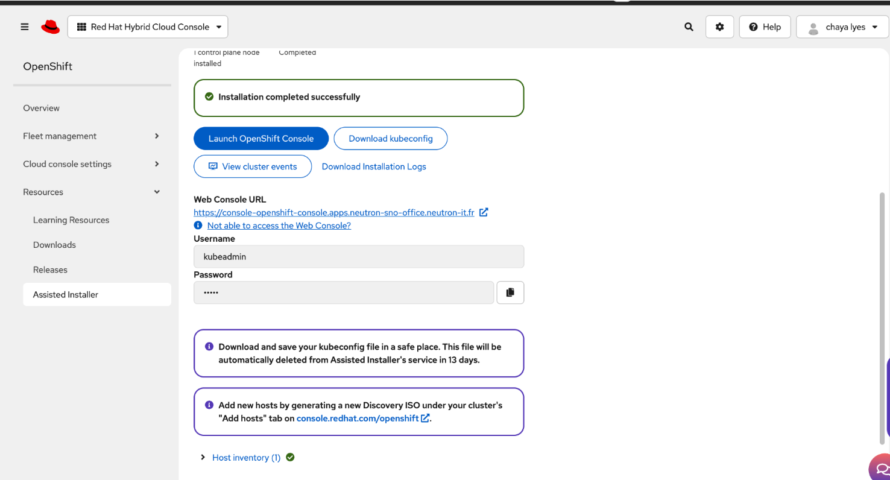

:::tip Accès à la console
Cette page permet d'**accéder à la console web du cluster OpenShift**. Les identifiants
`kubeadmin` sont disponibles directement sur cette page lors de la première installation.
:::

---
## Étape 2 — Choisir le bon type de connexion

Après avoir ouvert la console, la page suivante apparaît :

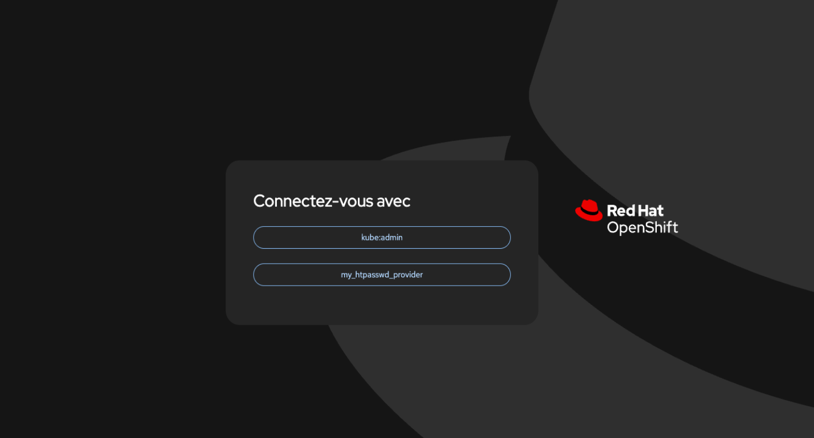

Sur votre page, vous voyez deux options :

- `kube:admin`
- `my_htpasswd_provider`

Clique sur :

- `my_htpasswd_provider`

car c'est le **provider d'authentification des utilisateurs du cluster**.

:::info Pourquoi my_htpasswd_provider ?
`kube:admin` est le compte administrateur système du cluster, réservé aux opérations
d'administration. `my_htpasswd_provider` est le provider configuré pour les utilisateurs
normaux du cluster.
:::

## Étape 3 — Se connecter au cluster

Après avoir choisi `my_htpasswd_provider`, une page de connexion apparaît.

Il faut saisir :

- **Username**
- **Password**

Dans notre cas, nous nous connectons en tant qu'administrateur du cluster.

Cette interface permet d'administrer le cluster et de gérer les ressources telles que :

- les projets
- les pods
- les déploiements
- les services
- les routes

:::tip Navigation dans la console
Dans le menu de gauche, tu retrouves toutes les ressources Workloads : **Pods**, **Deployments**,
**StatefulSets**, **CronJobs**, **Jobs**, **DaemonSets**, **ReplicaSets**, etc.
:::

À partir de cette console, nous allons pouvoir créer un projet et déployer notre application nginx.

## Étape 4 — Créer un nouveau projet

Dans la page **Topology**, clique sur le lien : **Create Project**

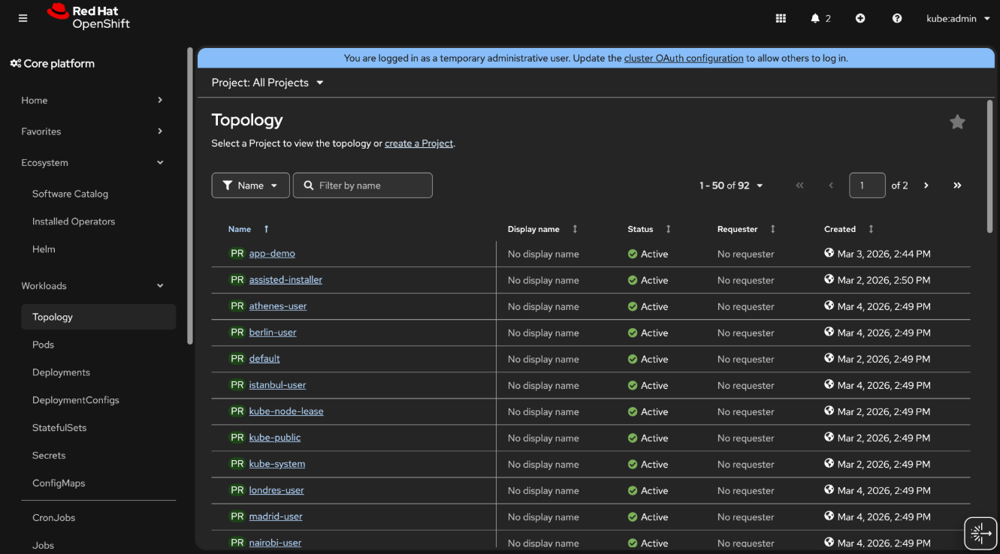

Une fenêtre **Create Project** va s'ouvrir.

Remplis les champs comme suit :

- **Name** : `exercice-nginx`
- **Display Name** : `exercice nginx`
- **Description** : `Projet pour déployer nginx`

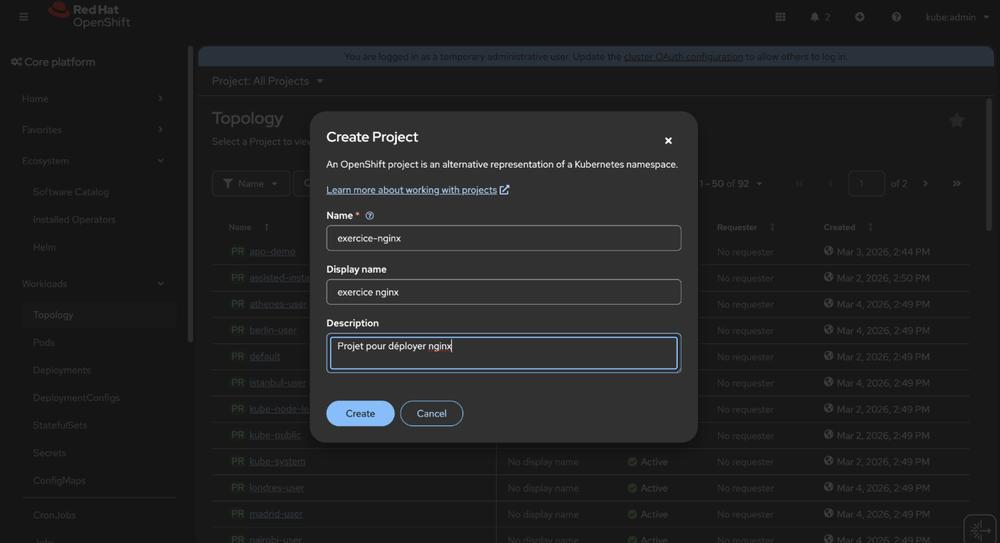

Puis clique sur : **Create**

Le projet **exercice-nginx** sera alors créé.

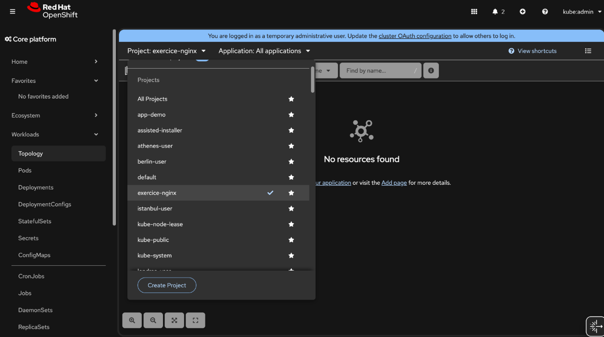

## Étape 5 — Déployer l'application nginx

Maintenant nous allons déployer nginx dans le projet.

Aller dans la page d'ajout d'application, dans le menu de gauche clique sur : **add**

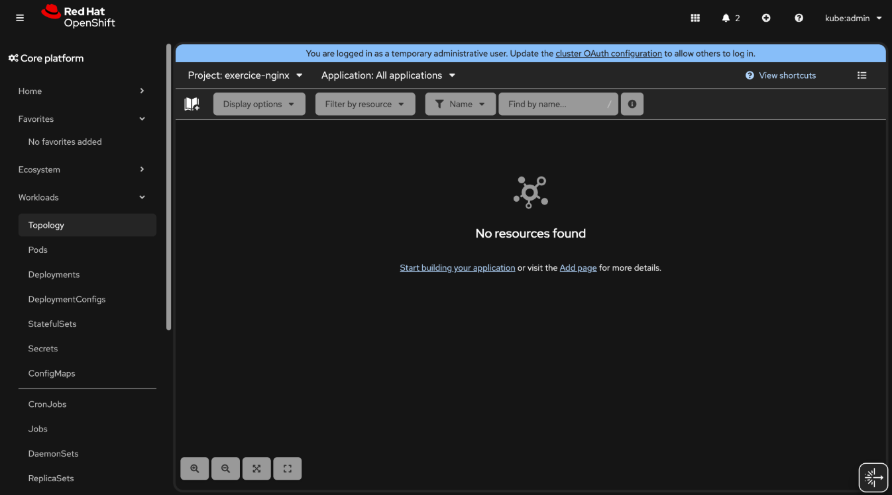

Maintenant clique sur : **Container images**

C'est la case qui dit : *Deploy an existing image from an Image registry or Image stream tag.*

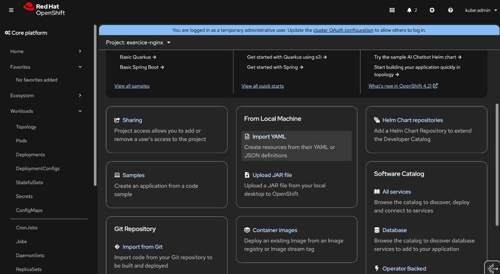

Une nouvelle page va s'ouvrir avec **Image name**.

Dans **Image name from external registry**, remplace le texte par : `nginxinc/nginx-unprivileged`

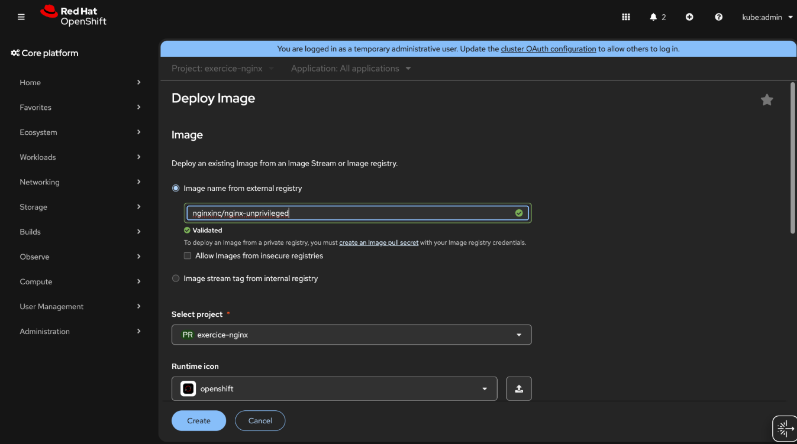

Laisse les autres options par défaut.

Vérifie ensuite :

- **Select project** : `exercice-nginx`

:::info Pourquoi cette image fonctionne ?
`nginxinc/nginx-unprivileged` est une version de nginx :
- qui **n'utilise pas root**
- compatible avec la **sécurité OpenShift**
- donc **pas d'erreur permission denied**

OpenShift interdit par défaut l'exécution de conteneurs en tant que `root`. Il faut toujours
utiliser des images compatibles avec cette contrainte de sécurité.
:::

### Créer l'application

 Ensuite descends un peu et clique sur : **Create**

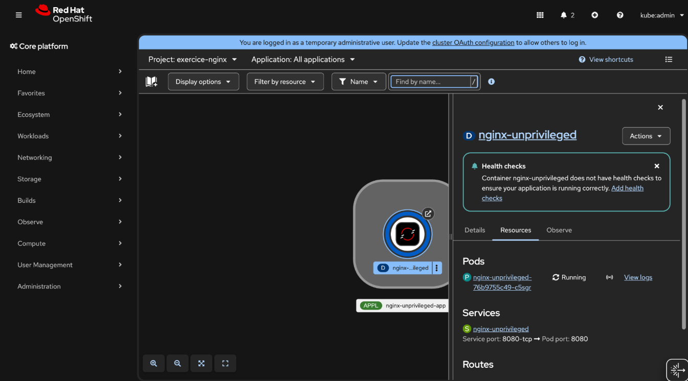

Dans la topologie, vous verrez :

- **Pod** : Running
- **Service** créé
- **Application** nginx-unprivileged déployée

:::tip Félicitations !
Ton application nginx est maintenant déployée dans le projet **exercice-nginx**. Tu peux voir
le Pod en état **Running** et le Service créé automatiquement sur le port **8080**.
:::

---

## Étape 7 — Augmentation du nombre de réplicas de Pods

Aller dans Deployments :

**Workloads → Deployments**

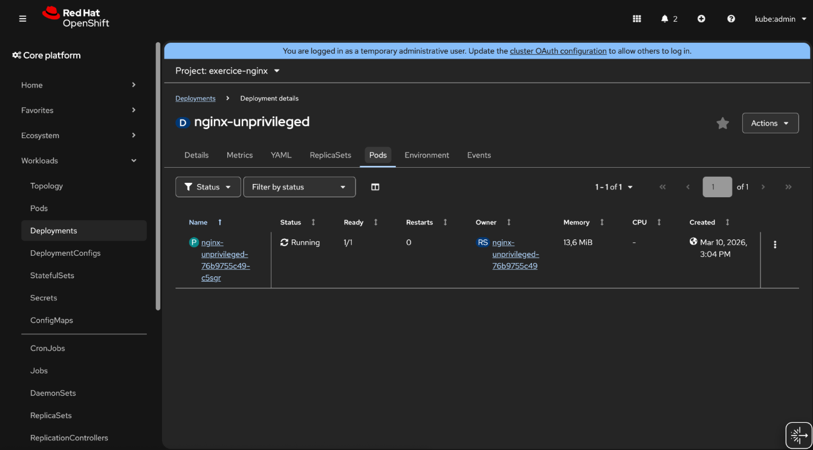
Cliquer sur **Details**

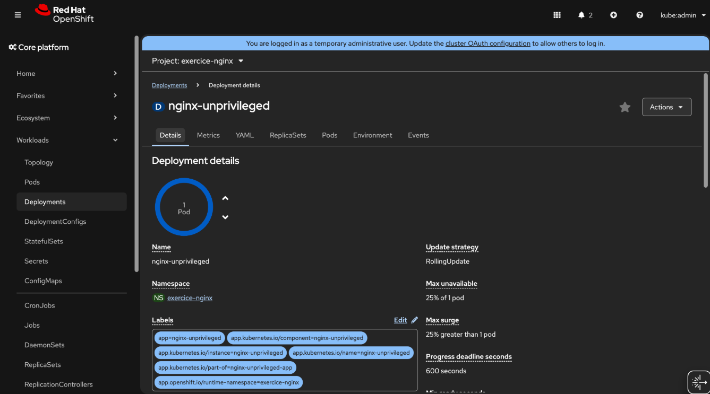

Regarde le cercle bleu avec **"1 Pod"**.

À droite du cercle il y a deux petites flèches :

- ⬆️ flèche vers le haut
- ⬇️ flèche vers le bas

Clique sur la flèche vers le haut ⬆️ **deux fois**.
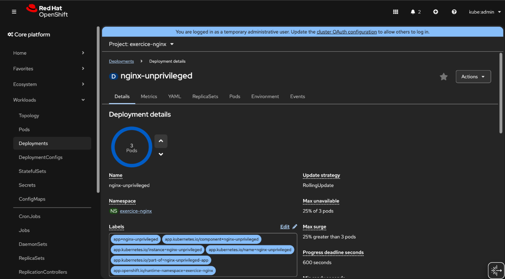

Donc ton application **nginx fonctionne sur 3 pods**.

Les pods sont :

- `nginx-unprivileged-76b9755c49-c5sgr`
- `nginx-unprivileged-76b9755c49-dzxcn`
- `nginx-unprivileged-76b9755c49-z4xc4`

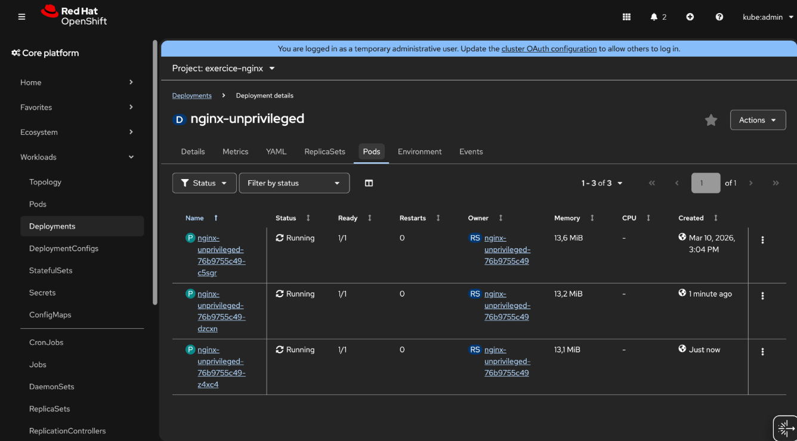

:::info Pourquoi augmenter le nombre de réplicas de Pods ?
L'augmentation du nombre de réplicas permet d'améliorer la **disponibilité** et la
**performance** de l'application.

En exécutant plusieurs pods pour une même application, OpenShift peut **répartir les requêtes**
des utilisateurs entre plusieurs instances du service. Cela permet également d'assurer la
**continuité du service** : si un pod tombe en panne, les autres pods continuent de fonctionner
et l'application reste accessible.

Cette opération s'appelle la **mise à l'échelle (scaling)** et elle est essentielle pour gérer
une augmentation du trafic ou garantir la haute disponibilité des applications dans un cluster
OpenShift.
:::

---

## Étape 7 — Créer une Route

**Networking → Routes**

En haut à droite clique sur : **Créer une Route**
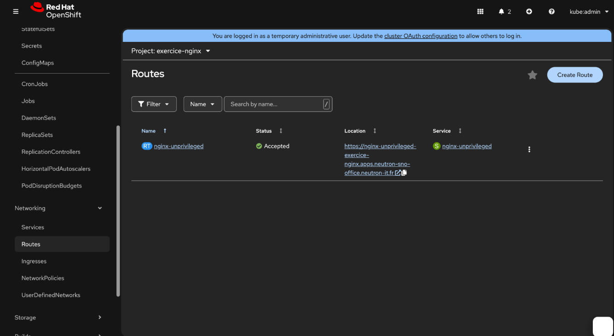

Remplis comme ceci :

- **Name** : `nginx-route`
- **Service** : `nginx-unprivileged`
- **Target Port** : `8080`

Laisse les autres options par défaut.

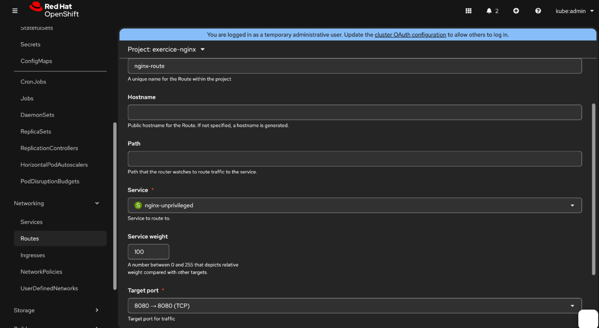

:::info Qu'est-ce qu'une Route dans OpenShift ?
Une **Route** est une ressource spécifique à OpenShift qui expose un Service à l'extérieur
du cluster via une URL publique. Elle est gérée par le **HAProxy** intégré d'OpenShift et
permet d'accéder à ton application depuis un navigateur.

Sans Route, ton application est accessible uniquement à l'intérieur du cluster.
:::

:::tip URL générée automatiquement
OpenShift génère automatiquement une URL de type :
`https://nginx-unprivileged-exercice-nginx.apps.neutron-sno-office.neutron-it.fr`

Tu peux voir le statut **Accepted** ✅ qui confirme que la Route est bien configurée et
que le trafic est bien redirigé vers ton Service.
:::
## Tester l'application

Clique sur le lien **Location** : `http://nginx-route-exercice-nginx.apps.neutron-sno-office.neutron-it.fr`

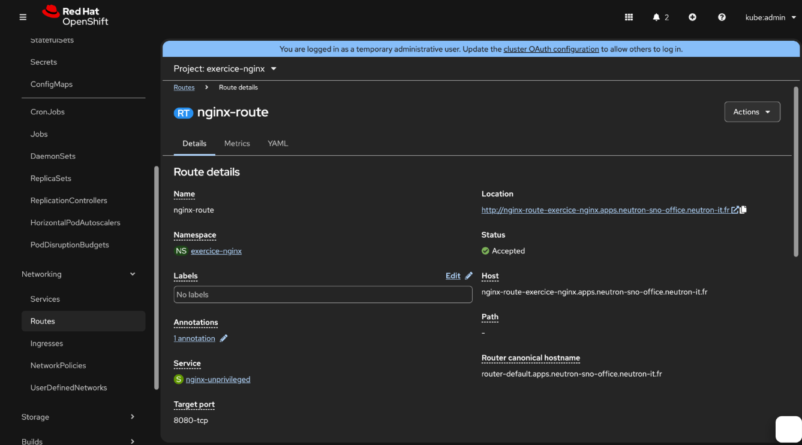

La page **Welcome to nginx** s'affiche correctement, ce qui confirme que le déploiement et
l'exposition de l'application dans OpenShift fonctionnent correctement.

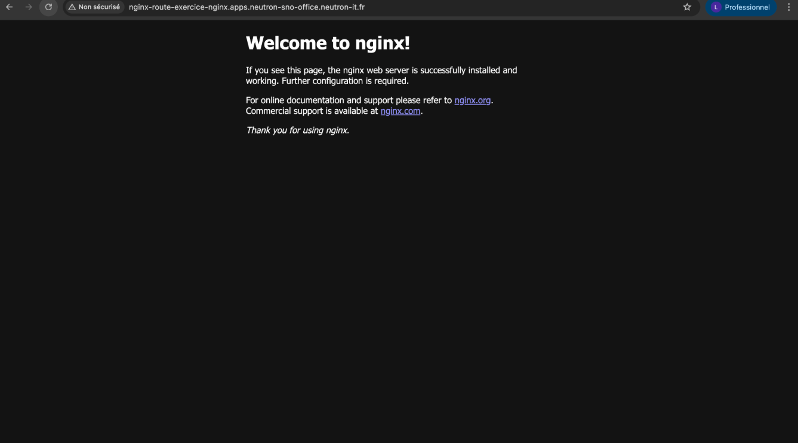

:::tip Félicitations ! 🎉
Tu as réussi à :
- ✅ Créer un projet **exercice-nginx**
- ✅ Déployer l'image **nginxinc/nginx-unprivileged**
- ✅ Scaler l'application à **3 réplicas**
- ✅ Créer une **Route** pour exposer l'application
- ✅ Accéder à l'application depuis un navigateur
:::

:::info Récapitulatif des ressources créées
| Ressource | Nom | Description |
|-----------|-----|-------------|
| **Deployment** | `nginx-unprivileged` | Gère les 3 réplicas nginx |
| **Service** | `nginx-unprivileged` | Expose le port 8080 en interne |
| **Route** | `nginx-route` | Expose l'application à l'extérieur |
:::
## Résumé de l'exercice

| Étape | Action | Résultat |
|-------|--------|---------|
| 1 | Accéder à la **Red Hat Hybrid Cloud Console** | Accès à la console web du cluster |
| 2 | Choisir **my_htpasswd_provider** | Connexion au cluster |
| 3 | Se connecter avec Username / Password | Accès au dashboard OpenShift |
| 4 | Créer le projet **exercice-nginx** | Namespace isolé créé |
| 5 | **Workloads → Add → Container images** | Page de déploiement ouverte |
| 6 | Image : `nginxinc/nginx-unprivileged` | Application déployée avec 1 Pod |
| 7 | Scaler à **3 réplicas** via les flèches | 3 Pods Running |
| 8 | **Networking → Routes → Create Route** | URL publique générée |
| ✅ | Accéder à l'URL de la Route | Page **Welcome to nginx** affichée |

:::tip Ce que vous avez appris
- Créer un **projet** (namespace) dans OpenShift
- Déployer une application depuis un **registry externe**
- Faire du **scaling manuel** de Pods
- Exposer une application avec une **Route**
:::